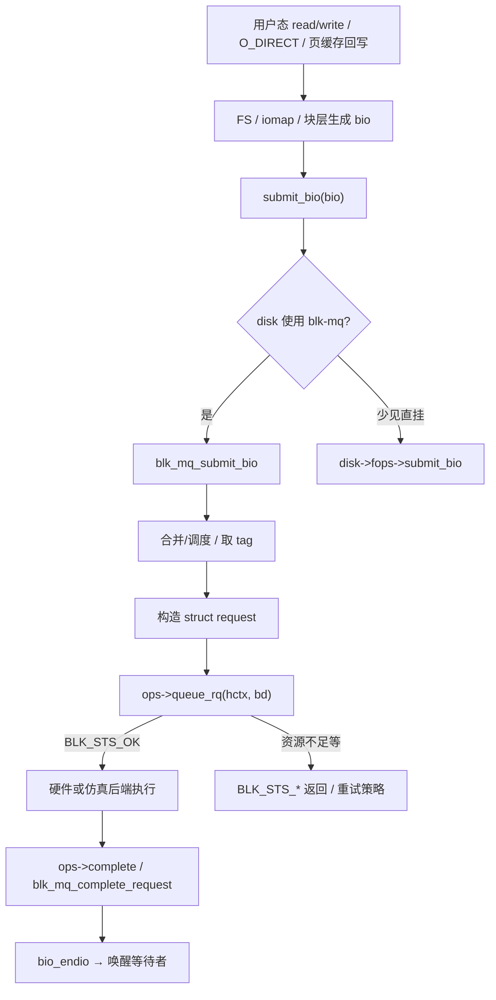
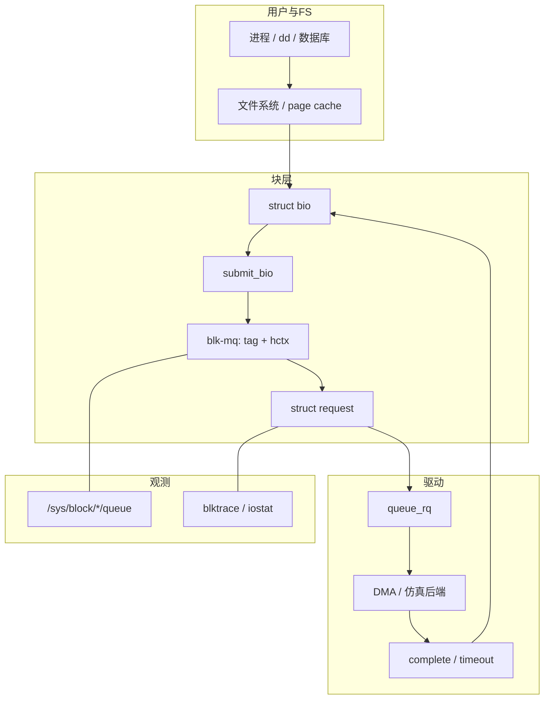

# Linux 块设备驱动完整篇：从 gendisk、submit_bio 到 blk-mq queue_rq 与排障

磁盘节点在 `/dev` 里看得见，但 `dd` 挂死、`iostat` 的 await 只涨不跌、自写驱动 `probe` 成功却永远没有 I/O——根因很少在文件系统，而在 **bio → request → 硬件队列** 这一环没接牢。字符设备用 `read/write` 直接碰缓冲；块设备必须把请求交给统一块层，由 `blk-mq` 调度后再进驱动的 `queue_rq`。少实现完成回调、容量与逻辑块大小不一致、或在 `queue_rq` 里长时间阻塞，都会表现为「设备在、业务死」。

本文把 `gendisk` 注册、`submit_bio` 主路径、`blk_mq_ops`、队列参数、完成/超时与卸载生命周期合成一篇可对照源码动手验证的闭环。源 chapter（021–023、025–027）为提纲；正文按主线内核真实符号重写，便于嵌入式存储、virtio-blk、简易 RAM disk 与 NVMe/SCSI 类驱动排障。

---

## 源码锚点

| 路径 | 作用 |
|------|------|
| `include/linux/blkdev.h` | `struct gendisk`、`block_device_operations`、`submit_bio*` |
| `include/linux/blk-mq.h` | `struct blk_mq_ops`、`blk_mq_tag_set`、`blk_mq_hw_ctx` |
| `include/linux/bio.h` | `struct bio`、生物向量、`bio_endio` |
| `block/blk-core.c` | `submit_bio` / 通用提交流程入口 |
| `block/blk-mq.c` | mq 分发、构造 `request`、调用 `queue_rq`、完成路径 |
| `block/genhd.c` | `device_add_disk` / `del_gendisk`、磁盘生命周期 |
| `block/blk-mq-tag.c` 一带 | tag / 队列深度管理 |
| `Documentation/block/` | 块层与 mq 文档 |

关键回调（字段以本机头文件为准）：

```c
/* include/linux/blkdev.h */
struct block_device_operations {
	blk_qc_t (*submit_bio)(struct bio *bio); /* 少数驱动直挂 bio */
	int (*open)(struct block_device *, fmode_t);
	void (*release)(struct gendisk *, fmode_t);
	int (*getgeo)(struct block_device *, struct hd_geometry *);
	struct module *owner;
	/* … */
};

/* include/linux/blk-mq.h */
struct blk_mq_ops {
	blk_status_t (*queue_rq)(struct blk_mq_hw_ctx *hctx,
				 const struct blk_mq_queue_data *bd);
	void (*complete)(struct request *rq);
	enum blk_eh_timer_return (*timeout)(struct request *rq);
	/* map_queues / commit_rqs / poll … 按设备能力选配 */
};
```

现代驱动注册骨架（API 名随版本演进，以树内 `block/` 为准）：

```c
struct blk_mq_tag_set set = {
	.ops = &my_mq_ops,
	.nr_hw_queues = nr_queues,
	.queue_depth = depth,
	.numa_node = NUMA_NO_NODE,
	.flags = BLK_MQ_F_SHOULD_MERGE, /* 按需 */
};
blk_mq_alloc_tag_set(&set);

/* 常见路径：blk_mq_alloc_disk / blk_alloc_disk + 绑定 tag_set */
disk->fops = &my_fops;
disk->private_data = priv;
set_capacity(disk, sectors_512);   /* 或 set_capacity_and_notify */
device_add_disk(parent_dev, disk, NULL);
/* → genhd：sysfs /dev 节点出现，此后才可对 /dev/xxx 下发 I/O */
```

完成路径必须与 `queue_rq` 成对：

```c
/* 驱动在中断/完成线程里 */
blk_mq_complete_request(rq);
/* 或软中断路径：blk_mq_end_request / __blk_mq_end_request 等
   以当前树符号为准——核心是：每个已接受的 request 最终要 end */
```

---

## 调用链

### 用户 I/O → bio → mq → 驱动（主路径）



### 模块分层与数据流



打开与容量侧：

```text
open("/dev/sdX") / 分区扫描
  → bdev open → disk->fops->open（若实现）
  → /sys/block/<disk>/size、logical_block_size、nr_requests
     决定可寻址范围与并发深度
```

卸载必须先停 I/O：

```text
冻结/排水队列 → del_gendisk → 释放 tag_set / 私有数据
  否则在飞 request 回调会 UAF
```

---

## 重点知识

### 1. bio 是通用货币，request 是队列侧封装

文件系统和页缓存不直接碰 NVMe/SCSI/virtio 寄存器；它们提交 `bio`（扇区范围 + 生物向量）。块层把 bio 映射成 `request`，再交给 `blk_mq_ops.queue_rq`。自写「伪块设备」若只实现了字符式 `read` 而没有挂上 mq/队列，`/dev` 节点即便存在也不会按块语义工作。

设计意图：用统一块层屏蔽后端差异，并让 elevator/io scheduler、合并、限流、cgroup 在一层完成。

### 2. `queue_rq` 要快，完成路径要成对

`queue_rq` 返回 `BLK_STS_OK` 表示「已接受」——通常意味着描述符已交给硬件或内部队列，而不是「数据已落盘」。真正结束靠中断/轮询线程里的 `complete`。忘记 `blk_mq_complete_request`，表现就是 await 永久上涨、进程 D 状态；重复 complete 则可能破坏 request 生命周期。

超时走 `ops->timeout`：硬件挂死后，内核靠它决定复位或错误结束，而不是让上层无限等。

**踩坑**：在 `queue_rq` 里做大块 `memcpy`、拿可能睡眠的锁、或同步等硬件完成——会拖垮整条 mq 路径。重活放完成路径的线程上下文或独立 worker。

### 3. 容量、逻辑块、队列深度必须自洽

```bash
lsblk -t
cat /sys/block/<dev>/queue/logical_block_size
cat /sys/block/<dev>/queue/physical_block_size
cat /sys/block/<dev>/queue/max_sectors_kb
cat /sys/block/<dev>/queue/nr_requests
cat /sys/block/<dev>/size          # 历史语义：512B 扇区数
# 直接验证驱动本身（绕过 page cache）
dd if=/dev/zero of=/dev/<dev> bs=4k count=100 oflag=direct
# 追踪
sudo blktrace -d /dev/<dev> -o - | blkparse -i -
iostat -x 1
```

`O_DIRECT` 对齐失败、错误的 `max_hw_sectors`、逻辑块写成 512 而硬件是 4K，都会导致 EIO 或吞吐断崖。分区表/`revalidate` 时机不对时，用户态会读到旧 size。

Kconfig 侧确认 `CONFIG_BLOCK`、`CONFIG_BLK_MQ`（现代默认）以及具体后端（如 `CONFIG_BLK_DEV_LOOP`、`CONFIG_VIRTIO_BLK`）已开。

### 4. 注册与生命周期

`device_add_disk` 之后才会出现 `/dev` 与 `/sys/block`。模块卸载顺序建议：

1. 停止接受新 I/O（冻队列 / 置失效标志）
2. `del_gendisk`
3. 等待在飞请求结束
4. `blk_mq_free_tag_set`（或等价释放）
5. 释放私有 DMA/缓冲

**踩坑**：只 `module_exit` 里 `kfree` 私有结构，未摘盘——热路径回调仍可能进入。

### 5. 排障对照表

| 现象 | 优先检查 |
|------|----------|
| 有节点，读写挂死 | `queue_rq` 是否被调用；完成回调是否执行；`/proc` D 状态栈 |
| await 高、吞吐低 | 队列深度、合并是否关闭、是否在 `queue_rq` 阻塞、中断亲和 |
| EIO / 对齐错误 | `logical_block_size`、`O_DIRECT` 对齐、`max_sectors` |
| 容量不对 | `set_capacity`、分区重扫、`size` sysfs |
| 卸载 oops | 是否先 `del_gendisk` 再释放；是否有在飞 request |
| 只缓冲 I/O「正常」 | 用 `oflag=direct` / `fio` direct 验证驱动本身 |

### 6. 性能要点（来自队列侧，而非盲目加大 bio）

- 合理 `nr_hw_queues`（常贴近 CPU/硬件队列数），避免单队列锁争用
- 允许合并（除非设备语义禁止），减少 doorbell
- 完成路径尽量 `blk_mq_complete_request` 批处理友好，避免在硬中断里做重活
- 用 `blktrace` 看 Q/D/C 事件间隔，区分「提交慢」与「完成慢」

---


---

## 小结

块驱动的核心不是「会写寄存器」，而是 **把统一块层的 bio/request 契约接完整**：注册出正确容量的 `gendisk`，在 `queue_rq` 快速提交，在完成路径成对结束，并用 sysfs/`blktrace` 证明请求真的进出硬件。抓住这条链，存储类挂死与 await 飙高的问题大多能在驱动侧几分钟内定位。
