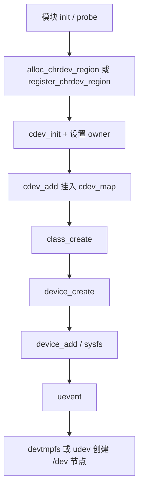
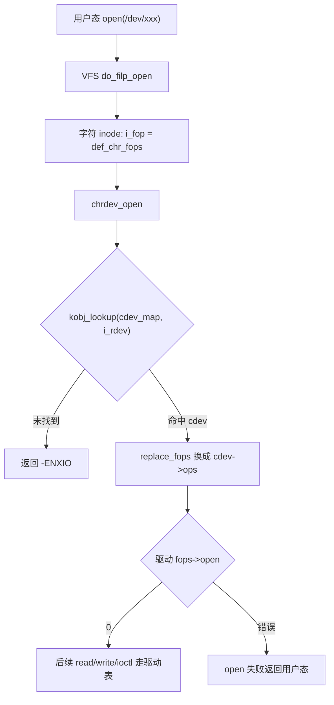
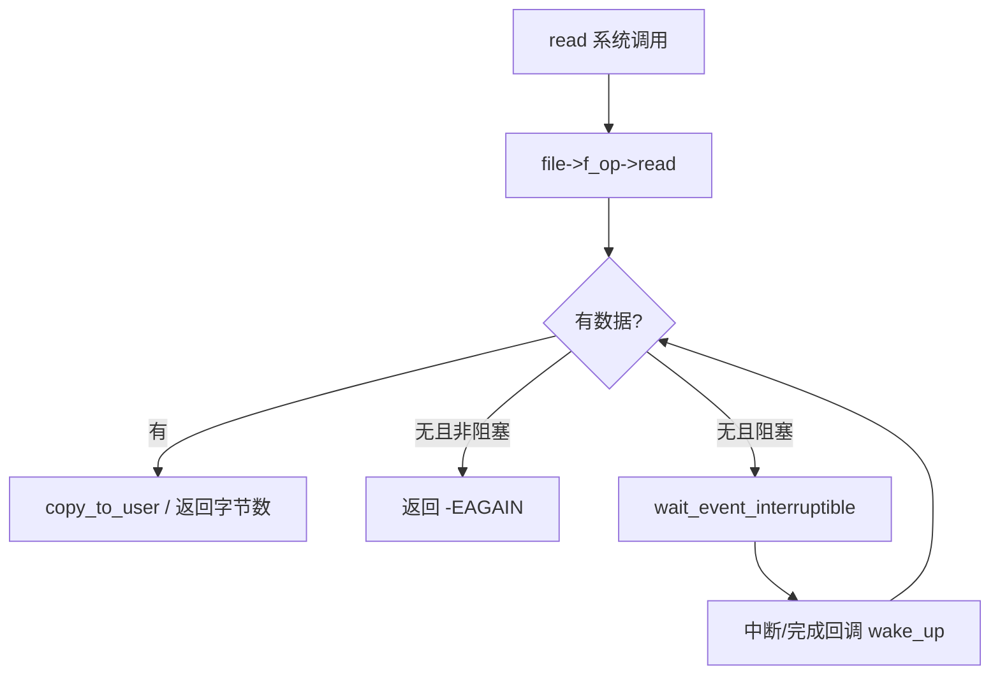

# 字符设备驱动完整篇：从 cdev_add、file_operations 到 chrdev_open 与排障

`open("/dev/xxx")` 报 `ENXIO`、节点有了但 `read` 永远阻塞、ioctl 在 32/64 位混用下炸——多半不是「业务逻辑写错」，而是 **主次设备号、`cdev` 注册与 VFS 换表（`chrdev_open`）** 某一步没对齐。

字符设备是嵌入式与内核模块里最常见的用户接口形态：不像块设备走请求队列，也不像 netdev 走协议栈，它把硬件能力直接暴露成「文件」——用户态用熟悉的 `open/read/write/ioctl/mmap/poll` 即可。代价是驱动必须自己把 **号段、cdev、设备模型节点、fops 语义** 四件事接对；少一环就会出现「sysfs 能看见、节点也有，却怎么都 open 不进驱动」的假象。

本文把路径从号段申请、`cdev_init`/`cdev_add`、`class`/`device_create`、用户态 open，讲到阻塞读、ioctl 与 `copy_to_user`/`mmap` 选型，并给出可执行的排障顺序。源 chapter 为模板提纲，正文按主线内核真实符号与调用关系重写，不改动原 chapter 文件。

---

## 源码锚点

| 路径 | 作用 |
|------|------|
| `fs/char_dev.c` | `alloc_chrdev_region`、`cdev_add`、`chrdev_open`、`def_chr_fops`、`cdev_map` |
| `include/linux/cdev.h` | `struct cdev`、`cdev_init`/`cdev_add`/`cdev_del` |
| `include/linux/fs.h` | `struct file_operations`、`alloc_chrdev_region` 声明、`def_chr_fops` |
| `include/linux/kdev_t.h` | `MAJOR`/`MINOR`/`MKDEV`、`dev_t` |
| `drivers/base/core.c` | `device_add`、sysfs/uevent；`device_create` 最终落点 |
| `drivers/base/class.c`（及 `include/linux/device/class.h`） | `class_create`、类设备与 `/sys/class` |
| `include/linux/device.h` | `device_create`/`device_destroy` |
| `fs/open.c`（及 VFS 打开路径） | 用户态 `open` → 字符 inode 的 `i_fop` |

核心结构（字段以当前主线为准，排障时对照本机头文件）：

```c
/* include/linux/cdev.h */
struct cdev {
	struct kobject kobj;
	struct module *owner;
	const struct file_operations *ops;
	struct list_head list;
	dev_t dev;
	unsigned int count;
};

/* include/linux/fs.h — 字符驱动最常实现的子集 */
struct file_operations {
	struct module *owner;
	ssize_t (*read)(struct file *, char __user *, size_t, loff_t *);
	ssize_t (*write)(struct file *, const char __user *, size_t, loff_t *);
	__poll_t (*poll)(struct file *, struct poll_table_struct *);
	long (*unlocked_ioctl)(struct file *, unsigned int, unsigned long);
	long (*compat_ioctl)(struct file *, unsigned int, unsigned long);
	int (*mmap)(struct file *, struct vm_area_struct *);
	int (*open)(struct inode *, struct file *);
	int (*release)(struct inode *, struct file *);
	/* … */
};
```

字符设备号段与挂接：

```c
dev_t devt;
alloc_chrdev_region(&devt, 0 /* baseminor */, 1 /* count */, "mydev");
/* → fs/char_dev.c：动态选 major，写入 *devt = MKDEV(major, baseminor) */

cdev_init(&mycdev, &my_fops);   /* 填 ops，初始化 kobj */
mycdev.owner = THIS_MODULE;
cdev_add(&mycdev, devt, 1);     /* 挂入 cdev_map，立刻可被 open 查找 */

cls = class_create(THIS_MODULE, "myclass");
device_create(cls, NULL, devt, NULL, "mydev%d", 0);
/* → drivers/base：sysfs + uevent；devtmpfs/udev 创建 /dev/mydev0 */
```

VFS 侧默认入口（打开字符节点时先走到这里，再换成驱动自己的 fops）：

```c
/* fs/char_dev.c */
const struct file_operations def_chr_fops = {
	.open = chrdev_open,
	.llseek = noop_llseek,
};
```

记住分工：`def_chr_fops` 只负责「找到 cdev 并换表」；真正的读写语义全在驱动自己的 `file_operations`。调试 open 失败时，先确认是否进入了 `chrdev_open`，再看驱动 `open` 的返回值——两层错误码都可能是 `-ENXIO`，含义却不同（map 未命中 vs 驱动主动拒绝/模块引用失败）。

---

## 调用链

### 注册：号段 → cdev → 设备模型节点



### 打开：VFS → chrdev_open → 驱动 fops



### 读路径与阻塞（概念）



三条链合在一起看：注册解决「内核认不认这个 `dev_t`」，打开解决「fops 换没换成你的」，读写解决「有没有数据、怎么唤醒」。现场问题多半落在其中一环，而不是三环同时坏。

---

## 重点知识

### 1. 主次设备号：`dev_t` 与号段策略

字符设备用 `dev_t` 标识，宏 `MAJOR`/`MINOR`/`MKDEV` 拆合。用户态 `ls -l /dev/xxx` 里形如 `c 10, 223` 的数字，就是 major/minor；内核打开时用的是 inode 上的 `i_rdev`，与 `cdev_add` 登记的区间必须对得上。

| API | 适用 | 要点 |
|-----|------|------|
| `alloc_chrdev_region` | 现代驱动默认 | 传入 major=0 动态分配；`*dev` 返回 `MKDEV(major, baseminor)` |
| `register_chrdev_region` | 已知固定 major | 与历史 ABI、文档写死的号段绑定时用 |
| `__register_chrdev` / 旧 `register_chrdev` | 快速占一段 | 内部也会建 `cdev`；新代码更推荐显式 `cdev_*` 以便错误回滚清晰 |

`count` 是连续次设备个数：一个 `cdev` 可覆盖 `minor … minor+count-1`。多实例有两种常见做法：

- **一段号 + 一个 cdev**：`open` 里用 `iminor(inode)` 索引私有数组；
- **每实例一个 cdev**：每个 probe 各自 `alloc`/`cdev_add`，生命周期跟 `struct device` 走。

不要「全局单例结构体 + 多个 `/dev` 节点」却共享无锁状态——并发 open 会互相踩 `private_data`。动态 major 时，用户态不要写死主设备号；应依赖 udev 节点名，或从 sysfs/`/proc/devices` 解析。

卸载对称顺序建议：`device_destroy` → `class_destroy` → `cdev_del` → `unregister_chrdev_region`。顺序反了常见后果是：节点还在但 open 已 `-ENXIO`，或 kobject 引用未清导致卸载告警。

### 2. `cdev` 注册：为什么光有号段不够

`alloc_chrdev_region` 只占用号段（`/proc/devices` 能看见名字），**并不**把操作集挂到 `cdev_map`。`cdev_add` 才会把 `struct cdev` 登记进 map；随后 `chrdev_open` 才能：

1. `kobj_lookup(cdev_map, inode->i_rdev, &idx)` 找到 cdev；
2. 把 `inode->i_cdev` 缓存起来（后续 open 可少查一次）；
3. `fops_get(p->ops)` + `replace_fops(filp, fops)`；
4. 若驱动提供了 `fops->open`，再调用它。

对照 `fs/char_dev.c`：找不到 cdev 时直接 `-ENXIO`；`fops_get` 失败（模块正在卸载等）同样 `-ENXIO`。因此「节点是手搓的 mknod、内核从未 `cdev_add`」与「模块已卸但节点残留」表现相同，都要靠 `/proc/devices` 与 `lsmod` 区分。

常见半截注册：

1. 只 `mknod`/udev 建了节点，内核从未 `cdev_add` → open `-ENXIO`；
2. `cdev_add` 成功但 `device_create` 失败 → `/proc/devices` 有项、无 `/dev`；
3. `cdev.owner` / `fops.owner` 未设 `THIS_MODULE` → 文件仍打开时可被 rmmod，随后调用已释放的 fops。

`cdev_device_add` 可把 cdev 与 `struct device` 绑成父子，方便统一生命周期；多数板级/平台驱动仍用「`cdev_add` + `class_create`/`device_create`」两段式，和 `drivers/base` 的 uevent/sysfs 路径更直观，排障时也更好拆。

### 3. `file_operations`：驱动真正的 ABI

字符 inode 初始的 `i_fop` 是 `def_chr_fops`（几乎只有 `open = chrdev_open`）。换表成功后，`filp->f_op` 才是驱动表；之后 `read`/`write`/`ioctl`/`mmap`/`poll`/`release` **不再经过** `def_chr_fops`。

实现纪律：

- `open`：按 minor 取私有结构，写入 `filp->private_data`；申请失败要回滚。
- `release`：与 `open` 对称；多进程同开同一节点时用引用计数，别在第一次 close 就拆硬件。
- `read`/`write`：用户指针必须经 `copy_to_user`/`copy_from_user`（或 `get_user`/`put_user`）；成功返回已传字节数，失败返回负错误码（不要混用「正数表示错误」）。
- `unlocked_ioctl`：无大内核锁的现代默认；若存在 32 位用户态访问 64 位内核，补 `compat_ioctl`。
- `poll`：必须 `poll_wait`，并在有数据/可写时返回 `EPOLLIN`/`EPOLLOUT`。
- `mmap`：大块或高频缓冲时替代反复拷贝；见第 8 节。

最小可读骨架（逻辑示意，省略错误标签细节）：

```c
static int my_open(struct inode *inode, struct file *filp)
{
	struct my_dev *d = container_of(inode->i_cdev, struct my_dev, cdev);
	filp->private_data = d;
	return 0;
}

static ssize_t my_read(struct file *filp, char __user *buf,
		       size_t len, loff_t *ppos)
{
	struct my_dev *d = filp->private_data;
	if (filp->f_flags & O_NONBLOCK) {
		if (!my_has_data(d))
			return -EAGAIN;
	} else if (wait_event_interruptible(d->wq, my_has_data(d)))
		return -ERESTARTSYS;
	/* 从内核缓冲 copy_to_user，返回实际字节数 */
	return my_copy_out(d, buf, len);
}

static const struct file_operations my_fops = {
	.owner = THIS_MODULE,
	.open = my_open,
	.release = my_release,
	.read = my_read,
	.write = my_write,
	.unlocked_ioctl = my_ioctl,
	.poll = my_poll,
};
```

### 4. `/dev` 节点：devtmpfs 与 udev

分层记忆（与设备模型完整篇一致）：

1. **bus 绑定**（platform/i2c/usb…）只说明驱动认领了硬件；
2. **`cdev_add`** 让该 `dev_t` 可被 `chrdev_open` 解析；
3. **`device_create(cls, parent, devt, …)`** 在 `drivers/base` 里走 `device_add`，发 uevent；
4. **devtmpfs** 常直接按 `devt` 建节点；**udev** 再改名、改权限、建 symlink。

调试命令：

```bash
cat /proc/devices | grep mydev          # 号段是否登记
ls -l /dev/mydev0                       # 主次是否与 MKDEV 一致
stat /dev/mydev0
udevadm info -a -n /dev/mydev0
ls -l /sys/class/myclass/
readlink -f /sys/class/myclass/mydev0/device
dmesg | grep -iE 'mydev|cdev|probe'
# 仅调试对照：mknod /dev/mydev0 c <major> <minor>
```

权限默认可能仅 root；产品侧用 udev 规则设 `MODE`/`GROUP`，或在 class 上提供 `devnode` 回调。节点主次与 `cdev_add` 不一致时，可能 open 到别的驱动，或直接 `-ENXIO`。热插拔场景还要确认 remove 时 `device_destroy` 已跑，避免应用打开陈旧 inode。

### 5. ioctl：命令编码与兼容

用 `_IO`/`_IOR`/`_IOW`/`_IOWR` 定义命令，把方向、magic、序号、参数大小编进 `cmd`。驱动侧：

```c
#define MYDEV_IOC_MAGIC  'M'
#define MYDEV_GET_STATUS _IOR(MYDEV_IOC_MAGIC, 1, struct my_status)

static long my_ioctl(struct file *filp, unsigned int cmd, unsigned long arg)
{
	struct my_status st;
	switch (cmd) {
	case MYDEV_GET_STATUS:
		my_fill_status(filp->private_data, &st);
		if (copy_to_user((void __user *)arg, &st, sizeof(st)))
			return -EFAULT;
		return 0;
	default:
		return -ENOTTY;
	}
}
```

实战坑：

- 结构体含指针、或字段依赖 `long`/`size_t` 宽度 → 必须 `compat_ioctl`，或 ABI 全面改成 `u32`/`u64`/`__u64`。
- 把用户地址当内核指针解引用 → 必挂；一律 `__user` + `copy_*`。
- 成功一般返回 0；若要用正返回值表示「写出长度」，用户态与内核必须同一约定，且勿与负错误码冲突。
- magic/序号冲突时，表现为偶发 `-ENOTTY` 或误进别的分支——用 `strace -e ioctl` 核对原始 `cmd`。

### 6. 阻塞读与 `poll`

典型模式：环形缓冲 + `wait_queue_head_t` +（可选）spinlock 保护生产者/消费者。

- **阻塞读**：`wait_event_interruptible(wq, 有数据 || 已断开)`；被信号打断返回 `-ERESTARTSYS`，由 VFS/用户态决定重启。
- **非阻塞**：`O_NONBLOCK` 且无数据 → `-EAGAIN`。
- **生产者**：硬中断里只做最小工作（读 FIFO、置位），`wake_up_interruptible`；重活丢线程中断或 workqueue。
- **poll/epoll**：`poll` 里 `poll_wait(file, &d->wq, wait)`，有数据返回 `EPOLLIN | EPOLLRDNORM`。

漏 `wake_up` → 用户态永久阻塞；只实现 `read` 不实现 `poll` → 很多库用 `epoll` 等就绪，会表现为「设备假死」。断开设备时应唤醒所有等待者并让后续 read 返回 `0` 或 `-ENODEV`，避免僵尸阻塞。

### 7. 常见 probe / open 失败

平台驱动场景下，字符设备注册常嵌在 `probe` 里：先通过 `really_probe` 绑定硬件，再导出 cdev。硬件依赖未就绪应返回 `-EPROBE_DEFER`，而不是在 probe 里死等。

| 现象 | 常见根因 | 核对 |
|------|----------|------|
| probe 反复 defer | 时钟/GPIO/regulator/pinctrl 未就绪 | `dmesg`、deferred 设备列表 |
| probe 成功无 `/dev` | 未 `device_create`、class 失败、udev 规则丢弃 | `/sys/class`、`udevadm` |
| 有节点 open=`ENXIO` | 未 `cdev_add`、主次不一致、模块已卸 | `/proc/devices`、`ls -l`、`lsmod` |
| open=`ENODEV`/`EINVAL` | 驱动 `open` 主动拒绝（固件未加载等） | 在 `fops->open` 打点返回值 |
| 读永远阻塞 | 无数据且未 wake；IRQ 未进；条件写反 | 中断计数、`ftrace`、dynamic debug |
| ioctl=`ENOTTY`/`EFAULT` | cmd 未实现、magic 错、copy 失败 | `strace`、核对 `_IO*` |
| rmmod 失败或卸载后崩溃 | 文件未关、owner 错误、异步回调未停 | `lsof`、停 IRQ/work 再 `cdev_del` |

probe 推荐顺序：分配私有数据 → `devm_*` 申请时钟/中断/内存 → `alloc_chrdev_region` → `cdev_init`/`cdev_add` → `class_create`/`device_create`。任一步失败从该点反向回滚，避免「号段占用但 cdev 未挂」的半残状态。`remove`/`exit` 先拒绝新 open（或保证无打开者），再拆节点与 cdev。

### 8. 性能：`copy_to_user` vs `mmap`

| 路径 | 特点 | 适用 |
|------|------|------|
| `copy_to_user` / `copy_from_user` | 实现简单；每次 syscall + 拷贝 | 控制面、小包、偶发读写 |
| 增大单次 read/write 缓冲 | 摊薄用户/内核切换 | 中等吞吐的日志、采样流 |
| `mmap` + 共享环缓 | 少拷贝；需一致性与生命周期 | 高频 ADC、帧数据、DMA 环 |
| `read_iter` / `splice` 等 | 更易与管道/其它 fd 拼接 | 进阶零拷贝路径 |

优化顺序建议：

1. 先量：阻塞等待时间 vs `copy_user` CPU 占比（`perf`、`ftrace function_graph` 跟到自己的 `read`）；
2. 再增大单次传输、合并中断、减少锁持有时间；
3. 确认拷贝已成热点后，再上 mmap/`dma_mmap_coherent` 等。

mmap 实现要注意：`remap_pfn_range`/`vm_iomap_memory`/`dma_mmap_*` 选对；用户写回与设备 DMA 之间的 cache 同步；`vm_operations_struct.close` 里处理映射撕毁。过早上 mmap 却漏同步，会出现偶发脏数据，比「慢一点的 copy_to_user」更难复现。控制类 ioctl 继续走拷贝即可，不必强行零拷贝。
---

### 9. 动手验证：最小闭环

写完驱动后建议固定跑一遍，避免「以为注册成功」：

```bash
# 1) 模块与号段
insmod mydev.ko   # 或 modprobe
cat /proc/devices | grep mydev
ls -l /dev/mydev*

# 2) open/read 冒烟（按你的 ABI 改）
printf '' | strace -e openat,read,ioctl,close cat /dev/mydev0

# 3) 非阻塞与阻塞对比
# 无数据时应立即 EAGAIN：
strace -e read dd if=/dev/mydev0 iflag=nonblock bs=64 count=1

# 4) 卸载前确认无占用
lsof /dev/mydev0 2>/dev/null
rmmod mydev
# 卸载后节点应消失；若残留，检查 device_destroy / udev
```

内核侧可用 `trace-cmd record -p function_graph -g chrdev_open` 或 `echo 'file fs/char_dev.c +p' > /sys/kernel/debug/dynamic_debug/control`（需打开 dynamic debug）确认是否进入换表与驱动 `open`。用户态 `ENXIO` 却看不到 `chrdev_open` 命中 cdev，优先查号段与 `cdev_add`，而不是先怀疑 `copy_to_user`。

配置与部署注意：主线不靠 sysctl 开关「启用字符设备」；真正要管的是 **设备树/ACPI 是否让 probe 跑到**、**模块是否自动加载**（`modules.alias` / `char-major-*` 请求）、以及 **udev 规则是否改坏节点名或权限**。交叉编译时确认用户态头文件里的 ioctl 结构与内核模块一致，否则会出现「本机正常、板端 ioctl 全 EFAULT」的版本漂移。

---

## Checklist

- [ ] 号段用 `alloc_chrdev_region`（或固定 major 的 register），`/proc/devices` 可见且与 `/dev` 主次一致
- [ ] `cdev_init` → 设 `owner` → `cdev_add` 成功；失败路径有 `cdev_del`/`unregister`
- [ ] `class_create` + `device_create(…, devt, …)`，节点由 devtmpfs/udev 出现且权限可接受
- [ ] 能口述：`open` → `def_chr_fops.open`=`chrdev_open` → `replace_fops` → 驱动 `open`
- [ ] `read` 区分阻塞/`O_NONBLOCK`，生产者路径有 `wake_up`；需要时实现 `poll`
- [ ] ioctl 用 `_IO*` 编码，跨 32/64 位场景有 `compat_ioctl` 或固定宽度
- [ ] 吞吐热点已对比 `copy_*_user` 与 `mmap`，未盲目零拷贝
- [ ] remove/错误路径对称释放，无「节点残留」或「文件开着可 rmmod」
- [ ] 用 `strace`/`lsof`/`insmod-rmmod` 跑通最小验证闭环

---

## 小结

字符设备的设计切面很清晰：**号段登记身份，`cdev` 挂操作集，device/class 导出节点，VFS 用 `chrdev_open` 换表**。排障时按「`/proc/devices` → `cdev_map` 能否 lookup → `/dev` 主次是否一致 → 驱动 `open`/`read`/`ioctl` 返回值」收束，比在业务里盲目加日志快得多。

把注册与卸载对称、阻塞唤醒、`poll` 与拷贝/mmap 边界做对，大多数「节点在却打不开 / 一读就卡死 / ioctl 乱码 / 一 rmmod 就崩」都能落到 `fs/char_dev.c` 与 `drivers/base` 的具体锚点上。先打通这条用户态文件 ABI，再往子系统（input、IIO、misc 等）迁移时，也会更容易看懂它们各自封装了哪一段样板代码。
