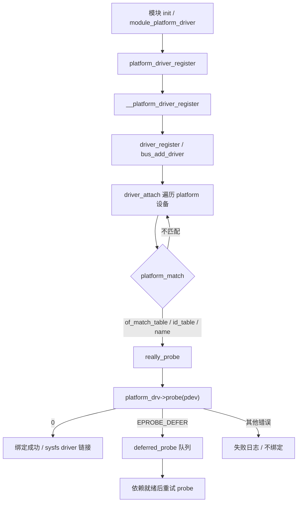
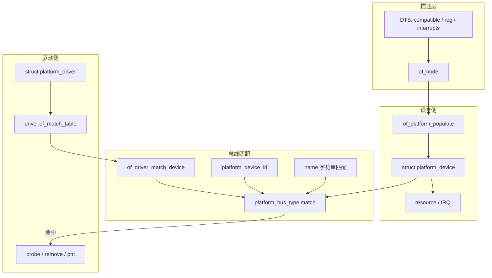

# platform 驱动完整篇：从 platform_driver_register、DT compatible 到 probe 与延迟绑定排障

SoC 上的 UART、GPIO、时钟控制器多数挂在 **platform 总线**：设备树节点早已存在，驱动模块后加载，结果是「`/sys` 有设备却永不 probe」。根因通常是 `compatible` 字符串不一致、`of_match_table` 未挂上、或依赖时钟/GPIO 返回 `-EPROBE_DEFER` 却被当成硬失败。

和 PCI/USB 驱动相比，platform 没有总线枚举给你「扫出」硬件——板级描述（DT 或遗留板文件）就是唯一真相。因此排障重心必须前移到 **匹配与依赖**，而不是一上来怀疑 `probe` 里某行寄存器写法。本文把 `platform_driver_register`、DT 匹配、资源获取、`dev_pm_ops`、deferred probe 与模块加载顺序合成一篇可对照源码动手验证的闭环；读完应能独立完成：写最小 `platform_driver`、对照 sysfs 判断是否绑定、以及把 defer 与 compatible 写错区分开。

---

## 源码锚点

| 路径 | 作用 |
|------|------|
| `drivers/base/platform.c` | `platform_bus_type`、`platform_match`、`__platform_driver_register`、资源/IRQ 辅助函数 |
| `include/linux/platform_device.h` | `struct platform_device` / `struct platform_driver`、`platform_get_resource`/`platform_get_irq`、`module_platform_driver` |
| `include/linux/device/driver.h` | `struct device_driver` 的 `of_match_table`、`pm` |
| `include/linux/mod_devicetable.h` | `struct of_device_id`（`.compatible`） |
| `drivers/base/dd.c` | `really_probe`、deferred probe 队列与重试 |
| `drivers/of/device.c` / `drivers/of/platform.c` | OF 匹配、`of_platform_populate` 创建设备 |
| `include/linux/pm.h` | `struct dev_pm_ops` |
| `Documentation/driver-api/driver-model/platform.rst` | platform 设备模型文档 |

核心结构（字段以当前内核树为准）：

```c
/* include/linux/platform_device.h */
struct platform_device {
	const char *name;
	int id;
	struct device dev;
	u32 num_resources;
	struct resource *resource;
	/* … */
};

struct platform_driver {
	int (*probe)(struct platform_device *);
	int (*remove)(struct platform_device *);
	void (*shutdown)(struct platform_device *);
	int (*suspend)(struct platform_device *, pm_message_t state);
	int (*resume)(struct platform_device *);
	struct device_driver driver;          /* 内嵌通用 driver */
	const struct platform_device_id *id_table;
	bool prevent_deferred_probe;
};

/* of_match_table 挂在内嵌的 device_driver 上 */
static const struct of_device_id my_of_match[] = {
	{ .compatible = "vendor,my-uart" },
	{ /* sentinel */ }
};
MODULE_DEVICE_TABLE(of, my_of_match);

static struct platform_driver my_drv = {
	.probe  = my_probe,
	.remove = my_remove,
	.driver = {
		.name = "my-uart",
		.of_match_table = my_of_match,
		.pm = &my_pm_ops,   /* 可选：现代路径用 driver.pm */
	},
};

module_platform_driver(my_drv);
/* → platform_driver_register → __platform_driver_register
   → driver_register → bus_add_driver → driver_attach */
```

资源与中断（probe 内常用）：

```c
res = platform_get_resource(pdev, IORESOURCE_MEM, 0);
base = devm_ioremap_resource(&pdev->dev, res);
/* 或一步到位：devm_platform_ioremap_resource(pdev, 0); */

irq = platform_get_irq(pdev, 0);
/* 可选中断：platform_get_irq_optional；按名：platform_get_irq_byname */
```

---

## 调用链

### 注册 → 匹配 → probe（主路径）



### 分层与 DT 匹配数据流



设备侧：设备树（或板级 `platform_device_register*`）先把 `platform_device` 挂上 `platform` 总线。驱动侧：`platform_driver_register` 后对每个未绑定设备跑 `platform_match`。ARM/DT 路径优先 `of_match_table` 的 `compatible`；遗留代码还有 `id_table` 与 `pdev->name` 字符串匹配。反向也成立——设备后注册时，已挂上的驱动会再次尝试 attach，所以「先加载驱动还是先有 DTB 节点」在机制上都能收敛，真正卡死的往往是匹配表或 defer。

---

## 重点知识

### 1. platform 总线解决什么问题

PCI/USB 有枚举；片上外设没有「热插拔发现」，地址与中断由板级固件描述。platform 把「固定资源 + 驱动逻辑」收成同一套 driver core：设备实例是 `platform_device`，驱动是 `platform_driver`，匹配规则在 `platform_match`（`drivers/base/platform.c`）。

现代板子几乎全走 **设备树**：`compatible` 是主键；`reg`/`interrupts`/`clocks`/`pinctrl-*` 等变成 probe 时用的资源与消费者句柄。`platform_data` 仍存在于遗留驱动，新代码优先 DT property / `device_property_*`。

和 PCI 对比记忆：PCI 用 Vendor/Device ID；platform 用 `compatible`（或遗留 `name`）。生命周期都是 match → probe → remove，差别只在「资源从哪里来」。把 platform 当成「没有配置空间的伪总线」就好理解：总线不扫硬件，只做绑定与 sysfs 展现。

为何内核单独维护 `drivers/base/platform.c`，而不是让每个驱动自己 `ioremap` 完事？因为统一挂上 driver core 之后，才能共享 deferred probe、runtime PM、sysfs unbind/bind、以及 OF/ACPI 匹配表。片上外设数量大、依赖网复杂，没有这套机制，启动阶段的「谁先谁后」会变成不可维护的 initcall 拼图。

### 2. DT `compatible` 与 `of_match_table`

匹配要求 **字符串完全一致**（含厂商前缀、连字符、大小写）。常见翻车：

| 现象 | 根因 |
|------|------|
| 设备在 `/sys/bus/platform/devices/`，无 `driver` 链接 | DTS `compatible` 与表项拼写不一致；或漏了 `MODULE_DEVICE_TABLE(of, …)` 导致模块自动加载不触发 |
| 模块已加载仍不绑 | `of_match_table` 写在了错误字段（应挂 `driver.of_match_table`，不是只设 `name`） |
| 换了一版 DTB 全挂 | binding 改了字符串，驱动表未同步 |
| 多字符串 `compatible` 只认第二个 | 驱动表只写了兜底兼容串，却漏了板级实际使用的更具体串（OF 按列表从前到后匹配驱动表） |

排障先对齐两侧字符串：

```bash
# 设备侧 of_node compatible（路径按板子改）
cat /sys/firmware/devicetree/base/soc/uart@.../compatible
# 或
ls -l /sys/bus/platform/devices/
readlink /sys/bus/platform/devices/<name>/driver   # 有链接才算绑定

modinfo my_uart.ko | grep -i alias   # 应有 of:N*T*Cvendor,my-uart
dmesg | grep -iE 'of:|probe|defer'
```

`platform_match` 顺序大致为：`driver_override` → OF/ACPI → `id_table` → `name`。新驱动应只依赖 `of_match_table`，避免靠 `name` 碰巧一致。调试时可临时写 `driver_override` 强制绑定，但量产仍应修好 `compatible`。

典型写错形态：`vendor,my_uart` 与 `vendor,my-uart`（下划线/连字符）、漏掉厂商前缀只写 `my-uart`、DTS 用了 `vendor,my-uart-v2` 而驱动表仍是旧串。这类问题 **不会打印你的 `dev_err`**，因为根本没进 `probe`。

### 3. probe / remove 纪律与资源 API

`probe` 职责：取资源 → 映射寄存器 → 申请 IRQ/clk/regulator → 初始化硬件 → `platform_set_drvdata`。失败路径返回负 errno；依赖未就绪返回 `-EPROBE_DEFER`。

```c
static int my_probe(struct platform_device *pdev)
{
	struct device *dev = &pdev->dev;
	void __iomem *base;
	int irq, ret;

	base = devm_platform_ioremap_resource(pdev, 0);
	if (IS_ERR(base))
		return PTR_ERR(base);

	irq = platform_get_irq(pdev, 0);
	if (irq < 0)
		return irq;   /* 含 -EPROBE_DEFER 时原样向上传 */

	/* clk_get / regulator_get 失败也可能是 DEFER */
	ret = devm_request_irq(dev, irq, my_isr, 0, dev_name(dev), priv);
	if (ret)
		return ret;

	platform_set_drvdata(pdev, priv);
	return 0;
}
```

要点：

- 优先 `devm_*`：`remove` 或 probe 失败时自动释放，减少泄漏。
- `platform_get_resource(pdev, IORESOURCE_MEM/IORESOURCE_IRQ, index)` 与 `platform_get_irq` 是标准入口；按名用 `*_byname`。
- `remove` 做 quiesce（关中断、停 DMA）；内存交给 devres 即可。不要在 `remove` 里假设用户态已全部关闭（可配合 `devm` 与引用计数）。
- 多段 `reg` 时索引从 0 递增，必须与 binding 文档一致；搞反控制寄存器与数据寄存器是「probe 成功但读写错乱」的经典坑。
- 中断在 DT 里用 `interrupts-extended` 或带 `interrupt-names` 时，优先 `platform_get_irq_byname`，少用魔法下标。

`platform_driver_probe()` 适合不可热插拔、希望把 `probe` 放进 `__init` 省内存的场景；一旦绑定窗口错过就不会再试，模块场景一般用普通 `platform_driver_register` / `module_platform_driver`。

### 4. deferred probe：延迟绑定，不是启动失败

时钟、pinctrl、供电、GPIO 控制器往往也是 platform 驱动。消费者先于提供者加载时，`clk_get`/`gpiod_get` 等会得到 `-EPROBE_DEFER`。driver core（`drivers/base/dd.c`）把设备放入 deferred 队列，待有驱动成功绑定后再批量重试。

错误做法：`msleep` 死等、把 DEFER 改成 `-ENODEV`、或设 `prevent_deferred_probe` 却仍依赖其他驱动。正确做法：原样返回 `-EPROBE_DEFER`，保证依赖方模块/内置驱动最终会注册。

```bash
# 仍卡在延迟队列的设备（需 debugfs）
cat /sys/kernel/debug/devices_deferred 2>/dev/null
dmesg | grep -i defer
```

若列表长期不空：查依赖环（A 等 B、B 等 A），或提供者从未 probe 成功（其 `compatible` 也错了）。冷启动偶发失败、热重启却稳定，高度怀疑 defer 被吞掉或依赖驱动是模块却未打进 initramfs。

与 `really_probe` 的关系：platform 的 `probe` 包装最终仍落到 driver core；返回 `EPROBE_DEFER` 时不会把设备标成「永久失败」，而是可重试。把 DEFER 映射成别的错误，等于主动放弃重试机会。

### 5. PM：`dev_pm_ops` 与遗留 suspend/resume

`platform_driver` 上仍有 `.suspend` / `.resume` 回调，但现代路径把电源管理挂在 **`driver.pm`（`struct dev_pm_ops`）**：

```c
static const struct dev_pm_ops my_pm_ops = {
	SET_SYSTEM_SLEEP_PM_OPS(my_suspend, my_resume)
	/* 或 RUNTIME_PM_OPS(...) */
};

.driver = {
	.name = "my-uart",
	.of_match_table = my_of_match,
	.pm = &my_pm_ops,
},
```

系统休眠走 system sleep 回调；运行时节能用 runtime PM（`pm_runtime_enable` 等）。probe 里勿长时间阻塞整条依赖链；能推迟的初始化放到工作队列。可运行时关闭的时钟/电源域，在 idle 路径关掉，避免「驱动绑上但整板耗电异常」。

实现 PM 时注意：suspend 前停 DMA/关中断，resume 后恢复时钟与寄存器上下文；runtime idle 与 system sleep 回调不要互相假设对方已跑过。若设备挂在电源域下，还需配合 `pm_runtime` 与 genpd，否则会出现「回调返回 0 但寄存器读全零」。

### 6. 模块加载顺序与 initcall

- **内置驱动**：`builtin_platform_driver` / `device_initcall` 等，顺序由 initcall 级别决定，不保证「消费者晚于提供者」。
- **模块**：`modprobe` 顺序、`softdep`、发行版 initramfs 钩子都会影响谁先出现。

因此 **不能** 靠「先装 A 再装 B」保证成功；必须用 deferred probe。自动加载依赖 `MODULE_DEVICE_TABLE(of, …)` 生成的 alias，udev/systemd 才能按 DT 模块别名拉驱动。

```bash
modinfo my_uart.ko
lsmod | grep my_uart
# 手动验证绑定
echo <device_name> > /sys/bus/platform/drivers/my-uart/bind
```

实战建议：供应商时钟/pinctrl 驱动尽量 `=y` 或保证早期加载；消费者可以 `=m`。若两者都是模块，用 softdep 只能表达弱顺序，仍要以 DEFER 为准。调试绑定可 `unbind`/`bind`，但生产环境优先修 DT 与依赖，而不是脚本里轮询 bind。

### 7. 配置、使用与验证

**设备树最小骨架**（示意）：

```dts
my_uart: uart@4000c000 {
	compatible = "vendor,my-uart";
	reg = <0x4000c000 0x1000>;
	interrupts = <GIC_SPI 32 IRQ_TYPE_LEVEL_HIGH>;
	clocks = <&clk_uart>;
	clock-names = "baud";
	status = "okay";
};
```

**内核配置**：对应 `CONFIG_SERIAL_VENDOR_UART`（名称以实际 Kconfig 为准）设为 `y` 或 `m`；确认 DTB 与内核镜像同刷。`status = "disabled"` 或 overlay 未合并时，`/sys/bus/platform/devices/` 下不会出现该设备，此时改驱动无意义。

**验证绑定是否成功**：

1. `ls /sys/bus/platform/devices/` 能看到 `4000c000.uart` 一类名字；
2. `readlink .../driver` 指向你的驱动目录；
3. `dmesg` 中有 probe 成功日志或子系统注册信息；
4. 功能侧：`/dev` 节点、`/proc/interrupts` 计数增加。

缺任一步就按「无设备 / 未 match / probe 失败 / 子系统未导出」四层定位，不要一上来改业务逻辑。

### 8. 性能优化（先度量再动手）

platform 本身几乎不在热路径上；性能问题多在 **probe 之后的中断与 MMIO**：

- IRQ：能走线程化中断就避免在 hardirq 里做重活；高频路径用 NAPI/tasklet/work 按子系统惯例。
- MMIO：热路径避免重复 `ioremap`；用 probe 时映射好的基址；合并寄存器读写，减少总线往返。
- Runtime PM：空闲关时钟，比「一直开时钟省一点软件判断」更划算；注意 autosuspend delay 与唤醒延迟的权衡。
- 启动时间：慢设备可考虑 `PROBE_PREFER_ASYNCHRONOUS`（见 `device_driver.probe_type`），但需确认无严格顺序依赖。
- 观测：用 `ftrace`/`trace-cmd` 看 `probe` 耗时，用 `/proc/interrupts` 与子系统统计看运行期负载；没有基线就不要调参。

优化禁忌：在 `probe` 里用忙等代替 defer；为「加快启动」而关闭必要的时钟/电源初始化，导致偶发寄存器访问失败。

### 9. 常见问题与解决方案

| 现象 | 核对顺序 |
|------|----------|
| 无 device | DTB/overlay、`of_platform_populate`、节点 `status = "okay"` |
| 有 device 无 driver | `compatible` vs `of_match_table`、模块是否加载、`modinfo` alias |
| 反复 defer | 依赖驱动是否在、是否依赖环、`devices_deferred` |
| probe 返回 0 但功能挂 | `reg`/`interrupts` 索引错、时钟未 enable、pinctrl 默认态不对 |
| 卸载后 rmmod 失败 | 未 `devm` 或用户态仍打开、IRQ/子设备未拆 |
| 休眠唤醒后失效 | `dev_pm_ops` 未恢复时钟/引脚；runtime 与 system sleep 状态不一致 |

`compatible` 写错是最高频问题：差一个厂商前缀就不会 match，**不会**进入你的 `probe`，`dmesg` 里也往往没有你的日志——这正是「驱动代码明明编译进内核却像没加载」的错觉来源。

排障固定五步：**复现 → 看 sysfs 是否有设备与 driver 链接 → 对比 compatible 与 modinfo → 读 dmesg/defer 列表 → 最小化只留本驱动与依赖**。改代码前先证明是 match 问题还是 probe 问题，否则容易在错误层打补丁。同一块板多次复现时，把 `devices_deferred` 与 `compatible` 字符串一并贴进问题单，可避免评审时反复猜「驱动有没有加载」。

---

## Checklist

- [ ] `driver.of_match_table` 已填，且与 DTS `compatible` **逐字符**一致
- [ ] 有 `MODULE_DEVICE_TABLE(of, …)`，`modinfo` 能看到 `of:` alias
- [ ] 资源用 `platform_get_resource` / `platform_get_irq`（或 `devm_platform_ioremap_resource`），索引与 DT `reg`/`interrupts` 顺序一致
- [ ] 依赖未就绪时返回 `-EPROBE_DEFER`，不用 `msleep` 代替
- [ ] 能解释 `platform_driver_register` → `platform_match` → `really_probe` → `probe` 整条链
- [ ] PM 走 `driver.pm`（`dev_pm_ops`），清楚 system sleep 与 runtime PM 差异
- [ ] `/sys/bus/platform/devices/.../driver` 有符号链接才判定「已绑定」；会查 `devices_deferred`
- [ ] 不依赖模块加载运气顺序；提供者缺失时能从 defer 列表反查
- [ ] 节点 `status`、Kconfig、`DTB` 三者一致，能完成一次 bind 与功能冒烟

---

## 小结

platform 驱动的主线是：**DT（或板级代码）创建设备 → `compatible`/`of_match_table` 匹配 → `probe` 取资源并初始化 → 失败可 defer → `remove`/PM 收尾**。排障顺序固定为：节点是否存在 → 字符串是否命中 → 模块是否加载 → probe 返回值是错误还是 `EPROBE_DEFER` → 资源与时钟是否按 binding 拿对。对照 `drivers/base/platform.c` 与 `include/linux/platform_device.h`，比堆概念更能一次定位「看不见 probe」的真因。把本文 Checklist 贴进板级驱动评审，可显著减少「以为驱动没跑、其实根本没 match」这类低级事故。
