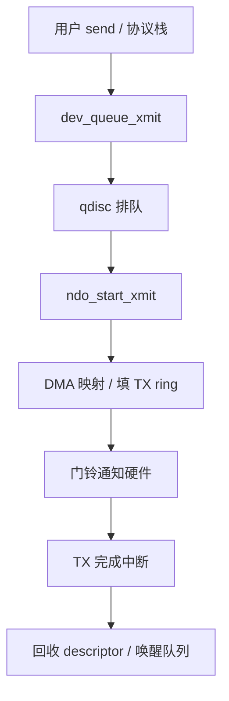
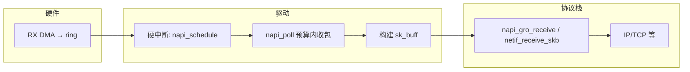

# 网卡驱动完整篇：从 net_device、NAPI 到收发包与排障

板子上网口灯亮但 `ifconfig` 无包、中断风暴、软中断 CPU 打满、TX 超时——问题经常卡在 **网卡驱动与协议栈交界**：`netdev_ops`、环形缓冲区、NAPI 与 `sk_buff`。本文把注册、打开、收包、发包、ethtool 观测合成一篇可对照主线源码验证的闭环。

---

## 源码锚点

| 路径 | 作用 |
|------|------|
| `include/linux/netdevice.h` | `struct net_device`、`struct net_device_ops` |
| `net/core/dev.c` | `register_netdev`、`dev_queue_xmit`、`netif_receive_skb` 等 |
| `include/linux/skbuff.h` | `sk_buff` 包描述符 |
| `net/core/skbuff.c` | skb 分配与操作 |
| `include/linux/napi.h` | NAPI：`napi_struct`、`napi_schedule`、`napi_gro_receive` |
| `net/core/dev.c`（NAPI 相关） | `napi_poll` 调度与预算 |
| `include/uapi/linux/ethtool.h` | ethtool 用户 ABI |
| `Documentation/networking/netdevices.rst` | 网卡驱动文档 |
| `drivers/net/` | 各厂商网卡实现（参考 `*_main.c`） |

设备操作表（驱动必须填充的核心回调）：

```c
/* include/linux/netdevice.h */
struct net_device_ops {
	int			(*ndo_open)(struct net_device *dev);
	int			(*ndo_stop)(struct net_device *dev);
	netdev_tx_t		(*ndo_start_xmit)(struct sk_buff *skb,
						  struct net_device *dev);
	/* ... ndo_set_rx_mode, ndo_tx_timeout, ndo_get_stats64 ... */
};
```

注册与打开：

```c
/* 典型驱动 probe 中 */
dev = alloc_etherdev(sizeof(*priv));
dev->netdev_ops = &xxx_netdev_ops;
dev->ethtool_ops = &xxx_ethtool_ops;
register_netdev(dev);   /* 失败要完整回滚 */
```

---

## 调用链

### 发包路径



### 收包与 NAPI（数据流）



---

## 重点知识

### 1. `net_device` 是驱动与栈的契约

驱动拥有硬件与 ring；协议栈通过 `net_device` + `netdev_ops` 访问设备。`alloc_etherdev`/`alloc_netdev` 分配设备及 `priv`；`register_netdev` 后才会出现在 `ip link`。`ndo_open` 里申请 IRQ、启动 DMA、`netif_start_queue`；`ndo_stop` 对称拆除，避免卸模块后还在跑中断。

### 2. `sk_buff`：包的统一载体

收发包都围绕 skb：线性区、分片、`data`/`len`/`protocol`、校验状态。驱动 RX 路径常见两种：

- 中断里直接 `netif_rx`（低速、老写法）；
- **NAPI**：硬中断只 `napi_schedule`，在 `poll` 里批量收，降中断频率。

TX 侧 `ndo_start_xmit` 返回 `NETDEV_TX_OK` / `NETDEV_TX_BUSY`；环满时 `netif_stop_queue`，完成中断里再 `netif_wake_queue`。

### 3. NAPI 与预算

NAPI 用「预算（budget）」限制一次 softirq 处理的工作量，避免长时间占着 softirq。`napi_complete_done` 后重新开中断；若仍有积压可再次 schedule。调优时常看：

```bash
cat /proc/net/softnet_stat
# 列含 processed / dropped / time_squeeze 等（含义见文档）
grep -r . /sys/class/net/eth0/statistics/
ethtool -S eth0
```

`time_squeeze` 升高往往表示预算不够或 CPU 忙不过来，需要扩队列、RSS、或减包处理成本（GRO/XDP 等进阶手段）。

### 4. 中断、多队列与亲和

现代网卡多队列：每队列一对 TX/RX + MSI-X。结合 `RPS`/`RFS`/`XPS` 与 `irqbalance`/手动 `/proc/irq/*/smp_affinity` 把软中断打散。单核 softirq 100% 而其它核空闲，是典型亲和问题。

### 5. 配置与设备树

嵌入式平台常在 DT 里描述 MAC/PHY（`phy-handle`、`phy-mode`、时钟、复位 GPIO）。缺 PHY 驱动或 `phy_connect` 失败时，表现是 carrier down。用户态：

```bash
ip link set eth0 up
ethtool eth0          # link / speed / duplex
ethtool -k eth0       # offload：TSO/GRO/checksum
ethtool -g eth0       # ring 参数
ethtool -C eth0 ...   # 中断合并（慎改）
```

关错 checksum offload 会导致诡异 TCP 问题；改 ring/coalesce 要有前后对比数据。

### 6. 常见故障

| 现象 | 排查 |
|------|------|
| 有驱动无链路 | PHY、DT、`ethtool` link、mdio 日志 |
| 能 ping 通但吞吐低 | offload、NAPI、IRQ 亲和、qdisc |
| TX timeout | 查 DMA/复位/完成中断是否丢失；`ndo_tx_timeout` |
| 中断风暴 | 合并不当或未走 NAPI；看 `/proc/interrupts` |
| 卸模块 Oops | `ndo_stop` 未停 NAPI/IRQ/定时器 |

调试：`dynamic_debug` 打开驱动 pr_debug；`ftrace` 跟 `napi_poll`/`ndo_start_xmit`；对比 `ethtool -S` 的 error/drop 计数。

---

## Checklist

- [ ] 能画出 `register_netdev` → `ndo_open` → 收发包 → `ndo_stop` 生命周期
- [ ] 理解 `ndo_start_xmit` 与 `netif_stop_queue`/`wake_queue` 的背压关系
- [ ] 能说明 NAPI：硬中断只调度、`poll` 批量收、预算与 `napi_complete`
- [ ] 会用 `ethtool -S/-k/-g` 与 `/proc/net/softnet_stat` 定位丢包与 squeeze
- [ ] 多队列场景会检查 IRQ 亲和与 softirq CPU 分布
- [ ] DT/PHY 链路问题有固定排查顺序（驱动绑定 → phy → carrier）
- [ ] 模块卸载路径确认 IRQ/NAPI/timer 已停干净

---

## 小结

网卡驱动的设计意图是：**硬件细节收敛在 `netdev_ops` 之后，协议栈只看见统一的 `net_device` 与 skb**；NAPI 用轮询批次换中断效率。读一个真实驱动时，抓住 probe 注册、`ndo_open/start_xmit`、中断与 `napi_poll` 四条线，再用 ethtool 统计闭环，比背厂商私有寄存器表更有迁移能力。
