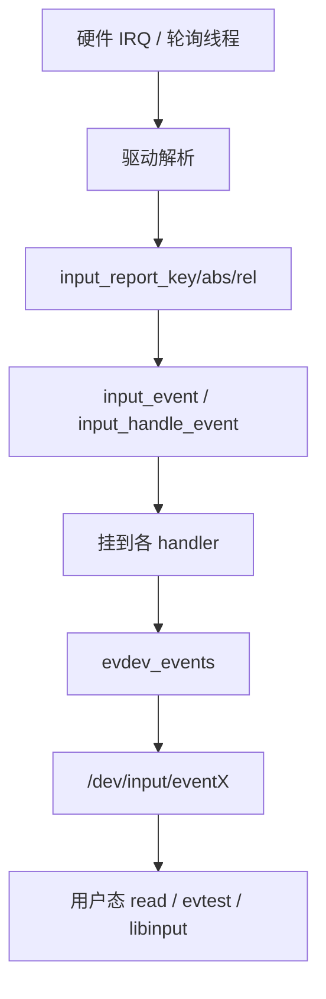
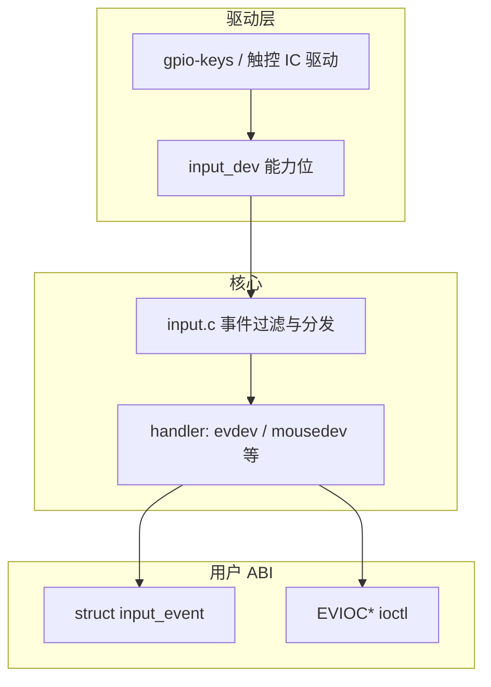

# Linux 输入子系统完整篇：从 input_dev、evdev 到按键/触控上报

写 GPIO 按键或触控驱动时，很多人直接 `request_irq` 再自己搞字符设备——能跑，但用户态、多进程、`evtest`、Android/Qt 输入栈都接不上。正确做法是走 **input 子系统**：驱动只负责采集，内核统一成 `EV_*` 事件，经 `evdev` 暴露给 `/dev/input/eventX`。本文覆盖注册、能力位、上报、同步、设备树与常见坑。

---

## 源码锚点

| 路径 | 作用 |
|------|------|
| `include/linux/input.h` | `struct input_dev`、`input_report_*`、`input_sync` |
| `drivers/input/input.c` | `input_allocate_device`、`input_register_device`、事件分发 |
| `drivers/input/evdev.c` | 用户态 `evdev` 节点、`read`/`poll`/`ioctl` |
| `include/uapi/linux/input-event-codes.h` | `EV_KEY`/`EV_ABS`/`EV_REL`、键码与轴 |
| `include/linux/input/mt.h` | 多点触控 MT 协议辅助 |
| `drivers/input/keyboard/`、`drivers/input/touchscreen/` | 参考实现 |
| `Documentation/input/` | 输入子系统文档、event codes |

分配与注册：

```c
/* drivers/input/input.c 用法 */
idev = input_allocate_device();
idev->name = "my-keys";
idev->phys = "gpio-keys/input0";
idev->id.bustype = BUS_HOST;

__set_bit(EV_KEY, idev->evbit);
__set_bit(KEY_POWER, idev->keybit);

err = input_register_device(idev);
```

中断或线程里上报：

```c
input_report_key(idev, KEY_POWER, pressed); /* 1 按下 / 0 抬起 */
input_sync(idev);   /* 产生 EV_SYN / SYN_REPORT，结束一帧事件 */
```

---

## 调用链

### 事件从硬件到用户态



### 子系统分层



---

## 重点知识

### 1. `input_dev`：先声明能力，再上报

注册前必须设置 `evbit`/`keybit`/`absbit` 等；未声明的事件会被核心丢掉。ABS 轴还要 `input_set_abs_params`（min/max/fuzz/flat），否则用户态校准与触控范围错乱。

常见事件类：

| 类型 | 用途 | 示例 |
|------|------|------|
| `EV_KEY` | 按键/开关 | `KEY_A`、`BTN_LEFT`、`KEY_POWER` |
| `EV_REL` | 相对位移 | 鼠标 `REL_X/Y`、滚轮 |
| `EV_ABS` | 绝对坐标 | 触控 `ABS_X/Y`、`ABS_MT_*` |
| `EV_SYN` | 同步 | `SYN_REPORT` 结束一批 |

### 2. 为什么必须 `input_sync`

多次 `input_report_*` 只是往当前帧塞事件；`input_sync` 发出 `EV_SYN/SYN_REPORT`，告诉用户态「这一帧齐了」。漏 sync 会导致 `evtest` 卡住或坐标「粘连」。多点触控还要遵守 Type B（slot）或 Type A 协议，参考 `Documentation/input/multi-touch-protocol.rst`。

### 3. 打开路径与用户态

`input_register_device` 成功后，`evdev` 创建 `/dev/input/eventX`。用户态：

```bash
evtest /dev/input/event0
cat /proc/bus/input/devices
# 看 Handlers=sysrq kbd event2 等

# 抓包式调试
getevent -l   # Android
libinput debug-events
```

`struct input_event` 含 `time`/`type`/`code`/`value`。多进程可同时打开同一 event 节点（实现上有队列；注意慢读者丢事件）。

### 4. 驱动模型与设备树

平台键常用 `gpio-keys` / `gpio-keys-polled`：DT 描述 GPIO、keycode、`debounce-interval`，往往**不用写 C**。触控则需 I2C/SPI 驱动 + `interrupt-parent` + 复位/供电 regulator。probe 里：

1. 解析 DT / 申请 GPIO / `request_threaded_irq`
2. `input_allocate_device` + 能力位
3. `input_register_device`
4. 错误路径完整 `input_free_device` / `input_unregister_device`

电源键等可配合 `KEY_POWER` 与 pm 子系统；注意唤醒源 `wakeup-source`。

### 5. 防抖、轮询与线程中断

机械按键要消抖：硬件 RC、软件 timer，或 threaded IRQ 里 `msleep`（注意延迟）。高噪声场景可用 `gpio-keys-polled`。触控 IRQ 风暴时优先 threaded IRQ + 在线程里读 FIFO，避免硬中断里 I2C 传输。

### 6. 常见坑

| 现象 | 原因 | 处理 |
|------|------|------|
| `evtest` 无设备 | 未 register / 权限 / 被 grab | 查 `dmesg`、`/proc/bus/input/devices` |
| 有设备无事件 | 能力位未置、IRQ 未进、report 后无 sync | 打点 IRQ；补 `input_sync` |
| 坐标反了/范围错 | ABS 参数或面板方向 | 调 abs params / DT 矩阵 |
| 多指乱跳 | MT 协议用错 slot | 按 Type B 文档改 |
| 休眠后失灵 | 未恢复 IRQ/电源 | 补 resume；查 runtime PM |

安全：输入节点权限；部分系统用 `evdev` grab 独占（`EVIOCGRAB`），调试时注意谁占了设备。

---

## Checklist

- [ ] 能独立写：allocate → 设 bit → register → report → sync → unregister
- [ ] 理解未声明能力位的事件会被丢弃
- [ ] 每帧事件以 `input_sync` 结束，并能在 `evtest` 看到 `SYN_REPORT`
- [ ] 会用 `/proc/bus/input/devices` 与 `evtest` 验证
- [ ] DT 按键优先评估 `gpio-keys`，避免重复造轮子
- [ ] 触控 ABS/MT 参数与协议类型正确
- [ ] 错误与 remove 路径释放 input_dev 与 IRQ，无 UAF

---

## 小结

输入子系统的设计意图是：**驱动只管「发生了什么」并声明能力，内核统一编码与扇出，用户态只认 evdev ABI**。嵌入式上优先复用 `gpio-keys` 与成熟触控驱动框架；自写驱动时把能力位、`input_sync` 和对称的卸载路径做对，就能和桌面/Android 输入栈无缝衔接。
