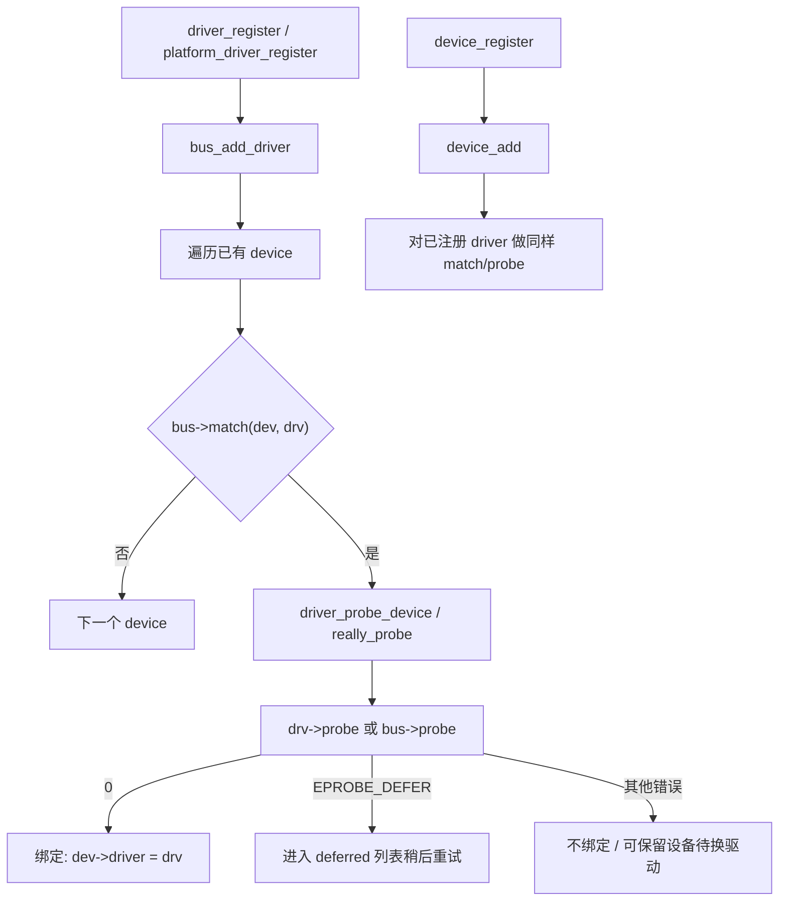
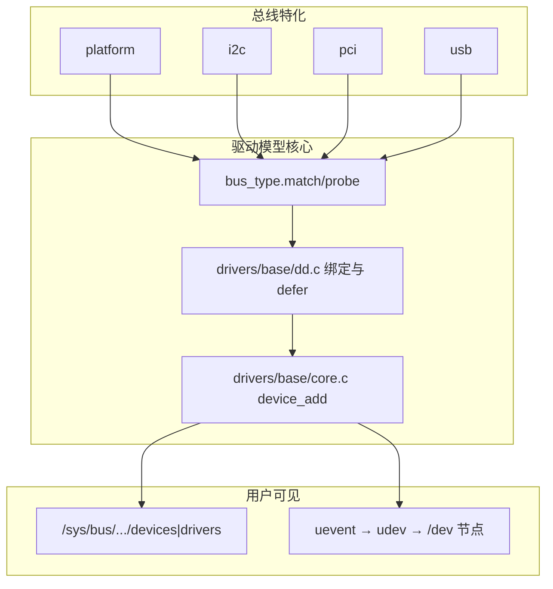

# Linux 驱动模型基础完整篇：从 bus/device/driver 到 match/probe 绑定排障

`compatible` 写对了却始终不进 `probe`、`sysfs` 里能看见设备却没有驱动、或者 `probe` 返回 `-EPROBE_DEFER` 后就「失踪」——根因几乎总在 **驱动模型三元组（bus / device / driver）的注册与匹配**，而不是业务代码第一行。

Linux 把「有什么设备」和「谁来驱动」解耦：设备挂到总线上，驱动向总线注册，总线的 `match` 成功后再走 `probe`。platform、I2C、PCI、USB 都是这套模型的特化。本文从核心对象、注册调用链、延迟 probe、sysfs 观测到排障 Checklist 一次讲清。源 chapter（001–003、005–007）为提纲；004 曾单独发过短文，本篇按完整主线重写。

---

## 源码锚点

| 路径 | 作用 |
|------|------|
| `include/linux/device.h` | `struct device`、`device_register`/`device_unregister` |
| `include/linux/device/driver.h` | `struct device_driver`、`driver_register` |
| `include/linux/device/bus.h` | `struct bus_type`、`bus_register`、`match`/`probe`/`remove` |
| `drivers/base/bus.c` | 驱动/设备挂总线、迭代匹配 |
| `drivers/base/dd.c` | `device_bind_driver`、`driver_probe_device`、延迟 probe 列表 |
| `drivers/base/core.c` | `device_add`、属性、uevent、与 sysfs 衔接 |
| `drivers/base/platform.c` | platform 总线特化（`platform_driver_register`） |
| `Documentation/driver-api/driver-model/` | 模型总览 |

核心对象关系（字段以主线为准）：

```c
/* 总线：匹配策略与通用 probe/remove */
struct bus_type {
	const char *name;
	int (*match)(struct device *dev, struct device_driver *drv);
	int (*probe)(struct device *dev);
	void (*remove)(struct device *dev);
	/* ... */
};

/* 驱动：挂在某条 bus 上 */
struct device_driver {
	const char *name;
	struct bus_type *bus;
	struct module *owner;
	const struct of_device_id *of_match_table;
	int (*probe)(struct device *dev);
	int (*remove)(struct device *dev);
	/* ... */
};

/* 设备：父设备、总线、驱动指针、电源等 */
struct device {
	struct device *parent;
	struct bus_type *bus;
	struct device_driver *driver; /* 绑定成功后非 NULL */
	void *platform_data;
	/* ... */
};
```

注册入口（驱动侧最常见）：

```c
/* 通用 */
int driver_register(struct device_driver *drv);
/* platform 封装：填 bus=platform_bus_type 再 register */
int platform_driver_register(struct platform_driver *drv);
/* 设备侧 */
int device_register(struct device *dev);
int platform_device_register(struct platform_device *pdev);
```

---

## 调用链

### 驱动注册到 probe（主路径）



### 模型分层（谁负责什么）



---

## 重点知识

### 1. 为什么必须有 bus？

没有总线，内核无法回答「这个设备该交给谁」。`match` 把策略收口到总线：

- platform / OF：主要看 `of_match_table` 的 `compatible`
- PCI：`pci_device_id` 表
- USB：接口级 id 表
- I2C：`i2c_device_id` / OF / ACPI

驱动作者通常只填 **特化后的 `xxx_driver`**，由封装函数设置好 `bus` 指针。自己写 `driver_register` 时若 `bus` 为空或 match 表为空，表现就是「永远不 probe」。

### 2. 设备与驱动谁先注册？

无所谓先后——`device_add` 会扫已有驱动，`bus_add_driver` 会扫已有设备。嵌入式上常见顺序：

1. 总线初始化  
2. DT 展开创建设备（或 `platform_device_register`）  
3. 模块加载注册驱动 → match → probe  

若设备在驱动之后才创建（热插拔、后加载 DT overlay），同样会再走匹配。

### 3. `probe` 返回值语义（必记）

| 返回值 | 含义 | 后果 |
|--------|------|------|
| `0` | 成功 | `dev->driver` 绑定 |
| `-EPROBE_DEFER` | 依赖未就绪（时钟、供电、另一设备） | 进 deferred 队列，稍后重试 |
| 其他负值 | 失败 | 不绑定；可能打日志；设备仍在，可换驱动 |

典型坑：把「可选资源缺失」写成硬失败，或把「必选资源」漏成 defer，导致启动期静默、很久后才成功/失败。

### 4. sysfs 上怎么确认绑定

```bash
# 设备是否存在
ls /sys/bus/platform/devices/
# 驱动是否登记
ls /sys/bus/platform/drivers/mydrv/
# 是否已绑定（有 driver 软链）
ls -l /sys/bus/platform/devices/foo.0/driver
# 手动触发（调试）
echo foo.0 > /sys/bus/platform/drivers/mydrv/bind
echo foo.0 > /sys/bus/platform/drivers/mydrv/unbind
```

`dmesg` 里搜 `deferred probe`、`EPROBE_DEFER`，对照 `/sys/kernel/debug/devices_deferred`（若开启）。

### 5. 与字符设备/类设备的关系

驱动模型解决 **绑定**；`cdev`/`device_create` 解决 **用户节点**。常见正确组合：

1. `platform_driver.probe` 成功  
2. 申请 `dev_t`、`cdev_add`  
3. `device_create` 发 uevent → udev 建 `/dev/xxx`  

只做了 2/3 而 probe 从未成功，会出现「代码里写了 create 却根本没执行」。只做了绑定不做节点，则 sysfs 正常但用户态无设备文件——两者要分开查。

### 6. 配置与模块

- 总线与核心：`drivers/base/` 通常内置  
- 具体驱动：`tristate` 模块，`MODULE_DEVICE_TABLE` 便于别名自动加载  
- OF：`of_match_table` + `MODULE_DEVICE_TABLE(of, ...)`  

```c
static const struct of_device_id my_of_match[] = {
	{ .compatible = "vendor,my-device" },
	{ /* sentinel */ }
};
MODULE_DEVICE_TABLE(of, my_of_match);
```

### 7. 常见坑

| 坑 | 现象 | 对策 |
|----|------|------|
| compatible 与 DT 不一致 | 有设备无驱动 | `od -c`/`cat` 节点 `compatible`；对齐字符串 |
| 驱动未进镜像/未加载 | 同上 | `zcat /proc/config.gz`；`modprobe`；initramfs |
| 依赖未 defer | 启动失败或空指针 | 时钟/regulator/gpio 用官方 get API，允许 `-EPROBE_DEFER` |
| probe 里失败未回滚 | 第二次 probe 资源忙 | 按申请逆序释放；用 `devm_*` |
| 绑定了错误驱动 | 行为怪异 | `unbind` 后换正确驱动；检查 match 过宽 |

---

## Checklist

- [ ] `xxx_driver.driver.bus` / 封装注册函数正确（非 NULL）
- [ ] match 表（OF/ID）与硬件/DT/ACPI 一致，含 sentinel
- [ ] `MODULE_DEVICE_TABLE` 已写，模块别名可自动加载
- [ ] `probe` 区分硬失败与 `-EPROBE_DEFER`，失败路径资源回滚
- [ ] `/sys/bus/.../devices/.../driver` 软链存在即绑定成功
- [ ] 需要用户节点时，在 probe 成功路径创建 cdev/device_create
- [ ] 能用 `bind`/`unbind` 手动验证 remove/probe 对称
- [ ] 启动日志无无限 deferred；依赖闭环可在有限次重试内结束

---

*合并自：驱动开发/chapters/001,002,003,005,006,007-驱动模型基础*（2026-09-06）
