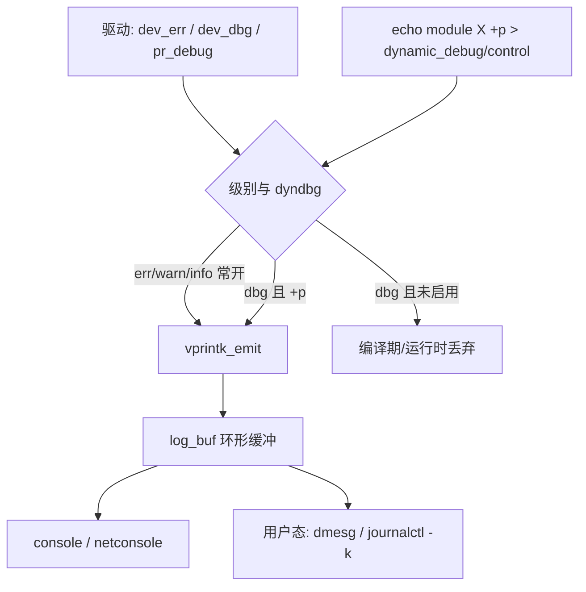
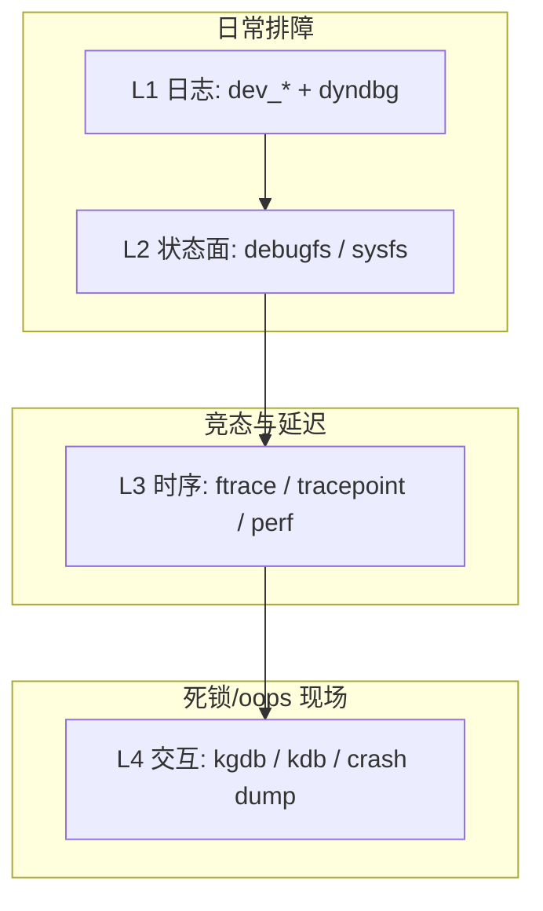

# Linux 驱动调试完整篇：从 printk/dev_dbg、动态调试到 debugfs/ftrace 排障

模块 `probe` 偶发失败、现场只能复现一次、打开 `printk` 满屏刷却找不到关键路径——驱动调试的痛点通常不是「不会写驱动」，而是 **观测面选错、日志级别不对、或在错误上下文里睡眠/打印**。板子上真正管用的是一套分层手段：日常用 `dev_*` + 动态调试（dyndbg），结构用 debugfs 暴露，时序用 ftrace/tracepoint，硬核再用 kgdb。

本文把驱动侧调试工具链收成一篇可验证闭环：日志与动态调试 → debugfs → ftrace/事件 → 常见坑与 Checklist。源 chapter（091–096）为提纲；正文按主线 `lib/dynamic_debug.c`、`fs/debugfs/`、`kernel/trace/` 真实路径重写。

---

## 源码锚点

| 路径 | 作用 |
|------|------|
| `include/linux/printk.h` | `printk`、日志级别、`pr_*` |
| `include/linux/dev_printk.h` | `dev_err`/`dev_warn`/`dev_info`/`dev_dbg` |
| `include/linux/dynamic_debug.h` | `DEFINE_DYNAMIC_DEBUG_METADATA`、`dynamic_dev_dbg` |
| `lib/dynamic_debug.c` | dyndbg 查询解析、`/sys/kernel/debug/dynamic_debug/control` |
| `include/linux/debugfs.h` / `fs/debugfs/` | `debugfs_create_dir`/`debugfs_create_file` |
| `include/linux/tracepoint.h` / `include/trace/events/` | tracepoint 声明与事件头 |
| `kernel/trace/` | ftrace、function tracer、event tracing |
| `Documentation/admin-guide/dynamic-debug-howto.rst` | dyndbg 语法与模块参数 |

设备侧日志（优先于裸 `printk`）：

```c
/* include/linux/dev_printk.h —— 带设备名，便于 dmesg/grep */
dev_err(dev, "probe failed: %d\n", err);
dev_warn(dev, "fallback to polling\n");
dev_info(dev, "irq=%d\n", irq);
dev_dbg(dev, "xfer len=%zu\n", len);   /* 默认常被编译为可控 dbg */
```

动态调试控制面：

```c
/* 用户态：打开某模块所有 pr_debug/dev_dbg */
/* echo 'module mydrv +p' > /sys/kernel/debug/dynamic_debug/control */

/* 或按文件/行/函数： */
/* echo 'file mydrv.c:120 +p' > .../control */
/* echo 'func my_probe +p' > .../control */

/* 模块加载时：insmod mydrv.ko dyndbg=+p */
```

debugfs 导出寄存器/状态：

```c
/* include/linux/debugfs.h */
priv->dbg_dir = debugfs_create_dir("mydrv", NULL);
debugfs_create_u32("errors", 0444, priv->dbg_dir, &priv->err_cnt);
debugfs_create_file("regs", 0444, priv->dbg_dir, priv, &regs_fops);
/* 卸载：debugfs_remove_recursive(priv->dbg_dir); */
```

---

## 调用链

### 日志从驱动打到控制台/缓冲区



### 调试手段分层（选对层再加码）



---

## 重点知识

### 1. 先分清「该不该打印」与「在哪一层看」

| 现象 | 优先手段 | 避免 |
|------|----------|------|
| probe 失败、资源拿不到 | `dev_err` + 返回值路径 | 无设备上下文的裸 `printk` |
| 偶发数据路径问题 | `dev_dbg` + dyndbg 按函数打开 | 生产环境常开 `+p` 刷屏 |
| 寄存器/计数器要现场看 | debugfs 只读节点 | 在硬中断里做复杂格式化 |
| 丢中断、延迟尖峰 | ftrace / irqsoff / event | 只靠猜 sleep 位置 |
| oops / 死锁 | 完整 oops 文本、锁依赖、kgdb | 重启前不保存日志 |

原则：**错误路径永远要有可检索日志**；热路径默认静默，用 dyndbg 按需打开。

### 2. `dev_dbg` 与动态调试（CONFIG_DYNAMIC_DEBUG）

开启 `CONFIG_DYNAMIC_DEBUG` 后，`dev_dbg`/`pr_debug` 会挂到 `__dyndbg` 段，由 `lib/dynamic_debug.c` 按查询串启停。常用 flag：

- `+p` / `-p`：打印开关  
- `+f`/`+l`/`+m`：附带函数名、行号、模块名（排障期有用，热路径慎开）

模块参数惯例：

```bash
# 启动参数（内置驱动）
mydrv.dyndbg=+p

# 或全局
dyndbg="file drivers/misc/mydrv.c +p"
```

未开 DYNAMIC_DEBUG 时，许多配置下 `dev_dbg` 会变成空操作或依赖 `DEBUG` 宏——**板级 defconfig 先确认**，否则你以为开了调试其实一条都没有。

### 3. debugfs：给驱动一个「只读仪表盘」

适合导出：错误计数、最近一次错误码、关键寄存器快照、ring 指针、固件版本。注意：

- 权限默认收紧；量产镜像常不挂 debugfs，调试镜像再 `mount -t debugfs none /sys/kernel/debug`
- `file_operations` 里用 `simple_read_from_buffer` 即可；避免在 show 里拿会死锁的锁
- 卸载必须 `debugfs_remove_recursive`，否则模块卸载后访问必 oops

### 4. ftrace：看调用与延迟，不只看字符串

```bash
# 函数追踪（过滤模块符号）
echo function > /sys/kernel/tracing/current_tracer
echo 'mydrv_*' > /sys/kernel/tracing/set_ftrace_filter
echo 1 > /sys/kernel/tracing/tracing_on
# 复现后
cat /sys/kernel/tracing/trace

# 事件：调度 / 中断
echo 1 > /sys/kernel/tracing/events/irq/enable
echo 1 > /sys/kernel/tracing/events/sched/sched_switch/enable
```

驱动若定义 tracepoint（`TRACE_EVENT`），比狂打 `printk` 轻一个数量级，且可用 `perf`/`trace-cmd` 离线分析。

### 5. 配置与编译开关

| 配置 | 用途 |
|------|------|
| `CONFIG_DYNAMIC_DEBUG` | 运行时开关 dbg |
| `CONFIG_DEBUG_FS` | debugfs |
| `CONFIG_FTRACE` / `FUNCTION_TRACER` | 函数追踪 |
| `CONFIG_KALLSYMS` | oops 符号化 |
| `CONFIG_DEBUG_KERNEL` 及 lockdep/kasan（调试内核） | 锁与内存类问题 |

模块 Makefile：调试包可加 `ccflags-y += -DDEBUG`，但长期更推荐 dyndbg，避免两套二进制行为不一致。

### 6. 常见坑与对策

| 坑 | 现象 | 对策 |
|----|------|------|
| 硬中断里 `printk` 过多 | 丢中断、调度延迟炸 | 硬中断只记标志；重活放 thread/wq；dbg 用 rate limit |
| 忘记关 dyndbg | 磁盘/串口被日志打满 | 复现后立刻 `-p`；自动化脚本成对开关 |
| debugfs 节点在 remove 后仍被读 | use-after-free oops | `remove_recursive` 与模块引用计数对齐 |
| 只看 `dmesg` 截断 | 关键 oops 丢失 | `dmesg -T` / 增大 `log_buf_len` / 持久日志 |
| 用户态权限 | 打不开 `dynamic_debug/control` | 需要 debugfs + root；确认已 mount |
| 发行版裁掉 debugfs | 节点不存在 | 调试镜像单独开 `DEBUG_FS` |

### 7. 一条可重复的排障顺序

1. 固定复现命令与版本（`uname -r`、模块 `vermagic`、DT/兼容串）  
2. 清环缓：`dmesg -C`（慎用生产），再跑复现，抓完整 `dmesg -T`  
3. 错误路径是否有 `dev_err`？没有则先补返回值日志再谈玄学  
4. 需要细节：对嫌疑函数 `+p`，或开对应 tracepoint  
5. 怀疑时序：ftrace/irqsoff；怀疑内存：KASAN/kmemleak（调试内核）  
6. 根因写入回归用例；默认关闭调试开关后再验证一次性能

---

## Checklist

- [ ] defconfig 已确认 `DYNAMIC_DEBUG` / `DEBUG_FS` / 必要 ftrace 选项
- [ ] 错误路径一律 `dev_err`（或等价），带返回值与设备名
- [ ] 热路径只用 `dev_dbg`，并用 dyndbg 按函数/文件开关，而非常开
- [ ] 模块支持 `dyndbg=` 参数或文档写明 control 查询串
- [ ] debugfs 目录在 `probe` 创建、`remove` 时 `debugfs_remove_recursive`
- [ ] 硬中断/spinlock 路径无阻塞、无过量打印
- [ ] 能用一条命令复现，并保存完整 dmesg + `/proc/version` + 模块信息
- [ ] 关闭所有 `+p` 后功能与性能仍正常（无调试依赖）

---

*合并自：驱动开发/chapters/091–096-驱动调试*（2026-09-06）
