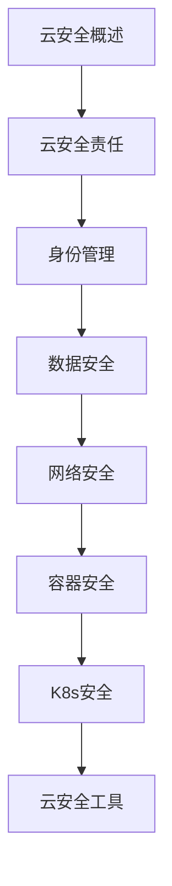

# 云安全 学习指南

> **分类**：安全 ｜ **技术生态**：AWS Security Hub, Azure Defender, CIS Benchmarks, Falco, OPA/Gatekeeper

> **学习声明**：本章内容仅供合法授权环境下的安全研究与防御建设，请遵守法律法规与组织安全政策，禁止对未授权系统开展测试。

## 领域定位

云安全遵循共享责任模型：云厂商保障基础设施，客户负责配置、数据与访问控制。容器、Kubernetes 与 Serverless 引入新的攻击面，身份管理（IAM）、网络策略与密钥管理是核心防御层。

面向云架构师与 DevSecOps 工程师，侧重 AWS/阿里云/K8s 安全配置。

本领域常用技术栈与工具包括：AWS Security Hub, Azure Defender, CIS Benchmarks, Falco, OPA/Gatekeeper。

## 学习目标

- 理解云共享责任模型与各服务安全边界
- 配置 IAM 最小权限与 MFA
- 加固容器镜像与 K8s RBAC/NetworkPolicy
- 满足等保、SOC2 等合规要求

## 前置知识

- 云计算基础
- Docker/Kubernetes
- 网络基础
- IAM 概念

## 学习路径

1. **云安全概述**
2. **云安全责任**
3. **身份管理**
4. **数据安全**
5. **网络安全**
6. **容器安全**
7. **K8s安全**
8. **云安全工具**

## 模块体系

- **云安全概述**
- **云安全责任**
- **身份管理**
- **数据安全**
- **网络安全**
- **容器安全**
- **K8s安全**
- **云安全工具**
- **合规**
- **云安全最佳实践**

## 难度分布

| 入门 | 12 | 20% |
| 实战 | 12 | 20% |
| 进阶 | 18 | 30% |
| 高级 | 18 | 30% |

## 章节索引

### 云安全概述

- [云安全概述核心概念与原理](chapters/001-云安全概述核心概念与原理.md) ｜ 入门
- [云安全概述的实现机制详解](chapters/002-云安全概述的实现机制详解.md) ｜ 入门
- [云安全概述的关键技术点](chapters/003-云安全概述的关键技术点.md) ｜ 入门
- [云安全概述的源码级分析](chapters/004-云安全概述的源码级分析.md) ｜ 入门
- [云安全概述的配置与使用](chapters/005-云安全概述的配置与使用.md) ｜ 入门
- [云安全概述的常见问题与解决方案](chapters/006-云安全概述的常见问题与解决方案.md) ｜ 入门

### 云安全责任

- [云安全责任核心概念与原理](chapters/007-云安全责任核心概念与原理.md) ｜ 入门
- [云安全责任的实现机制详解](chapters/008-云安全责任的实现机制详解.md) ｜ 入门
- [云安全责任的关键技术点](chapters/009-云安全责任的关键技术点.md) ｜ 入门
- [云安全责任的源码级分析](chapters/010-云安全责任的源码级分析.md) ｜ 入门
- [云安全责任的配置与使用](chapters/011-云安全责任的配置与使用.md) ｜ 入门
- [云安全责任的常见问题与解决方案](chapters/012-云安全责任的常见问题与解决方案.md) ｜ 入门

### 身份管理

- [身份管理核心概念与原理](chapters/013-身份管理核心概念与原理.md) ｜ 进阶
- [身份管理的实现机制详解](chapters/014-身份管理的实现机制详解.md) ｜ 进阶
- [身份管理的关键技术点](chapters/015-身份管理的关键技术点.md) ｜ 进阶
- [身份管理的源码级分析](chapters/016-身份管理的源码级分析.md) ｜ 进阶
- [身份管理的配置与使用](chapters/017-身份管理的配置与使用.md) ｜ 进阶
- [身份管理的常见问题与解决方案](chapters/018-身份管理的常见问题与解决方案.md) ｜ 进阶

### 数据安全

- [数据安全核心概念与原理](chapters/019-数据安全核心概念与原理.md) ｜ 进阶
- [数据安全的实现机制详解](chapters/020-数据安全的实现机制详解.md) ｜ 进阶
- [数据安全的关键技术点](chapters/021-数据安全的关键技术点.md) ｜ 进阶
- [数据安全的源码级分析](chapters/022-数据安全的源码级分析.md) ｜ 进阶
- [数据安全的配置与使用](chapters/023-数据安全的配置与使用.md) ｜ 进阶
- [数据安全的常见问题与解决方案](chapters/024-数据安全的常见问题与解决方案.md) ｜ 进阶

### 网络安全

- [网络安全核心概念与原理](chapters/025-网络安全核心概念与原理.md) ｜ 进阶
- [网络安全的实现机制详解](chapters/026-网络安全的实现机制详解.md) ｜ 进阶
- [网络安全的关键技术点](chapters/027-网络安全的关键技术点.md) ｜ 进阶
- [网络安全的源码级分析](chapters/028-网络安全的源码级分析.md) ｜ 进阶
- [网络安全的配置与使用](chapters/029-网络安全的配置与使用.md) ｜ 进阶
- [网络安全的常见问题与解决方案](chapters/030-网络安全的常见问题与解决方案.md) ｜ 进阶

### 容器安全

- [容器安全核心概念与原理](chapters/031-容器安全核心概念与原理.md) ｜ 高级
- [容器安全的实现机制详解](chapters/032-容器安全的实现机制详解.md) ｜ 高级
- [容器安全的关键技术点](chapters/033-容器安全的关键技术点.md) ｜ 高级
- [容器安全的源码级分析](chapters/034-容器安全的源码级分析.md) ｜ 高级
- [容器安全的配置与使用](chapters/035-容器安全的配置与使用.md) ｜ 高级
- [容器安全的常见问题与解决方案](chapters/036-容器安全的常见问题与解决方案.md) ｜ 高级

### K8s安全

- [K8s安全核心概念与原理](chapters/037-K8s安全核心概念与原理.md) ｜ 高级
- [K8s安全的实现机制详解](chapters/038-K8s安全的实现机制详解.md) ｜ 高级
- [K8s安全的关键技术点](chapters/039-K8s安全的关键技术点.md) ｜ 高级
- [K8s安全的源码级分析](chapters/040-K8s安全的源码级分析.md) ｜ 高级
- [K8s安全的配置与使用](chapters/041-K8s安全的配置与使用.md) ｜ 高级
- [K8s安全的常见问题与解决方案](chapters/042-K8s安全的常见问题与解决方案.md) ｜ 高级

### 云安全工具

- [云安全工具核心概念与原理](chapters/043-云安全工具核心概念与原理.md) ｜ 高级
- [云安全工具的实现机制详解](chapters/044-云安全工具的实现机制详解.md) ｜ 高级
- [云安全工具的关键技术点](chapters/045-云安全工具的关键技术点.md) ｜ 高级
- [云安全工具的源码级分析](chapters/046-云安全工具的源码级分析.md) ｜ 高级
- [云安全工具的配置与使用](chapters/047-云安全工具的配置与使用.md) ｜ 高级
- [云安全工具的常见问题与解决方案](chapters/048-云安全工具的常见问题与解决方案.md) ｜ 高级

### 合规

- [合规核心概念与原理](chapters/049-合规核心概念与原理.md) ｜ 实战
- [合规的实现机制详解](chapters/050-合规的实现机制详解.md) ｜ 实战
- [合规的关键技术点](chapters/051-合规的关键技术点.md) ｜ 实战
- [合规的源码级分析](chapters/052-合规的源码级分析.md) ｜ 实战
- [合规的配置与使用](chapters/053-合规的配置与使用.md) ｜ 实战
- [合规的常见问题与解决方案](chapters/054-合规的常见问题与解决方案.md) ｜ 实战

### 云安全最佳实践

- [云安全最佳实践核心概念与原理](chapters/055-云安全最佳实践核心概念与原理.md) ｜ 实战
- [云安全最佳实践的实现机制详解](chapters/056-云安全最佳实践的实现机制详解.md) ｜ 实战
- [云安全最佳实践的关键技术点](chapters/057-云安全最佳实践的关键技术点.md) ｜ 实战
- [云安全最佳实践的源码级分析](chapters/058-云安全最佳实践的源码级分析.md) ｜ 实战
- [云安全最佳实践的配置与使用](chapters/059-云安全最佳实践的配置与使用.md) ｜ 实战
- [云安全最佳实践的常见问题与解决方案](chapters/060-云安全最佳实践的常见问题与解决方案.md) ｜ 实战

---
*领域: 云安全*