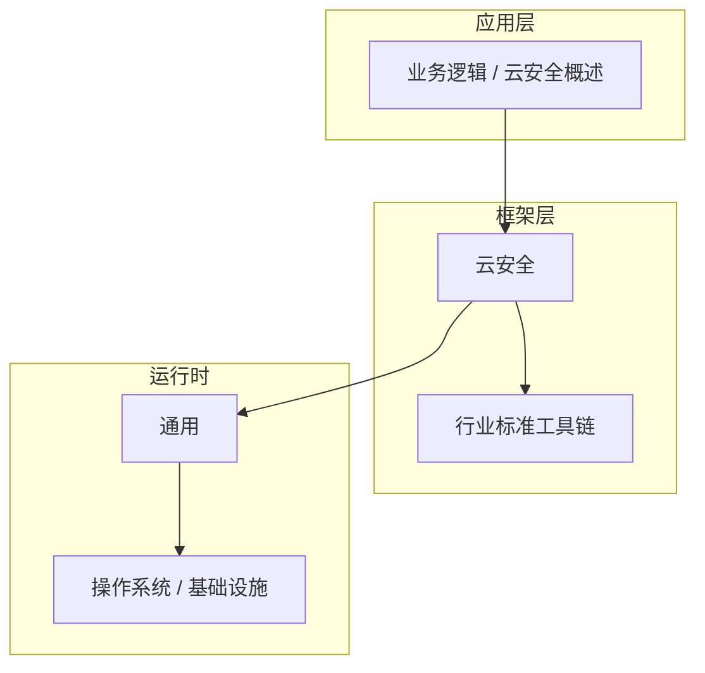

# 云安全概述的配置与使用

> **领域**：云安全 ｜ **模块**：云安全概述 ｜ **难度**：入门 ｜ **类型**：配置实践

> **学习声明**：本章内容仅供合法授权环境下的安全研究与防御建设，请遵守法律法规与组织安全政策，禁止对未授权系统开展测试。

## 导读

本章属于 **云安全** 教程的 **云安全概述** 模块，难度为 **入门**。阅读重点在于建立清晰的概念模型与工程判断能力，而非死记细节。

## 核心概念

云安全 是当前技术生态中的重要方向，系统学习需兼顾概念、原理与工程实践。

在 **云安全** 体系中，**云安全概述** 与上下游模块形成协作。技术栈以 **云安全** 为核心（通用），生态包括 行业标准工具链。

「云安全概述」是该领域的核心知识模块，理解其原理与边界是工程实践的基础。

### 概念精讲

**云安全概述的基本概念与定义**

从实践出发：典型应用场景与反模式（不该用的场景）。 在 云安全概述 语境下，这一点直接影响设计决策与故障排查思路。

**云安全概述在云安全中的作用与地位**

从演进出发：历史上为何出现、未来可能如何变化。 在 云安全概述 语境下，这一点直接影响设计决策与故障排查思路。

**云安全概述的核心数据结构**

从度量出发：如何评估它是否工作正常、性能是否达标。 在 云安全概述 语境下，这一点直接影响设计决策与故障排查思路。

**云安全概述的关键算法与流程**

从定义出发：它解决什么问题、不解决什么问题，边界在哪里。 在 云安全概述 语境下，这一点直接影响设计决策与故障排查思路。

**云安全概述与其他模块的关系**

从结构出发：核心组成部分是什么，彼此如何协作。 在 云安全概述 语境下，这一点直接影响设计决策与故障排查思路。

## 架构与流程

以下框图帮助你在宏观层面把握模块协作关系与处理流向：

## 深度讲解

### 配置三层

- **默认值**：框架内置，开箱可用。
- **环境配置**：开发/测试/生产差异化注入。
- **运行时覆盖**：紧急开关、限流阈值。

### 原则

敏感项由密钥服务注入；变更可追溯；启动时校验，失败快速退出。

### 版本注意

云安全 配置项可能随大版本更名，升级前对照迁移指南。

### 落地检查清单

- **理解云安全概述的设计思想与适用场景**：落地时需明确验收标准与回滚方案。
- **掌握云安全概述的核心API与配置项**：落地时需明确验收标准与回滚方案。
- **分析云安全概述的源码实现与调用流程**：落地时需明确验收标准与回滚方案。
- **了解云安全概述的性能特点与瓶颈**：落地时需明确验收标准与回滚方案。

### 常见误区与应对

**误区：对云安全概述的概念理解不深入导致误用**

**应对**：回到官方定义画一张概念图，与同事讲解一遍，确保能用自己的话复述。

**误区：忽略云安全概述的性能边界与限制条件**

**应对**：用 Profiler 或压测建立基线，对比优化前后数据，避免凭感觉优化。

**误区：云安全概述配置不当引发的问题**

**应对**：核对环境变量、配置文件与部署清单是否一致，使用配置 diff 工具排查。

**误区：缺乏对云安全概述底层原理的理解**

**应对**：做威胁建模与权限审计，最小权限原则，敏感操作留审计日志。

**误区：云安全概述与其他模块集成时的兼容性问题**

**应对**：列出依赖版本矩阵，在 CI 中跑集成测试覆盖主要组合。

### 最佳实践

1. **遵循云安全概述的官方推荐用法与规范** — 落地方式：写入团队 Wiki 并纳入 Code Review 检查项。

2. **在理解原理的基础上合理使用云安全概述** — 落地方式：配置静态检查或 CI 规则自动拦截违规写法。

3. **建立完善的云安全概述监控与告警机制** — 落地方式：在新人 onboarding 中作为必修内容讲解。

4. **编写充分的测试用例覆盖云安全概述的各种场景** — 落地方式：每季度回顾一次，对照社区最佳实践更新。

5. **持续关注云安全概述的版本更新与最佳实践演进** — 落地方式：用真实项目案例演示正确与错误对比。

### 本章小结

学完本章，你应能：

- 说清 **云安全概述的配置与使用** 在 云安全/云安全概述 中的定位。
- 描述核心流程与关键概念，能用自己的话复述。
- 识别常见误区并采取预防与排查手段。
- 在项目中做出与场景匹配的工程决策。

类型：**配置实践**。建议完成小练习或复盘笔记，将阅读转化为能力。

## 延伸学习

建议结合以下同模块章节继续阅读，构建完整知识链：

- 云安全概述的关键技术点
- 云安全概述的源码级分析
- 云安全概述的常见问题与解决方案

### 参考资料

- 云安全官方文档 - 云安全概述章节
- 《云安全权威指南》相关章节
- 云安全概述源码实现与注释
- 云安全社区最佳实践文章
- 云安全概述相关技术博客与教程

---
*章节 ID: 005 ｜ 领域: 云安全 ｜ 版本: 2.0*