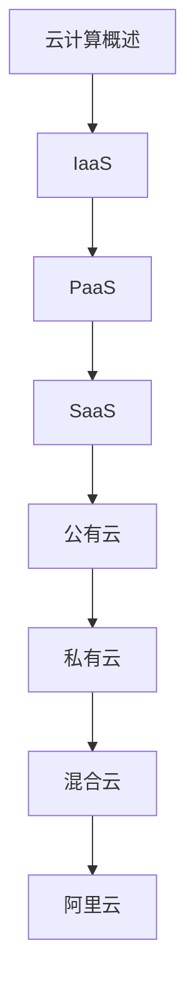

# 云计算 学习指南

> **分类**：DevOps ｜ **技术生态**：AWS、阿里云、Azure、Terraform、Kubernetes

## 领域定位

云计算按 IaaS/PaaS/SaaS 分层交付资源。公有云、私有云与混合云并存，云原生（容器+K8s+微服务）是主流架构范式。

覆盖 VPC、对象存储、托管 K8s、IAM 与 FinOps 成本优化。

本领域常用技术栈与工具包括：AWS、阿里云、Azure、Terraform、Kubernetes。

## 学习目标

- 能设计 VPC 与安全组
- 能使用托管数据库与对象存储
- 能评估多云与厂商锁定
- 能实施成本标签与预算告警

## 前置知识

- 网络基础
- Docker/K8s 入门

## 学习路径

1. **云计算概述**
2. **IaaS**
3. **PaaS**
4. **SaaS**
5. **公有云**
6. **私有云**
7. **混合云**
8. **阿里云**

## 模块体系

- **云计算概述**
- **IaaS**
- **PaaS**
- **SaaS**
- **公有云**
- **私有云**
- **混合云**
- **阿里云**
- **AWS**
- **云原生**
- **云安全**
- **成本优化**
- **云计算最佳实践**

## 难度分布

| 入门 | 15 | 25% |
| 实战 | 12 | 20% |
| 进阶 | 15 | 25% |
| 高级 | 18 | 30% |

## 章节索引

### 云计算概述

- [云计算概述核心概念与原理](chapters/001-云计算概述核心概念与原理.md) ｜ 入门
- [云计算概述的实现机制详解](chapters/002-云计算概述的实现机制详解.md) ｜ 入门
- [云计算概述的关键技术点](chapters/003-云计算概述的关键技术点.md) ｜ 入门
- [云计算概述的源码级分析](chapters/004-云计算概述的源码级分析.md) ｜ 入门
- [云计算概述的配置与使用](chapters/005-云计算概述的配置与使用.md) ｜ 入门

### IaaS

- [IaaS核心概念与原理](chapters/006-IaaS核心概念与原理.md) ｜ 入门
- [IaaS的实现机制详解](chapters/007-IaaS的实现机制详解.md) ｜ 入门
- [IaaS的关键技术点](chapters/008-IaaS的关键技术点.md) ｜ 入门
- [IaaS的源码级分析](chapters/009-IaaS的源码级分析.md) ｜ 入门
- [IaaS的配置与使用](chapters/010-IaaS的配置与使用.md) ｜ 入门

### PaaS

- [PaaS核心概念与原理](chapters/011-PaaS核心概念与原理.md) ｜ 入门
- [PaaS的实现机制详解](chapters/012-PaaS的实现机制详解.md) ｜ 入门
- [PaaS的关键技术点](chapters/013-PaaS的关键技术点.md) ｜ 入门
- [PaaS的源码级分析](chapters/014-PaaS的源码级分析.md) ｜ 入门
- [PaaS的配置与使用](chapters/015-PaaS的配置与使用.md) ｜ 入门

### SaaS

- [SaaS核心概念与原理](chapters/016-SaaS核心概念与原理.md) ｜ 进阶
- [SaaS的实现机制详解](chapters/017-SaaS的实现机制详解.md) ｜ 进阶
- [SaaS的关键技术点](chapters/018-SaaS的关键技术点.md) ｜ 进阶
- [SaaS的源码级分析](chapters/019-SaaS的源码级分析.md) ｜ 进阶
- [SaaS的配置与使用](chapters/020-SaaS的配置与使用.md) ｜ 进阶

### 公有云

- [公有云核心概念与原理](chapters/021-公有云核心概念与原理.md) ｜ 进阶
- [公有云的实现机制详解](chapters/022-公有云的实现机制详解.md) ｜ 进阶
- [公有云的关键技术点](chapters/023-公有云的关键技术点.md) ｜ 进阶
- [公有云的源码级分析](chapters/024-公有云的源码级分析.md) ｜ 进阶
- [公有云的配置与使用](chapters/025-公有云的配置与使用.md) ｜ 进阶

### 私有云

- [私有云核心概念与原理](chapters/026-私有云核心概念与原理.md) ｜ 进阶
- [私有云的实现机制详解](chapters/027-私有云的实现机制详解.md) ｜ 进阶
- [私有云的关键技术点](chapters/028-私有云的关键技术点.md) ｜ 进阶
- [私有云的源码级分析](chapters/029-私有云的源码级分析.md) ｜ 进阶
- [私有云的配置与使用](chapters/030-私有云的配置与使用.md) ｜ 进阶

### 混合云

- [混合云核心概念与原理](chapters/031-混合云核心概念与原理.md) ｜ 高级
- [混合云的实现机制详解](chapters/032-混合云的实现机制详解.md) ｜ 高级
- [混合云的关键技术点](chapters/033-混合云的关键技术点.md) ｜ 高级
- [混合云的源码级分析](chapters/034-混合云的源码级分析.md) ｜ 高级
- [混合云的配置与使用](chapters/035-混合云的配置与使用.md) ｜ 高级

### 阿里云

- [阿里云核心概念与原理](chapters/036-阿里云核心概念与原理.md) ｜ 高级
- [阿里云的实现机制详解](chapters/037-阿里云的实现机制详解.md) ｜ 高级
- [阿里云的关键技术点](chapters/038-阿里云的关键技术点.md) ｜ 高级
- [阿里云的源码级分析](chapters/039-阿里云的源码级分析.md) ｜ 高级
- [阿里云的配置与使用](chapters/040-阿里云的配置与使用.md) ｜ 高级

### AWS

- [AWS核心概念与原理](chapters/041-AWS核心概念与原理.md) ｜ 高级
- [AWS的实现机制详解](chapters/042-AWS的实现机制详解.md) ｜ 高级
- [AWS的关键技术点](chapters/043-AWS的关键技术点.md) ｜ 高级
- [AWS的源码级分析](chapters/044-AWS的源码级分析.md) ｜ 高级

### 云原生

- [云原生核心概念与原理](chapters/045-云原生核心概念与原理.md) ｜ 高级
- [云原生的实现机制详解](chapters/046-云原生的实现机制详解.md) ｜ 高级
- [云原生的关键技术点](chapters/047-云原生的关键技术点.md) ｜ 高级
- [云原生的源码级分析](chapters/048-云原生的源码级分析.md) ｜ 高级

### 云安全

- [云安全核心概念与原理](chapters/049-云安全核心概念与原理.md) ｜ 实战
- [云安全的实现机制详解](chapters/050-云安全的实现机制详解.md) ｜ 实战
- [云安全的关键技术点](chapters/051-云安全的关键技术点.md) ｜ 实战
- [云安全的源码级分析](chapters/052-云安全的源码级分析.md) ｜ 实战

### 成本优化

- [成本优化核心概念与原理](chapters/053-成本优化核心概念与原理.md) ｜ 实战
- [成本优化的实现机制详解](chapters/054-成本优化的实现机制详解.md) ｜ 实战
- [成本优化的关键技术点](chapters/055-成本优化的关键技术点.md) ｜ 实战
- [成本优化的源码级分析](chapters/056-成本优化的源码级分析.md) ｜ 实战

### 云计算最佳实践

- [云计算最佳实践核心概念与原理](chapters/057-云计算最佳实践核心概念与原理.md) ｜ 实战
- [云计算最佳实践的实现机制详解](chapters/058-云计算最佳实践的实现机制详解.md) ｜ 实战
- [云计算最佳实践的关键技术点](chapters/059-云计算最佳实践的关键技术点.md) ｜ 实战
- [云计算最佳实践的源码级分析](chapters/060-云计算最佳实践的源码级分析.md) ｜ 实战

---
*领域: 云计算*