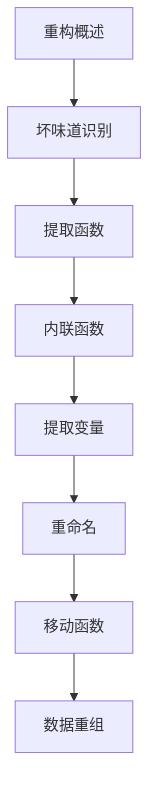

# 代码重构 学习指南

> **分类**：后端开发 ｜ **章节总数**：80 ｜ **技术栈**：代码重构

## 领域概述

代码重构是后端开发领域的重要技术方向，本系列从基础到高级逐步深入，涵盖14个核心模块：重构概述、坏味道识别、提取函数、内联函数、提取变量等。每个知识点作为独立章节，包含原理讲解、实现要点、常见陷阱和最佳实践，配合源码分析和架构图，帮助读者建立完整的代码重构知识体系。

本教程基于 **通用** 与 **代码重构** 生态编写，涵盖 行业标准工具链 等主流工具与框架。每章独立成篇，文字精炼、逻辑清晰，适合系统学习与按需查阅。

## 你将学到什么

完成本系列后，你将能够：

- 系统理解 **代码重构** 的核心概念与模块划分。
- 按难度递进掌握从入门到实战的完整知识路径。
- 在工程实践中做出合理的技术判断与问题排查。
- 通过章节索引快速定位所需知识点。

## 前置知识

- 编程基础
- 数据结构
- 计算机基础
- 后端开发基础概念

## 推荐学习路径

1. **重构概述**
2. **坏味道识别**
3. **提取函数**
4. **内联函数**
5. **提取变量**
6. **重命名**
7. **移动函数**
8. **数据重组**

## 模块体系

本领域按以下模块组织，难度由浅入深：

- **重构概述**
- **坏味道识别**
- **提取函数**
- **内联函数**
- **提取变量**
- **重命名**
- **移动函数**
- **数据重组**
- **条件逻辑简化**
- **多态替换条件**
- **重构模式**
- **安全重构**
- **重构工具**
- **重构最佳实践**

## 难度分布

| 难度 | 章节数 | 占比 |
|------|--------|------|
| 入门 | 18 | 22% |
| 实战 | 15 | 18% |
| 进阶 | 24 | 30% |
| 高级 | 23 | 28% |

## 章节索引

点击章节标题进入对应教程：

### 重构概述

- [重构概述核心概念与原理](chapters/001-重构概述核心概念与原理.md) ｜ 入门
- [重构概述的实现机制详解](chapters/002-重构概述的实现机制详解.md) ｜ 入门
- [重构概述的关键技术点](chapters/003-重构概述的关键技术点.md) ｜ 入门
- [重构概述的源码级分析](chapters/004-重构概述的源码级分析.md) ｜ 入门
- [重构概述的配置与使用](chapters/005-重构概述的配置与使用.md) ｜ 入门
- [重构概述的常见问题与解决方案](chapters/006-重构概述的常见问题与解决方案.md) ｜ 入门

### 坏味道识别

- [坏味道识别核心概念与原理](chapters/007-坏味道识别核心概念与原理.md) ｜ 入门
- [坏味道识别的实现机制详解](chapters/008-坏味道识别的实现机制详解.md) ｜ 入门
- [坏味道识别的关键技术点](chapters/009-坏味道识别的关键技术点.md) ｜ 入门
- [坏味道识别的源码级分析](chapters/010-坏味道识别的源码级分析.md) ｜ 入门
- [坏味道识别的配置与使用](chapters/011-坏味道识别的配置与使用.md) ｜ 入门
- [坏味道识别的常见问题与解决方案](chapters/012-坏味道识别的常见问题与解决方案.md) ｜ 入门

### 提取函数

- [提取函数核心概念与原理](chapters/013-提取函数核心概念与原理.md) ｜ 入门
- [提取函数的实现机制详解](chapters/014-提取函数的实现机制详解.md) ｜ 入门
- [提取函数的关键技术点](chapters/015-提取函数的关键技术点.md) ｜ 入门
- [提取函数的源码级分析](chapters/016-提取函数的源码级分析.md) ｜ 入门
- [提取函数的配置与使用](chapters/017-提取函数的配置与使用.md) ｜ 入门
- [提取函数的常见问题与解决方案](chapters/018-提取函数的常见问题与解决方案.md) ｜ 入门

### 内联函数

- [内联函数核心概念与原理](chapters/019-内联函数核心概念与原理.md) ｜ 进阶
- [内联函数的实现机制详解](chapters/020-内联函数的实现机制详解.md) ｜ 进阶
- [内联函数的关键技术点](chapters/021-内联函数的关键技术点.md) ｜ 进阶
- [内联函数的源码级分析](chapters/022-内联函数的源码级分析.md) ｜ 进阶
- [内联函数的配置与使用](chapters/023-内联函数的配置与使用.md) ｜ 进阶
- [内联函数的常见问题与解决方案](chapters/024-内联函数的常见问题与解决方案.md) ｜ 进阶

### 提取变量

- [提取变量核心概念与原理](chapters/025-提取变量核心概念与原理.md) ｜ 进阶
- [提取变量的实现机制详解](chapters/026-提取变量的实现机制详解.md) ｜ 进阶
- [提取变量的关键技术点](chapters/027-提取变量的关键技术点.md) ｜ 进阶
- [提取变量的源码级分析](chapters/028-提取变量的源码级分析.md) ｜ 进阶
- [提取变量的配置与使用](chapters/029-提取变量的配置与使用.md) ｜ 进阶
- [提取变量的常见问题与解决方案](chapters/030-提取变量的常见问题与解决方案.md) ｜ 进阶

### 重命名

- [重命名核心概念与原理](chapters/031-重命名核心概念与原理.md) ｜ 进阶
- [重命名的实现机制详解](chapters/032-重命名的实现机制详解.md) ｜ 进阶
- [重命名的关键技术点](chapters/033-重命名的关键技术点.md) ｜ 进阶
- [重命名的源码级分析](chapters/034-重命名的源码级分析.md) ｜ 进阶
- [重命名的配置与使用](chapters/035-重命名的配置与使用.md) ｜ 进阶
- [重命名的常见问题与解决方案](chapters/036-重命名的常见问题与解决方案.md) ｜ 进阶

### 移动函数

- [移动函数核心概念与原理](chapters/037-移动函数核心概念与原理.md) ｜ 进阶
- [移动函数的实现机制详解](chapters/038-移动函数的实现机制详解.md) ｜ 进阶
- [移动函数的关键技术点](chapters/039-移动函数的关键技术点.md) ｜ 进阶
- [移动函数的源码级分析](chapters/040-移动函数的源码级分析.md) ｜ 进阶
- [移动函数的配置与使用](chapters/041-移动函数的配置与使用.md) ｜ 进阶
- [移动函数的常见问题与解决方案](chapters/042-移动函数的常见问题与解决方案.md) ｜ 进阶

### 数据重组

- [数据重组核心概念与原理](chapters/043-数据重组核心概念与原理.md) ｜ 高级
- [数据重组的实现机制详解](chapters/044-数据重组的实现机制详解.md) ｜ 高级
- [数据重组的关键技术点](chapters/045-数据重组的关键技术点.md) ｜ 高级
- [数据重组的源码级分析](chapters/046-数据重组的源码级分析.md) ｜ 高级
- [数据重组的配置与使用](chapters/047-数据重组的配置与使用.md) ｜ 高级
- [数据重组的常见问题与解决方案](chapters/048-数据重组的常见问题与解决方案.md) ｜ 高级

### 条件逻辑简化

- [条件逻辑简化核心概念与原理](chapters/049-条件逻辑简化核心概念与原理.md) ｜ 高级
- [条件逻辑简化的实现机制详解](chapters/050-条件逻辑简化的实现机制详解.md) ｜ 高级
- [条件逻辑简化的关键技术点](chapters/051-条件逻辑简化的关键技术点.md) ｜ 高级
- [条件逻辑简化的源码级分析](chapters/052-条件逻辑简化的源码级分析.md) ｜ 高级
- [条件逻辑简化的配置与使用](chapters/053-条件逻辑简化的配置与使用.md) ｜ 高级
- [条件逻辑简化的常见问题与解决方案](chapters/054-条件逻辑简化的常见问题与解决方案.md) ｜ 高级

### 多态替换条件

- [多态替换条件核心概念与原理](chapters/055-多态替换条件核心概念与原理.md) ｜ 高级
- [多态替换条件的实现机制详解](chapters/056-多态替换条件的实现机制详解.md) ｜ 高级
- [多态替换条件的关键技术点](chapters/057-多态替换条件的关键技术点.md) ｜ 高级
- [多态替换条件的源码级分析](chapters/058-多态替换条件的源码级分析.md) ｜ 高级
- [多态替换条件的配置与使用](chapters/059-多态替换条件的配置与使用.md) ｜ 高级
- [多态替换条件的常见问题与解决方案](chapters/060-多态替换条件的常见问题与解决方案.md) ｜ 高级

### 重构模式

- [重构模式核心概念与原理](chapters/061-重构模式核心概念与原理.md) ｜ 高级
- [重构模式的实现机制详解](chapters/062-重构模式的实现机制详解.md) ｜ 高级
- [重构模式的关键技术点](chapters/063-重构模式的关键技术点.md) ｜ 高级
- [重构模式的源码级分析](chapters/064-重构模式的源码级分析.md) ｜ 高级
- [重构模式的配置与使用](chapters/065-重构模式的配置与使用.md) ｜ 高级

### 安全重构

- [安全重构核心概念与原理](chapters/066-安全重构核心概念与原理.md) ｜ 实战
- [安全重构的实现机制详解](chapters/067-安全重构的实现机制详解.md) ｜ 实战
- [安全重构的关键技术点](chapters/068-安全重构的关键技术点.md) ｜ 实战
- [安全重构的源码级分析](chapters/069-安全重构的源码级分析.md) ｜ 实战
- [安全重构的配置与使用](chapters/070-安全重构的配置与使用.md) ｜ 实战

### 重构工具

- [重构工具核心概念与原理](chapters/071-重构工具核心概念与原理.md) ｜ 实战
- [重构工具的实现机制详解](chapters/072-重构工具的实现机制详解.md) ｜ 实战
- [重构工具的关键技术点](chapters/073-重构工具的关键技术点.md) ｜ 实战
- [重构工具的源码级分析](chapters/074-重构工具的源码级分析.md) ｜ 实战
- [重构工具的配置与使用](chapters/075-重构工具的配置与使用.md) ｜ 实战

### 重构最佳实践

- [重构最佳实践核心概念与原理](chapters/076-重构最佳实践核心概念与原理.md) ｜ 实战
- [重构最佳实践的实现机制详解](chapters/077-重构最佳实践的实现机制详解.md) ｜ 实战
- [重构最佳实践的关键技术点](chapters/078-重构最佳实践的关键技术点.md) ｜ 实战
- [重构最佳实践的源码级分析](chapters/079-重构最佳实践的源码级分析.md) ｜ 实战
- [重构最佳实践的配置与使用](chapters/080-重构最佳实践的配置与使用.md) ｜ 实战

## 学习方法建议

1. **先读概述再读章节**：用本指南建立全局地图，避免迷失在细节中。
2. **按模块递进**：同一模块内章节有前后关联，顺序阅读效果更好。
3. **主动复述**：每章读完后，用三五句话概括「是什么、为什么、怎么用」。
4. **关联阅读**：利用章节底部的「延伸学习」在同模块内构建知识网络。
5. **对照官方文档**：本教程提供结构化视角，细节以官方文档为准。

---
*领域: 代码重构 ｜ 版本: 2.0 ｜ 共 80 章*