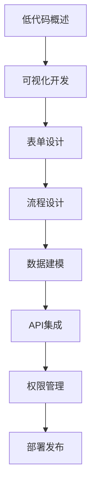

# 低代码开发 学习指南

> **分类**：其他 ｜ **章节总数**：50 ｜ **技术栈**：低代码开发

## 领域概述

低代码开发是其他领域的重要技术方向，本系列从基础到高级逐步深入，涵盖10个核心模块：低代码概述、可视化开发、表单设计、流程设计、数据建模等。每个知识点作为独立章节，包含原理讲解、实现要点、常见陷阱和最佳实践，配合源码分析和架构图，帮助读者建立完整的低代码开发知识体系。

本教程基于 **通用** 与 **低代码开发** 生态编写，涵盖 行业标准工具链 等主流工具与框架。每章独立成篇，文字精炼、逻辑清晰，适合系统学习与按需查阅。

## 你将学到什么

完成本系列后，你将能够：

- 系统理解 **低代码开发** 的核心概念与模块划分。
- 按难度递进掌握从入门到实战的完整知识路径。
- 在工程实践中做出合理的技术判断与问题排查。
- 通过章节索引快速定位所需知识点。

## 前置知识

- 编程基础
- 数据结构
- 计算机基础
- 其他基础概念

## 推荐学习路径

1. **低代码概述**
2. **可视化开发**
3. **表单设计**
4. **流程设计**
5. **数据建模**
6. **API集成**
7. **权限管理**
8. **部署发布**

## 模块体系

本领域按以下模块组织，难度由浅入深：

- **低代码概述**
- **可视化开发**
- **表单设计**
- **流程设计**
- **数据建模**
- **API集成**
- **权限管理**
- **部署发布**
- **低代码平台**
- **低代码最佳实践**

## 难度分布

| 难度 | 章节数 | 占比 |
|------|--------|------|
| 入门 | 10 | 20% |
| 实战 | 10 | 20% |
| 进阶 | 15 | 30% |
| 高级 | 15 | 30% |

## 章节索引

点击章节标题进入对应教程：

### 低代码概述

- [低代码概述核心概念与原理](chapters/001-低代码概述核心概念与原理.md) ｜ 入门
- [低代码概述的实现机制详解](chapters/002-低代码概述的实现机制详解.md) ｜ 入门
- [低代码概述的关键技术点](chapters/003-低代码概述的关键技术点.md) ｜ 入门
- [低代码概述的源码级分析](chapters/004-低代码概述的源码级分析.md) ｜ 入门
- [低代码概述的配置与使用](chapters/005-低代码概述的配置与使用.md) ｜ 入门

### 可视化开发

- [可视化开发核心概念与原理](chapters/006-可视化开发核心概念与原理.md) ｜ 入门
- [可视化开发的实现机制详解](chapters/007-可视化开发的实现机制详解.md) ｜ 入门
- [可视化开发的关键技术点](chapters/008-可视化开发的关键技术点.md) ｜ 入门
- [可视化开发的源码级分析](chapters/009-可视化开发的源码级分析.md) ｜ 入门
- [可视化开发的配置与使用](chapters/010-可视化开发的配置与使用.md) ｜ 入门

### 表单设计

- [表单设计核心概念与原理](chapters/011-表单设计核心概念与原理.md) ｜ 进阶
- [表单设计的实现机制详解](chapters/012-表单设计的实现机制详解.md) ｜ 进阶
- [表单设计的关键技术点](chapters/013-表单设计的关键技术点.md) ｜ 进阶
- [表单设计的源码级分析](chapters/014-表单设计的源码级分析.md) ｜ 进阶
- [表单设计的配置与使用](chapters/015-表单设计的配置与使用.md) ｜ 进阶

### 流程设计

- [流程设计核心概念与原理](chapters/016-流程设计核心概念与原理.md) ｜ 进阶
- [流程设计的实现机制详解](chapters/017-流程设计的实现机制详解.md) ｜ 进阶
- [流程设计的关键技术点](chapters/018-流程设计的关键技术点.md) ｜ 进阶
- [流程设计的源码级分析](chapters/019-流程设计的源码级分析.md) ｜ 进阶
- [流程设计的配置与使用](chapters/020-流程设计的配置与使用.md) ｜ 进阶

### 数据建模

- [数据建模核心概念与原理](chapters/021-数据建模核心概念与原理.md) ｜ 进阶
- [数据建模的实现机制详解](chapters/022-数据建模的实现机制详解.md) ｜ 进阶
- [数据建模的关键技术点](chapters/023-数据建模的关键技术点.md) ｜ 进阶
- [数据建模的源码级分析](chapters/024-数据建模的源码级分析.md) ｜ 进阶
- [数据建模的配置与使用](chapters/025-数据建模的配置与使用.md) ｜ 进阶

### API集成

- [API集成核心概念与原理](chapters/026-API集成核心概念与原理.md) ｜ 高级
- [API集成的实现机制详解](chapters/027-API集成的实现机制详解.md) ｜ 高级
- [API集成的关键技术点](chapters/028-API集成的关键技术点.md) ｜ 高级
- [API集成的源码级分析](chapters/029-API集成的源码级分析.md) ｜ 高级
- [API集成的配置与使用](chapters/030-API集成的配置与使用.md) ｜ 高级

### 权限管理

- [权限管理核心概念与原理](chapters/031-权限管理核心概念与原理.md) ｜ 高级
- [权限管理的实现机制详解](chapters/032-权限管理的实现机制详解.md) ｜ 高级
- [权限管理的关键技术点](chapters/033-权限管理的关键技术点.md) ｜ 高级
- [权限管理的源码级分析](chapters/034-权限管理的源码级分析.md) ｜ 高级
- [权限管理的配置与使用](chapters/035-权限管理的配置与使用.md) ｜ 高级

### 部署发布

- [部署发布核心概念与原理](chapters/036-部署发布核心概念与原理.md) ｜ 高级
- [部署发布的实现机制详解](chapters/037-部署发布的实现机制详解.md) ｜ 高级
- [部署发布的关键技术点](chapters/038-部署发布的关键技术点.md) ｜ 高级
- [部署发布的源码级分析](chapters/039-部署发布的源码级分析.md) ｜ 高级
- [部署发布的配置与使用](chapters/040-部署发布的配置与使用.md) ｜ 高级

### 低代码平台

- [低代码平台核心概念与原理](chapters/041-低代码平台核心概念与原理.md) ｜ 实战
- [低代码平台的实现机制详解](chapters/042-低代码平台的实现机制详解.md) ｜ 实战
- [低代码平台的关键技术点](chapters/043-低代码平台的关键技术点.md) ｜ 实战
- [低代码平台的源码级分析](chapters/044-低代码平台的源码级分析.md) ｜ 实战
- [低代码平台的配置与使用](chapters/045-低代码平台的配置与使用.md) ｜ 实战

### 低代码最佳实践

- [低代码最佳实践核心概念与原理](chapters/046-低代码最佳实践核心概念与原理.md) ｜ 实战
- [低代码最佳实践的实现机制详解](chapters/047-低代码最佳实践的实现机制详解.md) ｜ 实战
- [低代码最佳实践的关键技术点](chapters/048-低代码最佳实践的关键技术点.md) ｜ 实战
- [低代码最佳实践的源码级分析](chapters/049-低代码最佳实践的源码级分析.md) ｜ 实战
- [低代码最佳实践的配置与使用](chapters/050-低代码最佳实践的配置与使用.md) ｜ 实战

## 学习方法建议

1. **先读概述再读章节**：用本指南建立全局地图，避免迷失在细节中。
2. **按模块递进**：同一模块内章节有前后关联，顺序阅读效果更好。
3. **主动复述**：每章读完后，用三五句话概括「是什么、为什么、怎么用」。
4. **关联阅读**：利用章节底部的「延伸学习」在同模块内构建知识网络。
5. **对照官方文档**：本教程提供结构化视角，细节以官方文档为准。

---
*领域: 低代码开发 ｜ 版本: 2.0 ｜ 共 50 章*