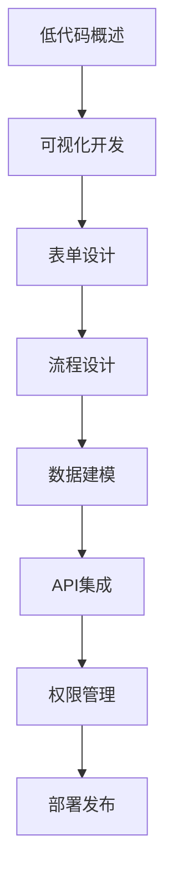

# 低代码开发 学习指南

> **分类**：其他 ｜ **技术生态**：OutSystems, Mendix, 钉钉宜搭, 飞书多维表格, Power Apps

## 领域定位

低代码/无代码平台通过可视化建模加速应用交付。表单设计、流程编排、数据建模与 API 集成是核心能力，适合企业内部系统与快速原型，但需关注可维护性与安全。

面向业务开发者与技术负责人，评估低代码平台选型与治理。

本领域常用技术栈与工具包括：OutSystems, Mendix, 钉钉宜搭, 飞书多维表格, Power Apps。

## 学习目标

- 使用低代码平台构建表单与审批流程
- 设计数据模型并集成外部 API
- 配置权限与多环境部署
- 评估低代码项目的长期可维护性

## 前置知识

- 基本编程概念
- 数据库基础
- HTTP/API 概念
- 业务流程理解

## 学习路径

1. **低代码概述**
2. **可视化开发**
3. **表单设计**
4. **流程设计**
5. **数据建模**
6. **API集成**
7. **权限管理**
8. **部署发布**

## 模块体系

- **低代码概述**
- **可视化开发**
- **表单设计**
- **流程设计**
- **数据建模**
- **API集成**
- **权限管理**
- **部署发布**
- **低代码平台**
- **低代码最佳实践**

## 难度分布

| 入门 | 10 | 20% |
| 实战 | 10 | 20% |
| 进阶 | 15 | 30% |
| 高级 | 15 | 30% |

## 章节索引

### 低代码概述

- [低代码概述核心概念与原理](chapters/001-低代码概述核心概念与原理.md) ｜ 入门
- [低代码概述的实现机制详解](chapters/002-低代码概述的实现机制详解.md) ｜ 入门
- [低代码概述的关键技术点](chapters/003-低代码概述的关键技术点.md) ｜ 入门
- [低代码概述的源码级分析](chapters/004-低代码概述的源码级分析.md) ｜ 入门
- [低代码概述的配置与使用](chapters/005-低代码概述的配置与使用.md) ｜ 入门

### 可视化开发

- [可视化开发核心概念与原理](chapters/006-可视化开发核心概念与原理.md) ｜ 入门
- [可视化开发的实现机制详解](chapters/007-可视化开发的实现机制详解.md) ｜ 入门
- [可视化开发的关键技术点](chapters/008-可视化开发的关键技术点.md) ｜ 入门
- [可视化开发的源码级分析](chapters/009-可视化开发的源码级分析.md) ｜ 入门
- [可视化开发的配置与使用](chapters/010-可视化开发的配置与使用.md) ｜ 入门

### 表单设计

- [表单设计核心概念与原理](chapters/011-表单设计核心概念与原理.md) ｜ 进阶
- [表单设计的实现机制详解](chapters/012-表单设计的实现机制详解.md) ｜ 进阶
- [表单设计的关键技术点](chapters/013-表单设计的关键技术点.md) ｜ 进阶
- [表单设计的源码级分析](chapters/014-表单设计的源码级分析.md) ｜ 进阶
- [表单设计的配置与使用](chapters/015-表单设计的配置与使用.md) ｜ 进阶

### 流程设计

- [流程设计核心概念与原理](chapters/016-流程设计核心概念与原理.md) ｜ 进阶
- [流程设计的实现机制详解](chapters/017-流程设计的实现机制详解.md) ｜ 进阶
- [流程设计的关键技术点](chapters/018-流程设计的关键技术点.md) ｜ 进阶
- [流程设计的源码级分析](chapters/019-流程设计的源码级分析.md) ｜ 进阶
- [流程设计的配置与使用](chapters/020-流程设计的配置与使用.md) ｜ 进阶

### 数据建模

- [数据建模核心概念与原理](chapters/021-数据建模核心概念与原理.md) ｜ 进阶
- [数据建模的实现机制详解](chapters/022-数据建模的实现机制详解.md) ｜ 进阶
- [数据建模的关键技术点](chapters/023-数据建模的关键技术点.md) ｜ 进阶
- [数据建模的源码级分析](chapters/024-数据建模的源码级分析.md) ｜ 进阶
- [数据建模的配置与使用](chapters/025-数据建模的配置与使用.md) ｜ 进阶

### API集成

- [API集成核心概念与原理](chapters/026-API集成核心概念与原理.md) ｜ 高级
- [API集成的实现机制详解](chapters/027-API集成的实现机制详解.md) ｜ 高级
- [API集成的关键技术点](chapters/028-API集成的关键技术点.md) ｜ 高级
- [API集成的源码级分析](chapters/029-API集成的源码级分析.md) ｜ 高级
- [API集成的配置与使用](chapters/030-API集成的配置与使用.md) ｜ 高级

### 权限管理

- [权限管理核心概念与原理](chapters/031-权限管理核心概念与原理.md) ｜ 高级
- [权限管理的实现机制详解](chapters/032-权限管理的实现机制详解.md) ｜ 高级
- [权限管理的关键技术点](chapters/033-权限管理的关键技术点.md) ｜ 高级
- [权限管理的源码级分析](chapters/034-权限管理的源码级分析.md) ｜ 高级
- [权限管理的配置与使用](chapters/035-权限管理的配置与使用.md) ｜ 高级

### 部署发布

- [部署发布核心概念与原理](chapters/036-部署发布核心概念与原理.md) ｜ 高级
- [部署发布的实现机制详解](chapters/037-部署发布的实现机制详解.md) ｜ 高级
- [部署发布的关键技术点](chapters/038-部署发布的关键技术点.md) ｜ 高级
- [部署发布的源码级分析](chapters/039-部署发布的源码级分析.md) ｜ 高级
- [部署发布的配置与使用](chapters/040-部署发布的配置与使用.md) ｜ 高级

### 低代码平台

- [低代码平台核心概念与原理](chapters/041-低代码平台核心概念与原理.md) ｜ 实战
- [低代码平台的实现机制详解](chapters/042-低代码平台的实现机制详解.md) ｜ 实战
- [低代码平台的关键技术点](chapters/043-低代码平台的关键技术点.md) ｜ 实战
- [低代码平台的源码级分析](chapters/044-低代码平台的源码级分析.md) ｜ 实战
- [低代码平台的配置与使用](chapters/045-低代码平台的配置与使用.md) ｜ 实战

### 低代码最佳实践

- [低代码最佳实践核心概念与原理](chapters/046-低代码最佳实践核心概念与原理.md) ｜ 实战
- [低代码最佳实践的实现机制详解](chapters/047-低代码最佳实践的实现机制详解.md) ｜ 实战
- [低代码最佳实践的关键技术点](chapters/048-低代码最佳实践的关键技术点.md) ｜ 实战
- [低代码最佳实践的源码级分析](chapters/049-低代码最佳实践的源码级分析.md) ｜ 实战
- [低代码最佳实践的配置与使用](chapters/050-低代码最佳实践的配置与使用.md) ｜ 实战

---
*领域: 低代码开发*