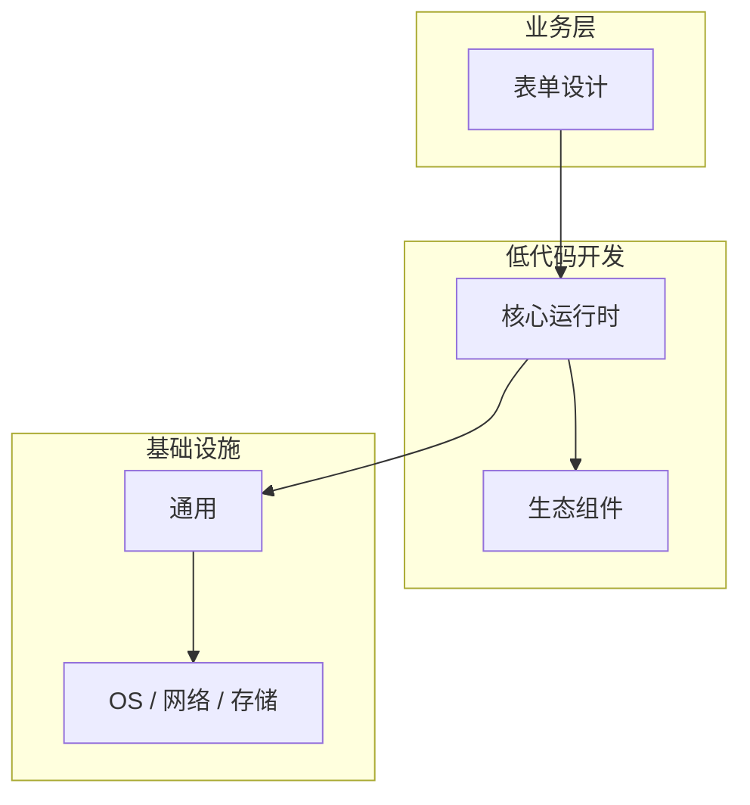

# 表单设计核心概念与原理

> **领域**：低代码开发 ｜ **模块**：表单设计 ｜ **难度**：进阶 ｜ **类型**：基础概念

## 导读

本章系统讲解 **低代码开发** 中 **表单设计** 的相关知识（基础概念）。本章建立 **表单设计** 的概念模型与工作原理，是后续专题章节的基础。内容基于主流框架与工程实践撰写，不依赖过时概念堆砌。

## 核心知识

**表单设计** 是 低代码开发 领域的核心主题。低代码表单。本模块从原理与工程实践出发，帮助读者建立系统理解。

### 核心知识

**1. 组件**

输入框、下拉、日期、上传。

**2. 校验**

必填、格式、自定义规则。

**3. 联动**

字段间显示/隐藏联动。

## 架构与流程

## 技术详解

### 基础理解

**表单设计** 是 低代码开发 领域的核心主题。低代码表单。本模块从原理与工程实践出发，帮助读者建立系统理解。

1. 理解 表单设计 概念 → 2. 学习标准用法 → 3. 动手实验 → 4. 分析案例 → 5. 总结最佳实践。

## 原理与实现

### 工作机制

设计表单 → 配置校验 → 绑定数据 → 发布。

### 内部实现

表单设计 的底层实现依赖 低代码开发 生态中的标准组件与协议，建议阅读官方规范文档。

## 操作流程与实践

### 操作流程

1. 理解 表单设计 概念 → 2. 学习标准用法 → 3. 动手实验 → 4. 分析案例 → 5. 总结最佳实践。

### 配置要点

配置 表单设计 时遵循官方推荐默认值，仅在理解影响后调整参数。

## 性能、安全与排查

### 性能优化

评估 表单设计 性能时建立基准测试，关注时间/空间复杂度或系统吞吐延迟指标。

### 安全注意

在 低代码开发 场景下注意输入校验、权限控制与敏感数据保护。

### 调试排错

排查 表单设计 问题时，结合日志、监控与最小复现用例逐步定位根因。

## 案例与选型

### 案例复盘

在典型 低代码开发 项目中，正确应用 表单设计 可显著提升系统质量与可维护性。

### 方案对比

选择 表单设计 方案时需对比多种替代方案的适用场景、性能与生态支持。

### 常见误区与纠正

**概念理解偏差**

对 表单设计 理解不全面导致误用，应回到官方文档重新梳理。

**忽视边界条件**

表单设计 在极端输入或高并发下行为可能不同，需充分测试。

**缺少监控**

未对 表单设计 关键指标监控，问题只能被动发现。

### 最佳实践

1. 遵循 低代码开发 领域 表单设计 的官方推荐实践
2. 为 表单设计 相关功能编写自动化测试
3. 关键配置纳入版本管理与变更审计
4. 生产部署前在接近真实环境验证

## 巩固建议

建议结合 **低代码开发** 官方文档与小型实验，亲手验证 **表单设计** 的默认行为与边界条件；将本章要点整理为检查清单或 ADR，便于评审与团队 onboarding。

### 本章小结

学完本章，你应能独立说明 **表单设计** 在 低代码开发 中的角色，理解其核心机制，规避常见误区，并在项目中正确运用。

## 延伸学习

- 表单设计的实现机制详解
- 表单设计的关键技术点
- 表单设计的源码级分析
- 表单设计的配置与使用

### 延伸阅读

- 低代码开发 官方文档 - 表单设计
- OWASP / NIST 相关指南（如适用）
- 权威书籍与 RFC 标准文档

---
*章节 ID: 011 ｜ 领域: 低代码开发*