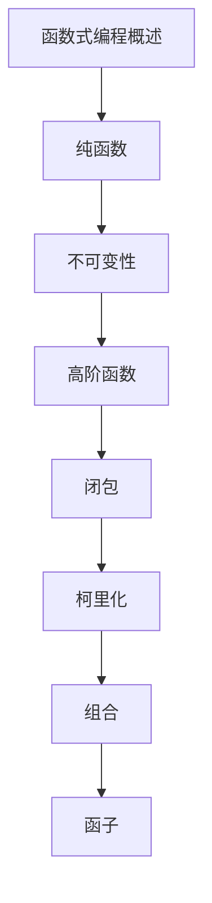

# 函数式编程 学习指南

> **分类**：编程语言 ｜ **章节总数**：80 ｜ **技术栈**：函数式编程

## 领域概述

函数式编程是编程语言领域的重要技术方向，本系列从基础到高级逐步深入，涵盖15个核心模块：函数式编程概述、纯函数、不可变性、高阶函数、闭包等。每个知识点作为独立章节，包含原理讲解、实现要点、常见陷阱和最佳实践，配合源码分析和架构图，帮助读者建立完整的函数式编程知识体系。

本教程基于 **通用** 与 **函数式编程** 生态编写，涵盖 行业标准工具链 等主流工具与框架。每章独立成篇，文字精炼、逻辑清晰，适合系统学习与按需查阅。

## 你将学到什么

完成本系列后，你将能够：

- 系统理解 **函数式编程** 的核心概念与模块划分。
- 按难度递进掌握从入门到实战的完整知识路径。
- 在工程实践中做出合理的技术判断与问题排查。
- 通过章节索引快速定位所需知识点。

## 前置知识

- 编程基础
- 数据结构
- 计算机基础
- 编程语言基础概念

## 推荐学习路径

1. **函数式编程概述**
2. **纯函数**
3. **不可变性**
4. **高阶函数**
5. **闭包**
6. **柯里化**
7. **组合**
8. **函子**

## 模块体系

本领域按以下模块组织，难度由浅入深：

- **函数式编程概述**
- **纯函数**
- **不可变性**
- **高阶函数**
- **闭包**
- **柯里化**
- **组合**
- **函子**
- **Monad**
- **模式匹配**
- **代数数据类型**
- **惰性求值**
- **递归**
- **函数式并发**
- **函数式设计模式**

## 难度分布

| 难度 | 章节数 | 占比 |
|------|--------|------|
| 入门 | 18 | 22% |
| 实战 | 15 | 18% |
| 进阶 | 22 | 27% |
| 高级 | 25 | 31% |

## 章节索引

点击章节标题进入对应教程：

### 函数式编程概述

- [函数式编程概述核心概念与原理](chapters/001-函数式编程概述核心概念与原理.md) ｜ 入门
- [函数式编程概述的实现机制详解](chapters/002-函数式编程概述的实现机制详解.md) ｜ 入门
- [函数式编程概述的关键技术点](chapters/003-函数式编程概述的关键技术点.md) ｜ 入门
- [函数式编程概述的源码级分析](chapters/004-函数式编程概述的源码级分析.md) ｜ 入门
- [函数式编程概述的配置与使用](chapters/005-函数式编程概述的配置与使用.md) ｜ 入门
- [函数式编程概述的常见问题与解决方案](chapters/006-函数式编程概述的常见问题与解决方案.md) ｜ 入门

### 纯函数

- [纯函数核心概念与原理](chapters/007-纯函数核心概念与原理.md) ｜ 入门
- [纯函数的实现机制详解](chapters/008-纯函数的实现机制详解.md) ｜ 入门
- [纯函数的关键技术点](chapters/009-纯函数的关键技术点.md) ｜ 入门
- [纯函数的源码级分析](chapters/010-纯函数的源码级分析.md) ｜ 入门
- [纯函数的配置与使用](chapters/011-纯函数的配置与使用.md) ｜ 入门
- [纯函数的常见问题与解决方案](chapters/012-纯函数的常见问题与解决方案.md) ｜ 入门

### 不可变性

- [不可变性核心概念与原理](chapters/013-不可变性核心概念与原理.md) ｜ 入门
- [不可变性的实现机制详解](chapters/014-不可变性的实现机制详解.md) ｜ 入门
- [不可变性的关键技术点](chapters/015-不可变性的关键技术点.md) ｜ 入门
- [不可变性的源码级分析](chapters/016-不可变性的源码级分析.md) ｜ 入门
- [不可变性的配置与使用](chapters/017-不可变性的配置与使用.md) ｜ 入门
- [不可变性的常见问题与解决方案](chapters/018-不可变性的常见问题与解决方案.md) ｜ 入门

### 高阶函数

- [高阶函数核心概念与原理](chapters/019-高阶函数核心概念与原理.md) ｜ 进阶
- [高阶函数的实现机制详解](chapters/020-高阶函数的实现机制详解.md) ｜ 进阶
- [高阶函数的关键技术点](chapters/021-高阶函数的关键技术点.md) ｜ 进阶
- [高阶函数的源码级分析](chapters/022-高阶函数的源码级分析.md) ｜ 进阶
- [高阶函数的配置与使用](chapters/023-高阶函数的配置与使用.md) ｜ 进阶
- [高阶函数的常见问题与解决方案](chapters/024-高阶函数的常见问题与解决方案.md) ｜ 进阶

### 闭包

- [闭包核心概念与原理](chapters/025-闭包核心概念与原理.md) ｜ 进阶
- [闭包的实现机制详解](chapters/026-闭包的实现机制详解.md) ｜ 进阶
- [闭包的关键技术点](chapters/027-闭包的关键技术点.md) ｜ 进阶
- [闭包的源码级分析](chapters/028-闭包的源码级分析.md) ｜ 进阶
- [闭包的配置与使用](chapters/029-闭包的配置与使用.md) ｜ 进阶
- [闭包的常见问题与解决方案](chapters/030-闭包的常见问题与解决方案.md) ｜ 进阶

### 柯里化

- [柯里化核心概念与原理](chapters/031-柯里化核心概念与原理.md) ｜ 进阶
- [柯里化的实现机制详解](chapters/032-柯里化的实现机制详解.md) ｜ 进阶
- [柯里化的关键技术点](chapters/033-柯里化的关键技术点.md) ｜ 进阶
- [柯里化的源码级分析](chapters/034-柯里化的源码级分析.md) ｜ 进阶
- [柯里化的配置与使用](chapters/035-柯里化的配置与使用.md) ｜ 进阶

### 组合

- [组合核心概念与原理](chapters/036-组合核心概念与原理.md) ｜ 进阶
- [组合的实现机制详解](chapters/037-组合的实现机制详解.md) ｜ 进阶
- [组合的关键技术点](chapters/038-组合的关键技术点.md) ｜ 进阶
- [组合的源码级分析](chapters/039-组合的源码级分析.md) ｜ 进阶
- [组合的配置与使用](chapters/040-组合的配置与使用.md) ｜ 进阶

### 函子

- [函子核心概念与原理](chapters/041-函子核心概念与原理.md) ｜ 高级
- [函子的实现机制详解](chapters/042-函子的实现机制详解.md) ｜ 高级
- [函子的关键技术点](chapters/043-函子的关键技术点.md) ｜ 高级
- [函子的源码级分析](chapters/044-函子的源码级分析.md) ｜ 高级
- [函子的配置与使用](chapters/045-函子的配置与使用.md) ｜ 高级

### Monad

- [Monad核心概念与原理](chapters/046-Monad核心概念与原理.md) ｜ 高级
- [Monad的实现机制详解](chapters/047-Monad的实现机制详解.md) ｜ 高级
- [Monad的关键技术点](chapters/048-Monad的关键技术点.md) ｜ 高级
- [Monad的源码级分析](chapters/049-Monad的源码级分析.md) ｜ 高级
- [Monad的配置与使用](chapters/050-Monad的配置与使用.md) ｜ 高级

### 模式匹配

- [模式匹配核心概念与原理](chapters/051-模式匹配核心概念与原理.md) ｜ 高级
- [模式匹配的实现机制详解](chapters/052-模式匹配的实现机制详解.md) ｜ 高级
- [模式匹配的关键技术点](chapters/053-模式匹配的关键技术点.md) ｜ 高级
- [模式匹配的源码级分析](chapters/054-模式匹配的源码级分析.md) ｜ 高级
- [模式匹配的配置与使用](chapters/055-模式匹配的配置与使用.md) ｜ 高级

### 代数数据类型

- [代数数据类型核心概念与原理](chapters/056-代数数据类型核心概念与原理.md) ｜ 高级
- [代数数据类型的实现机制详解](chapters/057-代数数据类型的实现机制详解.md) ｜ 高级
- [代数数据类型的关键技术点](chapters/058-代数数据类型的关键技术点.md) ｜ 高级
- [代数数据类型的源码级分析](chapters/059-代数数据类型的源码级分析.md) ｜ 高级
- [代数数据类型的配置与使用](chapters/060-代数数据类型的配置与使用.md) ｜ 高级

### 惰性求值

- [惰性求值核心概念与原理](chapters/061-惰性求值核心概念与原理.md) ｜ 高级
- [惰性求值的实现机制详解](chapters/062-惰性求值的实现机制详解.md) ｜ 高级
- [惰性求值的关键技术点](chapters/063-惰性求值的关键技术点.md) ｜ 高级
- [惰性求值的源码级分析](chapters/064-惰性求值的源码级分析.md) ｜ 高级
- [惰性求值的配置与使用](chapters/065-惰性求值的配置与使用.md) ｜ 高级

### 递归

- [递归核心概念与原理](chapters/066-递归核心概念与原理.md) ｜ 实战
- [递归的实现机制详解](chapters/067-递归的实现机制详解.md) ｜ 实战
- [递归的关键技术点](chapters/068-递归的关键技术点.md) ｜ 实战
- [递归的源码级分析](chapters/069-递归的源码级分析.md) ｜ 实战
- [递归的配置与使用](chapters/070-递归的配置与使用.md) ｜ 实战

### 函数式并发

- [函数式并发核心概念与原理](chapters/071-函数式并发核心概念与原理.md) ｜ 实战
- [函数式并发的实现机制详解](chapters/072-函数式并发的实现机制详解.md) ｜ 实战
- [函数式并发的关键技术点](chapters/073-函数式并发的关键技术点.md) ｜ 实战
- [函数式并发的源码级分析](chapters/074-函数式并发的源码级分析.md) ｜ 实战
- [函数式并发的配置与使用](chapters/075-函数式并发的配置与使用.md) ｜ 实战

### 函数式设计模式

- [函数式设计模式核心概念与原理](chapters/076-函数式设计模式核心概念与原理.md) ｜ 实战
- [函数式设计模式的实现机制详解](chapters/077-函数式设计模式的实现机制详解.md) ｜ 实战
- [函数式设计模式的关键技术点](chapters/078-函数式设计模式的关键技术点.md) ｜ 实战
- [函数式设计模式的源码级分析](chapters/079-函数式设计模式的源码级分析.md) ｜ 实战
- [函数式设计模式的配置与使用](chapters/080-函数式设计模式的配置与使用.md) ｜ 实战

## 学习方法建议

1. **先读概述再读章节**：用本指南建立全局地图，避免迷失在细节中。
2. **按模块递进**：同一模块内章节有前后关联，顺序阅读效果更好。
3. **主动复述**：每章读完后，用三五句话概括「是什么、为什么、怎么用」。
4. **关联阅读**：利用章节底部的「延伸学习」在同模块内构建知识网络。
5. **对照官方文档**：本教程提供结构化视角，细节以官方文档为准。

---
*领域: 函数式编程 ｜ 版本: 2.0 ｜ 共 80 章*