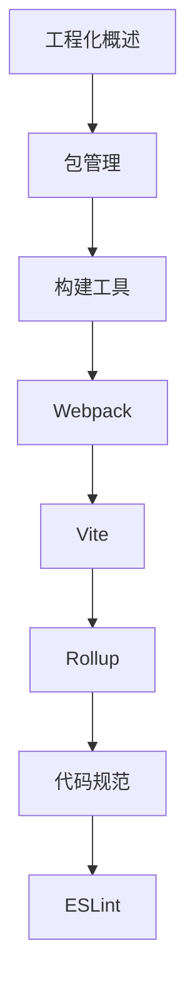

# 前端工程化 学习指南

> **分类**：前端开发 ｜ **技术生态**：Vite、Webpack、Rollup、ESLint、Vitest、Playwright、GitHub Actions

## 领域定位

前端工程化解决规模化协作的构建、规范、测试与交付。Webpack/Vite、ESLint、TypeScript、CI/CD 构成现代基建。

系统讲解依赖管理、编译打包、代码质量、自动化测试与持续集成，含微前端集成。

本领域常用技术栈与工具包括：Vite、Webpack、Rollup、ESLint、Vitest、Playwright、GitHub Actions。

## 学习目标

- 配置 Webpack/Vite
- ESLint/Prettier/TS 质量体系
- 单元与 E2E 测试流水线
- CI/CD 与性能监控

## 前置知识

- JavaScript/TypeScript
- Git
- npm

## 学习路径

1. **工程化概述**
2. **包管理**
3. **构建工具**
4. **Webpack**
5. **Vite**
6. **Rollup**
7. **代码规范**
8. **ESLint**

## 模块体系

- **工程化概述**
- **包管理**
- **构建工具**
- **Webpack**
- **Vite**
- **Rollup**
- **代码规范**
- **ESLint**
- **Prettier**
- **Babel**
- **TypeScript工程**
- **单元测试**
- **E2E测试**
- **CI/CD**
- **性能监控**
- **微前端**
- **前端最佳实践**

## 难度分布

| 入门 | 24 | 24% |
| 实战 | 22 | 22% |
| 进阶 | 24 | 24% |
| 高级 | 30 | 30% |

## 章节索引

### 工程化概述

- [工程化概述核心概念与原理](chapters/001-工程化概述核心概念与原理.md) ｜ 入门
- [工程化概述的实现机制详解](chapters/002-工程化概述的实现机制详解.md) ｜ 入门
- [工程化概述的关键技术点](chapters/003-工程化概述的关键技术点.md) ｜ 入门
- [工程化概述的源码级分析](chapters/004-工程化概述的源码级分析.md) ｜ 入门
- [工程化概述的配置与使用](chapters/005-工程化概述的配置与使用.md) ｜ 入门
- [工程化概述的常见问题与解决方案](chapters/006-工程化概述的常见问题与解决方案.md) ｜ 入门

### 包管理

- [包管理核心概念与原理](chapters/007-包管理核心概念与原理.md) ｜ 入门
- [包管理的实现机制详解](chapters/008-包管理的实现机制详解.md) ｜ 入门
- [包管理的关键技术点](chapters/009-包管理的关键技术点.md) ｜ 入门
- [包管理的源码级分析](chapters/010-包管理的源码级分析.md) ｜ 入门
- [包管理的配置与使用](chapters/011-包管理的配置与使用.md) ｜ 入门
- [包管理的常见问题与解决方案](chapters/012-包管理的常见问题与解决方案.md) ｜ 入门

### 构建工具

- [构建工具核心概念与原理](chapters/013-构建工具核心概念与原理.md) ｜ 入门
- [构建工具的实现机制详解](chapters/014-构建工具的实现机制详解.md) ｜ 入门
- [构建工具的关键技术点](chapters/015-构建工具的关键技术点.md) ｜ 入门
- [构建工具的源码级分析](chapters/016-构建工具的源码级分析.md) ｜ 入门
- [构建工具的配置与使用](chapters/017-构建工具的配置与使用.md) ｜ 入门
- [构建工具的常见问题与解决方案](chapters/018-构建工具的常见问题与解决方案.md) ｜ 入门

### Webpack

- [Webpack核心概念与原理](chapters/019-Webpack核心概念与原理.md) ｜ 入门
- [Webpack的实现机制详解](chapters/020-Webpack的实现机制详解.md) ｜ 入门
- [Webpack的关键技术点](chapters/021-Webpack的关键技术点.md) ｜ 入门
- [Webpack的源码级分析](chapters/022-Webpack的源码级分析.md) ｜ 入门
- [Webpack的配置与使用](chapters/023-Webpack的配置与使用.md) ｜ 入门
- [Webpack的常见问题与解决方案](chapters/024-Webpack的常见问题与解决方案.md) ｜ 入门

### Vite

- [Vite核心概念与原理](chapters/025-Vite核心概念与原理.md) ｜ 进阶
- [Vite的实现机制详解](chapters/026-Vite的实现机制详解.md) ｜ 进阶
- [Vite的关键技术点](chapters/027-Vite的关键技术点.md) ｜ 进阶
- [Vite的源码级分析](chapters/028-Vite的源码级分析.md) ｜ 进阶
- [Vite的配置与使用](chapters/029-Vite的配置与使用.md) ｜ 进阶
- [Vite的常见问题与解决方案](chapters/030-Vite的常见问题与解决方案.md) ｜ 进阶

### Rollup

- [Rollup核心概念与原理](chapters/031-Rollup核心概念与原理.md) ｜ 进阶
- [Rollup的实现机制详解](chapters/032-Rollup的实现机制详解.md) ｜ 进阶
- [Rollup的关键技术点](chapters/033-Rollup的关键技术点.md) ｜ 进阶
- [Rollup的源码级分析](chapters/034-Rollup的源码级分析.md) ｜ 进阶
- [Rollup的配置与使用](chapters/035-Rollup的配置与使用.md) ｜ 进阶
- [Rollup的常见问题与解决方案](chapters/036-Rollup的常见问题与解决方案.md) ｜ 进阶

### 代码规范

- [代码规范核心概念与原理](chapters/037-代码规范核心概念与原理.md) ｜ 进阶
- [代码规范的实现机制详解](chapters/038-代码规范的实现机制详解.md) ｜ 进阶
- [代码规范的关键技术点](chapters/039-代码规范的关键技术点.md) ｜ 进阶
- [代码规范的源码级分析](chapters/040-代码规范的源码级分析.md) ｜ 进阶
- [代码规范的配置与使用](chapters/041-代码规范的配置与使用.md) ｜ 进阶
- [代码规范的常见问题与解决方案](chapters/042-代码规范的常见问题与解决方案.md) ｜ 进阶

### ESLint

- [ESLint核心概念与原理](chapters/043-ESLint核心概念与原理.md) ｜ 进阶
- [ESLint的实现机制详解](chapters/044-ESLint的实现机制详解.md) ｜ 进阶
- [ESLint的关键技术点](chapters/045-ESLint的关键技术点.md) ｜ 进阶
- [ESLint的源码级分析](chapters/046-ESLint的源码级分析.md) ｜ 进阶
- [ESLint的配置与使用](chapters/047-ESLint的配置与使用.md) ｜ 进阶
- [ESLint的常见问题与解决方案](chapters/048-ESLint的常见问题与解决方案.md) ｜ 进阶

### Prettier

- [Prettier核心概念与原理](chapters/049-Prettier核心概念与原理.md) ｜ 高级
- [Prettier的实现机制详解](chapters/050-Prettier的实现机制详解.md) ｜ 高级
- [Prettier的关键技术点](chapters/051-Prettier的关键技术点.md) ｜ 高级
- [Prettier的源码级分析](chapters/052-Prettier的源码级分析.md) ｜ 高级
- [Prettier的配置与使用](chapters/053-Prettier的配置与使用.md) ｜ 高级
- [Prettier的常见问题与解决方案](chapters/054-Prettier的常见问题与解决方案.md) ｜ 高级

### Babel

- [Babel核心概念与原理](chapters/055-Babel核心概念与原理.md) ｜ 高级
- [Babel的实现机制详解](chapters/056-Babel的实现机制详解.md) ｜ 高级
- [Babel的关键技术点](chapters/057-Babel的关键技术点.md) ｜ 高级
- [Babel的源码级分析](chapters/058-Babel的源码级分析.md) ｜ 高级
- [Babel的配置与使用](chapters/059-Babel的配置与使用.md) ｜ 高级
- [Babel的常见问题与解决方案](chapters/060-Babel的常见问题与解决方案.md) ｜ 高级

### TypeScript工程

- [TypeScript工程核心概念与原理](chapters/061-TypeScript工程核心概念与原理.md) ｜ 高级
- [TypeScript工程的实现机制详解](chapters/062-TypeScript工程的实现机制详解.md) ｜ 高级
- [TypeScript工程的关键技术点](chapters/063-TypeScript工程的关键技术点.md) ｜ 高级
- [TypeScript工程的源码级分析](chapters/064-TypeScript工程的源码级分析.md) ｜ 高级
- [TypeScript工程的配置与使用](chapters/065-TypeScript工程的配置与使用.md) ｜ 高级
- [TypeScript工程的常见问题与解决方案](chapters/066-TypeScript工程的常见问题与解决方案.md) ｜ 高级

### 单元测试

- [单元测试核心概念与原理](chapters/067-单元测试核心概念与原理.md) ｜ 高级
- [单元测试的实现机制详解](chapters/068-单元测试的实现机制详解.md) ｜ 高级
- [单元测试的关键技术点](chapters/069-单元测试的关键技术点.md) ｜ 高级
- [单元测试的源码级分析](chapters/070-单元测试的源码级分析.md) ｜ 高级
- [单元测试的配置与使用](chapters/071-单元测试的配置与使用.md) ｜ 高级
- [单元测试的常见问题与解决方案](chapters/072-单元测试的常见问题与解决方案.md) ｜ 高级

### E2E测试

- [E2E测试核心概念与原理](chapters/073-E2E测试核心概念与原理.md) ｜ 高级
- [E2E测试的实现机制详解](chapters/074-E2E测试的实现机制详解.md) ｜ 高级
- [E2E测试的关键技术点](chapters/075-E2E测试的关键技术点.md) ｜ 高级
- [E2E测试的源码级分析](chapters/076-E2E测试的源码级分析.md) ｜ 高级
- [E2E测试的配置与使用](chapters/077-E2E测试的配置与使用.md) ｜ 高级
- [E2E测试的常见问题与解决方案](chapters/078-E2E测试的常见问题与解决方案.md) ｜ 高级

### CI/CD

- [CI/CD核心概念与原理](chapters/079-CICD核心概念与原理.md) ｜ 实战
- [CI/CD的实现机制详解](chapters/080-CICD的实现机制详解.md) ｜ 实战
- [CI/CD的关键技术点](chapters/081-CICD的关键技术点.md) ｜ 实战
- [CI/CD的源码级分析](chapters/082-CICD的源码级分析.md) ｜ 实战
- [CI/CD的配置与使用](chapters/083-CICD的配置与使用.md) ｜ 实战
- [CI/CD的常见问题与解决方案](chapters/084-CICD的常见问题与解决方案.md) ｜ 实战

### 性能监控

- [性能监控核心概念与原理](chapters/085-性能监控核心概念与原理.md) ｜ 实战
- [性能监控的实现机制详解](chapters/086-性能监控的实现机制详解.md) ｜ 实战
- [性能监控的关键技术点](chapters/087-性能监控的关键技术点.md) ｜ 实战
- [性能监控的源码级分析](chapters/088-性能监控的源码级分析.md) ｜ 实战
- [性能监控的配置与使用](chapters/089-性能监控的配置与使用.md) ｜ 实战
- [性能监控的常见问题与解决方案](chapters/090-性能监控的常见问题与解决方案.md) ｜ 实战

### 微前端

- [微前端核心概念与原理](chapters/091-微前端核心概念与原理.md) ｜ 实战
- [微前端的实现机制详解](chapters/092-微前端的实现机制详解.md) ｜ 实战
- [微前端的关键技术点](chapters/093-微前端的关键技术点.md) ｜ 实战
- [微前端的源码级分析](chapters/094-微前端的源码级分析.md) ｜ 实战
- [微前端的配置与使用](chapters/095-微前端的配置与使用.md) ｜ 实战

### 前端最佳实践

- [前端最佳实践核心概念与原理](chapters/096-前端最佳实践核心概念与原理.md) ｜ 实战
- [前端最佳实践的实现机制详解](chapters/097-前端最佳实践的实现机制详解.md) ｜ 实战
- [前端最佳实践的关键技术点](chapters/098-前端最佳实践的关键技术点.md) ｜ 实战
- [前端最佳实践的源码级分析](chapters/099-前端最佳实践的源码级分析.md) ｜ 实战
- [前端最佳实践的配置与使用](chapters/100-前端最佳实践的配置与使用.md) ｜ 实战

---
*领域: 前端工程化*