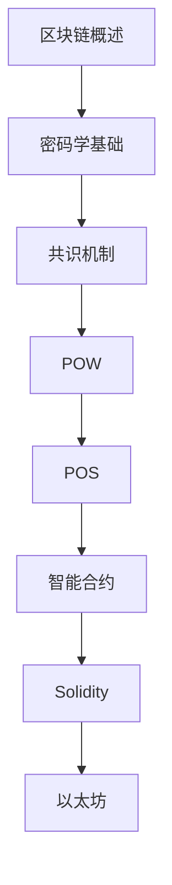

# 区块链 学习指南

> **分类**：其他 ｜ **技术生态**：Ethereum, Solidity, Hardhat, Web3.js, MetaMask, IPFS

## 领域定位

区块链是以密码学保障的去中心化分布式账本。共识机制（PoW/PoS）、智能合约与 DApp 构成 Web3 技术栈，以太坊与 Solidity 是智能合约开发的主流平台。

面向区块链开发者，从密码学基础到智能合约与 DApp 开发。

本领域常用技术栈与工具包括：Ethereum, Solidity, Hardhat, Web3.js, MetaMask, IPFS。

## 学习目标

- 理解区块链架构与共识机制
- 使用 Solidity 编写与测试智能合约
- 开发 DApp 并连接 MetaMask 钱包
- 评估 DeFi/NFT 项目的安全风险

## 前置知识

- 密码学基础
- JavaScript/Python
- 计算机网络
- 数据结构

## 学习路径

1. **区块链概述**
2. **密码学基础**
3. **共识机制**
4. **POW**
5. **POS**
6. **智能合约**
7. **Solidity**
8. **以太坊**

## 模块体系

- **区块链概述**
- **密码学基础**
- **共识机制**
- **POW**
- **POS**
- **智能合约**
- **Solidity**
- **以太坊**
- **比特币**
- **DApp**
- **DeFi**
- **NFT**
- **跨链**
- **钱包**
- **区块链安全**
- **区块链最佳实践**

## 难度分布

| 入门 | 15 | 18% |
| 实战 | 20 | 25% |
| 进阶 | 25 | 31% |
| 高级 | 20 | 25% |

## 章节索引

### 区块链概述

- [区块链概述核心概念与原理](chapters/001-区块链概述核心概念与原理.md) ｜ 入门
- [区块链概述的实现机制详解](chapters/002-区块链概述的实现机制详解.md) ｜ 入门
- [区块链概述的关键技术点](chapters/003-区块链概述的关键技术点.md) ｜ 入门
- [区块链概述的源码级分析](chapters/004-区块链概述的源码级分析.md) ｜ 入门
- [区块链概述的配置与使用](chapters/005-区块链概述的配置与使用.md) ｜ 入门

### 密码学基础

- [密码学基础核心概念与原理](chapters/006-密码学基础核心概念与原理.md) ｜ 入门
- [密码学基础的实现机制详解](chapters/007-密码学基础的实现机制详解.md) ｜ 入门
- [密码学基础的关键技术点](chapters/008-密码学基础的关键技术点.md) ｜ 入门
- [密码学基础的源码级分析](chapters/009-密码学基础的源码级分析.md) ｜ 入门
- [密码学基础的配置与使用](chapters/010-密码学基础的配置与使用.md) ｜ 入门

### 共识机制

- [共识机制核心概念与原理](chapters/011-共识机制核心概念与原理.md) ｜ 入门
- [共识机制的实现机制详解](chapters/012-共识机制的实现机制详解.md) ｜ 入门
- [共识机制的关键技术点](chapters/013-共识机制的关键技术点.md) ｜ 入门
- [共识机制的源码级分析](chapters/014-共识机制的源码级分析.md) ｜ 入门
- [共识机制的配置与使用](chapters/015-共识机制的配置与使用.md) ｜ 入门

### POW

- [POW核心概念与原理](chapters/016-POW核心概念与原理.md) ｜ 进阶
- [POW的实现机制详解](chapters/017-POW的实现机制详解.md) ｜ 进阶
- [POW的关键技术点](chapters/018-POW的关键技术点.md) ｜ 进阶
- [POW的源码级分析](chapters/019-POW的源码级分析.md) ｜ 进阶
- [POW的配置与使用](chapters/020-POW的配置与使用.md) ｜ 进阶

### POS

- [POS核心概念与原理](chapters/021-POS核心概念与原理.md) ｜ 进阶
- [POS的实现机制详解](chapters/022-POS的实现机制详解.md) ｜ 进阶
- [POS的关键技术点](chapters/023-POS的关键技术点.md) ｜ 进阶
- [POS的源码级分析](chapters/024-POS的源码级分析.md) ｜ 进阶
- [POS的配置与使用](chapters/025-POS的配置与使用.md) ｜ 进阶

### 智能合约

- [智能合约核心概念与原理](chapters/026-智能合约核心概念与原理.md) ｜ 进阶
- [智能合约的实现机制详解](chapters/027-智能合约的实现机制详解.md) ｜ 进阶
- [智能合约的关键技术点](chapters/028-智能合约的关键技术点.md) ｜ 进阶
- [智能合约的源码级分析](chapters/029-智能合约的源码级分析.md) ｜ 进阶
- [智能合约的配置与使用](chapters/030-智能合约的配置与使用.md) ｜ 进阶

### Solidity

- [Solidity核心概念与原理](chapters/031-Solidity核心概念与原理.md) ｜ 进阶
- [Solidity的实现机制详解](chapters/032-Solidity的实现机制详解.md) ｜ 进阶
- [Solidity的关键技术点](chapters/033-Solidity的关键技术点.md) ｜ 进阶
- [Solidity的源码级分析](chapters/034-Solidity的源码级分析.md) ｜ 进阶
- [Solidity的配置与使用](chapters/035-Solidity的配置与使用.md) ｜ 进阶

### 以太坊

- [以太坊核心概念与原理](chapters/036-以太坊核心概念与原理.md) ｜ 进阶
- [以太坊的实现机制详解](chapters/037-以太坊的实现机制详解.md) ｜ 进阶
- [以太坊的关键技术点](chapters/038-以太坊的关键技术点.md) ｜ 进阶
- [以太坊的源码级分析](chapters/039-以太坊的源码级分析.md) ｜ 进阶
- [以太坊的配置与使用](chapters/040-以太坊的配置与使用.md) ｜ 进阶

### 比特币

- [比特币核心概念与原理](chapters/041-比特币核心概念与原理.md) ｜ 高级
- [比特币的实现机制详解](chapters/042-比特币的实现机制详解.md) ｜ 高级
- [比特币的关键技术点](chapters/043-比特币的关键技术点.md) ｜ 高级
- [比特币的源码级分析](chapters/044-比特币的源码级分析.md) ｜ 高级
- [比特币的配置与使用](chapters/045-比特币的配置与使用.md) ｜ 高级

### DApp

- [DApp核心概念与原理](chapters/046-DApp核心概念与原理.md) ｜ 高级
- [DApp的实现机制详解](chapters/047-DApp的实现机制详解.md) ｜ 高级
- [DApp的关键技术点](chapters/048-DApp的关键技术点.md) ｜ 高级
- [DApp的源码级分析](chapters/049-DApp的源码级分析.md) ｜ 高级
- [DApp的配置与使用](chapters/050-DApp的配置与使用.md) ｜ 高级

### DeFi

- [DeFi核心概念与原理](chapters/051-DeFi核心概念与原理.md) ｜ 高级
- [DeFi的实现机制详解](chapters/052-DeFi的实现机制详解.md) ｜ 高级
- [DeFi的关键技术点](chapters/053-DeFi的关键技术点.md) ｜ 高级
- [DeFi的源码级分析](chapters/054-DeFi的源码级分析.md) ｜ 高级
- [DeFi的配置与使用](chapters/055-DeFi的配置与使用.md) ｜ 高级

### NFT

- [NFT核心概念与原理](chapters/056-NFT核心概念与原理.md) ｜ 高级
- [NFT的实现机制详解](chapters/057-NFT的实现机制详解.md) ｜ 高级
- [NFT的关键技术点](chapters/058-NFT的关键技术点.md) ｜ 高级
- [NFT的源码级分析](chapters/059-NFT的源码级分析.md) ｜ 高级
- [NFT的配置与使用](chapters/060-NFT的配置与使用.md) ｜ 高级

### 跨链

- [跨链核心概念与原理](chapters/061-跨链核心概念与原理.md) ｜ 实战
- [跨链的实现机制详解](chapters/062-跨链的实现机制详解.md) ｜ 实战
- [跨链的关键技术点](chapters/063-跨链的关键技术点.md) ｜ 实战
- [跨链的源码级分析](chapters/064-跨链的源码级分析.md) ｜ 实战
- [跨链的配置与使用](chapters/065-跨链的配置与使用.md) ｜ 实战

### 钱包

- [钱包核心概念与原理](chapters/066-钱包核心概念与原理.md) ｜ 实战
- [钱包的实现机制详解](chapters/067-钱包的实现机制详解.md) ｜ 实战
- [钱包的关键技术点](chapters/068-钱包的关键技术点.md) ｜ 实战
- [钱包的源码级分析](chapters/069-钱包的源码级分析.md) ｜ 实战
- [钱包的配置与使用](chapters/070-钱包的配置与使用.md) ｜ 实战

### 区块链安全

- [区块链安全核心概念与原理](chapters/071-区块链安全核心概念与原理.md) ｜ 实战
- [区块链安全的实现机制详解](chapters/072-区块链安全的实现机制详解.md) ｜ 实战
- [区块链安全的关键技术点](chapters/073-区块链安全的关键技术点.md) ｜ 实战
- [区块链安全的源码级分析](chapters/074-区块链安全的源码级分析.md) ｜ 实战
- [区块链安全的配置与使用](chapters/075-区块链安全的配置与使用.md) ｜ 实战

### 区块链最佳实践

- [区块链最佳实践核心概念与原理](chapters/076-区块链最佳实践核心概念与原理.md) ｜ 实战
- [区块链最佳实践的实现机制详解](chapters/077-区块链最佳实践的实现机制详解.md) ｜ 实战
- [区块链最佳实践的关键技术点](chapters/078-区块链最佳实践的关键技术点.md) ｜ 实战
- [区块链最佳实践的源码级分析](chapters/079-区块链最佳实践的源码级分析.md) ｜ 实战
- [区块链最佳实践的配置与使用](chapters/080-区块链最佳实践的配置与使用.md) ｜ 实战

---
*领域: 区块链*