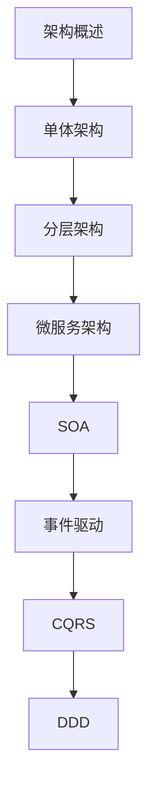

# 后端架构 学习指南

> **分类**：后端开发 ｜ **章节总数**：120 ｜ **技术栈**：后端架构

## 领域概述

后端架构是后端开发领域的重要技术方向，本系列从基础到高级逐步深入，涵盖17个核心模块：架构概述、单体架构、分层架构、微服务架构、SOA等。每个知识点作为独立章节，包含原理讲解、实现要点、常见陷阱和最佳实践，配合源码分析和架构图，帮助读者建立完整的后端架构知识体系。

本教程基于 **通用** 与 **后端架构** 生态编写，涵盖 行业标准工具链 等主流工具与框架。每章独立成篇，文字精炼、逻辑清晰，适合系统学习与按需查阅。

## 你将学到什么

完成本系列后，你将能够：

- 系统理解 **后端架构** 的核心概念与模块划分。
- 按难度递进掌握从入门到实战的完整知识路径。
- 在工程实践中做出合理的技术判断与问题排查。
- 通过章节索引快速定位所需知识点。

## 前置知识

- 编程基础
- 数据结构
- 计算机基础
- 后端开发基础概念

## 推荐学习路径

1. **架构概述**
2. **单体架构**
3. **分层架构**
4. **微服务架构**
5. **SOA**
6. **事件驱动**
7. **CQRS**
8. **DDD**

## 模块体系

本领域按以下模块组织，难度由浅入深：

- **架构概述**
- **单体架构**
- **分层架构**
- **微服务架构**
- **SOA**
- **事件驱动**
- **CQRS**
- **DDD**
- **API设计**
- **数据架构**
- **缓存架构**
- **消息架构**
- **高可用**
- **高并发**
- **可扩展**
- **安全架构**
- **后端架构最佳实践**

## 难度分布

| 难度 | 章节数 | 占比 |
|------|--------|------|
| 入门 | 29 | 24% |
| 实战 | 28 | 23% |
| 进阶 | 28 | 23% |
| 高级 | 35 | 29% |

## 章节索引

点击章节标题进入对应教程：

### 架构概述

- [架构概述核心概念与原理](chapters/001-架构概述核心概念与原理.md) ｜ 入门
- [架构概述的实现机制详解](chapters/002-架构概述的实现机制详解.md) ｜ 入门
- [架构概述的关键技术点](chapters/003-架构概述的关键技术点.md) ｜ 入门
- [架构概述的源码级分析](chapters/004-架构概述的源码级分析.md) ｜ 入门
- [架构概述的配置与使用](chapters/005-架构概述的配置与使用.md) ｜ 入门
- [架构概述的常见问题与解决方案](chapters/006-架构概述的常见问题与解决方案.md) ｜ 入门
- [架构概述的性能优化技巧](chapters/007-架构概述的性能优化技巧.md) ｜ 入门
- [架构概述的最佳实践指南](chapters/008-架构概述的最佳实践指南.md) ｜ 入门

### 单体架构

- [单体架构核心概念与原理](chapters/009-单体架构核心概念与原理.md) ｜ 入门
- [单体架构的实现机制详解](chapters/010-单体架构的实现机制详解.md) ｜ 入门
- [单体架构的关键技术点](chapters/011-单体架构的关键技术点.md) ｜ 入门
- [单体架构的源码级分析](chapters/012-单体架构的源码级分析.md) ｜ 入门
- [单体架构的配置与使用](chapters/013-单体架构的配置与使用.md) ｜ 入门
- [单体架构的常见问题与解决方案](chapters/014-单体架构的常见问题与解决方案.md) ｜ 入门
- [单体架构的性能优化技巧](chapters/015-单体架构的性能优化技巧.md) ｜ 入门

### 分层架构

- [分层架构核心概念与原理](chapters/016-分层架构核心概念与原理.md) ｜ 入门
- [分层架构的实现机制详解](chapters/017-分层架构的实现机制详解.md) ｜ 入门
- [分层架构的关键技术点](chapters/018-分层架构的关键技术点.md) ｜ 入门
- [分层架构的源码级分析](chapters/019-分层架构的源码级分析.md) ｜ 入门
- [分层架构的配置与使用](chapters/020-分层架构的配置与使用.md) ｜ 入门
- [分层架构的常见问题与解决方案](chapters/021-分层架构的常见问题与解决方案.md) ｜ 入门
- [分层架构的性能优化技巧](chapters/022-分层架构的性能优化技巧.md) ｜ 入门

### 微服务架构

- [微服务架构核心概念与原理](chapters/023-微服务架构核心概念与原理.md) ｜ 入门
- [微服务架构的实现机制详解](chapters/024-微服务架构的实现机制详解.md) ｜ 入门
- [微服务架构的关键技术点](chapters/025-微服务架构的关键技术点.md) ｜ 入门
- [微服务架构的源码级分析](chapters/026-微服务架构的源码级分析.md) ｜ 入门
- [微服务架构的配置与使用](chapters/027-微服务架构的配置与使用.md) ｜ 入门
- [微服务架构的常见问题与解决方案](chapters/028-微服务架构的常见问题与解决方案.md) ｜ 入门
- [微服务架构的性能优化技巧](chapters/029-微服务架构的性能优化技巧.md) ｜ 入门

### SOA

- [SOA核心概念与原理](chapters/030-SOA核心概念与原理.md) ｜ 进阶
- [SOA的实现机制详解](chapters/031-SOA的实现机制详解.md) ｜ 进阶
- [SOA的关键技术点](chapters/032-SOA的关键技术点.md) ｜ 进阶
- [SOA的源码级分析](chapters/033-SOA的源码级分析.md) ｜ 进阶
- [SOA的配置与使用](chapters/034-SOA的配置与使用.md) ｜ 进阶
- [SOA的常见问题与解决方案](chapters/035-SOA的常见问题与解决方案.md) ｜ 进阶
- [SOA的性能优化技巧](chapters/036-SOA的性能优化技巧.md) ｜ 进阶

### 事件驱动

- [事件驱动核心概念与原理](chapters/037-事件驱动核心概念与原理.md) ｜ 进阶
- [事件驱动的实现机制详解](chapters/038-事件驱动的实现机制详解.md) ｜ 进阶
- [事件驱动的关键技术点](chapters/039-事件驱动的关键技术点.md) ｜ 进阶
- [事件驱动的源码级分析](chapters/040-事件驱动的源码级分析.md) ｜ 进阶
- [事件驱动的配置与使用](chapters/041-事件驱动的配置与使用.md) ｜ 进阶
- [事件驱动的常见问题与解决方案](chapters/042-事件驱动的常见问题与解决方案.md) ｜ 进阶
- [事件驱动的性能优化技巧](chapters/043-事件驱动的性能优化技巧.md) ｜ 进阶

### CQRS

- [CQRS核心概念与原理](chapters/044-CQRS核心概念与原理.md) ｜ 进阶
- [CQRS的实现机制详解](chapters/045-CQRS的实现机制详解.md) ｜ 进阶
- [CQRS的关键技术点](chapters/046-CQRS的关键技术点.md) ｜ 进阶
- [CQRS的源码级分析](chapters/047-CQRS的源码级分析.md) ｜ 进阶
- [CQRS的配置与使用](chapters/048-CQRS的配置与使用.md) ｜ 进阶
- [CQRS的常见问题与解决方案](chapters/049-CQRS的常见问题与解决方案.md) ｜ 进阶
- [CQRS的性能优化技巧](chapters/050-CQRS的性能优化技巧.md) ｜ 进阶

### DDD

- [DDD核心概念与原理](chapters/051-DDD核心概念与原理.md) ｜ 进阶
- [DDD的实现机制详解](chapters/052-DDD的实现机制详解.md) ｜ 进阶
- [DDD的关键技术点](chapters/053-DDD的关键技术点.md) ｜ 进阶
- [DDD的源码级分析](chapters/054-DDD的源码级分析.md) ｜ 进阶
- [DDD的配置与使用](chapters/055-DDD的配置与使用.md) ｜ 进阶
- [DDD的常见问题与解决方案](chapters/056-DDD的常见问题与解决方案.md) ｜ 进阶
- [DDD的性能优化技巧](chapters/057-DDD的性能优化技巧.md) ｜ 进阶

### API设计

- [API设计核心概念与原理](chapters/058-API设计核心概念与原理.md) ｜ 高级
- [API设计的实现机制详解](chapters/059-API设计的实现机制详解.md) ｜ 高级
- [API设计的关键技术点](chapters/060-API设计的关键技术点.md) ｜ 高级
- [API设计的源码级分析](chapters/061-API设计的源码级分析.md) ｜ 高级
- [API设计的配置与使用](chapters/062-API设计的配置与使用.md) ｜ 高级
- [API设计的常见问题与解决方案](chapters/063-API设计的常见问题与解决方案.md) ｜ 高级
- [API设计的性能优化技巧](chapters/064-API设计的性能优化技巧.md) ｜ 高级

### 数据架构

- [数据架构核心概念与原理](chapters/065-数据架构核心概念与原理.md) ｜ 高级
- [数据架构的实现机制详解](chapters/066-数据架构的实现机制详解.md) ｜ 高级
- [数据架构的关键技术点](chapters/067-数据架构的关键技术点.md) ｜ 高级
- [数据架构的源码级分析](chapters/068-数据架构的源码级分析.md) ｜ 高级
- [数据架构的配置与使用](chapters/069-数据架构的配置与使用.md) ｜ 高级
- [数据架构的常见问题与解决方案](chapters/070-数据架构的常见问题与解决方案.md) ｜ 高级
- [数据架构的性能优化技巧](chapters/071-数据架构的性能优化技巧.md) ｜ 高级

### 缓存架构

- [缓存架构核心概念与原理](chapters/072-缓存架构核心概念与原理.md) ｜ 高级
- [缓存架构的实现机制详解](chapters/073-缓存架构的实现机制详解.md) ｜ 高级
- [缓存架构的关键技术点](chapters/074-缓存架构的关键技术点.md) ｜ 高级
- [缓存架构的源码级分析](chapters/075-缓存架构的源码级分析.md) ｜ 高级
- [缓存架构的配置与使用](chapters/076-缓存架构的配置与使用.md) ｜ 高级
- [缓存架构的常见问题与解决方案](chapters/077-缓存架构的常见问题与解决方案.md) ｜ 高级
- [缓存架构的性能优化技巧](chapters/078-缓存架构的性能优化技巧.md) ｜ 高级

### 消息架构

- [消息架构核心概念与原理](chapters/079-消息架构核心概念与原理.md) ｜ 高级
- [消息架构的实现机制详解](chapters/080-消息架构的实现机制详解.md) ｜ 高级
- [消息架构的关键技术点](chapters/081-消息架构的关键技术点.md) ｜ 高级
- [消息架构的源码级分析](chapters/082-消息架构的源码级分析.md) ｜ 高级
- [消息架构的配置与使用](chapters/083-消息架构的配置与使用.md) ｜ 高级
- [消息架构的常见问题与解决方案](chapters/084-消息架构的常见问题与解决方案.md) ｜ 高级
- [消息架构的性能优化技巧](chapters/085-消息架构的性能优化技巧.md) ｜ 高级

### 高可用

- [高可用核心概念与原理](chapters/086-高可用核心概念与原理.md) ｜ 高级
- [高可用的实现机制详解](chapters/087-高可用的实现机制详解.md) ｜ 高级
- [高可用的关键技术点](chapters/088-高可用的关键技术点.md) ｜ 高级
- [高可用的源码级分析](chapters/089-高可用的源码级分析.md) ｜ 高级
- [高可用的配置与使用](chapters/090-高可用的配置与使用.md) ｜ 高级
- [高可用的常见问题与解决方案](chapters/091-高可用的常见问题与解决方案.md) ｜ 高级
- [高可用的性能优化技巧](chapters/092-高可用的性能优化技巧.md) ｜ 高级

### 高并发

- [高并发核心概念与原理](chapters/093-高并发核心概念与原理.md) ｜ 实战
- [高并发的实现机制详解](chapters/094-高并发的实现机制详解.md) ｜ 实战
- [高并发的关键技术点](chapters/095-高并发的关键技术点.md) ｜ 实战
- [高并发的源码级分析](chapters/096-高并发的源码级分析.md) ｜ 实战
- [高并发的配置与使用](chapters/097-高并发的配置与使用.md) ｜ 实战
- [高并发的常见问题与解决方案](chapters/098-高并发的常见问题与解决方案.md) ｜ 实战
- [高并发的性能优化技巧](chapters/099-高并发的性能优化技巧.md) ｜ 实战

### 可扩展

- [可扩展核心概念与原理](chapters/100-可扩展核心概念与原理.md) ｜ 实战
- [可扩展的实现机制详解](chapters/101-可扩展的实现机制详解.md) ｜ 实战
- [可扩展的关键技术点](chapters/102-可扩展的关键技术点.md) ｜ 实战
- [可扩展的源码级分析](chapters/103-可扩展的源码级分析.md) ｜ 实战
- [可扩展的配置与使用](chapters/104-可扩展的配置与使用.md) ｜ 实战
- [可扩展的常见问题与解决方案](chapters/105-可扩展的常见问题与解决方案.md) ｜ 实战
- [可扩展的性能优化技巧](chapters/106-可扩展的性能优化技巧.md) ｜ 实战

### 安全架构

- [安全架构核心概念与原理](chapters/107-安全架构核心概念与原理.md) ｜ 实战
- [安全架构的实现机制详解](chapters/108-安全架构的实现机制详解.md) ｜ 实战
- [安全架构的关键技术点](chapters/109-安全架构的关键技术点.md) ｜ 实战
- [安全架构的源码级分析](chapters/110-安全架构的源码级分析.md) ｜ 实战
- [安全架构的配置与使用](chapters/111-安全架构的配置与使用.md) ｜ 实战
- [安全架构的常见问题与解决方案](chapters/112-安全架构的常见问题与解决方案.md) ｜ 实战
- [安全架构的性能优化技巧](chapters/113-安全架构的性能优化技巧.md) ｜ 实战

### 后端架构最佳实践

- [后端架构最佳实践核心概念与原理](chapters/114-后端架构最佳实践核心概念与原理.md) ｜ 实战
- [后端架构最佳实践的实现机制详解](chapters/115-后端架构最佳实践的实现机制详解.md) ｜ 实战
- [后端架构最佳实践的关键技术点](chapters/116-后端架构最佳实践的关键技术点.md) ｜ 实战
- [后端架构最佳实践的源码级分析](chapters/117-后端架构最佳实践的源码级分析.md) ｜ 实战
- [后端架构最佳实践的配置与使用](chapters/118-后端架构最佳实践的配置与使用.md) ｜ 实战
- [后端架构最佳实践的常见问题与解决方案](chapters/119-后端架构最佳实践的常见问题与解决方案.md) ｜ 实战
- [后端架构最佳实践的性能优化技巧](chapters/120-后端架构最佳实践的性能优化技巧.md) ｜ 实战

## 学习方法建议

1. **先读概述再读章节**：用本指南建立全局地图，避免迷失在细节中。
2. **按模块递进**：同一模块内章节有前后关联，顺序阅读效果更好。
3. **主动复述**：每章读完后，用三五句话概括「是什么、为什么、怎么用」。
4. **关联阅读**：利用章节底部的「延伸学习」在同模块内构建知识网络。
5. **对照官方文档**：本教程提供结构化视角，细节以官方文档为准。

---
*领域: 后端架构 ｜ 版本: 2.0 ｜ 共 120 章*