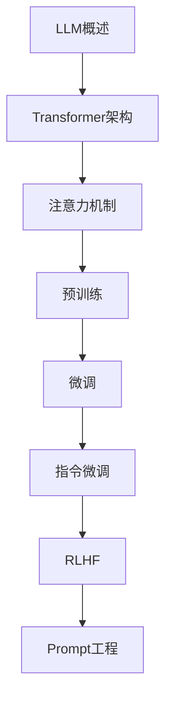

# 大语言模型 学习指南

> **分类**：AI与算法 ｜ **技术生态**：Hugging Face, vLLM, LangChain, LlamaIndex, OpenAI API

## 领域定位

大语言模型（LLM）基于 Transformer 架构，通过大规模预训练习得语言理解与生成能力。微调、RLHF、Prompt 工程、RAG 与 Agent 是当前应用落地的关键技术，GPT、LLaMA、Qwen 等模型推动 AI 应用范式变革。

面向 AI 应用工程师，覆盖 LLM 原理、微调、部署与应用开发。

本领域常用技术栈与工具包括：Hugging Face, vLLM, LangChain, LlamaIndex, OpenAI API。

## 学习目标

- 理解 Transformer 与预训练-微调范式
- 完成指令微调与 RLHF 流程
- 设计 Prompt 与 RAG 检索增强方案
- 部署量化模型并构建 Agent 应用

## 前置知识

- Python
- 深度学习
- NLP 基础
- PyTorch

## 学习路径

1. **LLM概述**
2. **Transformer架构**
3. **注意力机制**
4. **预训练**
5. **微调**
6. **指令微调**
7. **RLHF**
8. **Prompt工程**

## 模块体系

- **LLM概述**
- **Transformer架构**
- **注意力机制**
- **预训练**
- **微调**
- **指令微调**
- **RLHF**
- **Prompt工程**
- **上下文学习**
- **思维链**
- **RAG检索增强**
- **Agent**
- **工具调用**
- **多模态**
- **模型评估**
- **推理优化**
- **量化**
- **蒸馏**
- **部署**
- **LLM最佳实践**

## 难度分布

| 入门 | 32 | 21% |
| 实战 | 28 | 18% |
| 进阶 | 48 | 32% |
| 高级 | 42 | 28% |

## 章节索引

### LLM概述

- [LLM概述核心概念与原理](chapters/001-LLM概述核心概念与原理.md) ｜ 入门
- [LLM概述的实现机制详解](chapters/002-LLM概述的实现机制详解.md) ｜ 入门
- [LLM概述的关键技术点](chapters/003-LLM概述的关键技术点.md) ｜ 入门
- [LLM概述的源码级分析](chapters/004-LLM概述的源码级分析.md) ｜ 入门
- [LLM概述的配置与使用](chapters/005-LLM概述的配置与使用.md) ｜ 入门
- [LLM概述的常见问题与解决方案](chapters/006-LLM概述的常见问题与解决方案.md) ｜ 入门
- [LLM概述的性能优化技巧](chapters/007-LLM概述的性能优化技巧.md) ｜ 入门
- [LLM概述的最佳实践指南](chapters/008-LLM概述的最佳实践指南.md) ｜ 入门

### Transformer架构

- [Transformer架构核心概念与原理](chapters/009-Transformer架构核心概念与原理.md) ｜ 入门
- [Transformer架构的实现机制详解](chapters/010-Transformer架构的实现机制详解.md) ｜ 入门
- [Transformer架构的关键技术点](chapters/011-Transformer架构的关键技术点.md) ｜ 入门
- [Transformer架构的源码级分析](chapters/012-Transformer架构的源码级分析.md) ｜ 入门
- [Transformer架构的配置与使用](chapters/013-Transformer架构的配置与使用.md) ｜ 入门
- [Transformer架构的常见问题与解决方案](chapters/014-Transformer架构的常见问题与解决方案.md) ｜ 入门
- [Transformer架构的性能优化技巧](chapters/015-Transformer架构的性能优化技巧.md) ｜ 入门
- [Transformer架构的最佳实践指南](chapters/016-Transformer架构的最佳实践指南.md) ｜ 入门

### 注意力机制

- [注意力机制核心概念与原理](chapters/017-注意力机制核心概念与原理.md) ｜ 入门
- [注意力机制的实现机制详解](chapters/018-注意力机制的实现机制详解.md) ｜ 入门
- [注意力机制的关键技术点](chapters/019-注意力机制的关键技术点.md) ｜ 入门
- [注意力机制的源码级分析](chapters/020-注意力机制的源码级分析.md) ｜ 入门
- [注意力机制的配置与使用](chapters/021-注意力机制的配置与使用.md) ｜ 入门
- [注意力机制的常见问题与解决方案](chapters/022-注意力机制的常见问题与解决方案.md) ｜ 入门
- [注意力机制的性能优化技巧](chapters/023-注意力机制的性能优化技巧.md) ｜ 入门
- [注意力机制的最佳实践指南](chapters/024-注意力机制的最佳实践指南.md) ｜ 入门

### 预训练

- [预训练核心概念与原理](chapters/025-预训练核心概念与原理.md) ｜ 入门
- [预训练的实现机制详解](chapters/026-预训练的实现机制详解.md) ｜ 入门
- [预训练的关键技术点](chapters/027-预训练的关键技术点.md) ｜ 入门
- [预训练的源码级分析](chapters/028-预训练的源码级分析.md) ｜ 入门
- [预训练的配置与使用](chapters/029-预训练的配置与使用.md) ｜ 入门
- [预训练的常见问题与解决方案](chapters/030-预训练的常见问题与解决方案.md) ｜ 入门
- [预训练的性能优化技巧](chapters/031-预训练的性能优化技巧.md) ｜ 入门
- [预训练的最佳实践指南](chapters/032-预训练的最佳实践指南.md) ｜ 入门

### 微调

- [微调核心概念与原理](chapters/033-微调核心概念与原理.md) ｜ 进阶
- [微调的实现机制详解](chapters/034-微调的实现机制详解.md) ｜ 进阶
- [微调的关键技术点](chapters/035-微调的关键技术点.md) ｜ 进阶
- [微调的源码级分析](chapters/036-微调的源码级分析.md) ｜ 进阶
- [微调的配置与使用](chapters/037-微调的配置与使用.md) ｜ 进阶
- [微调的常见问题与解决方案](chapters/038-微调的常见问题与解决方案.md) ｜ 进阶
- [微调的性能优化技巧](chapters/039-微调的性能优化技巧.md) ｜ 进阶
- [微调的最佳实践指南](chapters/040-微调的最佳实践指南.md) ｜ 进阶

### 指令微调

- [指令微调核心概念与原理](chapters/041-指令微调核心概念与原理.md) ｜ 进阶
- [指令微调的实现机制详解](chapters/042-指令微调的实现机制详解.md) ｜ 进阶
- [指令微调的关键技术点](chapters/043-指令微调的关键技术点.md) ｜ 进阶
- [指令微调的源码级分析](chapters/044-指令微调的源码级分析.md) ｜ 进阶
- [指令微调的配置与使用](chapters/045-指令微调的配置与使用.md) ｜ 进阶
- [指令微调的常见问题与解决方案](chapters/046-指令微调的常见问题与解决方案.md) ｜ 进阶
- [指令微调的性能优化技巧](chapters/047-指令微调的性能优化技巧.md) ｜ 进阶
- [指令微调的最佳实践指南](chapters/048-指令微调的最佳实践指南.md) ｜ 进阶

### RLHF

- [RLHF核心概念与原理](chapters/049-RLHF核心概念与原理.md) ｜ 进阶
- [RLHF的实现机制详解](chapters/050-RLHF的实现机制详解.md) ｜ 进阶
- [RLHF的关键技术点](chapters/051-RLHF的关键技术点.md) ｜ 进阶
- [RLHF的源码级分析](chapters/052-RLHF的源码级分析.md) ｜ 进阶
- [RLHF的配置与使用](chapters/053-RLHF的配置与使用.md) ｜ 进阶
- [RLHF的常见问题与解决方案](chapters/054-RLHF的常见问题与解决方案.md) ｜ 进阶
- [RLHF的性能优化技巧](chapters/055-RLHF的性能优化技巧.md) ｜ 进阶
- [RLHF的最佳实践指南](chapters/056-RLHF的最佳实践指南.md) ｜ 进阶

### Prompt工程

- [Prompt工程核心概念与原理](chapters/057-Prompt工程核心概念与原理.md) ｜ 进阶
- [Prompt工程的实现机制详解](chapters/058-Prompt工程的实现机制详解.md) ｜ 进阶
- [Prompt工程的关键技术点](chapters/059-Prompt工程的关键技术点.md) ｜ 进阶
- [Prompt工程的源码级分析](chapters/060-Prompt工程的源码级分析.md) ｜ 进阶
- [Prompt工程的配置与使用](chapters/061-Prompt工程的配置与使用.md) ｜ 进阶
- [Prompt工程的常见问题与解决方案](chapters/062-Prompt工程的常见问题与解决方案.md) ｜ 进阶
- [Prompt工程的性能优化技巧](chapters/063-Prompt工程的性能优化技巧.md) ｜ 进阶
- [Prompt工程的最佳实践指南](chapters/064-Prompt工程的最佳实践指南.md) ｜ 进阶

### 上下文学习

- [上下文学习核心概念与原理](chapters/065-上下文学习核心概念与原理.md) ｜ 进阶
- [上下文学习的实现机制详解](chapters/066-上下文学习的实现机制详解.md) ｜ 进阶
- [上下文学习的关键技术点](chapters/067-上下文学习的关键技术点.md) ｜ 进阶
- [上下文学习的源码级分析](chapters/068-上下文学习的源码级分析.md) ｜ 进阶
- [上下文学习的配置与使用](chapters/069-上下文学习的配置与使用.md) ｜ 进阶
- [上下文学习的常见问题与解决方案](chapters/070-上下文学习的常见问题与解决方案.md) ｜ 进阶
- [上下文学习的性能优化技巧](chapters/071-上下文学习的性能优化技巧.md) ｜ 进阶
- [上下文学习的最佳实践指南](chapters/072-上下文学习的最佳实践指南.md) ｜ 进阶

### 思维链

- [思维链核心概念与原理](chapters/073-思维链核心概念与原理.md) ｜ 进阶
- [思维链的实现机制详解](chapters/074-思维链的实现机制详解.md) ｜ 进阶
- [思维链的关键技术点](chapters/075-思维链的关键技术点.md) ｜ 进阶
- [思维链的源码级分析](chapters/076-思维链的源码级分析.md) ｜ 进阶
- [思维链的配置与使用](chapters/077-思维链的配置与使用.md) ｜ 进阶
- [思维链的常见问题与解决方案](chapters/078-思维链的常见问题与解决方案.md) ｜ 进阶
- [思维链的性能优化技巧](chapters/079-思维链的性能优化技巧.md) ｜ 进阶
- [思维链的最佳实践指南](chapters/080-思维链的最佳实践指南.md) ｜ 进阶

### RAG检索增强

- [RAG检索增强核心概念与原理](chapters/081-RAG检索增强核心概念与原理.md) ｜ 高级
- [RAG检索增强的实现机制详解](chapters/082-RAG检索增强的实现机制详解.md) ｜ 高级
- [RAG检索增强的关键技术点](chapters/083-RAG检索增强的关键技术点.md) ｜ 高级
- [RAG检索增强的源码级分析](chapters/084-RAG检索增强的源码级分析.md) ｜ 高级
- [RAG检索增强的配置与使用](chapters/085-RAG检索增强的配置与使用.md) ｜ 高级
- [RAG检索增强的常见问题与解决方案](chapters/086-RAG检索增强的常见问题与解决方案.md) ｜ 高级
- [RAG检索增强的性能优化技巧](chapters/087-RAG检索增强的性能优化技巧.md) ｜ 高级

### Agent

- [Agent核心概念与原理](chapters/088-Agent核心概念与原理.md) ｜ 高级
- [Agent的实现机制详解](chapters/089-Agent的实现机制详解.md) ｜ 高级
- [Agent的关键技术点](chapters/090-Agent的关键技术点.md) ｜ 高级
- [Agent的源码级分析](chapters/091-Agent的源码级分析.md) ｜ 高级
- [Agent的配置与使用](chapters/092-Agent的配置与使用.md) ｜ 高级
- [Agent的常见问题与解决方案](chapters/093-Agent的常见问题与解决方案.md) ｜ 高级
- [Agent的性能优化技巧](chapters/094-Agent的性能优化技巧.md) ｜ 高级

### 工具调用

- [工具调用核心概念与原理](chapters/095-工具调用核心概念与原理.md) ｜ 高级
- [工具调用的实现机制详解](chapters/096-工具调用的实现机制详解.md) ｜ 高级
- [工具调用的关键技术点](chapters/097-工具调用的关键技术点.md) ｜ 高级
- [工具调用的源码级分析](chapters/098-工具调用的源码级分析.md) ｜ 高级
- [工具调用的配置与使用](chapters/099-工具调用的配置与使用.md) ｜ 高级
- [工具调用的常见问题与解决方案](chapters/100-工具调用的常见问题与解决方案.md) ｜ 高级
- [工具调用的性能优化技巧](chapters/101-工具调用的性能优化技巧.md) ｜ 高级

### 多模态

- [多模态核心概念与原理](chapters/102-多模态核心概念与原理.md) ｜ 高级
- [多模态的实现机制详解](chapters/103-多模态的实现机制详解.md) ｜ 高级
- [多模态的关键技术点](chapters/104-多模态的关键技术点.md) ｜ 高级
- [多模态的源码级分析](chapters/105-多模态的源码级分析.md) ｜ 高级
- [多模态的配置与使用](chapters/106-多模态的配置与使用.md) ｜ 高级
- [多模态的常见问题与解决方案](chapters/107-多模态的常见问题与解决方案.md) ｜ 高级
- [多模态的性能优化技巧](chapters/108-多模态的性能优化技巧.md) ｜ 高级

### 模型评估

- [模型评估核心概念与原理](chapters/109-模型评估核心概念与原理.md) ｜ 高级
- [模型评估的实现机制详解](chapters/110-模型评估的实现机制详解.md) ｜ 高级
- [模型评估的关键技术点](chapters/111-模型评估的关键技术点.md) ｜ 高级
- [模型评估的源码级分析](chapters/112-模型评估的源码级分析.md) ｜ 高级
- [模型评估的配置与使用](chapters/113-模型评估的配置与使用.md) ｜ 高级
- [模型评估的常见问题与解决方案](chapters/114-模型评估的常见问题与解决方案.md) ｜ 高级
- [模型评估的性能优化技巧](chapters/115-模型评估的性能优化技巧.md) ｜ 高级

### 推理优化

- [推理优化核心概念与原理](chapters/116-推理优化核心概念与原理.md) ｜ 高级
- [推理优化的实现机制详解](chapters/117-推理优化的实现机制详解.md) ｜ 高级
- [推理优化的关键技术点](chapters/118-推理优化的关键技术点.md) ｜ 高级
- [推理优化的源码级分析](chapters/119-推理优化的源码级分析.md) ｜ 高级
- [推理优化的配置与使用](chapters/120-推理优化的配置与使用.md) ｜ 高级
- [推理优化的常见问题与解决方案](chapters/121-推理优化的常见问题与解决方案.md) ｜ 高级
- [推理优化的性能优化技巧](chapters/122-推理优化的性能优化技巧.md) ｜ 高级

### 量化

- [量化核心概念与原理](chapters/123-量化核心概念与原理.md) ｜ 实战
- [量化的实现机制详解](chapters/124-量化的实现机制详解.md) ｜ 实战
- [量化的关键技术点](chapters/125-量化的关键技术点.md) ｜ 实战
- [量化的源码级分析](chapters/126-量化的源码级分析.md) ｜ 实战
- [量化的配置与使用](chapters/127-量化的配置与使用.md) ｜ 实战
- [量化的常见问题与解决方案](chapters/128-量化的常见问题与解决方案.md) ｜ 实战
- [量化的性能优化技巧](chapters/129-量化的性能优化技巧.md) ｜ 实战

### 蒸馏

- [蒸馏核心概念与原理](chapters/130-蒸馏核心概念与原理.md) ｜ 实战
- [蒸馏的实现机制详解](chapters/131-蒸馏的实现机制详解.md) ｜ 实战
- [蒸馏的关键技术点](chapters/132-蒸馏的关键技术点.md) ｜ 实战
- [蒸馏的源码级分析](chapters/133-蒸馏的源码级分析.md) ｜ 实战
- [蒸馏的配置与使用](chapters/134-蒸馏的配置与使用.md) ｜ 实战
- [蒸馏的常见问题与解决方案](chapters/135-蒸馏的常见问题与解决方案.md) ｜ 实战
- [蒸馏的性能优化技巧](chapters/136-蒸馏的性能优化技巧.md) ｜ 实战

### 部署

- [部署核心概念与原理](chapters/137-部署核心概念与原理.md) ｜ 实战
- [部署的实现机制详解](chapters/138-部署的实现机制详解.md) ｜ 实战
- [部署的关键技术点](chapters/139-部署的关键技术点.md) ｜ 实战
- [部署的源码级分析](chapters/140-部署的源码级分析.md) ｜ 实战
- [部署的配置与使用](chapters/141-部署的配置与使用.md) ｜ 实战
- [部署的常见问题与解决方案](chapters/142-部署的常见问题与解决方案.md) ｜ 实战
- [部署的性能优化技巧](chapters/143-部署的性能优化技巧.md) ｜ 实战

### LLM最佳实践

- [LLM最佳实践核心概念与原理](chapters/144-LLM最佳实践核心概念与原理.md) ｜ 实战
- [LLM最佳实践的实现机制详解](chapters/145-LLM最佳实践的实现机制详解.md) ｜ 实战
- [LLM最佳实践的关键技术点](chapters/146-LLM最佳实践的关键技术点.md) ｜ 实战
- [LLM最佳实践的源码级分析](chapters/147-LLM最佳实践的源码级分析.md) ｜ 实战
- [LLM最佳实践的配置与使用](chapters/148-LLM最佳实践的配置与使用.md) ｜ 实战
- [LLM最佳实践的常见问题与解决方案](chapters/149-LLM最佳实践的常见问题与解决方案.md) ｜ 实战
- [LLM最佳实践的性能优化技巧](chapters/150-LLM最佳实践的性能优化技巧.md) ｜ 实战

---
*领域: 大语言模型*