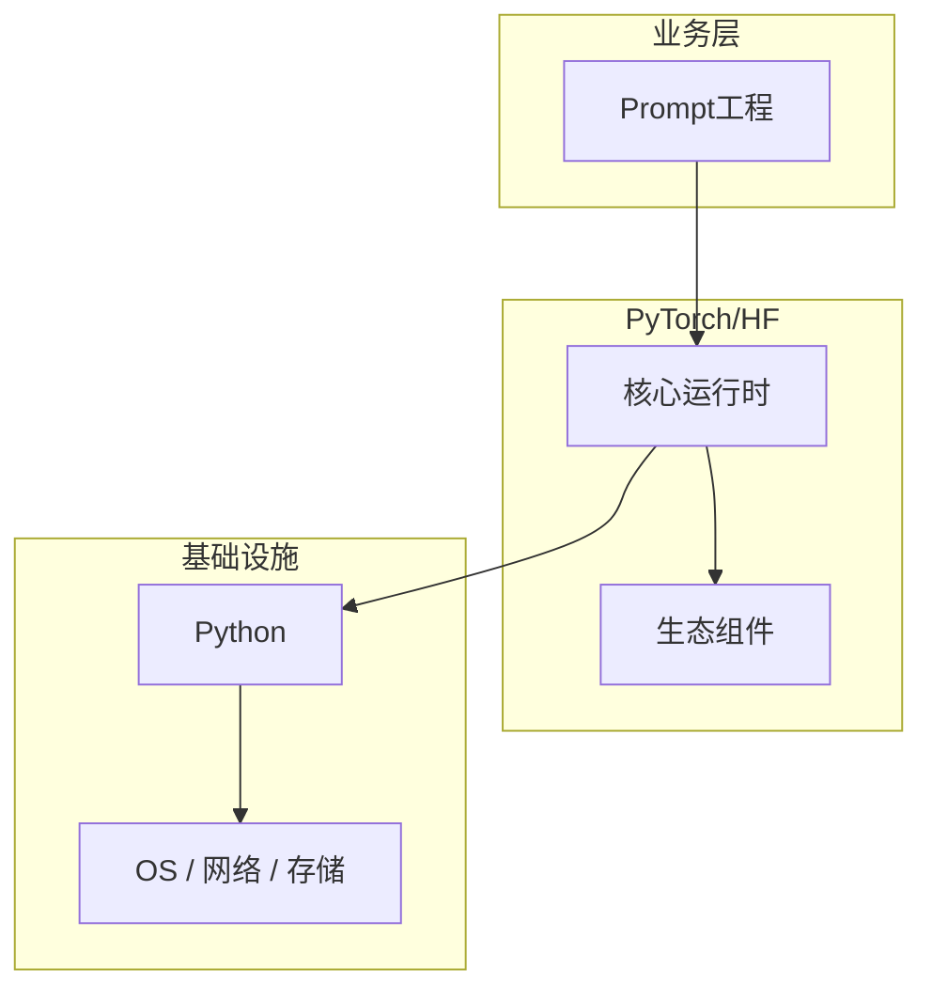

# Prompt工程的配置与使用

> **领域**：大语言模型 ｜ **模块**：Prompt工程 ｜ **难度**：进阶 ｜ **类型**：配置实践

## 导读

本章系统讲解 **大语言模型** 中 **Prompt工程** 的相关知识（配置实践）。本章讲解 **Prompt工程** 的配置项含义、环境差异与验证方法，强调可重复部署。内容基于主流框架与工程实践撰写，不依赖过时概念堆砌。

## 核心知识

**Prompt工程** 是 大语言模型 领域的核心主题。Prompt 设计技巧。本模块从原理与工程实践出发，帮助读者建立系统理解。

### 核心知识

**1. Zero-shot**

直接描述任务，不给示例。

**2. Few-shot**

提供几个示例引导模型。

**3. System Prompt**

设定角色与行为约束。

## 架构与流程

## 技术详解

### 配置实践

明确任务 → 提供上下文/示例 → 指定输出格式 → 迭代优化。

## 原理与实现

### 工作机制

明确任务 → 提供上下文/示例 → 指定输出格式 → 迭代优化。

### 内部实现

Prompt工程 的底层实现依赖 大语言模型 生态中的标准组件与协议，建议阅读官方规范文档。

## 操作流程与实践

### 操作流程

1. 理解 Prompt工程 概念 → 2. 学习标准用法 → 3. 动手实验 → 4. 分析案例 → 5. 总结最佳实践。

### 配置要点

配置 Prompt工程 时遵循官方推荐默认值，仅在理解影响后调整参数。

## 性能、安全与排查

### 性能优化

评估 Prompt工程 性能时建立基准测试，关注时间/空间复杂度或系统吞吐延迟指标。

### 安全注意

在 大语言模型 场景下注意输入校验、权限控制与敏感数据保护。

### 调试排错

排查 Prompt工程 问题时，结合日志、监控与最小复现用例逐步定位根因。

## 案例与选型

### 案例复盘

在典型 大语言模型 项目中，正确应用 Prompt工程 可显著提升系统质量与可维护性。

### 方案对比

选择 Prompt工程 方案时需对比多种替代方案的适用场景、性能与生态支持。

## 本章聚焦

**Prompt工程** 配置应外部化并分环境管理；关键项在文档中注明默认值、取值范围与生产推荐值，纳入 Code Review。

### 常见误区与纠正

**概念理解偏差**

对 Prompt工程 理解不全面导致误用，应回到官方文档重新梳理。

**忽视边界条件**

Prompt工程 在极端输入或高并发下行为可能不同，需充分测试。

**缺少监控**

未对 Prompt工程 关键指标监控，问题只能被动发现。

### 最佳实践

1. 遵循 大语言模型 领域 Prompt工程 的官方推荐实践
2. 为 Prompt工程 相关功能编写自动化测试
3. 关键配置纳入版本管理与变更审计
4. 生产部署前在接近真实环境验证

## 巩固建议

建议结合 **大语言模型** 官方文档与小型实验，亲手验证 **Prompt工程** 的默认行为与边界条件；将本章要点整理为检查清单或 ADR，便于评审与团队 onboarding。

### 本章小结

学完本章，你应能独立说明 **Prompt工程** 在 大语言模型 中的角色，理解其核心机制，规避常见误区，并在项目中正确运用。

## 延伸学习

- Prompt工程核心概念与原理
- Prompt工程的实现机制详解
- Prompt工程的关键技术点
- Prompt工程的源码级分析
- Prompt工程的常见问题与解决方案

### 延伸阅读

- 大语言模型 官方文档 - Prompt工程
- OWASP / NIST 相关指南（如适用）
- 权威书籍与 RFC 标准文档

---
*章节 ID: 061 ｜ 领域: 大语言模型*