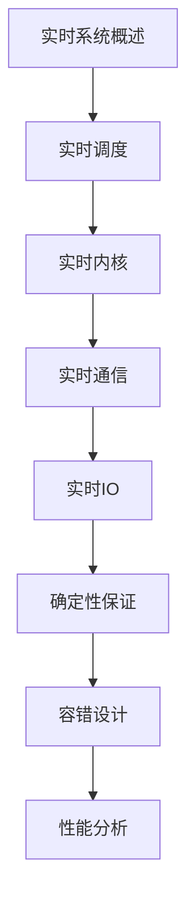

# 实时系统 学习指南

> **分类**：系统底层 ｜ **章节总数**：80 ｜ **技术栈**：实时系统

## 领域概述

实时系统是系统底层领域的重要技术方向，本系列从基础到高级逐步深入，涵盖10个核心模块：实时系统概述、实时调度、实时内核、实时通信、实时IO等。每个知识点作为独立章节，包含原理讲解、实现要点、常见陷阱和最佳实践，配合源码分析和架构图，帮助读者建立完整的实时系统知识体系。

本教程基于 **通用** 与 **实时系统** 生态编写，涵盖 行业标准工具链 等主流工具与框架。每章独立成篇，文字精炼、逻辑清晰，适合系统学习与按需查阅。

## 你将学到什么

完成本系列后，你将能够：

- 系统理解 **实时系统** 的核心概念与模块划分。
- 按难度递进掌握从入门到实战的完整知识路径。
- 在工程实践中做出合理的技术判断与问题排查。
- 通过章节索引快速定位所需知识点。

## 前置知识

- 编程基础
- 数据结构
- 计算机基础
- 系统底层基础概念

## 推荐学习路径

1. **实时系统概述**
2. **实时调度**
3. **实时内核**
4. **实时通信**
5. **实时IO**
6. **确定性保证**
7. **容错设计**
8. **性能分析**

## 模块体系

本领域按以下模块组织，难度由浅入深：

- **实时系统概述**
- **实时调度**
- **实时内核**
- **实时通信**
- **实时IO**
- **确定性保证**
- **容错设计**
- **性能分析**
- **实时Linux**
- **嵌入式实时**

## 难度分布

| 难度 | 章节数 | 占比 |
|------|--------|------|
| 入门 | 16 | 20% |
| 实战 | 16 | 20% |
| 进阶 | 24 | 30% |
| 高级 | 24 | 30% |

## 章节索引

点击章节标题进入对应教程：

### 实时系统概述

- [实时系统概述核心概念与原理](chapters/001-实时系统概述核心概念与原理.md) ｜ 入门
- [实时系统概述的实现机制详解](chapters/002-实时系统概述的实现机制详解.md) ｜ 入门
- [实时系统概述的关键技术点](chapters/003-实时系统概述的关键技术点.md) ｜ 入门
- [实时系统概述的源码级分析](chapters/004-实时系统概述的源码级分析.md) ｜ 入门
- [实时系统概述的配置与使用](chapters/005-实时系统概述的配置与使用.md) ｜ 入门
- [实时系统概述的常见问题与解决方案](chapters/006-实时系统概述的常见问题与解决方案.md) ｜ 入门
- [实时系统概述的性能优化技巧](chapters/007-实时系统概述的性能优化技巧.md) ｜ 入门
- [实时系统概述的最佳实践指南](chapters/008-实时系统概述的最佳实践指南.md) ｜ 入门

### 实时调度

- [实时调度核心概念与原理](chapters/009-实时调度核心概念与原理.md) ｜ 入门
- [实时调度的实现机制详解](chapters/010-实时调度的实现机制详解.md) ｜ 入门
- [实时调度的关键技术点](chapters/011-实时调度的关键技术点.md) ｜ 入门
- [实时调度的源码级分析](chapters/012-实时调度的源码级分析.md) ｜ 入门
- [实时调度的配置与使用](chapters/013-实时调度的配置与使用.md) ｜ 入门
- [实时调度的常见问题与解决方案](chapters/014-实时调度的常见问题与解决方案.md) ｜ 入门
- [实时调度的性能优化技巧](chapters/015-实时调度的性能优化技巧.md) ｜ 入门
- [实时调度的最佳实践指南](chapters/016-实时调度的最佳实践指南.md) ｜ 入门

### 实时内核

- [实时内核核心概念与原理](chapters/017-实时内核核心概念与原理.md) ｜ 进阶
- [实时内核的实现机制详解](chapters/018-实时内核的实现机制详解.md) ｜ 进阶
- [实时内核的关键技术点](chapters/019-实时内核的关键技术点.md) ｜ 进阶
- [实时内核的源码级分析](chapters/020-实时内核的源码级分析.md) ｜ 进阶
- [实时内核的配置与使用](chapters/021-实时内核的配置与使用.md) ｜ 进阶
- [实时内核的常见问题与解决方案](chapters/022-实时内核的常见问题与解决方案.md) ｜ 进阶
- [实时内核的性能优化技巧](chapters/023-实时内核的性能优化技巧.md) ｜ 进阶
- [实时内核的最佳实践指南](chapters/024-实时内核的最佳实践指南.md) ｜ 进阶

### 实时通信

- [实时通信核心概念与原理](chapters/025-实时通信核心概念与原理.md) ｜ 进阶
- [实时通信的实现机制详解](chapters/026-实时通信的实现机制详解.md) ｜ 进阶
- [实时通信的关键技术点](chapters/027-实时通信的关键技术点.md) ｜ 进阶
- [实时通信的源码级分析](chapters/028-实时通信的源码级分析.md) ｜ 进阶
- [实时通信的配置与使用](chapters/029-实时通信的配置与使用.md) ｜ 进阶
- [实时通信的常见问题与解决方案](chapters/030-实时通信的常见问题与解决方案.md) ｜ 进阶
- [实时通信的性能优化技巧](chapters/031-实时通信的性能优化技巧.md) ｜ 进阶
- [实时通信的最佳实践指南](chapters/032-实时通信的最佳实践指南.md) ｜ 进阶

### 实时IO

- [实时IO核心概念与原理](chapters/033-实时IO核心概念与原理.md) ｜ 进阶
- [实时IO的实现机制详解](chapters/034-实时IO的实现机制详解.md) ｜ 进阶
- [实时IO的关键技术点](chapters/035-实时IO的关键技术点.md) ｜ 进阶
- [实时IO的源码级分析](chapters/036-实时IO的源码级分析.md) ｜ 进阶
- [实时IO的配置与使用](chapters/037-实时IO的配置与使用.md) ｜ 进阶
- [实时IO的常见问题与解决方案](chapters/038-实时IO的常见问题与解决方案.md) ｜ 进阶
- [实时IO的性能优化技巧](chapters/039-实时IO的性能优化技巧.md) ｜ 进阶
- [实时IO的最佳实践指南](chapters/040-实时IO的最佳实践指南.md) ｜ 进阶

### 确定性保证

- [确定性保证核心概念与原理](chapters/041-确定性保证核心概念与原理.md) ｜ 高级
- [确定性保证的实现机制详解](chapters/042-确定性保证的实现机制详解.md) ｜ 高级
- [确定性保证的关键技术点](chapters/043-确定性保证的关键技术点.md) ｜ 高级
- [确定性保证的源码级分析](chapters/044-确定性保证的源码级分析.md) ｜ 高级
- [确定性保证的配置与使用](chapters/045-确定性保证的配置与使用.md) ｜ 高级
- [确定性保证的常见问题与解决方案](chapters/046-确定性保证的常见问题与解决方案.md) ｜ 高级
- [确定性保证的性能优化技巧](chapters/047-确定性保证的性能优化技巧.md) ｜ 高级
- [确定性保证的最佳实践指南](chapters/048-确定性保证的最佳实践指南.md) ｜ 高级

### 容错设计

- [容错设计核心概念与原理](chapters/049-容错设计核心概念与原理.md) ｜ 高级
- [容错设计的实现机制详解](chapters/050-容错设计的实现机制详解.md) ｜ 高级
- [容错设计的关键技术点](chapters/051-容错设计的关键技术点.md) ｜ 高级
- [容错设计的源码级分析](chapters/052-容错设计的源码级分析.md) ｜ 高级
- [容错设计的配置与使用](chapters/053-容错设计的配置与使用.md) ｜ 高级
- [容错设计的常见问题与解决方案](chapters/054-容错设计的常见问题与解决方案.md) ｜ 高级
- [容错设计的性能优化技巧](chapters/055-容错设计的性能优化技巧.md) ｜ 高级
- [容错设计的最佳实践指南](chapters/056-容错设计的最佳实践指南.md) ｜ 高级

### 性能分析

- [性能分析核心概念与原理](chapters/057-性能分析核心概念与原理.md) ｜ 高级
- [性能分析的实现机制详解](chapters/058-性能分析的实现机制详解.md) ｜ 高级
- [性能分析的关键技术点](chapters/059-性能分析的关键技术点.md) ｜ 高级
- [性能分析的源码级分析](chapters/060-性能分析的源码级分析.md) ｜ 高级
- [性能分析的配置与使用](chapters/061-性能分析的配置与使用.md) ｜ 高级
- [性能分析的常见问题与解决方案](chapters/062-性能分析的常见问题与解决方案.md) ｜ 高级
- [性能分析的性能优化技巧](chapters/063-性能分析的性能优化技巧.md) ｜ 高级
- [性能分析的最佳实践指南](chapters/064-性能分析的最佳实践指南.md) ｜ 高级

### 实时Linux

- [实时Linux核心概念与原理](chapters/065-实时Linux核心概念与原理.md) ｜ 实战
- [实时Linux的实现机制详解](chapters/066-实时Linux的实现机制详解.md) ｜ 实战
- [实时Linux的关键技术点](chapters/067-实时Linux的关键技术点.md) ｜ 实战
- [实时Linux的源码级分析](chapters/068-实时Linux的源码级分析.md) ｜ 实战
- [实时Linux的配置与使用](chapters/069-实时Linux的配置与使用.md) ｜ 实战
- [实时Linux的常见问题与解决方案](chapters/070-实时Linux的常见问题与解决方案.md) ｜ 实战
- [实时Linux的性能优化技巧](chapters/071-实时Linux的性能优化技巧.md) ｜ 实战
- [实时Linux的最佳实践指南](chapters/072-实时Linux的最佳实践指南.md) ｜ 实战

### 嵌入式实时

- [嵌入式实时核心概念与原理](chapters/073-嵌入式实时核心概念与原理.md) ｜ 实战
- [嵌入式实时的实现机制详解](chapters/074-嵌入式实时的实现机制详解.md) ｜ 实战
- [嵌入式实时的关键技术点](chapters/075-嵌入式实时的关键技术点.md) ｜ 实战
- [嵌入式实时的源码级分析](chapters/076-嵌入式实时的源码级分析.md) ｜ 实战
- [嵌入式实时的配置与使用](chapters/077-嵌入式实时的配置与使用.md) ｜ 实战
- [嵌入式实时的常见问题与解决方案](chapters/078-嵌入式实时的常见问题与解决方案.md) ｜ 实战
- [嵌入式实时的性能优化技巧](chapters/079-嵌入式实时的性能优化技巧.md) ｜ 实战
- [嵌入式实时的最佳实践指南](chapters/080-嵌入式实时的最佳实践指南.md) ｜ 实战

## 学习方法建议

1. **先读概述再读章节**：用本指南建立全局地图，避免迷失在细节中。
2. **按模块递进**：同一模块内章节有前后关联，顺序阅读效果更好。
3. **主动复述**：每章读完后，用三五句话概括「是什么、为什么、怎么用」。
4. **关联阅读**：利用章节底部的「延伸学习」在同模块内构建知识网络。
5. **对照官方文档**：本教程提供结构化视角，细节以官方文档为准。

---
*领域: 实时系统 ｜ 版本: 2.0 ｜ 共 80 章*