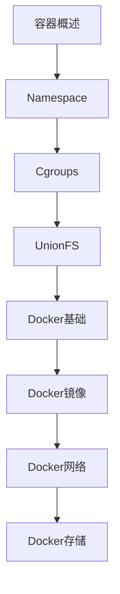

# 容器技术 学习指南

> **分类**：系统底层 ｜ **章节总数**：100 ｜ **技术栈**：容器技术

## 领域概述

容器技术是系统底层领域的重要技术方向，本系列从基础到高级逐步深入，涵盖10个核心模块：容器概述、Namespace、Cgroups、UnionFS、Docker基础等。每个知识点作为独立章节，包含原理讲解、实现要点、常见陷阱和最佳实践，配合源码分析和架构图，帮助读者建立完整的容器技术知识体系。

本教程基于 **通用** 与 **容器技术** 生态编写，涵盖 行业标准工具链 等主流工具与框架。每章独立成篇，文字精炼、逻辑清晰，适合系统学习与按需查阅。

## 你将学到什么

完成本系列后，你将能够：

- 系统理解 **容器技术** 的核心概念与模块划分。
- 按难度递进掌握从入门到实战的完整知识路径。
- 在工程实践中做出合理的技术判断与问题排查。
- 通过章节索引快速定位所需知识点。

## 前置知识

- 编程基础
- 数据结构
- 计算机基础
- 系统底层基础概念

## 推荐学习路径

1. **容器概述**
2. **Namespace**
3. **Cgroups**
4. **UnionFS**
5. **Docker基础**
6. **Docker镜像**
7. **Docker网络**
8. **Docker存储**

## 模块体系

本领域按以下模块组织，难度由浅入深：

- **容器概述**
- **Namespace**
- **Cgroups**
- **UnionFS**
- **Docker基础**
- **Docker镜像**
- **Docker网络**
- **Docker存储**
- **容器安全**
- **容器编排基础**

## 难度分布

| 难度 | 章节数 | 占比 |
|------|--------|------|
| 入门 | 20 | 20% |
| 实战 | 20 | 20% |
| 进阶 | 30 | 30% |
| 高级 | 30 | 30% |

## 章节索引

点击章节标题进入对应教程：

### 容器概述

- [容器概述核心概念与原理](chapters/001-容器概述核心概念与原理.md) ｜ 入门
- [容器概述的实现机制详解](chapters/002-容器概述的实现机制详解.md) ｜ 入门
- [容器概述的关键技术点](chapters/003-容器概述的关键技术点.md) ｜ 入门
- [容器概述的源码级分析](chapters/004-容器概述的源码级分析.md) ｜ 入门
- [容器概述的配置与使用](chapters/005-容器概述的配置与使用.md) ｜ 入门
- [容器概述的常见问题与解决方案](chapters/006-容器概述的常见问题与解决方案.md) ｜ 入门
- [容器概述的性能优化技巧](chapters/007-容器概述的性能优化技巧.md) ｜ 入门
- [容器概述的最佳实践指南](chapters/008-容器概述的最佳实践指南.md) ｜ 入门
- [容器概述的高级应用场景](chapters/009-容器概述的高级应用场景.md) ｜ 入门
- [容器概述的实战案例分析](chapters/010-容器概述的实战案例分析.md) ｜ 入门

### Namespace

- [Namespace核心概念与原理](chapters/011-Namespace核心概念与原理.md) ｜ 入门
- [Namespace的实现机制详解](chapters/012-Namespace的实现机制详解.md) ｜ 入门
- [Namespace的关键技术点](chapters/013-Namespace的关键技术点.md) ｜ 入门
- [Namespace的源码级分析](chapters/014-Namespace的源码级分析.md) ｜ 入门
- [Namespace的配置与使用](chapters/015-Namespace的配置与使用.md) ｜ 入门
- [Namespace的常见问题与解决方案](chapters/016-Namespace的常见问题与解决方案.md) ｜ 入门
- [Namespace的性能优化技巧](chapters/017-Namespace的性能优化技巧.md) ｜ 入门
- [Namespace的最佳实践指南](chapters/018-Namespace的最佳实践指南.md) ｜ 入门
- [Namespace的高级应用场景](chapters/019-Namespace的高级应用场景.md) ｜ 入门
- [Namespace的实战案例分析](chapters/020-Namespace的实战案例分析.md) ｜ 入门

### Cgroups

- [Cgroups核心概念与原理](chapters/021-Cgroups核心概念与原理.md) ｜ 进阶
- [Cgroups的实现机制详解](chapters/022-Cgroups的实现机制详解.md) ｜ 进阶
- [Cgroups的关键技术点](chapters/023-Cgroups的关键技术点.md) ｜ 进阶
- [Cgroups的源码级分析](chapters/024-Cgroups的源码级分析.md) ｜ 进阶
- [Cgroups的配置与使用](chapters/025-Cgroups的配置与使用.md) ｜ 进阶
- [Cgroups的常见问题与解决方案](chapters/026-Cgroups的常见问题与解决方案.md) ｜ 进阶
- [Cgroups的性能优化技巧](chapters/027-Cgroups的性能优化技巧.md) ｜ 进阶
- [Cgroups的最佳实践指南](chapters/028-Cgroups的最佳实践指南.md) ｜ 进阶
- [Cgroups的高级应用场景](chapters/029-Cgroups的高级应用场景.md) ｜ 进阶
- [Cgroups的实战案例分析](chapters/030-Cgroups的实战案例分析.md) ｜ 进阶

### UnionFS

- [UnionFS核心概念与原理](chapters/031-UnionFS核心概念与原理.md) ｜ 进阶
- [UnionFS的实现机制详解](chapters/032-UnionFS的实现机制详解.md) ｜ 进阶
- [UnionFS的关键技术点](chapters/033-UnionFS的关键技术点.md) ｜ 进阶
- [UnionFS的源码级分析](chapters/034-UnionFS的源码级分析.md) ｜ 进阶
- [UnionFS的配置与使用](chapters/035-UnionFS的配置与使用.md) ｜ 进阶
- [UnionFS的常见问题与解决方案](chapters/036-UnionFS的常见问题与解决方案.md) ｜ 进阶
- [UnionFS的性能优化技巧](chapters/037-UnionFS的性能优化技巧.md) ｜ 进阶
- [UnionFS的最佳实践指南](chapters/038-UnionFS的最佳实践指南.md) ｜ 进阶
- [UnionFS的高级应用场景](chapters/039-UnionFS的高级应用场景.md) ｜ 进阶
- [UnionFS的实战案例分析](chapters/040-UnionFS的实战案例分析.md) ｜ 进阶

### Docker基础

- [Docker基础核心概念与原理](chapters/041-Docker基础核心概念与原理.md) ｜ 进阶
- [Docker基础的实现机制详解](chapters/042-Docker基础的实现机制详解.md) ｜ 进阶
- [Docker基础的关键技术点](chapters/043-Docker基础的关键技术点.md) ｜ 进阶
- [Docker基础的源码级分析](chapters/044-Docker基础的源码级分析.md) ｜ 进阶
- [Docker基础的配置与使用](chapters/045-Docker基础的配置与使用.md) ｜ 进阶
- [Docker基础的常见问题与解决方案](chapters/046-Docker基础的常见问题与解决方案.md) ｜ 进阶
- [Docker基础的性能优化技巧](chapters/047-Docker基础的性能优化技巧.md) ｜ 进阶
- [Docker基础的最佳实践指南](chapters/048-Docker基础的最佳实践指南.md) ｜ 进阶
- [Docker基础的高级应用场景](chapters/049-Docker基础的高级应用场景.md) ｜ 进阶
- [Docker基础的实战案例分析](chapters/050-Docker基础的实战案例分析.md) ｜ 进阶

### Docker镜像

- [Docker镜像核心概念与原理](chapters/051-Docker镜像核心概念与原理.md) ｜ 高级
- [Docker镜像的实现机制详解](chapters/052-Docker镜像的实现机制详解.md) ｜ 高级
- [Docker镜像的关键技术点](chapters/053-Docker镜像的关键技术点.md) ｜ 高级
- [Docker镜像的源码级分析](chapters/054-Docker镜像的源码级分析.md) ｜ 高级
- [Docker镜像的配置与使用](chapters/055-Docker镜像的配置与使用.md) ｜ 高级
- [Docker镜像的常见问题与解决方案](chapters/056-Docker镜像的常见问题与解决方案.md) ｜ 高级
- [Docker镜像的性能优化技巧](chapters/057-Docker镜像的性能优化技巧.md) ｜ 高级
- [Docker镜像的最佳实践指南](chapters/058-Docker镜像的最佳实践指南.md) ｜ 高级
- [Docker镜像的高级应用场景](chapters/059-Docker镜像的高级应用场景.md) ｜ 高级
- [Docker镜像的实战案例分析](chapters/060-Docker镜像的实战案例分析.md) ｜ 高级

### Docker网络

- [Docker网络核心概念与原理](chapters/061-Docker网络核心概念与原理.md) ｜ 高级
- [Docker网络的实现机制详解](chapters/062-Docker网络的实现机制详解.md) ｜ 高级
- [Docker网络的关键技术点](chapters/063-Docker网络的关键技术点.md) ｜ 高级
- [Docker网络的源码级分析](chapters/064-Docker网络的源码级分析.md) ｜ 高级
- [Docker网络的配置与使用](chapters/065-Docker网络的配置与使用.md) ｜ 高级
- [Docker网络的常见问题与解决方案](chapters/066-Docker网络的常见问题与解决方案.md) ｜ 高级
- [Docker网络的性能优化技巧](chapters/067-Docker网络的性能优化技巧.md) ｜ 高级
- [Docker网络的最佳实践指南](chapters/068-Docker网络的最佳实践指南.md) ｜ 高级
- [Docker网络的高级应用场景](chapters/069-Docker网络的高级应用场景.md) ｜ 高级
- [Docker网络的实战案例分析](chapters/070-Docker网络的实战案例分析.md) ｜ 高级

### Docker存储

- [Docker存储核心概念与原理](chapters/071-Docker存储核心概念与原理.md) ｜ 高级
- [Docker存储的实现机制详解](chapters/072-Docker存储的实现机制详解.md) ｜ 高级
- [Docker存储的关键技术点](chapters/073-Docker存储的关键技术点.md) ｜ 高级
- [Docker存储的源码级分析](chapters/074-Docker存储的源码级分析.md) ｜ 高级
- [Docker存储的配置与使用](chapters/075-Docker存储的配置与使用.md) ｜ 高级
- [Docker存储的常见问题与解决方案](chapters/076-Docker存储的常见问题与解决方案.md) ｜ 高级
- [Docker存储的性能优化技巧](chapters/077-Docker存储的性能优化技巧.md) ｜ 高级
- [Docker存储的最佳实践指南](chapters/078-Docker存储的最佳实践指南.md) ｜ 高级
- [Docker存储的高级应用场景](chapters/079-Docker存储的高级应用场景.md) ｜ 高级
- [Docker存储的实战案例分析](chapters/080-Docker存储的实战案例分析.md) ｜ 高级

### 容器安全

- [容器安全核心概念与原理](chapters/081-容器安全核心概念与原理.md) ｜ 实战
- [容器安全的实现机制详解](chapters/082-容器安全的实现机制详解.md) ｜ 实战
- [容器安全的关键技术点](chapters/083-容器安全的关键技术点.md) ｜ 实战
- [容器安全的源码级分析](chapters/084-容器安全的源码级分析.md) ｜ 实战
- [容器安全的配置与使用](chapters/085-容器安全的配置与使用.md) ｜ 实战
- [容器安全的常见问题与解决方案](chapters/086-容器安全的常见问题与解决方案.md) ｜ 实战
- [容器安全的性能优化技巧](chapters/087-容器安全的性能优化技巧.md) ｜ 实战
- [容器安全的最佳实践指南](chapters/088-容器安全的最佳实践指南.md) ｜ 实战
- [容器安全的高级应用场景](chapters/089-容器安全的高级应用场景.md) ｜ 实战
- [容器安全的实战案例分析](chapters/090-容器安全的实战案例分析.md) ｜ 实战

### 容器编排基础

- [容器编排基础核心概念与原理](chapters/091-容器编排基础核心概念与原理.md) ｜ 实战
- [容器编排基础的实现机制详解](chapters/092-容器编排基础的实现机制详解.md) ｜ 实战
- [容器编排基础的关键技术点](chapters/093-容器编排基础的关键技术点.md) ｜ 实战
- [容器编排基础的源码级分析](chapters/094-容器编排基础的源码级分析.md) ｜ 实战
- [容器编排基础的配置与使用](chapters/095-容器编排基础的配置与使用.md) ｜ 实战
- [容器编排基础的常见问题与解决方案](chapters/096-容器编排基础的常见问题与解决方案.md) ｜ 实战
- [容器编排基础的性能优化技巧](chapters/097-容器编排基础的性能优化技巧.md) ｜ 实战
- [容器编排基础的最佳实践指南](chapters/098-容器编排基础的最佳实践指南.md) ｜ 实战
- [容器编排基础的高级应用场景](chapters/099-容器编排基础的高级应用场景.md) ｜ 实战
- [容器编排基础的实战案例分析](chapters/100-容器编排基础的实战案例分析.md) ｜ 实战

## 学习方法建议

1. **先读概述再读章节**：用本指南建立全局地图，避免迷失在细节中。
2. **按模块递进**：同一模块内章节有前后关联，顺序阅读效果更好。
3. **主动复述**：每章读完后，用三五句话概括「是什么、为什么、怎么用」。
4. **关联阅读**：利用章节底部的「延伸学习」在同模块内构建知识网络。
5. **对照官方文档**：本教程提供结构化视角，细节以官方文档为准。

---
*领域: 容器技术 ｜ 版本: 2.0 ｜ 共 100 章*