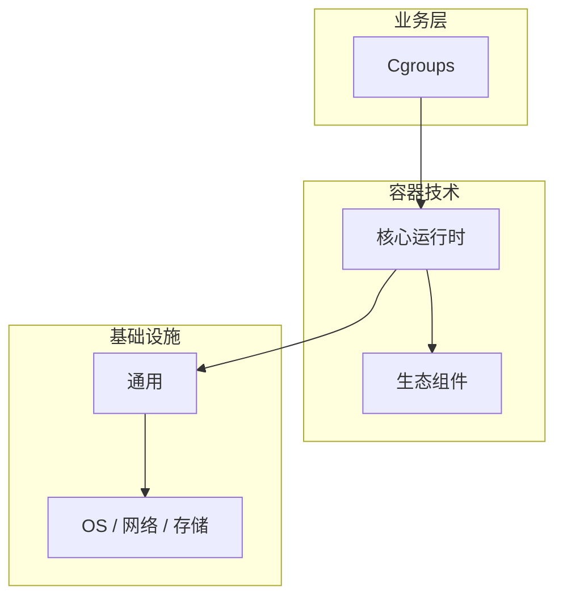

# Cgroups的最佳实践指南

> **领域**：容器技术 ｜ **模块**：Cgroups ｜ **难度**：进阶 ｜ **类型**：最佳实践

## 导读

本章系统讲解 **容器技术** 中 **Cgroups** 的相关知识（最佳实践）。本章总结 **Cgroups** 在团队工程化中的约定、检查项与落地方式。内容基于主流框架与工程实践撰写，不依赖过时概念堆砌。

## 核心知识

**Cgroups** 在 **容器技术** 中承担关键职责。Cgroups 是 容器技术 技术栈中的关键能力点，理解其原理与边界是工程实践的基础。

### 核心知识

**1. Cgroups核心机制**

Cgroups 的执行路径依赖 容器技术 标准实现与内核/硬件协作。

**2. Cgroups数据结构**

底层通过特定数据结构与系统调用暴露 Cgroups 能力。

**3. Cgroups配置要点**

关注 Cgroups 的 sysctl、设备树或编译选项配置。

**4. Cgroups观测指标**

为 Cgroups 关键路径配置延迟、错误率与资源占用指标，结合日志 trace_id 关联。

## 架构与流程

## 技术详解

### 工程实践

阅读 容器技术 官方文档中 Cgroups 章节并对照源码验证理解
为 Cgroups 编写单元/集成测试覆盖错误路径
关键配置纳入 IaC 与 Code Review
生产变更前在预发环境压测并建立回滚方案

## 原理与实现

### 工作机制

Cgroups 工作原理：接收请求或事件 → 路由到处理逻辑 → 访问依赖服务（DB/缓存/队列）→ 聚合结果返回。错误应分类为可重试与不可重试，并映射为统一错误码。Cgroups 的实现依赖 容器技术 官方文档与社区最佳实践中的标准模式。

### 内部实现

Cgroups 的实现依赖 容器技术 官方文档与社区最佳实践中的标准模式。

## 操作流程与实践

### 操作流程

1. 阅读 容器技术 官方 Cgroups 文档与权威示例，列出与本项目相关的 API/配置项
2. 在本地或开发环境搭建最小可运行样例，验证输入输出与边界条件
3. 将 Cgroups 集成到主流程，补充单元测试与必要的集成测试
4. 在预发环境做容量与回归验证，记录性能与错误率基线
5. 编写变更说明与回滚步骤，灰度上线并持续观察核心指标

### 配置要点

Cgroups 配置项应外部化（环境变量/配置中心），区分 dev/staging/prod；敏感项用密钥管理服务。

## 性能、安全与排查

### 性能优化

Cgroups 性能优化：Profiling 定位热点；优先优化 I/O 与算法复杂度；避免过早微优化。容器技术 社区通常提供 Cgroups 相关的 benchmark 与 tuning 指南。

### 安全注意

使用 Cgroups 时遵循最小权限：输入校验、敏感数据脱敏、审计日志。容器技术 安全公告与 CVE 应订阅并及时打补丁。

### 调试排错

结合 容器技术 官方文档、源码与观测工具（日志/追踪）复现问题，最小化测试用例隔离变量。

## 案例与选型

### 案例复盘

某团队在 容器技术 项目中重构 Cgroups 模块：拆分职责、引入缓存/队列削峰、补充契约测试，P95 延迟下降且故障恢复时间缩短。

### 方案对比

选型 Cgroups 方案时，对比官方推荐实现与第三方扩展的成熟度、社区活跃度、运维成本及与现有 容器技术 栈的集成难度。

### 常见误区与纠正

**忽视边界条件**

Cgroups 在异常输入、资源耗尽或并发场景下行为易与 happy path 不同，需专项测试。

**版本/配置漂移**

内核或 容器技术 组件升级后 Cgroups 默认行为可能变化，缺少回归测试易引发隐性故障。

**缺少可观测性**

未对 Cgroups 埋点与日志分级，故障只能被动发现，MTTR 居高不下。

### 最佳实践

1. 阅读 容器技术 官方文档中 Cgroups 章节并对照源码验证理解
2. 为 Cgroups 编写单元/集成测试覆盖错误路径
3. 关键配置纳入 IaC 与 Code Review
4. 生产变更前在预发环境压测并建立回滚方案

## 巩固建议

建议结合 **容器技术** 官方文档与小型实验，亲手验证 **Cgroups** 的默认行为与边界条件；将本章要点整理为检查清单或 ADR，便于评审与团队 onboarding。

### 本章小结

学完本章，你应能独立说明 **Cgroups** 在 容器技术 中的角色，理解其核心机制，规避常见误区，并在项目中正确运用。

## 延伸学习

- Cgroups核心概念与原理
- Cgroups的实现机制详解
- Cgroups的关键技术点
- Cgroups的源码级分析
- Cgroups的配置与使用

### 延伸阅读

- 容器技术 权威文档 — Cgroups
- Linux man pages / kernel.org Documentation（如适用）
- 相关 RFC 或芯片手册（如适用）

---
*章节 ID: 028 ｜ 领域: 容器技术*