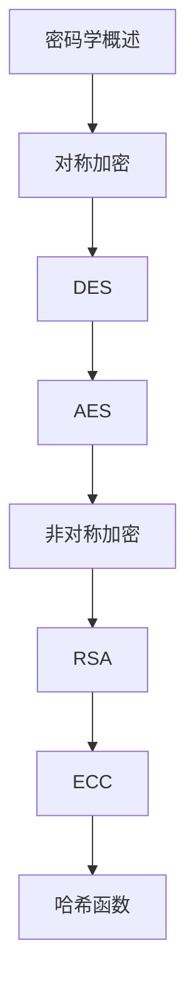

# 密码学 学习指南

> **分类**：安全 ｜ **章节总数**：100 ｜ **技术栈**：密码学

> **学习声明**：本章内容仅供合法授权环境下的安全研究与防御建设，请遵守法律法规与组织安全政策，禁止对未授权系统开展测试。

## 领域概述

密码学是安全领域的重要技术方向，本系列从基础到高级逐步深入，涵盖20个核心模块：密码学概述、对称加密、DES、AES、非对称加密等。每个知识点作为独立章节，包含原理讲解、实现要点、常见陷阱和最佳实践，配合源码分析和架构图，帮助读者建立完整的密码学知识体系。

本教程基于 **通用** 与 **密码学** 生态编写，涵盖 行业标准工具链 等主流工具与框架。每章独立成篇，文字精炼、逻辑清晰，适合系统学习与按需查阅。

## 你将学到什么

完成本系列后，你将能够：

- 系统理解 **密码学** 的核心概念与模块划分。
- 按难度递进掌握从入门到实战的完整知识路径。
- 在工程实践中做出合理的技术判断与问题排查。
- 通过章节索引快速定位所需知识点。

## 前置知识

- 编程基础
- 数据结构
- 计算机基础
- 安全基础概念

## 推荐学习路径

1. **密码学概述**
2. **对称加密**
3. **DES**
4. **AES**
5. **非对称加密**
6. **RSA**
7. **ECC**
8. **哈希函数**

## 模块体系

本领域按以下模块组织，难度由浅入深：

- **密码学概述**
- **对称加密**
- **DES**
- **AES**
- **非对称加密**
- **RSA**
- **ECC**
- **哈希函数**
- **MD5**
- **SHA**
- **消息认证码**
- **数字签名**
- **证书**
- **PKI**
- **密钥交换**
- **随机数**
- **密码协议**
- **TLS/SSL**
- **PGP**
- **密码学最佳实践**

## 难度分布

| 难度 | 章节数 | 占比 |
|------|--------|------|
| 入门 | 20 | 20% |
| 实战 | 20 | 20% |
| 进阶 | 30 | 30% |
| 高级 | 30 | 30% |

## 章节索引

点击章节标题进入对应教程：

### 密码学概述

- [密码学概述核心概念与原理](chapters/001-密码学概述核心概念与原理.md) ｜ 入门
- [密码学概述的实现机制详解](chapters/002-密码学概述的实现机制详解.md) ｜ 入门
- [密码学概述的关键技术点](chapters/003-密码学概述的关键技术点.md) ｜ 入门
- [密码学概述的源码级分析](chapters/004-密码学概述的源码级分析.md) ｜ 入门
- [密码学概述的配置与使用](chapters/005-密码学概述的配置与使用.md) ｜ 入门

### 对称加密

- [对称加密核心概念与原理](chapters/006-对称加密核心概念与原理.md) ｜ 入门
- [对称加密的实现机制详解](chapters/007-对称加密的实现机制详解.md) ｜ 入门
- [对称加密的关键技术点](chapters/008-对称加密的关键技术点.md) ｜ 入门
- [对称加密的源码级分析](chapters/009-对称加密的源码级分析.md) ｜ 入门
- [对称加密的配置与使用](chapters/010-对称加密的配置与使用.md) ｜ 入门

### DES

- [DES核心概念与原理](chapters/011-DES核心概念与原理.md) ｜ 入门
- [DES的实现机制详解](chapters/012-DES的实现机制详解.md) ｜ 入门
- [DES的关键技术点](chapters/013-DES的关键技术点.md) ｜ 入门
- [DES的源码级分析](chapters/014-DES的源码级分析.md) ｜ 入门
- [DES的配置与使用](chapters/015-DES的配置与使用.md) ｜ 入门

### AES

- [AES核心概念与原理](chapters/016-AES核心概念与原理.md) ｜ 入门
- [AES的实现机制详解](chapters/017-AES的实现机制详解.md) ｜ 入门
- [AES的关键技术点](chapters/018-AES的关键技术点.md) ｜ 入门
- [AES的源码级分析](chapters/019-AES的源码级分析.md) ｜ 入门
- [AES的配置与使用](chapters/020-AES的配置与使用.md) ｜ 入门

### 非对称加密

- [非对称加密核心概念与原理](chapters/021-非对称加密核心概念与原理.md) ｜ 进阶
- [非对称加密的实现机制详解](chapters/022-非对称加密的实现机制详解.md) ｜ 进阶
- [非对称加密的关键技术点](chapters/023-非对称加密的关键技术点.md) ｜ 进阶
- [非对称加密的源码级分析](chapters/024-非对称加密的源码级分析.md) ｜ 进阶
- [非对称加密的配置与使用](chapters/025-非对称加密的配置与使用.md) ｜ 进阶

### RSA

- [RSA核心概念与原理](chapters/026-RSA核心概念与原理.md) ｜ 进阶
- [RSA的实现机制详解](chapters/027-RSA的实现机制详解.md) ｜ 进阶
- [RSA的关键技术点](chapters/028-RSA的关键技术点.md) ｜ 进阶
- [RSA的源码级分析](chapters/029-RSA的源码级分析.md) ｜ 进阶
- [RSA的配置与使用](chapters/030-RSA的配置与使用.md) ｜ 进阶

### ECC

- [ECC核心概念与原理](chapters/031-ECC核心概念与原理.md) ｜ 进阶
- [ECC的实现机制详解](chapters/032-ECC的实现机制详解.md) ｜ 进阶
- [ECC的关键技术点](chapters/033-ECC的关键技术点.md) ｜ 进阶
- [ECC的源码级分析](chapters/034-ECC的源码级分析.md) ｜ 进阶
- [ECC的配置与使用](chapters/035-ECC的配置与使用.md) ｜ 进阶

### 哈希函数

- [哈希函数核心概念与原理](chapters/036-哈希函数核心概念与原理.md) ｜ 进阶
- [哈希函数的实现机制详解](chapters/037-哈希函数的实现机制详解.md) ｜ 进阶
- [哈希函数的关键技术点](chapters/038-哈希函数的关键技术点.md) ｜ 进阶
- [哈希函数的源码级分析](chapters/039-哈希函数的源码级分析.md) ｜ 进阶
- [哈希函数的配置与使用](chapters/040-哈希函数的配置与使用.md) ｜ 进阶

### MD5

- [MD5核心概念与原理](chapters/041-MD5核心概念与原理.md) ｜ 进阶
- [MD5的实现机制详解](chapters/042-MD5的实现机制详解.md) ｜ 进阶
- [MD5的关键技术点](chapters/043-MD5的关键技术点.md) ｜ 进阶
- [MD5的源码级分析](chapters/044-MD5的源码级分析.md) ｜ 进阶
- [MD5的配置与使用](chapters/045-MD5的配置与使用.md) ｜ 进阶

### SHA

- [SHA核心概念与原理](chapters/046-SHA核心概念与原理.md) ｜ 进阶
- [SHA的实现机制详解](chapters/047-SHA的实现机制详解.md) ｜ 进阶
- [SHA的关键技术点](chapters/048-SHA的关键技术点.md) ｜ 进阶
- [SHA的源码级分析](chapters/049-SHA的源码级分析.md) ｜ 进阶
- [SHA的配置与使用](chapters/050-SHA的配置与使用.md) ｜ 进阶

### 消息认证码

- [消息认证码核心概念与原理](chapters/051-消息认证码核心概念与原理.md) ｜ 高级
- [消息认证码的实现机制详解](chapters/052-消息认证码的实现机制详解.md) ｜ 高级
- [消息认证码的关键技术点](chapters/053-消息认证码的关键技术点.md) ｜ 高级
- [消息认证码的源码级分析](chapters/054-消息认证码的源码级分析.md) ｜ 高级
- [消息认证码的配置与使用](chapters/055-消息认证码的配置与使用.md) ｜ 高级

### 数字签名

- [数字签名核心概念与原理](chapters/056-数字签名核心概念与原理.md) ｜ 高级
- [数字签名的实现机制详解](chapters/057-数字签名的实现机制详解.md) ｜ 高级
- [数字签名的关键技术点](chapters/058-数字签名的关键技术点.md) ｜ 高级
- [数字签名的源码级分析](chapters/059-数字签名的源码级分析.md) ｜ 高级
- [数字签名的配置与使用](chapters/060-数字签名的配置与使用.md) ｜ 高级

### 证书

- [证书核心概念与原理](chapters/061-证书核心概念与原理.md) ｜ 高级
- [证书的实现机制详解](chapters/062-证书的实现机制详解.md) ｜ 高级
- [证书的关键技术点](chapters/063-证书的关键技术点.md) ｜ 高级
- [证书的源码级分析](chapters/064-证书的源码级分析.md) ｜ 高级
- [证书的配置与使用](chapters/065-证书的配置与使用.md) ｜ 高级

### PKI

- [PKI核心概念与原理](chapters/066-PKI核心概念与原理.md) ｜ 高级
- [PKI的实现机制详解](chapters/067-PKI的实现机制详解.md) ｜ 高级
- [PKI的关键技术点](chapters/068-PKI的关键技术点.md) ｜ 高级
- [PKI的源码级分析](chapters/069-PKI的源码级分析.md) ｜ 高级
- [PKI的配置与使用](chapters/070-PKI的配置与使用.md) ｜ 高级

### 密钥交换

- [密钥交换核心概念与原理](chapters/071-密钥交换核心概念与原理.md) ｜ 高级
- [密钥交换的实现机制详解](chapters/072-密钥交换的实现机制详解.md) ｜ 高级
- [密钥交换的关键技术点](chapters/073-密钥交换的关键技术点.md) ｜ 高级
- [密钥交换的源码级分析](chapters/074-密钥交换的源码级分析.md) ｜ 高级
- [密钥交换的配置与使用](chapters/075-密钥交换的配置与使用.md) ｜ 高级

### 随机数

- [随机数核心概念与原理](chapters/076-随机数核心概念与原理.md) ｜ 高级
- [随机数的实现机制详解](chapters/077-随机数的实现机制详解.md) ｜ 高级
- [随机数的关键技术点](chapters/078-随机数的关键技术点.md) ｜ 高级
- [随机数的源码级分析](chapters/079-随机数的源码级分析.md) ｜ 高级
- [随机数的配置与使用](chapters/080-随机数的配置与使用.md) ｜ 高级

### 密码协议

- [密码协议核心概念与原理](chapters/081-密码协议核心概念与原理.md) ｜ 实战
- [密码协议的实现机制详解](chapters/082-密码协议的实现机制详解.md) ｜ 实战
- [密码协议的关键技术点](chapters/083-密码协议的关键技术点.md) ｜ 实战
- [密码协议的源码级分析](chapters/084-密码协议的源码级分析.md) ｜ 实战
- [密码协议的配置与使用](chapters/085-密码协议的配置与使用.md) ｜ 实战

### TLS/SSL

- [TLS/SSL核心概念与原理](chapters/086-TLSSSL核心概念与原理.md) ｜ 实战
- [TLS/SSL的实现机制详解](chapters/087-TLSSSL的实现机制详解.md) ｜ 实战
- [TLS/SSL的关键技术点](chapters/088-TLSSSL的关键技术点.md) ｜ 实战
- [TLS/SSL的源码级分析](chapters/089-TLSSSL的源码级分析.md) ｜ 实战
- [TLS/SSL的配置与使用](chapters/090-TLSSSL的配置与使用.md) ｜ 实战

### PGP

- [PGP核心概念与原理](chapters/091-PGP核心概念与原理.md) ｜ 实战
- [PGP的实现机制详解](chapters/092-PGP的实现机制详解.md) ｜ 实战
- [PGP的关键技术点](chapters/093-PGP的关键技术点.md) ｜ 实战
- [PGP的源码级分析](chapters/094-PGP的源码级分析.md) ｜ 实战
- [PGP的配置与使用](chapters/095-PGP的配置与使用.md) ｜ 实战

### 密码学最佳实践

- [密码学最佳实践核心概念与原理](chapters/096-密码学最佳实践核心概念与原理.md) ｜ 实战
- [密码学最佳实践的实现机制详解](chapters/097-密码学最佳实践的实现机制详解.md) ｜ 实战
- [密码学最佳实践的关键技术点](chapters/098-密码学最佳实践的关键技术点.md) ｜ 实战
- [密码学最佳实践的源码级分析](chapters/099-密码学最佳实践的源码级分析.md) ｜ 实战
- [密码学最佳实践的配置与使用](chapters/100-密码学最佳实践的配置与使用.md) ｜ 实战

## 学习方法建议

1. **先读概述再读章节**：用本指南建立全局地图，避免迷失在细节中。
2. **按模块递进**：同一模块内章节有前后关联，顺序阅读效果更好。
3. **主动复述**：每章读完后，用三五句话概括「是什么、为什么、怎么用」。
4. **关联阅读**：利用章节底部的「延伸学习」在同模块内构建知识网络。
5. **对照官方文档**：本教程提供结构化视角，细节以官方文档为准。

---
*领域: 密码学 ｜ 版本: 2.0 ｜ 共 100 章*