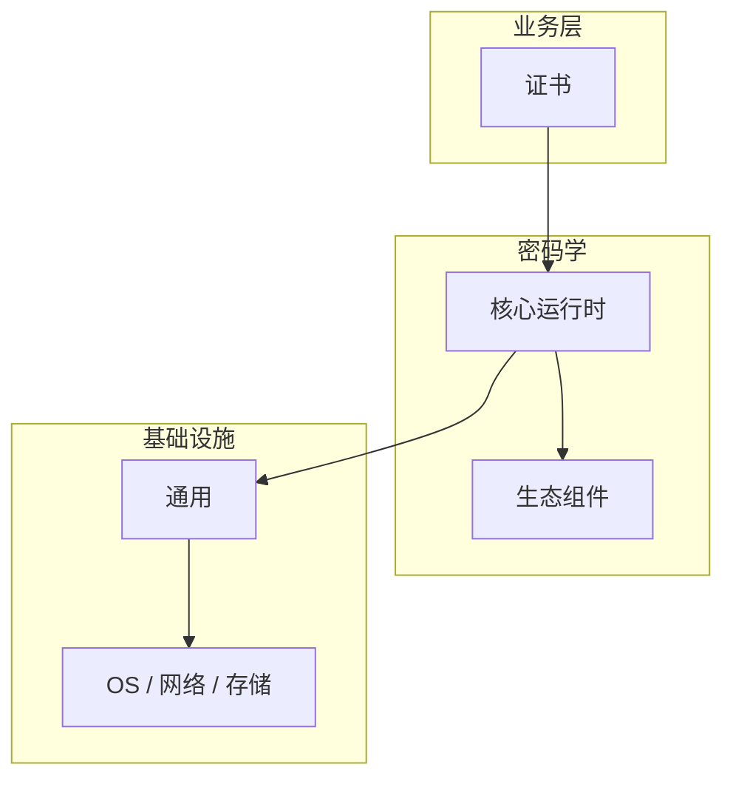

# 证书的关键技术点

> **领域**：密码学 ｜ **模块**：证书 ｜ **难度**：高级 ｜ **类型**：关键技术

> **学习声明**：本章内容仅供合法授权环境下的安全研究与防御建设，请遵守法律法规与组织安全政策，禁止对未授权系统开展测试。

## 导读

本章系统讲解 **密码学** 中 **证书** 的相关知识（关键技术）。本章归纳 **证书** 在生产环境中最常用、最易出错的关键技术点。内容基于主流框架与工程实践撰写，不依赖过时概念堆砌。

## 核心知识

**证书** 是 密码学 领域的核心主题。X.509 证书结构与字段。本模块从原理与工程实践出发，帮助读者建立系统理解。 本教程内容仅供合法授权的安全测试、防御加固与学术研究使用。未经授权对他人系统进行扫描、入侵或破坏属于违法行为。

### 核心知识

**1. 证书内容**

Subject、Issuer、公钥、有效期、签名算法、扩展（SAN）。

**2. SAN**

Subject Alternative Name 支持多域名证书。

**3. 验证链**

叶子证书 → 中间 CA → 根 CA，根证书预置信任库。

## 架构与流程

## 技术详解

### 关键技术

CA 私钥签名证书 → 客户端用 CA 公钥验证 → 信任公钥。

## 原理与实现

### 工作机制

CA 私钥签名证书 → 客户端用 CA 公钥验证 → 信任公钥。

### 内部实现

证书 的底层实现依赖 密码学 生态中的标准组件与协议，建议阅读官方规范文档。

## 操作流程与实践

### 操作流程

1. 理解 证书 概念 → 2. 学习标准用法 → 3. 动手实验 → 4. 分析案例 → 5. 总结最佳实践。

### 配置要点

配置 证书 时遵循官方推荐默认值，仅在理解影响后调整参数。

## 性能、安全与排查

### 性能优化

评估 证书 性能时建立基准测试，关注时间/空间复杂度或系统吞吐延迟指标。

### 安全注意

本教程内容仅供合法授权的安全测试、防御加固与学术研究使用。未经授权对他人系统进行扫描、入侵或破坏属于违法行为。

### 调试排错

排查 证书 问题时，结合日志、监控与最小复现用例逐步定位根因。

## 案例与选型

### 案例复盘

在典型 密码学 项目中，正确应用 证书 可显著提升系统质量与可维护性。

### 方案对比

选择 证书 方案时需对比多种替代方案的适用场景、性能与生态支持。

## 本章聚焦

**证书** 的关键技术往往集中在默认配置与边界行为；生产问题多源于「以为懂了」的细节，应用 checklist 逐项验证。

### 常见误区与纠正

**概念理解偏差**

对 证书 理解不全面导致误用，应回到官方文档重新梳理。

**忽视边界条件**

证书 在极端输入或高并发下行为可能不同，需充分测试。

**缺少监控**

未对 证书 关键指标监控，问题只能被动发现。

### 最佳实践

1. 遵循 密码学 领域 证书 的官方推荐实践
2. 为 证书 相关功能编写自动化测试
3. 关键配置纳入版本管理与变更审计
4. 生产部署前在接近真实环境验证

## 巩固建议

建议结合 **密码学** 官方文档与小型实验，亲手验证 **证书** 的默认行为与边界条件；将本章要点整理为检查清单或 ADR，便于评审与团队 onboarding。

### 本章小结

学完本章，你应能独立说明 **证书** 在 密码学 中的角色，理解其核心机制，规避常见误区，并在项目中正确运用。

## 延伸学习

- 证书核心概念与原理
- 证书的实现机制详解
- 证书的源码级分析
- 证书的配置与使用

### 延伸阅读

- 密码学 官方文档 - 证书
- OWASP / NIST 相关指南（如适用）
- 权威书籍与 RFC 标准文档

---
*章节 ID: 063 ｜ 领域: 密码学*