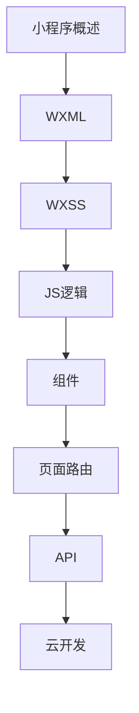

# 小程序开发 学习指南

> **分类**：前端开发 ｜ **技术生态**：微信开发者工具、Taro、uni-app、云开发

## 领域定位

小程序运行于超级 App 内，双线程架构与平台 API 各异。Taro/uni-app 支持跨端发布。

WXML/WXSS、逻辑层、组件路由、云开发及微信/支付宝差异与跨端方案。

本领域常用技术栈与工具包括：微信开发者工具、Taro、uni-app、云开发。

## 学习目标

- 理解双线程与 setData
- 开发页面组件 API
- 分包云开发
- 跨端框架选型

## 前置知识

- JavaScript
- HTML/CSS 概念
- 开发者账号

## 学习路径

1. **小程序概述**
2. **WXML**
3. **WXSS**
4. **JS逻辑**
5. **组件**
6. **页面路由**
7. **API**
8. **云开发**

## 模块体系

- **小程序概述**
- **WXML**
- **WXSS**
- **JS逻辑**
- **组件**
- **页面路由**
- **API**
- **云开发**
- **性能优化**
- **微信小程序**
- **支付宝小程序**
- **跨端框架**
- **小程序最佳实践**

## 难度分布

| 入门 | 20 | 25% |
| 实战 | 18 | 22% |
| 进阶 | 18 | 22% |
| 高级 | 24 | 30% |

## 章节索引

### 小程序概述

- [小程序概述核心概念与原理](chapters/001-小程序概述核心概念与原理.md) ｜ 入门
- [小程序概述的实现机制详解](chapters/002-小程序概述的实现机制详解.md) ｜ 入门
- [小程序概述的关键技术点](chapters/003-小程序概述的关键技术点.md) ｜ 入门
- [小程序概述的源码级分析](chapters/004-小程序概述的源码级分析.md) ｜ 入门
- [小程序概述的配置与使用](chapters/005-小程序概述的配置与使用.md) ｜ 入门
- [小程序概述的常见问题与解决方案](chapters/006-小程序概述的常见问题与解决方案.md) ｜ 入门
- [小程序概述的性能优化技巧](chapters/007-小程序概述的性能优化技巧.md) ｜ 入门

### WXML

- [WXML核心概念与原理](chapters/008-WXML核心概念与原理.md) ｜ 入门
- [WXML的实现机制详解](chapters/009-WXML的实现机制详解.md) ｜ 入门
- [WXML的关键技术点](chapters/010-WXML的关键技术点.md) ｜ 入门
- [WXML的源码级分析](chapters/011-WXML的源码级分析.md) ｜ 入门
- [WXML的配置与使用](chapters/012-WXML的配置与使用.md) ｜ 入门
- [WXML的常见问题与解决方案](chapters/013-WXML的常见问题与解决方案.md) ｜ 入门
- [WXML的性能优化技巧](chapters/014-WXML的性能优化技巧.md) ｜ 入门

### WXSS

- [W跨站脚本风险核心概念与原理](chapters/015-W跨站脚本风险核心概念与原理.md) ｜ 入门
- [W跨站脚本风险的实现机制详解](chapters/016-W跨站脚本风险的实现机制详解.md) ｜ 入门
- [W跨站脚本风险的关键技术点](chapters/017-W跨站脚本风险的关键技术点.md) ｜ 入门
- [W跨站脚本风险的源码级分析](chapters/018-W跨站脚本风险的源码级分析.md) ｜ 入门
- [W跨站脚本风险的配置与使用](chapters/019-W跨站脚本风险的配置与使用.md) ｜ 入门
- [W跨站脚本风险的常见问题与解决方案](chapters/020-W跨站脚本风险的常见问题与解决方案.md) ｜ 入门

### JS逻辑

- [JS逻辑核心概念与原理](chapters/021-JS逻辑核心概念与原理.md) ｜ 进阶
- [JS逻辑的实现机制详解](chapters/022-JS逻辑的实现机制详解.md) ｜ 进阶
- [JS逻辑的关键技术点](chapters/023-JS逻辑的关键技术点.md) ｜ 进阶
- [JS逻辑的源码级分析](chapters/024-JS逻辑的源码级分析.md) ｜ 进阶
- [JS逻辑的配置与使用](chapters/025-JS逻辑的配置与使用.md) ｜ 进阶
- [JS逻辑的常见问题与解决方案](chapters/026-JS逻辑的常见问题与解决方案.md) ｜ 进阶

### 组件

- [组件核心概念与原理](chapters/027-组件核心概念与原理.md) ｜ 进阶
- [组件的实现机制详解](chapters/028-组件的实现机制详解.md) ｜ 进阶
- [组件的关键技术点](chapters/029-组件的关键技术点.md) ｜ 进阶
- [组件的源码级分析](chapters/030-组件的源码级分析.md) ｜ 进阶
- [组件的配置与使用](chapters/031-组件的配置与使用.md) ｜ 进阶
- [组件的常见问题与解决方案](chapters/032-组件的常见问题与解决方案.md) ｜ 进阶

### 页面路由

- [页面路由核心概念与原理](chapters/033-页面路由核心概念与原理.md) ｜ 进阶
- [页面路由的实现机制详解](chapters/034-页面路由的实现机制详解.md) ｜ 进阶
- [页面路由的关键技术点](chapters/035-页面路由的关键技术点.md) ｜ 进阶
- [页面路由的源码级分析](chapters/036-页面路由的源码级分析.md) ｜ 进阶
- [页面路由的配置与使用](chapters/037-页面路由的配置与使用.md) ｜ 进阶
- [页面路由的常见问题与解决方案](chapters/038-页面路由的常见问题与解决方案.md) ｜ 进阶

### API

- [API核心概念与原理](chapters/039-API核心概念与原理.md) ｜ 高级
- [API的实现机制详解](chapters/040-API的实现机制详解.md) ｜ 高级
- [API的关键技术点](chapters/041-API的关键技术点.md) ｜ 高级
- [API的源码级分析](chapters/042-API的源码级分析.md) ｜ 高级
- [API的配置与使用](chapters/043-API的配置与使用.md) ｜ 高级
- [API的常见问题与解决方案](chapters/044-API的常见问题与解决方案.md) ｜ 高级

### 云开发

- [云开发核心概念与原理](chapters/045-云开发核心概念与原理.md) ｜ 高级
- [云开发的实现机制详解](chapters/046-云开发的实现机制详解.md) ｜ 高级
- [云开发的关键技术点](chapters/047-云开发的关键技术点.md) ｜ 高级
- [云开发的源码级分析](chapters/048-云开发的源码级分析.md) ｜ 高级
- [云开发的配置与使用](chapters/049-云开发的配置与使用.md) ｜ 高级
- [云开发的常见问题与解决方案](chapters/050-云开发的常见问题与解决方案.md) ｜ 高级

### 性能优化

- [性能优化核心概念与原理](chapters/051-性能优化核心概念与原理.md) ｜ 高级
- [性能优化的实现机制详解](chapters/052-性能优化的实现机制详解.md) ｜ 高级
- [性能优化的关键技术点](chapters/053-性能优化的关键技术点.md) ｜ 高级
- [性能优化的源码级分析](chapters/054-性能优化的源码级分析.md) ｜ 高级
- [性能优化的配置与使用](chapters/055-性能优化的配置与使用.md) ｜ 高级
- [性能优化的常见问题与解决方案](chapters/056-性能优化的常见问题与解决方案.md) ｜ 高级

### 微信小程序

- [微信小程序核心概念与原理](chapters/057-微信小程序核心概念与原理.md) ｜ 高级
- [微信小程序的实现机制详解](chapters/058-微信小程序的实现机制详解.md) ｜ 高级
- [微信小程序的关键技术点](chapters/059-微信小程序的关键技术点.md) ｜ 高级
- [微信小程序的源码级分析](chapters/060-微信小程序的源码级分析.md) ｜ 高级
- [微信小程序的配置与使用](chapters/061-微信小程序的配置与使用.md) ｜ 高级
- [微信小程序的常见问题与解决方案](chapters/062-微信小程序的常见问题与解决方案.md) ｜ 高级

### 支付宝小程序

- [支付宝小程序核心概念与原理](chapters/063-支付宝小程序核心概念与原理.md) ｜ 实战
- [支付宝小程序的实现机制详解](chapters/064-支付宝小程序的实现机制详解.md) ｜ 实战
- [支付宝小程序的关键技术点](chapters/065-支付宝小程序的关键技术点.md) ｜ 实战
- [支付宝小程序的源码级分析](chapters/066-支付宝小程序的源码级分析.md) ｜ 实战
- [支付宝小程序的配置与使用](chapters/067-支付宝小程序的配置与使用.md) ｜ 实战
- [支付宝小程序的常见问题与解决方案](chapters/068-支付宝小程序的常见问题与解决方案.md) ｜ 实战

### 跨端框架

- [跨端框架核心概念与原理](chapters/069-跨端框架核心概念与原理.md) ｜ 实战
- [跨端框架的实现机制详解](chapters/070-跨端框架的实现机制详解.md) ｜ 实战
- [跨端框架的关键技术点](chapters/071-跨端框架的关键技术点.md) ｜ 实战
- [跨端框架的源码级分析](chapters/072-跨端框架的源码级分析.md) ｜ 实战
- [跨端框架的配置与使用](chapters/073-跨端框架的配置与使用.md) ｜ 实战
- [跨端框架的常见问题与解决方案](chapters/074-跨端框架的常见问题与解决方案.md) ｜ 实战

### 小程序最佳实践

- [小程序最佳实践核心概念与原理](chapters/075-小程序最佳实践核心概念与原理.md) ｜ 实战
- [小程序最佳实践的实现机制详解](chapters/076-小程序最佳实践的实现机制详解.md) ｜ 实战
- [小程序最佳实践的关键技术点](chapters/077-小程序最佳实践的关键技术点.md) ｜ 实战
- [小程序最佳实践的源码级分析](chapters/078-小程序最佳实践的源码级分析.md) ｜ 实战
- [小程序最佳实践的配置与使用](chapters/079-小程序最佳实践的配置与使用.md) ｜ 实战
- [小程序最佳实践的常见问题与解决方案](chapters/080-小程序最佳实践的常见问题与解决方案.md) ｜ 实战

---
*领域: 小程序开发*