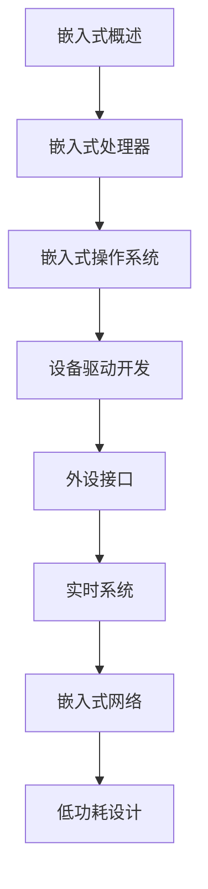

# 嵌入式系统 学习指南

> **分类**：系统底层 ｜ **技术生态**：STM32/NXP, FreeRTOS, Zephyr, Yocto, OpenOCD, logic analyzer

## 领域定位

嵌入式系统将计算能力嵌入设备，受功耗、成本与实时性约束。涵盖 MCU/SoC 选型、RTOS、外设驱动、低功耗设计与现场调试。

面向嵌入式软件工程师与硬件协同开发者，侧重 ARM Cortex-M 与常见 RTOS 生态。

本领域常用技术栈与工具包括：STM32/NXP, FreeRTOS, Zephyr, Yocto, OpenOCD, logic analyzer。

## 学习目标

- 阅读芯片数据手册配置时钟、GPIO、UART/SPI/I2C
- 在 FreeRTOS/Zephyr 上创建任务、队列与信号量
- 设计低功耗模式切换与唤醒源管理
- 使用 JTAG/SWD 与逻辑分析仪进行联调

## 前置知识

- C 语言
- 数字电路基础
- 汇编语言基础
- 操作系统概念

## 学习路径

1. **嵌入式概述**
2. **嵌入式处理器**
3. **嵌入式操作系统**
4. **设备驱动开发**
5. **外设接口**
6. **实时系统**
7. **嵌入式网络**
8. **低功耗设计**

## 模块体系

- **嵌入式概述**
- **嵌入式处理器**
- **嵌入式操作系统**
- **设备驱动开发**
- **外设接口**
- **实时系统**
- **嵌入式网络**
- **低功耗设计**
- **嵌入式调试**
- **嵌入式安全**

## 难度分布

| 入门 | 20 | 20% |
| 实战 | 20 | 20% |
| 进阶 | 30 | 30% |
| 高级 | 30 | 30% |

## 章节索引

### 嵌入式概述

- [嵌入式概述核心概念与原理](chapters/001-嵌入式概述核心概念与原理.md) ｜ 入门
- [嵌入式概述的实现机制详解](chapters/002-嵌入式概述的实现机制详解.md) ｜ 入门
- [嵌入式概述的关键技术点](chapters/003-嵌入式概述的关键技术点.md) ｜ 入门
- [嵌入式概述的源码级分析](chapters/004-嵌入式概述的源码级分析.md) ｜ 入门
- [嵌入式概述的配置与使用](chapters/005-嵌入式概述的配置与使用.md) ｜ 入门
- [嵌入式概述的常见问题与解决方案](chapters/006-嵌入式概述的常见问题与解决方案.md) ｜ 入门
- [嵌入式概述的性能优化技巧](chapters/007-嵌入式概述的性能优化技巧.md) ｜ 入门
- [嵌入式概述的最佳实践指南](chapters/008-嵌入式概述的最佳实践指南.md) ｜ 入门
- [嵌入式概述的高级应用场景](chapters/009-嵌入式概述的高级应用场景.md) ｜ 入门
- [嵌入式概述的实战案例分析](chapters/010-嵌入式概述的实战案例分析.md) ｜ 入门

### 嵌入式处理器

- [嵌入式处理器核心概念与原理](chapters/011-嵌入式处理器核心概念与原理.md) ｜ 入门
- [嵌入式处理器的实现机制详解](chapters/012-嵌入式处理器的实现机制详解.md) ｜ 入门
- [嵌入式处理器的关键技术点](chapters/013-嵌入式处理器的关键技术点.md) ｜ 入门
- [嵌入式处理器的源码级分析](chapters/014-嵌入式处理器的源码级分析.md) ｜ 入门
- [嵌入式处理器的配置与使用](chapters/015-嵌入式处理器的配置与使用.md) ｜ 入门
- [嵌入式处理器的常见问题与解决方案](chapters/016-嵌入式处理器的常见问题与解决方案.md) ｜ 入门
- [嵌入式处理器的性能优化技巧](chapters/017-嵌入式处理器的性能优化技巧.md) ｜ 入门
- [嵌入式处理器的最佳实践指南](chapters/018-嵌入式处理器的最佳实践指南.md) ｜ 入门
- [嵌入式处理器的高级应用场景](chapters/019-嵌入式处理器的高级应用场景.md) ｜ 入门
- [嵌入式处理器的实战案例分析](chapters/020-嵌入式处理器的实战案例分析.md) ｜ 入门

### 嵌入式操作系统

- [嵌入式操作系统核心概念与原理](chapters/021-嵌入式操作系统核心概念与原理.md) ｜ 进阶
- [嵌入式操作系统的实现机制详解](chapters/022-嵌入式操作系统的实现机制详解.md) ｜ 进阶
- [嵌入式操作系统的关键技术点](chapters/023-嵌入式操作系统的关键技术点.md) ｜ 进阶
- [嵌入式操作系统的源码级分析](chapters/024-嵌入式操作系统的源码级分析.md) ｜ 进阶
- [嵌入式操作系统的配置与使用](chapters/025-嵌入式操作系统的配置与使用.md) ｜ 进阶
- [嵌入式操作系统的常见问题与解决方案](chapters/026-嵌入式操作系统的常见问题与解决方案.md) ｜ 进阶
- [嵌入式操作系统的性能优化技巧](chapters/027-嵌入式操作系统的性能优化技巧.md) ｜ 进阶
- [嵌入式操作系统的最佳实践指南](chapters/028-嵌入式操作系统的最佳实践指南.md) ｜ 进阶
- [嵌入式操作系统的高级应用场景](chapters/029-嵌入式操作系统的高级应用场景.md) ｜ 进阶
- [嵌入式操作系统的实战案例分析](chapters/030-嵌入式操作系统的实战案例分析.md) ｜ 进阶

### 设备驱动开发

- [设备驱动开发核心概念与原理](chapters/031-设备驱动开发核心概念与原理.md) ｜ 进阶
- [设备驱动开发的实现机制详解](chapters/032-设备驱动开发的实现机制详解.md) ｜ 进阶
- [设备驱动开发的关键技术点](chapters/033-设备驱动开发的关键技术点.md) ｜ 进阶
- [设备驱动开发的源码级分析](chapters/034-设备驱动开发的源码级分析.md) ｜ 进阶
- [设备驱动开发的配置与使用](chapters/035-设备驱动开发的配置与使用.md) ｜ 进阶
- [设备驱动开发的常见问题与解决方案](chapters/036-设备驱动开发的常见问题与解决方案.md) ｜ 进阶
- [设备驱动开发的性能优化技巧](chapters/037-设备驱动开发的性能优化技巧.md) ｜ 进阶
- [设备驱动开发的最佳实践指南](chapters/038-设备驱动开发的最佳实践指南.md) ｜ 进阶
- [设备驱动开发的高级应用场景](chapters/039-设备驱动开发的高级应用场景.md) ｜ 进阶
- [设备驱动开发的实战案例分析](chapters/040-设备驱动开发的实战案例分析.md) ｜ 进阶

### 外设接口

- [外设接口核心概念与原理](chapters/041-外设接口核心概念与原理.md) ｜ 进阶
- [外设接口的实现机制详解](chapters/042-外设接口的实现机制详解.md) ｜ 进阶
- [外设接口的关键技术点](chapters/043-外设接口的关键技术点.md) ｜ 进阶
- [外设接口的源码级分析](chapters/044-外设接口的源码级分析.md) ｜ 进阶
- [外设接口的配置与使用](chapters/045-外设接口的配置与使用.md) ｜ 进阶
- [外设接口的常见问题与解决方案](chapters/046-外设接口的常见问题与解决方案.md) ｜ 进阶
- [外设接口的性能优化技巧](chapters/047-外设接口的性能优化技巧.md) ｜ 进阶
- [外设接口的最佳实践指南](chapters/048-外设接口的最佳实践指南.md) ｜ 进阶
- [外设接口的高级应用场景](chapters/049-外设接口的高级应用场景.md) ｜ 进阶
- [外设接口的实战案例分析](chapters/050-外设接口的实战案例分析.md) ｜ 进阶

### 实时系统

- [实时系统核心概念与原理](chapters/051-实时系统核心概念与原理.md) ｜ 高级
- [实时系统的实现机制详解](chapters/052-实时系统的实现机制详解.md) ｜ 高级
- [实时系统的关键技术点](chapters/053-实时系统的关键技术点.md) ｜ 高级
- [实时系统的源码级分析](chapters/054-实时系统的源码级分析.md) ｜ 高级
- [实时系统的配置与使用](chapters/055-实时系统的配置与使用.md) ｜ 高级
- [实时系统的常见问题与解决方案](chapters/056-实时系统的常见问题与解决方案.md) ｜ 高级
- [实时系统的性能优化技巧](chapters/057-实时系统的性能优化技巧.md) ｜ 高级
- [实时系统的最佳实践指南](chapters/058-实时系统的最佳实践指南.md) ｜ 高级
- [实时系统的高级应用场景](chapters/059-实时系统的高级应用场景.md) ｜ 高级
- [实时系统的实战案例分析](chapters/060-实时系统的实战案例分析.md) ｜ 高级

### 嵌入式网络

- [嵌入式网络核心概念与原理](chapters/061-嵌入式网络核心概念与原理.md) ｜ 高级
- [嵌入式网络的实现机制详解](chapters/062-嵌入式网络的实现机制详解.md) ｜ 高级
- [嵌入式网络的关键技术点](chapters/063-嵌入式网络的关键技术点.md) ｜ 高级
- [嵌入式网络的源码级分析](chapters/064-嵌入式网络的源码级分析.md) ｜ 高级
- [嵌入式网络的配置与使用](chapters/065-嵌入式网络的配置与使用.md) ｜ 高级
- [嵌入式网络的常见问题与解决方案](chapters/066-嵌入式网络的常见问题与解决方案.md) ｜ 高级
- [嵌入式网络的性能优化技巧](chapters/067-嵌入式网络的性能优化技巧.md) ｜ 高级
- [嵌入式网络的最佳实践指南](chapters/068-嵌入式网络的最佳实践指南.md) ｜ 高级
- [嵌入式网络的高级应用场景](chapters/069-嵌入式网络的高级应用场景.md) ｜ 高级
- [嵌入式网络的实战案例分析](chapters/070-嵌入式网络的实战案例分析.md) ｜ 高级

### 低功耗设计

- [低功耗设计核心概念与原理](chapters/071-低功耗设计核心概念与原理.md) ｜ 高级
- [低功耗设计的实现机制详解](chapters/072-低功耗设计的实现机制详解.md) ｜ 高级
- [低功耗设计的关键技术点](chapters/073-低功耗设计的关键技术点.md) ｜ 高级
- [低功耗设计的源码级分析](chapters/074-低功耗设计的源码级分析.md) ｜ 高级
- [低功耗设计的配置与使用](chapters/075-低功耗设计的配置与使用.md) ｜ 高级
- [低功耗设计的常见问题与解决方案](chapters/076-低功耗设计的常见问题与解决方案.md) ｜ 高级
- [低功耗设计的性能优化技巧](chapters/077-低功耗设计的性能优化技巧.md) ｜ 高级
- [低功耗设计的最佳实践指南](chapters/078-低功耗设计的最佳实践指南.md) ｜ 高级
- [低功耗设计的高级应用场景](chapters/079-低功耗设计的高级应用场景.md) ｜ 高级
- [低功耗设计的实战案例分析](chapters/080-低功耗设计的实战案例分析.md) ｜ 高级

### 嵌入式调试

- [嵌入式调试核心概念与原理](chapters/081-嵌入式调试核心概念与原理.md) ｜ 实战
- [嵌入式调试的实现机制详解](chapters/082-嵌入式调试的实现机制详解.md) ｜ 实战
- [嵌入式调试的关键技术点](chapters/083-嵌入式调试的关键技术点.md) ｜ 实战
- [嵌入式调试的源码级分析](chapters/084-嵌入式调试的源码级分析.md) ｜ 实战
- [嵌入式调试的配置与使用](chapters/085-嵌入式调试的配置与使用.md) ｜ 实战
- [嵌入式调试的常见问题与解决方案](chapters/086-嵌入式调试的常见问题与解决方案.md) ｜ 实战
- [嵌入式调试的性能优化技巧](chapters/087-嵌入式调试的性能优化技巧.md) ｜ 实战
- [嵌入式调试的最佳实践指南](chapters/088-嵌入式调试的最佳实践指南.md) ｜ 实战
- [嵌入式调试的高级应用场景](chapters/089-嵌入式调试的高级应用场景.md) ｜ 实战
- [嵌入式调试的实战案例分析](chapters/090-嵌入式调试的实战案例分析.md) ｜ 实战

### 嵌入式安全

- [嵌入式安全核心概念与原理](chapters/091-嵌入式安全核心概念与原理.md) ｜ 实战
- [嵌入式安全的实现机制详解](chapters/092-嵌入式安全的实现机制详解.md) ｜ 实战
- [嵌入式安全的关键技术点](chapters/093-嵌入式安全的关键技术点.md) ｜ 实战
- [嵌入式安全的源码级分析](chapters/094-嵌入式安全的源码级分析.md) ｜ 实战
- [嵌入式安全的配置与使用](chapters/095-嵌入式安全的配置与使用.md) ｜ 实战
- [嵌入式安全的常见问题与解决方案](chapters/096-嵌入式安全的常见问题与解决方案.md) ｜ 实战
- [嵌入式安全的性能优化技巧](chapters/097-嵌入式安全的性能优化技巧.md) ｜ 实战
- [嵌入式安全的最佳实践指南](chapters/098-嵌入式安全的最佳实践指南.md) ｜ 实战
- [嵌入式安全的高级应用场景](chapters/099-嵌入式安全的高级应用场景.md) ｜ 实战
- [嵌入式安全的实战案例分析](chapters/100-嵌入式安全的实战案例分析.md) ｜ 实战

---
*领域: 嵌入式系统*