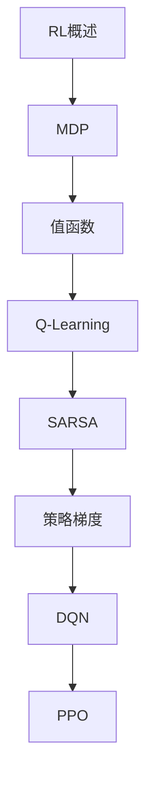

# 强化学习 学习指南

> **分类**：AI与算法 ｜ **技术生态**：OpenAI Gym/Gymnasium, Stable-Baselines3, PyTorch, RLlib

## 领域定位

强化学习通过智能体与环境的交互学习最优策略，以累积奖励最大化为目标。MDP、Q-Learning、策略梯度与 DQN/PPO 是核心算法，广泛应用于游戏 AI 与机器人控制。

面向 AI 研究员，从 MDP 基础到深度强化学习算法。

本领域常用技术栈与工具包括：OpenAI Gym/Gymnasium, Stable-Baselines3, PyTorch, RLlib。

## 学习目标

- 形式化 MDP 并理解值函数与策略
- 实现 Q-Learning、DQN、PPO 等算法
- 使用 OpenAI Gym 进行环境交互实验
- 分析探索-利用权衡与训练稳定性

## 前置知识

- Python
- 概率论
- 机器学习
- 深度学习基础

## 学习路径

1. **RL概述**
2. **MDP**
3. **值函数**
4. **Q-Learning**
5. **SARSA**
6. **策略梯度**
7. **DQN**
8. **PPO**

## 模块体系

- **RL概述**
- **MDP**
- **值函数**
- **Q-Learning**
- **SARSA**
- **策略梯度**
- **DQN**
- **PPO**
- **Actor-Critic**
- **蒙特卡洛**
- **时序差分**
- **多智能体**
- **RL最佳实践**

## 难度分布

| 入门 | 15 | 25% |
| 实战 | 12 | 20% |
| 进阶 | 15 | 25% |
| 高级 | 18 | 30% |

## 章节索引

### RL概述

- [RL概述核心概念与原理](chapters/001-RL概述核心概念与原理.md) ｜ 入门
- [RL概述的实现机制详解](chapters/002-RL概述的实现机制详解.md) ｜ 入门
- [RL概述的关键技术点](chapters/003-RL概述的关键技术点.md) ｜ 入门
- [RL概述的源码级分析](chapters/004-RL概述的源码级分析.md) ｜ 入门
- [RL概述的配置与使用](chapters/005-RL概述的配置与使用.md) ｜ 入门

### MDP

- [MDP核心概念与原理](chapters/006-MDP核心概念与原理.md) ｜ 入门
- [MDP的实现机制详解](chapters/007-MDP的实现机制详解.md) ｜ 入门
- [MDP的关键技术点](chapters/008-MDP的关键技术点.md) ｜ 入门
- [MDP的源码级分析](chapters/009-MDP的源码级分析.md) ｜ 入门
- [MDP的配置与使用](chapters/010-MDP的配置与使用.md) ｜ 入门

### 值函数

- [值函数核心概念与原理](chapters/011-值函数核心概念与原理.md) ｜ 入门
- [值函数的实现机制详解](chapters/012-值函数的实现机制详解.md) ｜ 入门
- [值函数的关键技术点](chapters/013-值函数的关键技术点.md) ｜ 入门
- [值函数的源码级分析](chapters/014-值函数的源码级分析.md) ｜ 入门
- [值函数的配置与使用](chapters/015-值函数的配置与使用.md) ｜ 入门

### Q-Learning

- [Q-Learning核心概念与原理](chapters/016-Q-Learning核心概念与原理.md) ｜ 进阶
- [Q-Learning的实现机制详解](chapters/017-Q-Learning的实现机制详解.md) ｜ 进阶
- [Q-Learning的关键技术点](chapters/018-Q-Learning的关键技术点.md) ｜ 进阶
- [Q-Learning的源码级分析](chapters/019-Q-Learning的源码级分析.md) ｜ 进阶
- [Q-Learning的配置与使用](chapters/020-Q-Learning的配置与使用.md) ｜ 进阶

### SARSA

- [SARSA核心概念与原理](chapters/021-SARSA核心概念与原理.md) ｜ 进阶
- [SARSA的实现机制详解](chapters/022-SARSA的实现机制详解.md) ｜ 进阶
- [SARSA的关键技术点](chapters/023-SARSA的关键技术点.md) ｜ 进阶
- [SARSA的源码级分析](chapters/024-SARSA的源码级分析.md) ｜ 进阶
- [SARSA的配置与使用](chapters/025-SARSA的配置与使用.md) ｜ 进阶

### 策略梯度

- [策略梯度核心概念与原理](chapters/026-策略梯度核心概念与原理.md) ｜ 进阶
- [策略梯度的实现机制详解](chapters/027-策略梯度的实现机制详解.md) ｜ 进阶
- [策略梯度的关键技术点](chapters/028-策略梯度的关键技术点.md) ｜ 进阶
- [策略梯度的源码级分析](chapters/029-策略梯度的源码级分析.md) ｜ 进阶
- [策略梯度的配置与使用](chapters/030-策略梯度的配置与使用.md) ｜ 进阶

### DQN

- [DQN核心概念与原理](chapters/031-DQN核心概念与原理.md) ｜ 高级
- [DQN的实现机制详解](chapters/032-DQN的实现机制详解.md) ｜ 高级
- [DQN的关键技术点](chapters/033-DQN的关键技术点.md) ｜ 高级
- [DQN的源码级分析](chapters/034-DQN的源码级分析.md) ｜ 高级
- [DQN的配置与使用](chapters/035-DQN的配置与使用.md) ｜ 高级

### PPO

- [PPO核心概念与原理](chapters/036-PPO核心概念与原理.md) ｜ 高级
- [PPO的实现机制详解](chapters/037-PPO的实现机制详解.md) ｜ 高级
- [PPO的关键技术点](chapters/038-PPO的关键技术点.md) ｜ 高级
- [PPO的源码级分析](chapters/039-PPO的源码级分析.md) ｜ 高级
- [PPO的配置与使用](chapters/040-PPO的配置与使用.md) ｜ 高级

### Actor-Critic

- [Actor-Critic核心概念与原理](chapters/041-Actor-Critic核心概念与原理.md) ｜ 高级
- [Actor-Critic的实现机制详解](chapters/042-Actor-Critic的实现机制详解.md) ｜ 高级
- [Actor-Critic的关键技术点](chapters/043-Actor-Critic的关键技术点.md) ｜ 高级
- [Actor-Critic的源码级分析](chapters/044-Actor-Critic的源码级分析.md) ｜ 高级

### 蒙特卡洛

- [蒙特卡洛核心概念与原理](chapters/045-蒙特卡洛核心概念与原理.md) ｜ 高级
- [蒙特卡洛的实现机制详解](chapters/046-蒙特卡洛的实现机制详解.md) ｜ 高级
- [蒙特卡洛的关键技术点](chapters/047-蒙特卡洛的关键技术点.md) ｜ 高级
- [蒙特卡洛的源码级分析](chapters/048-蒙特卡洛的源码级分析.md) ｜ 高级

### 时序差分

- [时序差分核心概念与原理](chapters/049-时序差分核心概念与原理.md) ｜ 实战
- [时序差分的实现机制详解](chapters/050-时序差分的实现机制详解.md) ｜ 实战
- [时序差分的关键技术点](chapters/051-时序差分的关键技术点.md) ｜ 实战
- [时序差分的源码级分析](chapters/052-时序差分的源码级分析.md) ｜ 实战

### 多智能体

- [多智能体核心概念与原理](chapters/053-多智能体核心概念与原理.md) ｜ 实战
- [多智能体的实现机制详解](chapters/054-多智能体的实现机制详解.md) ｜ 实战
- [多智能体的关键技术点](chapters/055-多智能体的关键技术点.md) ｜ 实战
- [多智能体的源码级分析](chapters/056-多智能体的源码级分析.md) ｜ 实战

### RL最佳实践

- [RL最佳实践核心概念与原理](chapters/057-RL最佳实践核心概念与原理.md) ｜ 实战
- [RL最佳实践的实现机制详解](chapters/058-RL最佳实践的实现机制详解.md) ｜ 实战
- [RL最佳实践的关键技术点](chapters/059-RL最佳实践的关键技术点.md) ｜ 实战
- [RL最佳实践的源码级分析](chapters/060-RL最佳实践的源码级分析.md) ｜ 实战

---
*领域: 强化学习*