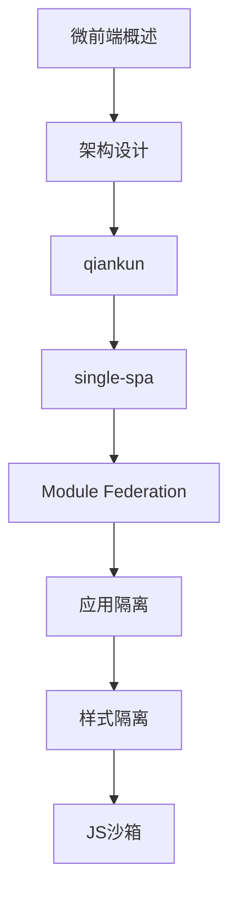

# 微前端 学习指南

> **分类**：前端开发 ｜ **技术生态**：qiankun、single-spa、Module Federation、Garfish

## 领域定位

微前端拆分单体前端为可独立部署子应用。qiankun、single-spa、Module Federation 是主流方案。

架构设计、隔离沙箱、通信路由、生命周期、部署与性能优化。

本领域常用技术栈与工具包括：qiankun、single-spa、Module Federation、Garfish。

## 学习目标

- 评估微前端场景
- qiankun/MF 集成
- 样式沙箱通信
- 路由分发统一部署

## 前置知识

- React/Vue
- Webpack/Vite
- 路由状态管理

## 学习路径

1. **微前端概述**
2. **架构设计**
3. **qiankun**
4. **single-spa**
5. **Module Federation**
6. **应用隔离**
7. **样式隔离**
8. **JS沙箱**

## 模块体系

- **微前端概述**
- **架构设计**
- **qiankun**
- **single-spa**
- **Module Federation**
- **应用隔离**
- **样式隔离**
- **JS沙箱**
- **通信机制**
- **路由分发**
- **生命周期**
- **部署**
- **性能优化**
- **微前端最佳实践**

## 难度分布

| 入门 | 18 | 22% |
| 实战 | 15 | 18% |
| 进阶 | 24 | 30% |
| 高级 | 23 | 28% |

## 章节索引

### 微前端概述

- [微前端概述核心概念与原理](chapters/001-微前端概述核心概念与原理.md) ｜ 入门
- [微前端概述的实现机制详解](chapters/002-微前端概述的实现机制详解.md) ｜ 入门
- [微前端概述的关键技术点](chapters/003-微前端概述的关键技术点.md) ｜ 入门
- [微前端概述的源码级分析](chapters/004-微前端概述的源码级分析.md) ｜ 入门
- [微前端概述的配置与使用](chapters/005-微前端概述的配置与使用.md) ｜ 入门
- [微前端概述的常见问题与解决方案](chapters/006-微前端概述的常见问题与解决方案.md) ｜ 入门

### 架构设计

- [架构设计核心概念与原理](chapters/007-架构设计核心概念与原理.md) ｜ 入门
- [架构设计的实现机制详解](chapters/008-架构设计的实现机制详解.md) ｜ 入门
- [架构设计的关键技术点](chapters/009-架构设计的关键技术点.md) ｜ 入门
- [架构设计的源码级分析](chapters/010-架构设计的源码级分析.md) ｜ 入门
- [架构设计的配置与使用](chapters/011-架构设计的配置与使用.md) ｜ 入门
- [架构设计的常见问题与解决方案](chapters/012-架构设计的常见问题与解决方案.md) ｜ 入门

### qiankun

- [qiankun核心概念与原理](chapters/013-qiankun核心概念与原理.md) ｜ 入门
- [qiankun的实现机制详解](chapters/014-qiankun的实现机制详解.md) ｜ 入门
- [qiankun的关键技术点](chapters/015-qiankun的关键技术点.md) ｜ 入门
- [qiankun的源码级分析](chapters/016-qiankun的源码级分析.md) ｜ 入门
- [qiankun的配置与使用](chapters/017-qiankun的配置与使用.md) ｜ 入门
- [qiankun的常见问题与解决方案](chapters/018-qiankun的常见问题与解决方案.md) ｜ 入门

### single-spa

- [single-spa核心概念与原理](chapters/019-single-spa核心概念与原理.md) ｜ 进阶
- [single-spa的实现机制详解](chapters/020-single-spa的实现机制详解.md) ｜ 进阶
- [single-spa的关键技术点](chapters/021-single-spa的关键技术点.md) ｜ 进阶
- [single-spa的源码级分析](chapters/022-single-spa的源码级分析.md) ｜ 进阶
- [single-spa的配置与使用](chapters/023-single-spa的配置与使用.md) ｜ 进阶
- [single-spa的常见问题与解决方案](chapters/024-single-spa的常见问题与解决方案.md) ｜ 进阶

### Module Federation

- [Module Federation核心概念与原理](chapters/025-Module-Federation核心概念与原理.md) ｜ 进阶
- [Module Federation的实现机制详解](chapters/026-Module-Federation的实现机制详解.md) ｜ 进阶
- [Module Federation的关键技术点](chapters/027-Module-Federation的关键技术点.md) ｜ 进阶
- [Module Federation的源码级分析](chapters/028-Module-Federation的源码级分析.md) ｜ 进阶
- [Module Federation的配置与使用](chapters/029-Module-Federation的配置与使用.md) ｜ 进阶
- [Module Federation的常见问题与解决方案](chapters/030-Module-Federation的常见问题与解决方案.md) ｜ 进阶

### 应用隔离

- [应用隔离核心概念与原理](chapters/031-应用隔离核心概念与原理.md) ｜ 进阶
- [应用隔离的实现机制详解](chapters/032-应用隔离的实现机制详解.md) ｜ 进阶
- [应用隔离的关键技术点](chapters/033-应用隔离的关键技术点.md) ｜ 进阶
- [应用隔离的源码级分析](chapters/034-应用隔离的源码级分析.md) ｜ 进阶
- [应用隔离的配置与使用](chapters/035-应用隔离的配置与使用.md) ｜ 进阶
- [应用隔离的常见问题与解决方案](chapters/036-应用隔离的常见问题与解决方案.md) ｜ 进阶

### 样式隔离

- [样式隔离核心概念与原理](chapters/037-样式隔离核心概念与原理.md) ｜ 进阶
- [样式隔离的实现机制详解](chapters/038-样式隔离的实现机制详解.md) ｜ 进阶
- [样式隔离的关键技术点](chapters/039-样式隔离的关键技术点.md) ｜ 进阶
- [样式隔离的源码级分析](chapters/040-样式隔离的源码级分析.md) ｜ 进阶
- [样式隔离的配置与使用](chapters/041-样式隔离的配置与使用.md) ｜ 进阶
- [样式隔离的常见问题与解决方案](chapters/042-样式隔离的常见问题与解决方案.md) ｜ 进阶

### JS沙箱

- [JS沙箱核心概念与原理](chapters/043-JS沙箱核心概念与原理.md) ｜ 高级
- [JS沙箱的实现机制详解](chapters/044-JS沙箱的实现机制详解.md) ｜ 高级
- [JS沙箱的关键技术点](chapters/045-JS沙箱的关键技术点.md) ｜ 高级
- [JS沙箱的源码级分析](chapters/046-JS沙箱的源码级分析.md) ｜ 高级
- [JS沙箱的配置与使用](chapters/047-JS沙箱的配置与使用.md) ｜ 高级
- [JS沙箱的常见问题与解决方案](chapters/048-JS沙箱的常见问题与解决方案.md) ｜ 高级

### 通信机制

- [通信机制核心概念与原理](chapters/049-通信机制核心概念与原理.md) ｜ 高级
- [通信机制的实现机制详解](chapters/050-通信机制的实现机制详解.md) ｜ 高级
- [通信机制的关键技术点](chapters/051-通信机制的关键技术点.md) ｜ 高级
- [通信机制的源码级分析](chapters/052-通信机制的源码级分析.md) ｜ 高级
- [通信机制的配置与使用](chapters/053-通信机制的配置与使用.md) ｜ 高级
- [通信机制的常见问题与解决方案](chapters/054-通信机制的常见问题与解决方案.md) ｜ 高级

### 路由分发

- [路由分发核心概念与原理](chapters/055-路由分发核心概念与原理.md) ｜ 高级
- [路由分发的实现机制详解](chapters/056-路由分发的实现机制详解.md) ｜ 高级
- [路由分发的关键技术点](chapters/057-路由分发的关键技术点.md) ｜ 高级
- [路由分发的源码级分析](chapters/058-路由分发的源码级分析.md) ｜ 高级
- [路由分发的配置与使用](chapters/059-路由分发的配置与使用.md) ｜ 高级
- [路由分发的常见问题与解决方案](chapters/060-路由分发的常见问题与解决方案.md) ｜ 高级

### 生命周期

- [生命周期核心概念与原理](chapters/061-生命周期核心概念与原理.md) ｜ 高级
- [生命周期的实现机制详解](chapters/062-生命周期的实现机制详解.md) ｜ 高级
- [生命周期的关键技术点](chapters/063-生命周期的关键技术点.md) ｜ 高级
- [生命周期的源码级分析](chapters/064-生命周期的源码级分析.md) ｜ 高级
- [生命周期的配置与使用](chapters/065-生命周期的配置与使用.md) ｜ 高级

### 部署

- [部署核心概念与原理](chapters/066-部署核心概念与原理.md) ｜ 实战
- [部署的实现机制详解](chapters/067-部署的实现机制详解.md) ｜ 实战
- [部署的关键技术点](chapters/068-部署的关键技术点.md) ｜ 实战
- [部署的源码级分析](chapters/069-部署的源码级分析.md) ｜ 实战
- [部署的配置与使用](chapters/070-部署的配置与使用.md) ｜ 实战

### 性能优化

- [性能优化核心概念与原理](chapters/071-性能优化核心概念与原理.md) ｜ 实战
- [性能优化的实现机制详解](chapters/072-性能优化的实现机制详解.md) ｜ 实战
- [性能优化的关键技术点](chapters/073-性能优化的关键技术点.md) ｜ 实战
- [性能优化的源码级分析](chapters/074-性能优化的源码级分析.md) ｜ 实战
- [性能优化的配置与使用](chapters/075-性能优化的配置与使用.md) ｜ 实战

### 微前端最佳实践

- [微前端最佳实践核心概念与原理](chapters/076-微前端最佳实践核心概念与原理.md) ｜ 实战
- [微前端最佳实践的实现机制详解](chapters/077-微前端最佳实践的实现机制详解.md) ｜ 实战
- [微前端最佳实践的关键技术点](chapters/078-微前端最佳实践的关键技术点.md) ｜ 实战
- [微前端最佳实践的源码级分析](chapters/079-微前端最佳实践的源码级分析.md) ｜ 实战
- [微前端最佳实践的配置与使用](chapters/080-微前端最佳实践的配置与使用.md) ｜ 实战

---
*领域: 微前端*