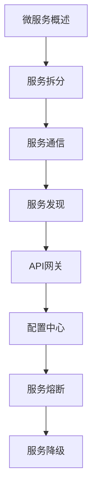

# 微服务架构 学习指南

> **分类**：后端开发 ｜ **章节总数**：120 ｜ **技术栈**：微服务

## 领域概述

微服务架构是后端开发领域的重要技术方向，本系列从基础到高级逐步深入，涵盖17个核心模块：微服务概述、服务拆分、服务通信、服务发现、API网关等。每个知识点作为独立章节，包含原理讲解、实现要点、常见陷阱和最佳实践，配合源码分析和架构图，帮助读者建立完整的微服务架构知识体系。

本教程基于 **多语言** 与 **微服务** 生态编写，涵盖 Spring Cloud, Istio, Consul 等主流工具与框架。每章独立成篇，文字精炼、逻辑清晰，适合系统学习与按需查阅。

## 你将学到什么

完成本系列后，你将能够：

- 系统理解 **微服务架构** 的核心概念与模块划分。
- 按难度递进掌握从入门到实战的完整知识路径。
- 在工程实践中做出合理的技术判断与问题排查。
- 通过章节索引快速定位所需知识点。

## 前置知识

- 编程基础
- 数据结构
- 计算机基础
- 后端开发基础概念

## 推荐学习路径

1. **微服务概述**
2. **服务拆分**
3. **服务通信**
4. **服务发现**
5. **API网关**
6. **配置中心**
7. **服务熔断**
8. **服务降级**

## 模块体系

本领域按以下模块组织，难度由浅入深：

- **微服务概述**
- **服务拆分**
- **服务通信**
- **服务发现**
- **API网关**
- **配置中心**
- **服务熔断**
- **服务降级**
- **限流**
- **分布式事务**
- **链路追踪**
- **日志聚合**
- **监控告警**
- **容器化部署**
- **服务网格**
- **微服务测试**
- **微服务最佳实践**

## 难度分布

| 难度 | 章节数 | 占比 |
|------|--------|------|
| 入门 | 29 | 24% |
| 实战 | 28 | 23% |
| 进阶 | 28 | 23% |
| 高级 | 35 | 29% |

## 章节索引

点击章节标题进入对应教程：

### 微服务概述

- [微服务概述核心概念与原理](chapters/001-微服务概述核心概念与原理.md) ｜ 入门
- [微服务概述的实现机制详解](chapters/002-微服务概述的实现机制详解.md) ｜ 入门
- [微服务概述的关键技术点](chapters/003-微服务概述的关键技术点.md) ｜ 入门
- [微服务概述的源码级分析](chapters/004-微服务概述的源码级分析.md) ｜ 入门
- [微服务概述的配置与使用](chapters/005-微服务概述的配置与使用.md) ｜ 入门
- [微服务概述的常见问题与解决方案](chapters/006-微服务概述的常见问题与解决方案.md) ｜ 入门
- [微服务概述的性能优化技巧](chapters/007-微服务概述的性能优化技巧.md) ｜ 入门
- [微服务概述的最佳实践指南](chapters/008-微服务概述的最佳实践指南.md) ｜ 入门

### 服务拆分

- [服务拆分核心概念与原理](chapters/009-服务拆分核心概念与原理.md) ｜ 入门
- [服务拆分的实现机制详解](chapters/010-服务拆分的实现机制详解.md) ｜ 入门
- [服务拆分的关键技术点](chapters/011-服务拆分的关键技术点.md) ｜ 入门
- [服务拆分的源码级分析](chapters/012-服务拆分的源码级分析.md) ｜ 入门
- [服务拆分的配置与使用](chapters/013-服务拆分的配置与使用.md) ｜ 入门
- [服务拆分的常见问题与解决方案](chapters/014-服务拆分的常见问题与解决方案.md) ｜ 入门
- [服务拆分的性能优化技巧](chapters/015-服务拆分的性能优化技巧.md) ｜ 入门

### 服务通信

- [服务通信核心概念与原理](chapters/016-服务通信核心概念与原理.md) ｜ 入门
- [服务通信的实现机制详解](chapters/017-服务通信的实现机制详解.md) ｜ 入门
- [服务通信的关键技术点](chapters/018-服务通信的关键技术点.md) ｜ 入门
- [服务通信的源码级分析](chapters/019-服务通信的源码级分析.md) ｜ 入门
- [服务通信的配置与使用](chapters/020-服务通信的配置与使用.md) ｜ 入门
- [服务通信的常见问题与解决方案](chapters/021-服务通信的常见问题与解决方案.md) ｜ 入门
- [服务通信的性能优化技巧](chapters/022-服务通信的性能优化技巧.md) ｜ 入门

### 服务发现

- [服务发现核心概念与原理](chapters/023-服务发现核心概念与原理.md) ｜ 入门
- [服务发现的实现机制详解](chapters/024-服务发现的实现机制详解.md) ｜ 入门
- [服务发现的关键技术点](chapters/025-服务发现的关键技术点.md) ｜ 入门
- [服务发现的源码级分析](chapters/026-服务发现的源码级分析.md) ｜ 入门
- [服务发现的配置与使用](chapters/027-服务发现的配置与使用.md) ｜ 入门
- [服务发现的常见问题与解决方案](chapters/028-服务发现的常见问题与解决方案.md) ｜ 入门
- [服务发现的性能优化技巧](chapters/029-服务发现的性能优化技巧.md) ｜ 入门

### API网关

- [API网关核心概念与原理](chapters/030-API网关核心概念与原理.md) ｜ 进阶
- [API网关的实现机制详解](chapters/031-API网关的实现机制详解.md) ｜ 进阶
- [API网关的关键技术点](chapters/032-API网关的关键技术点.md) ｜ 进阶
- [API网关的源码级分析](chapters/033-API网关的源码级分析.md) ｜ 进阶
- [API网关的配置与使用](chapters/034-API网关的配置与使用.md) ｜ 进阶
- [API网关的常见问题与解决方案](chapters/035-API网关的常见问题与解决方案.md) ｜ 进阶
- [API网关的性能优化技巧](chapters/036-API网关的性能优化技巧.md) ｜ 进阶

### 配置中心

- [配置中心核心概念与原理](chapters/037-配置中心核心概念与原理.md) ｜ 进阶
- [配置中心的实现机制详解](chapters/038-配置中心的实现机制详解.md) ｜ 进阶
- [配置中心的关键技术点](chapters/039-配置中心的关键技术点.md) ｜ 进阶
- [配置中心的源码级分析](chapters/040-配置中心的源码级分析.md) ｜ 进阶
- [配置中心的配置与使用](chapters/041-配置中心的配置与使用.md) ｜ 进阶
- [配置中心的常见问题与解决方案](chapters/042-配置中心的常见问题与解决方案.md) ｜ 进阶
- [配置中心的性能优化技巧](chapters/043-配置中心的性能优化技巧.md) ｜ 进阶

### 服务熔断

- [服务熔断核心概念与原理](chapters/044-服务熔断核心概念与原理.md) ｜ 进阶
- [服务熔断的实现机制详解](chapters/045-服务熔断的实现机制详解.md) ｜ 进阶
- [服务熔断的关键技术点](chapters/046-服务熔断的关键技术点.md) ｜ 进阶
- [服务熔断的源码级分析](chapters/047-服务熔断的源码级分析.md) ｜ 进阶
- [服务熔断的配置与使用](chapters/048-服务熔断的配置与使用.md) ｜ 进阶
- [服务熔断的常见问题与解决方案](chapters/049-服务熔断的常见问题与解决方案.md) ｜ 进阶
- [服务熔断的性能优化技巧](chapters/050-服务熔断的性能优化技巧.md) ｜ 进阶

### 服务降级

- [服务降级核心概念与原理](chapters/051-服务降级核心概念与原理.md) ｜ 进阶
- [服务降级的实现机制详解](chapters/052-服务降级的实现机制详解.md) ｜ 进阶
- [服务降级的关键技术点](chapters/053-服务降级的关键技术点.md) ｜ 进阶
- [服务降级的源码级分析](chapters/054-服务降级的源码级分析.md) ｜ 进阶
- [服务降级的配置与使用](chapters/055-服务降级的配置与使用.md) ｜ 进阶
- [服务降级的常见问题与解决方案](chapters/056-服务降级的常见问题与解决方案.md) ｜ 进阶
- [服务降级的性能优化技巧](chapters/057-服务降级的性能优化技巧.md) ｜ 进阶

### 限流

- [限流核心概念与原理](chapters/058-限流核心概念与原理.md) ｜ 高级
- [限流的实现机制详解](chapters/059-限流的实现机制详解.md) ｜ 高级
- [限流的关键技术点](chapters/060-限流的关键技术点.md) ｜ 高级
- [限流的源码级分析](chapters/061-限流的源码级分析.md) ｜ 高级
- [限流的配置与使用](chapters/062-限流的配置与使用.md) ｜ 高级
- [限流的常见问题与解决方案](chapters/063-限流的常见问题与解决方案.md) ｜ 高级
- [限流的性能优化技巧](chapters/064-限流的性能优化技巧.md) ｜ 高级

### 分布式事务

- [分布式事务核心概念与原理](chapters/065-分布式事务核心概念与原理.md) ｜ 高级
- [分布式事务的实现机制详解](chapters/066-分布式事务的实现机制详解.md) ｜ 高级
- [分布式事务的关键技术点](chapters/067-分布式事务的关键技术点.md) ｜ 高级
- [分布式事务的源码级分析](chapters/068-分布式事务的源码级分析.md) ｜ 高级
- [分布式事务的配置与使用](chapters/069-分布式事务的配置与使用.md) ｜ 高级
- [分布式事务的常见问题与解决方案](chapters/070-分布式事务的常见问题与解决方案.md) ｜ 高级
- [分布式事务的性能优化技巧](chapters/071-分布式事务的性能优化技巧.md) ｜ 高级

### 链路追踪

- [链路追踪核心概念与原理](chapters/072-链路追踪核心概念与原理.md) ｜ 高级
- [链路追踪的实现机制详解](chapters/073-链路追踪的实现机制详解.md) ｜ 高级
- [链路追踪的关键技术点](chapters/074-链路追踪的关键技术点.md) ｜ 高级
- [链路追踪的源码级分析](chapters/075-链路追踪的源码级分析.md) ｜ 高级
- [链路追踪的配置与使用](chapters/076-链路追踪的配置与使用.md) ｜ 高级
- [链路追踪的常见问题与解决方案](chapters/077-链路追踪的常见问题与解决方案.md) ｜ 高级
- [链路追踪的性能优化技巧](chapters/078-链路追踪的性能优化技巧.md) ｜ 高级

### 日志聚合

- [日志聚合核心概念与原理](chapters/079-日志聚合核心概念与原理.md) ｜ 高级
- [日志聚合的实现机制详解](chapters/080-日志聚合的实现机制详解.md) ｜ 高级
- [日志聚合的关键技术点](chapters/081-日志聚合的关键技术点.md) ｜ 高级
- [日志聚合的源码级分析](chapters/082-日志聚合的源码级分析.md) ｜ 高级
- [日志聚合的配置与使用](chapters/083-日志聚合的配置与使用.md) ｜ 高级
- [日志聚合的常见问题与解决方案](chapters/084-日志聚合的常见问题与解决方案.md) ｜ 高级
- [日志聚合的性能优化技巧](chapters/085-日志聚合的性能优化技巧.md) ｜ 高级

### 监控告警

- [监控告警核心概念与原理](chapters/086-监控告警核心概念与原理.md) ｜ 高级
- [监控告警的实现机制详解](chapters/087-监控告警的实现机制详解.md) ｜ 高级
- [监控告警的关键技术点](chapters/088-监控告警的关键技术点.md) ｜ 高级
- [监控告警的源码级分析](chapters/089-监控告警的源码级分析.md) ｜ 高级
- [监控告警的配置与使用](chapters/090-监控告警的配置与使用.md) ｜ 高级
- [监控告警的常见问题与解决方案](chapters/091-监控告警的常见问题与解决方案.md) ｜ 高级
- [监控告警的性能优化技巧](chapters/092-监控告警的性能优化技巧.md) ｜ 高级

### 容器化部署

- [容器化部署核心概念与原理](chapters/093-容器化部署核心概念与原理.md) ｜ 实战
- [容器化部署的实现机制详解](chapters/094-容器化部署的实现机制详解.md) ｜ 实战
- [容器化部署的关键技术点](chapters/095-容器化部署的关键技术点.md) ｜ 实战
- [容器化部署的源码级分析](chapters/096-容器化部署的源码级分析.md) ｜ 实战
- [容器化部署的配置与使用](chapters/097-容器化部署的配置与使用.md) ｜ 实战
- [容器化部署的常见问题与解决方案](chapters/098-容器化部署的常见问题与解决方案.md) ｜ 实战
- [容器化部署的性能优化技巧](chapters/099-容器化部署的性能优化技巧.md) ｜ 实战

### 服务网格

- [服务网格核心概念与原理](chapters/100-服务网格核心概念与原理.md) ｜ 实战
- [服务网格的实现机制详解](chapters/101-服务网格的实现机制详解.md) ｜ 实战
- [服务网格的关键技术点](chapters/102-服务网格的关键技术点.md) ｜ 实战
- [服务网格的源码级分析](chapters/103-服务网格的源码级分析.md) ｜ 实战
- [服务网格的配置与使用](chapters/104-服务网格的配置与使用.md) ｜ 实战
- [服务网格的常见问题与解决方案](chapters/105-服务网格的常见问题与解决方案.md) ｜ 实战
- [服务网格的性能优化技巧](chapters/106-服务网格的性能优化技巧.md) ｜ 实战

### 微服务测试

- [微服务测试核心概念与原理](chapters/107-微服务测试核心概念与原理.md) ｜ 实战
- [微服务测试的实现机制详解](chapters/108-微服务测试的实现机制详解.md) ｜ 实战
- [微服务测试的关键技术点](chapters/109-微服务测试的关键技术点.md) ｜ 实战
- [微服务测试的源码级分析](chapters/110-微服务测试的源码级分析.md) ｜ 实战
- [微服务测试的配置与使用](chapters/111-微服务测试的配置与使用.md) ｜ 实战
- [微服务测试的常见问题与解决方案](chapters/112-微服务测试的常见问题与解决方案.md) ｜ 实战
- [微服务测试的性能优化技巧](chapters/113-微服务测试的性能优化技巧.md) ｜ 实战

### 微服务最佳实践

- [微服务最佳实践核心概念与原理](chapters/114-微服务最佳实践核心概念与原理.md) ｜ 实战
- [微服务最佳实践的实现机制详解](chapters/115-微服务最佳实践的实现机制详解.md) ｜ 实战
- [微服务最佳实践的关键技术点](chapters/116-微服务最佳实践的关键技术点.md) ｜ 实战
- [微服务最佳实践的源码级分析](chapters/117-微服务最佳实践的源码级分析.md) ｜ 实战
- [微服务最佳实践的配置与使用](chapters/118-微服务最佳实践的配置与使用.md) ｜ 实战
- [微服务最佳实践的常见问题与解决方案](chapters/119-微服务最佳实践的常见问题与解决方案.md) ｜ 实战
- [微服务最佳实践的性能优化技巧](chapters/120-微服务最佳实践的性能优化技巧.md) ｜ 实战

## 学习方法建议

1. **先读概述再读章节**：用本指南建立全局地图，避免迷失在细节中。
2. **按模块递进**：同一模块内章节有前后关联，顺序阅读效果更好。
3. **主动复述**：每章读完后，用三五句话概括「是什么、为什么、怎么用」。
4. **关联阅读**：利用章节底部的「延伸学习」在同模块内构建知识网络。
5. **对照官方文档**：本教程提供结构化视角，细节以官方文档为准。

---
*领域: 微服务架构 ｜ 版本: 2.0 ｜ 共 120 章*