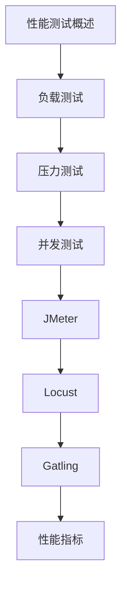

# 性能测试 学习指南

> **分类**：后端开发 ｜ **章节总数**：80 ｜ **技术栈**：性能测试

## 领域概述

性能测试是后端开发领域的重要技术方向，本系列从基础到高级逐步深入，涵盖12个核心模块：性能测试概述、负载测试、压力测试、并发测试、JMeter等。每个知识点作为独立章节，包含原理讲解、实现要点、常见陷阱和最佳实践，配合源码分析和架构图，帮助读者建立完整的性能测试知识体系。

本教程基于 **通用** 与 **性能测试** 生态编写，涵盖 行业标准工具链 等主流工具与框架。每章独立成篇，文字精炼、逻辑清晰，适合系统学习与按需查阅。

## 你将学到什么

完成本系列后，你将能够：

- 系统理解 **性能测试** 的核心概念与模块划分。
- 按难度递进掌握从入门到实战的完整知识路径。
- 在工程实践中做出合理的技术判断与问题排查。
- 通过章节索引快速定位所需知识点。

## 前置知识

- 编程基础
- 数据结构
- 计算机基础
- 后端开发基础概念

## 推荐学习路径

1. **性能测试概述**
2. **负载测试**
3. **压力测试**
4. **并发测试**
5. **JMeter**
6. **Locust**
7. **Gatling**
8. **性能指标**

## 模块体系

本领域按以下模块组织，难度由浅入深：

- **性能测试概述**
- **负载测试**
- **压力测试**
- **并发测试**
- **JMeter**
- **Locust**
- **Gatling**
- **性能指标**
- **性能分析**
- **性能调优**
- **瓶颈定位**
- **性能测试最佳实践**

## 难度分布

| 难度 | 章节数 | 占比 |
|------|--------|------|
| 入门 | 21 | 26% |
| 实战 | 18 | 22% |
| 进阶 | 21 | 26% |
| 高级 | 20 | 25% |

## 章节索引

点击章节标题进入对应教程：

### 性能测试概述

- [性能测试概述核心概念与原理](chapters/001-性能测试概述核心概念与原理.md) ｜ 入门
- [性能测试概述的实现机制详解](chapters/002-性能测试概述的实现机制详解.md) ｜ 入门
- [性能测试概述的关键技术点](chapters/003-性能测试概述的关键技术点.md) ｜ 入门
- [性能测试概述的源码级分析](chapters/004-性能测试概述的源码级分析.md) ｜ 入门
- [性能测试概述的配置与使用](chapters/005-性能测试概述的配置与使用.md) ｜ 入门
- [性能测试概述的常见问题与解决方案](chapters/006-性能测试概述的常见问题与解决方案.md) ｜ 入门
- [性能测试概述的性能优化技巧](chapters/007-性能测试概述的性能优化技巧.md) ｜ 入门

### 负载测试

- [负载测试核心概念与原理](chapters/008-负载测试核心概念与原理.md) ｜ 入门
- [负载测试的实现机制详解](chapters/009-负载测试的实现机制详解.md) ｜ 入门
- [负载测试的关键技术点](chapters/010-负载测试的关键技术点.md) ｜ 入门
- [负载测试的源码级分析](chapters/011-负载测试的源码级分析.md) ｜ 入门
- [负载测试的配置与使用](chapters/012-负载测试的配置与使用.md) ｜ 入门
- [负载测试的常见问题与解决方案](chapters/013-负载测试的常见问题与解决方案.md) ｜ 入门
- [负载测试的性能优化技巧](chapters/014-负载测试的性能优化技巧.md) ｜ 入门

### 压力测试

- [压力测试核心概念与原理](chapters/015-压力测试核心概念与原理.md) ｜ 入门
- [压力测试的实现机制详解](chapters/016-压力测试的实现机制详解.md) ｜ 入门
- [压力测试的关键技术点](chapters/017-压力测试的关键技术点.md) ｜ 入门
- [压力测试的源码级分析](chapters/018-压力测试的源码级分析.md) ｜ 入门
- [压力测试的配置与使用](chapters/019-压力测试的配置与使用.md) ｜ 入门
- [压力测试的常见问题与解决方案](chapters/020-压力测试的常见问题与解决方案.md) ｜ 入门
- [压力测试的性能优化技巧](chapters/021-压力测试的性能优化技巧.md) ｜ 入门

### 并发测试

- [并发测试核心概念与原理](chapters/022-并发测试核心概念与原理.md) ｜ 进阶
- [并发测试的实现机制详解](chapters/023-并发测试的实现机制详解.md) ｜ 进阶
- [并发测试的关键技术点](chapters/024-并发测试的关键技术点.md) ｜ 进阶
- [并发测试的源码级分析](chapters/025-并发测试的源码级分析.md) ｜ 进阶
- [并发测试的配置与使用](chapters/026-并发测试的配置与使用.md) ｜ 进阶
- [并发测试的常见问题与解决方案](chapters/027-并发测试的常见问题与解决方案.md) ｜ 进阶
- [并发测试的性能优化技巧](chapters/028-并发测试的性能优化技巧.md) ｜ 进阶

### JMeter

- [JMeter核心概念与原理](chapters/029-JMeter核心概念与原理.md) ｜ 进阶
- [JMeter的实现机制详解](chapters/030-JMeter的实现机制详解.md) ｜ 进阶
- [JMeter的关键技术点](chapters/031-JMeter的关键技术点.md) ｜ 进阶
- [JMeter的源码级分析](chapters/032-JMeter的源码级分析.md) ｜ 进阶
- [JMeter的配置与使用](chapters/033-JMeter的配置与使用.md) ｜ 进阶
- [JMeter的常见问题与解决方案](chapters/034-JMeter的常见问题与解决方案.md) ｜ 进阶
- [JMeter的性能优化技巧](chapters/035-JMeter的性能优化技巧.md) ｜ 进阶

### Locust

- [Locust核心概念与原理](chapters/036-Locust核心概念与原理.md) ｜ 进阶
- [Locust的实现机制详解](chapters/037-Locust的实现机制详解.md) ｜ 进阶
- [Locust的关键技术点](chapters/038-Locust的关键技术点.md) ｜ 进阶
- [Locust的源码级分析](chapters/039-Locust的源码级分析.md) ｜ 进阶
- [Locust的配置与使用](chapters/040-Locust的配置与使用.md) ｜ 进阶
- [Locust的常见问题与解决方案](chapters/041-Locust的常见问题与解决方案.md) ｜ 进阶
- [Locust的性能优化技巧](chapters/042-Locust的性能优化技巧.md) ｜ 进阶

### Gatling

- [Gatling核心概念与原理](chapters/043-Gatling核心概念与原理.md) ｜ 高级
- [Gatling的实现机制详解](chapters/044-Gatling的实现机制详解.md) ｜ 高级
- [Gatling的关键技术点](chapters/045-Gatling的关键技术点.md) ｜ 高级
- [Gatling的源码级分析](chapters/046-Gatling的源码级分析.md) ｜ 高级
- [Gatling的配置与使用](chapters/047-Gatling的配置与使用.md) ｜ 高级
- [Gatling的常见问题与解决方案](chapters/048-Gatling的常见问题与解决方案.md) ｜ 高级
- [Gatling的性能优化技巧](chapters/049-Gatling的性能优化技巧.md) ｜ 高级

### 性能指标

- [性能指标核心概念与原理](chapters/050-性能指标核心概念与原理.md) ｜ 高级
- [性能指标的实现机制详解](chapters/051-性能指标的实现机制详解.md) ｜ 高级
- [性能指标的关键技术点](chapters/052-性能指标的关键技术点.md) ｜ 高级
- [性能指标的源码级分析](chapters/053-性能指标的源码级分析.md) ｜ 高级
- [性能指标的配置与使用](chapters/054-性能指标的配置与使用.md) ｜ 高级
- [性能指标的常见问题与解决方案](chapters/055-性能指标的常见问题与解决方案.md) ｜ 高级
- [性能指标的性能优化技巧](chapters/056-性能指标的性能优化技巧.md) ｜ 高级

### 性能分析

- [性能分析核心概念与原理](chapters/057-性能分析核心概念与原理.md) ｜ 高级
- [性能分析的实现机制详解](chapters/058-性能分析的实现机制详解.md) ｜ 高级
- [性能分析的关键技术点](chapters/059-性能分析的关键技术点.md) ｜ 高级
- [性能分析的源码级分析](chapters/060-性能分析的源码级分析.md) ｜ 高级
- [性能分析的配置与使用](chapters/061-性能分析的配置与使用.md) ｜ 高级
- [性能分析的常见问题与解决方案](chapters/062-性能分析的常见问题与解决方案.md) ｜ 高级

### 性能调优

- [性能调优核心概念与原理](chapters/063-性能调优核心概念与原理.md) ｜ 实战
- [性能调优的实现机制详解](chapters/064-性能调优的实现机制详解.md) ｜ 实战
- [性能调优的关键技术点](chapters/065-性能调优的关键技术点.md) ｜ 实战
- [性能调优的源码级分析](chapters/066-性能调优的源码级分析.md) ｜ 实战
- [性能调优的配置与使用](chapters/067-性能调优的配置与使用.md) ｜ 实战
- [性能调优的常见问题与解决方案](chapters/068-性能调优的常见问题与解决方案.md) ｜ 实战

### 瓶颈定位

- [瓶颈定位核心概念与原理](chapters/069-瓶颈定位核心概念与原理.md) ｜ 实战
- [瓶颈定位的实现机制详解](chapters/070-瓶颈定位的实现机制详解.md) ｜ 实战
- [瓶颈定位的关键技术点](chapters/071-瓶颈定位的关键技术点.md) ｜ 实战
- [瓶颈定位的源码级分析](chapters/072-瓶颈定位的源码级分析.md) ｜ 实战
- [瓶颈定位的配置与使用](chapters/073-瓶颈定位的配置与使用.md) ｜ 实战
- [瓶颈定位的常见问题与解决方案](chapters/074-瓶颈定位的常见问题与解决方案.md) ｜ 实战

### 性能测试最佳实践

- [性能测试最佳实践核心概念与原理](chapters/075-性能测试最佳实践核心概念与原理.md) ｜ 实战
- [性能测试最佳实践的实现机制详解](chapters/076-性能测试最佳实践的实现机制详解.md) ｜ 实战
- [性能测试最佳实践的关键技术点](chapters/077-性能测试最佳实践的关键技术点.md) ｜ 实战
- [性能测试最佳实践的源码级分析](chapters/078-性能测试最佳实践的源码级分析.md) ｜ 实战
- [性能测试最佳实践的配置与使用](chapters/079-性能测试最佳实践的配置与使用.md) ｜ 实战
- [性能测试最佳实践的常见问题与解决方案](chapters/080-性能测试最佳实践的常见问题与解决方案.md) ｜ 实战

## 学习方法建议

1. **先读概述再读章节**：用本指南建立全局地图，避免迷失在细节中。
2. **按模块递进**：同一模块内章节有前后关联，顺序阅读效果更好。
3. **主动复述**：每章读完后，用三五句话概括「是什么、为什么、怎么用」。
4. **关联阅读**：利用章节底部的「延伸学习」在同模块内构建知识网络。
5. **对照官方文档**：本教程提供结构化视角，细节以官方文档为准。

---
*领域: 性能测试 ｜ 版本: 2.0 ｜ 共 80 章*