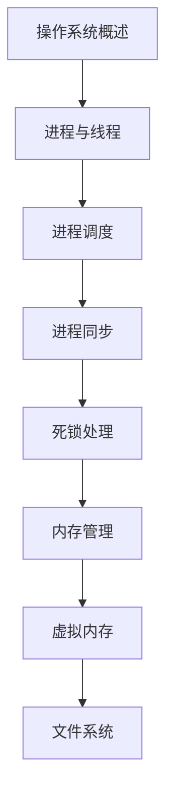

# 操作系统原理 学习指南

> **分类**：系统底层 ｜ **章节总数**：120 ｜ **技术栈**：操作系统原理

## 领域概述

操作系统原理是系统底层领域的重要技术方向，本系列从基础到高级逐步深入，涵盖11个核心模块：操作系统概述、进程与线程、进程调度、进程同步、死锁处理等。每个知识点作为独立章节，包含原理讲解、实现要点、常见陷阱和最佳实践，配合源码分析和架构图，帮助读者建立完整的操作系统原理知识体系。

本教程基于 **通用** 与 **操作系统原理** 生态编写，涵盖 行业标准工具链 等主流工具与框架。每章独立成篇，文字精炼、逻辑清晰，适合系统学习与按需查阅。

## 你将学到什么

完成本系列后，你将能够：

- 系统理解 **操作系统原理** 的核心概念与模块划分。
- 按难度递进掌握从入门到实战的完整知识路径。
- 在工程实践中做出合理的技术判断与问题排查。
- 通过章节索引快速定位所需知识点。

## 前置知识

- 编程基础
- 数据结构
- 计算机基础
- 系统底层基础概念

## 推荐学习路径

1. **操作系统概述**
2. **进程与线程**
3. **进程调度**
4. **进程同步**
5. **死锁处理**
6. **内存管理**
7. **虚拟内存**
8. **文件系统**

## 模块体系

本领域按以下模块组织，难度由浅入深：

- **操作系统概述**
- **进程与线程**
- **进程调度**
- **进程同步**
- **死锁处理**
- **内存管理**
- **虚拟内存**
- **文件系统**
- **IO系统**
- **磁盘调度**
- **安全与保护**

## 难度分布

| 难度 | 章节数 | 占比 |
|------|--------|------|
| 入门 | 22 | 18% |
| 实战 | 32 | 26% |
| 进阶 | 33 | 27% |
| 高级 | 33 | 27% |

## 章节索引

点击章节标题进入对应教程：

### 操作系统概述

- [操作系统概述核心概念与原理](chapters/001-操作系统概述核心概念与原理.md) ｜ 入门
- [操作系统概述的实现机制详解](chapters/002-操作系统概述的实现机制详解.md) ｜ 入门
- [操作系统概述的关键技术点](chapters/003-操作系统概述的关键技术点.md) ｜ 入门
- [操作系统概述的源码级分析](chapters/004-操作系统概述的源码级分析.md) ｜ 入门
- [操作系统概述的配置与使用](chapters/005-操作系统概述的配置与使用.md) ｜ 入门
- [操作系统概述的常见问题与解决方案](chapters/006-操作系统概述的常见问题与解决方案.md) ｜ 入门
- [操作系统概述的性能优化技巧](chapters/007-操作系统概述的性能优化技巧.md) ｜ 入门
- [操作系统概述的最佳实践指南](chapters/008-操作系统概述的最佳实践指南.md) ｜ 入门
- [操作系统概述的高级应用场景](chapters/009-操作系统概述的高级应用场景.md) ｜ 入门
- [操作系统概述的实战案例分析](chapters/010-操作系统概述的实战案例分析.md) ｜ 入门
- [操作系统概述的设计思想与演进](chapters/011-操作系统概述的设计思想与演进.md) ｜ 入门

### 进程与线程

- [进程与线程核心概念与原理](chapters/012-进程与线程核心概念与原理.md) ｜ 入门
- [进程与线程的实现机制详解](chapters/013-进程与线程的实现机制详解.md) ｜ 入门
- [进程与线程的关键技术点](chapters/014-进程与线程的关键技术点.md) ｜ 入门
- [进程与线程的源码级分析](chapters/015-进程与线程的源码级分析.md) ｜ 入门
- [进程与线程的配置与使用](chapters/016-进程与线程的配置与使用.md) ｜ 入门
- [进程与线程的常见问题与解决方案](chapters/017-进程与线程的常见问题与解决方案.md) ｜ 入门
- [进程与线程的性能优化技巧](chapters/018-进程与线程的性能优化技巧.md) ｜ 入门
- [进程与线程的最佳实践指南](chapters/019-进程与线程的最佳实践指南.md) ｜ 入门
- [进程与线程的高级应用场景](chapters/020-进程与线程的高级应用场景.md) ｜ 入门
- [进程与线程的实战案例分析](chapters/021-进程与线程的实战案例分析.md) ｜ 入门
- [进程与线程的设计思想与演进](chapters/022-进程与线程的设计思想与演进.md) ｜ 入门

### 进程调度

- [进程调度核心概念与原理](chapters/023-进程调度核心概念与原理.md) ｜ 进阶
- [进程调度的实现机制详解](chapters/024-进程调度的实现机制详解.md) ｜ 进阶
- [进程调度的关键技术点](chapters/025-进程调度的关键技术点.md) ｜ 进阶
- [进程调度的源码级分析](chapters/026-进程调度的源码级分析.md) ｜ 进阶
- [进程调度的配置与使用](chapters/027-进程调度的配置与使用.md) ｜ 进阶
- [进程调度的常见问题与解决方案](chapters/028-进程调度的常见问题与解决方案.md) ｜ 进阶
- [进程调度的性能优化技巧](chapters/029-进程调度的性能优化技巧.md) ｜ 进阶
- [进程调度的最佳实践指南](chapters/030-进程调度的最佳实践指南.md) ｜ 进阶
- [进程调度的高级应用场景](chapters/031-进程调度的高级应用场景.md) ｜ 进阶
- [进程调度的实战案例分析](chapters/032-进程调度的实战案例分析.md) ｜ 进阶
- [进程调度的设计思想与演进](chapters/033-进程调度的设计思想与演进.md) ｜ 进阶

### 进程同步

- [进程同步核心概念与原理](chapters/034-进程同步核心概念与原理.md) ｜ 进阶
- [进程同步的实现机制详解](chapters/035-进程同步的实现机制详解.md) ｜ 进阶
- [进程同步的关键技术点](chapters/036-进程同步的关键技术点.md) ｜ 进阶
- [进程同步的源码级分析](chapters/037-进程同步的源码级分析.md) ｜ 进阶
- [进程同步的配置与使用](chapters/038-进程同步的配置与使用.md) ｜ 进阶
- [进程同步的常见问题与解决方案](chapters/039-进程同步的常见问题与解决方案.md) ｜ 进阶
- [进程同步的性能优化技巧](chapters/040-进程同步的性能优化技巧.md) ｜ 进阶
- [进程同步的最佳实践指南](chapters/041-进程同步的最佳实践指南.md) ｜ 进阶
- [进程同步的高级应用场景](chapters/042-进程同步的高级应用场景.md) ｜ 进阶
- [进程同步的实战案例分析](chapters/043-进程同步的实战案例分析.md) ｜ 进阶
- [进程同步的设计思想与演进](chapters/044-进程同步的设计思想与演进.md) ｜ 进阶

### 死锁处理

- [死锁处理核心概念与原理](chapters/045-死锁处理核心概念与原理.md) ｜ 进阶
- [死锁处理的实现机制详解](chapters/046-死锁处理的实现机制详解.md) ｜ 进阶
- [死锁处理的关键技术点](chapters/047-死锁处理的关键技术点.md) ｜ 进阶
- [死锁处理的源码级分析](chapters/048-死锁处理的源码级分析.md) ｜ 进阶
- [死锁处理的配置与使用](chapters/049-死锁处理的配置与使用.md) ｜ 进阶
- [死锁处理的常见问题与解决方案](chapters/050-死锁处理的常见问题与解决方案.md) ｜ 进阶
- [死锁处理的性能优化技巧](chapters/051-死锁处理的性能优化技巧.md) ｜ 进阶
- [死锁处理的最佳实践指南](chapters/052-死锁处理的最佳实践指南.md) ｜ 进阶
- [死锁处理的高级应用场景](chapters/053-死锁处理的高级应用场景.md) ｜ 进阶
- [死锁处理的实战案例分析](chapters/054-死锁处理的实战案例分析.md) ｜ 进阶
- [死锁处理的设计思想与演进](chapters/055-死锁处理的设计思想与演进.md) ｜ 进阶

### 内存管理

- [内存管理核心概念与原理](chapters/056-内存管理核心概念与原理.md) ｜ 高级
- [内存管理的实现机制详解](chapters/057-内存管理的实现机制详解.md) ｜ 高级
- [内存管理的关键技术点](chapters/058-内存管理的关键技术点.md) ｜ 高级
- [内存管理的源码级分析](chapters/059-内存管理的源码级分析.md) ｜ 高级
- [内存管理的配置与使用](chapters/060-内存管理的配置与使用.md) ｜ 高级
- [内存管理的常见问题与解决方案](chapters/061-内存管理的常见问题与解决方案.md) ｜ 高级
- [内存管理的性能优化技巧](chapters/062-内存管理的性能优化技巧.md) ｜ 高级
- [内存管理的最佳实践指南](chapters/063-内存管理的最佳实践指南.md) ｜ 高级
- [内存管理的高级应用场景](chapters/064-内存管理的高级应用场景.md) ｜ 高级
- [内存管理的实战案例分析](chapters/065-内存管理的实战案例分析.md) ｜ 高级
- [内存管理的设计思想与演进](chapters/066-内存管理的设计思想与演进.md) ｜ 高级

### 虚拟内存

- [虚拟内存核心概念与原理](chapters/067-虚拟内存核心概念与原理.md) ｜ 高级
- [虚拟内存的实现机制详解](chapters/068-虚拟内存的实现机制详解.md) ｜ 高级
- [虚拟内存的关键技术点](chapters/069-虚拟内存的关键技术点.md) ｜ 高级
- [虚拟内存的源码级分析](chapters/070-虚拟内存的源码级分析.md) ｜ 高级
- [虚拟内存的配置与使用](chapters/071-虚拟内存的配置与使用.md) ｜ 高级
- [虚拟内存的常见问题与解决方案](chapters/072-虚拟内存的常见问题与解决方案.md) ｜ 高级
- [虚拟内存的性能优化技巧](chapters/073-虚拟内存的性能优化技巧.md) ｜ 高级
- [虚拟内存的最佳实践指南](chapters/074-虚拟内存的最佳实践指南.md) ｜ 高级
- [虚拟内存的高级应用场景](chapters/075-虚拟内存的高级应用场景.md) ｜ 高级
- [虚拟内存的实战案例分析](chapters/076-虚拟内存的实战案例分析.md) ｜ 高级
- [虚拟内存的设计思想与演进](chapters/077-虚拟内存的设计思想与演进.md) ｜ 高级

### 文件系统

- [文件系统核心概念与原理](chapters/078-文件系统核心概念与原理.md) ｜ 高级
- [文件系统的实现机制详解](chapters/079-文件系统的实现机制详解.md) ｜ 高级
- [文件系统的关键技术点](chapters/080-文件系统的关键技术点.md) ｜ 高级
- [文件系统的源码级分析](chapters/081-文件系统的源码级分析.md) ｜ 高级
- [文件系统的配置与使用](chapters/082-文件系统的配置与使用.md) ｜ 高级
- [文件系统的常见问题与解决方案](chapters/083-文件系统的常见问题与解决方案.md) ｜ 高级
- [文件系统的性能优化技巧](chapters/084-文件系统的性能优化技巧.md) ｜ 高级
- [文件系统的最佳实践指南](chapters/085-文件系统的最佳实践指南.md) ｜ 高级
- [文件系统的高级应用场景](chapters/086-文件系统的高级应用场景.md) ｜ 高级
- [文件系统的实战案例分析](chapters/087-文件系统的实战案例分析.md) ｜ 高级
- [文件系统的设计思想与演进](chapters/088-文件系统的设计思想与演进.md) ｜ 高级

### IO系统

- [IO系统核心概念与原理](chapters/089-IO系统核心概念与原理.md) ｜ 实战
- [IO系统的实现机制详解](chapters/090-IO系统的实现机制详解.md) ｜ 实战
- [IO系统的关键技术点](chapters/091-IO系统的关键技术点.md) ｜ 实战
- [IO系统的源码级分析](chapters/092-IO系统的源码级分析.md) ｜ 实战
- [IO系统的配置与使用](chapters/093-IO系统的配置与使用.md) ｜ 实战
- [IO系统的常见问题与解决方案](chapters/094-IO系统的常见问题与解决方案.md) ｜ 实战
- [IO系统的性能优化技巧](chapters/095-IO系统的性能优化技巧.md) ｜ 实战
- [IO系统的最佳实践指南](chapters/096-IO系统的最佳实践指南.md) ｜ 实战
- [IO系统的高级应用场景](chapters/097-IO系统的高级应用场景.md) ｜ 实战
- [IO系统的实战案例分析](chapters/098-IO系统的实战案例分析.md) ｜ 实战
- [IO系统的设计思想与演进](chapters/099-IO系统的设计思想与演进.md) ｜ 实战

### 磁盘调度

- [磁盘调度核心概念与原理](chapters/100-磁盘调度核心概念与原理.md) ｜ 实战
- [磁盘调度的实现机制详解](chapters/101-磁盘调度的实现机制详解.md) ｜ 实战
- [磁盘调度的关键技术点](chapters/102-磁盘调度的关键技术点.md) ｜ 实战
- [磁盘调度的源码级分析](chapters/103-磁盘调度的源码级分析.md) ｜ 实战
- [磁盘调度的配置与使用](chapters/104-磁盘调度的配置与使用.md) ｜ 实战
- [磁盘调度的常见问题与解决方案](chapters/105-磁盘调度的常见问题与解决方案.md) ｜ 实战
- [磁盘调度的性能优化技巧](chapters/106-磁盘调度的性能优化技巧.md) ｜ 实战
- [磁盘调度的最佳实践指南](chapters/107-磁盘调度的最佳实践指南.md) ｜ 实战
- [磁盘调度的高级应用场景](chapters/108-磁盘调度的高级应用场景.md) ｜ 实战
- [磁盘调度的实战案例分析](chapters/109-磁盘调度的实战案例分析.md) ｜ 实战
- [磁盘调度的设计思想与演进](chapters/110-磁盘调度的设计思想与演进.md) ｜ 实战

### 安全与保护

- [安全与保护核心概念与原理](chapters/111-安全与保护核心概念与原理.md) ｜ 实战
- [安全与保护的实现机制详解](chapters/112-安全与保护的实现机制详解.md) ｜ 实战
- [安全与保护的关键技术点](chapters/113-安全与保护的关键技术点.md) ｜ 实战
- [安全与保护的源码级分析](chapters/114-安全与保护的源码级分析.md) ｜ 实战
- [安全与保护的配置与使用](chapters/115-安全与保护的配置与使用.md) ｜ 实战
- [安全与保护的常见问题与解决方案](chapters/116-安全与保护的常见问题与解决方案.md) ｜ 实战
- [安全与保护的性能优化技巧](chapters/117-安全与保护的性能优化技巧.md) ｜ 实战
- [安全与保护的最佳实践指南](chapters/118-安全与保护的最佳实践指南.md) ｜ 实战
- [安全与保护的高级应用场景](chapters/119-安全与保护的高级应用场景.md) ｜ 实战
- [安全与保护的实战案例分析](chapters/120-安全与保护的实战案例分析.md) ｜ 实战

## 学习方法建议

1. **先读概述再读章节**：用本指南建立全局地图，避免迷失在细节中。
2. **按模块递进**：同一模块内章节有前后关联，顺序阅读效果更好。
3. **主动复述**：每章读完后，用三五句话概括「是什么、为什么、怎么用」。
4. **关联阅读**：利用章节底部的「延伸学习」在同模块内构建知识网络。
5. **对照官方文档**：本教程提供结构化视角，细节以官方文档为准。

---
*领域: 操作系统原理 ｜ 版本: 2.0 ｜ 共 120 章*