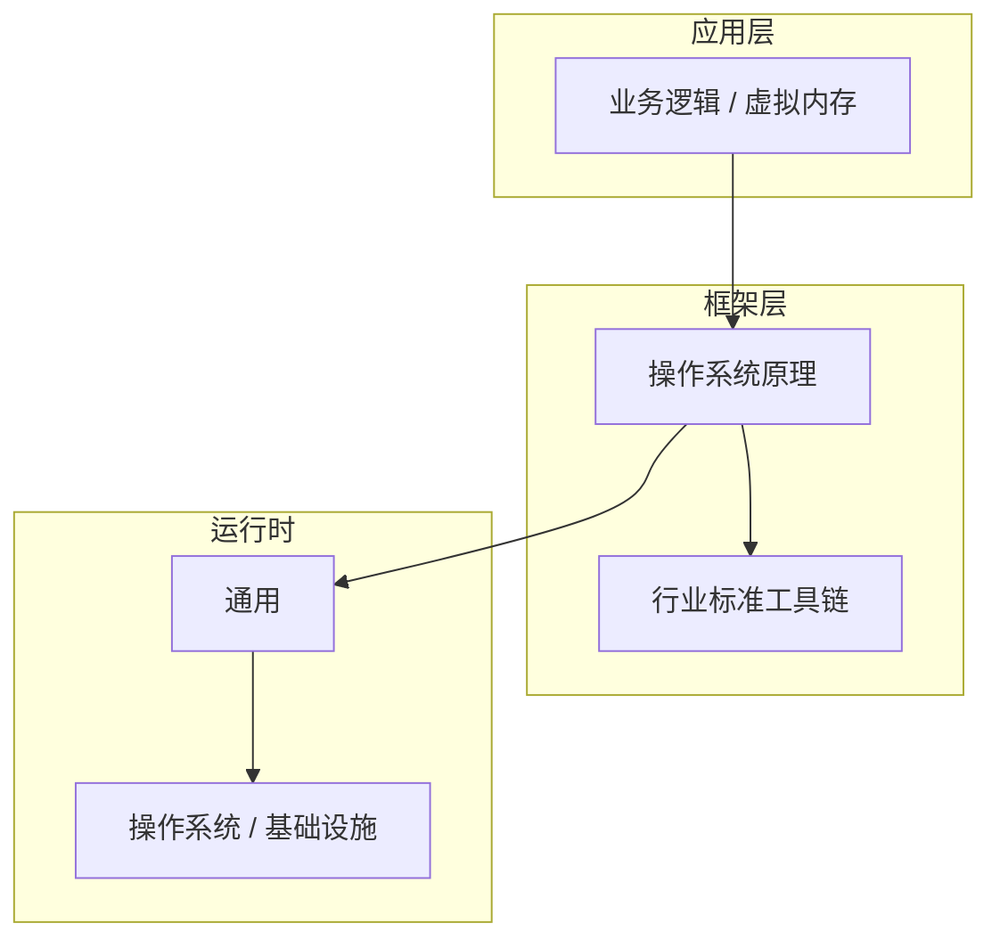

# 虚拟内存的设计思想与演进

> **领域**：操作系统原理 ｜ **模块**：虚拟内存 ｜ **难度**：高级 ｜ **类型**：设计演进

## 导读

本章属于 **操作系统原理** 教程的 **虚拟内存** 模块，难度为 **高级**。阅读重点在于建立清晰的概念模型与工程判断能力，而非死记细节。

## 核心概念

操作系统原理 是当前技术生态中的重要方向，系统学习需兼顾概念、原理与工程实践。

在 **操作系统原理** 体系中，**虚拟内存** 与上下游模块形成协作。技术栈以 **操作系统原理** 为核心（通用），生态包括 行业标准工具链。

虚拟地址经页表映射到物理页。缺页中断加载磁盘页。TLB 加速地址转换。进程隔离依赖独立页表。

### 概念精讲

**虚拟内存的基本概念与定义**

从实践出发：典型应用场景与反模式（不该用的场景）。 在 虚拟内存 语境下，这一点直接影响设计决策与故障排查思路。

**虚拟内存在操作系统原理中的作用与地位**

从演进出发：历史上为何出现、未来可能如何变化。 在 虚拟内存 语境下，这一点直接影响设计决策与故障排查思路。

**虚拟内存的核心数据结构**

从度量出发：如何评估它是否工作正常、性能是否达标。 在 虚拟内存 语境下，这一点直接影响设计决策与故障排查思路。

**虚拟内存的关键算法与流程**

从定义出发：它解决什么问题、不解决什么问题，边界在哪里。 在 虚拟内存 语境下，这一点直接影响设计决策与故障排查思路。

**虚拟内存与其他模块的关系**

从结构出发：核心组成部分是什么，彼此如何协作。 在 虚拟内存 语境下，这一点直接影响设计决策与故障排查思路。

## 架构与流程

以下框图帮助你在宏观层面把握模块协作关系与处理流向：

## 深度讲解

### 设计动机

虚拟内存 解决特定历史阶段的技术痛点。理解「当初为何这样设计」比死记用法更重要。

### 演进脉络

功能优先 → 模块化与自动化 → 云原生与全链路可观测。

### 关注方向

跟踪 操作系统原理 社区技术雷达，生产选型以稳定为先。

### 落地检查清单

- **掌握虚拟内存的常见问题与排查方法**：落地时需明确验收标准与回滚方案。
- **理解虚拟内存的安全注意事项**：落地时需明确验收标准与回滚方案。
- **掌握虚拟内存的调优技巧与最佳实践**：落地时需明确验收标准与回滚方案。
- **了解虚拟内存在实际项目中的应用案例**：落地时需明确验收标准与回滚方案。

### 常见误区与应对

**误区：对虚拟内存的概念理解不深入导致误用**

**应对**：回到官方定义画一张概念图，与同事讲解一遍，确保能用自己的话复述。

**误区：忽略虚拟内存的性能边界与限制条件**

**应对**：用 Profiler 或压测建立基线，对比优化前后数据，避免凭感觉优化。

**误区：虚拟内存配置不当引发的问题**

**应对**：核对环境变量、配置文件与部署清单是否一致，使用配置 diff 工具排查。

**误区：缺乏对虚拟内存底层原理的理解**

**应对**：阅读官方文档与一篇深度文章，结合小实验验证理解。

**误区：虚拟内存与其他模块集成时的兼容性问题**

**应对**：列出依赖版本矩阵，在 CI 中跑集成测试覆盖主要组合。

### 最佳实践

1. **遵循虚拟内存的官方推荐用法与规范** — 落地方式：写入团队 Wiki 并纳入 Code Review 检查项。

2. **在理解原理的基础上合理使用虚拟内存** — 落地方式：配置静态检查或 CI 规则自动拦截违规写法。

3. **建立完善的虚拟内存监控与告警机制** — 落地方式：在新人 onboarding 中作为必修内容讲解。

4. **编写充分的测试用例覆盖虚拟内存的各种场景** — 落地方式：每季度回顾一次，对照社区最佳实践更新。

5. **持续关注虚拟内存的版本更新与最佳实践演进** — 落地方式：用真实项目案例演示正确与错误对比。

### 本章小结

学完本章，你应能：

- 说清 **虚拟内存的设计思想与演进** 在 操作系统原理/虚拟内存 中的定位。
- 描述核心流程与关键概念，能用自己的话复述。
- 识别常见误区并采取预防与排查手段。
- 在项目中做出与场景匹配的工程决策。

类型：**设计演进**。建议完成小练习或复盘笔记，将阅读转化为能力。

## 延伸学习

建议结合以下同模块章节继续阅读，构建完整知识链：

- 虚拟内存的高级应用场景
- 虚拟内存的实战案例分析

### 参考资料

- 操作系统原理官方文档 - 虚拟内存章节
- 《操作系统原理权威指南》相关章节
- 虚拟内存源码实现与注释
- 操作系统原理社区最佳实践文章
- 虚拟内存相关技术博客与教程

---
*章节 ID: 077 ｜ 领域: 操作系统原理 ｜ 版本: 2.0*