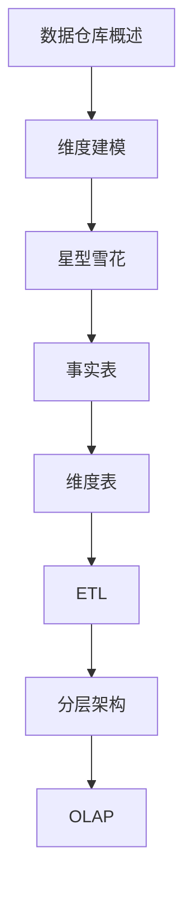

# 数据仓库 学习指南

> **分类**：数据存储 ｜ **技术生态**：Hive、ClickHouse、Apache Doris、dbt、Airflow

## 领域定位

数据仓库面向主题、集成、非易失、时变的数据集合，支撑 BI 与决策。Kimball 维度建模与 Inmon 企业模型是两大流派。

覆盖星型/雪花 schema、事实维度表、分层 ODS/DWD/DWS/ADS 与 OLAP 引擎。

本领域常用技术栈与工具包括：Hive、ClickHouse、Apache Doris、dbt、Airflow。

## 学习目标

- 能设计星型模型与 slowly changing dimension
- 能规划数仓分层
- 能选型 Hive/ClickHouse/Doris
- 能建立指标口径治理

## 前置知识

- SQL
- ETL 概念
- 业务指标基础

## 学习路径

1. **数据仓库概述**
2. **维度建模**
3. **星型雪花**
4. **事实表**
5. **维度表**
6. **ETL**
7. **分层架构**
8. **OLAP**

## 模块体系

- **数据仓库概述**
- **维度建模**
- **星型雪花**
- **事实表**
- **维度表**
- **ETL**
- **分层架构**
- **OLAP**
- **指标体系**
- **数据治理**
- **性能优化**
- **Hive**
- **ClickHouse**
- **Doris**
- **数据仓库最佳实践**

## 难度分布

| 入门 | 18 | 22% |
| 实战 | 15 | 18% |
| 进阶 | 22 | 27% |
| 高级 | 25 | 31% |

## 章节索引

### 数据仓库概述

- [数据仓库概述核心概念与原理](chapters/001-数据仓库概述核心概念与原理.md) ｜ 入门
- [数据仓库概述的实现机制详解](chapters/002-数据仓库概述的实现机制详解.md) ｜ 入门
- [数据仓库概述的关键技术点](chapters/003-数据仓库概述的关键技术点.md) ｜ 入门
- [数据仓库概述的源码级分析](chapters/004-数据仓库概述的源码级分析.md) ｜ 入门
- [数据仓库概述的配置与使用](chapters/005-数据仓库概述的配置与使用.md) ｜ 入门
- [数据仓库概述的常见问题与解决方案](chapters/006-数据仓库概述的常见问题与解决方案.md) ｜ 入门

### 维度建模

- [维度建模核心概念与原理](chapters/007-维度建模核心概念与原理.md) ｜ 入门
- [维度建模的实现机制详解](chapters/008-维度建模的实现机制详解.md) ｜ 入门
- [维度建模的关键技术点](chapters/009-维度建模的关键技术点.md) ｜ 入门
- [维度建模的源码级分析](chapters/010-维度建模的源码级分析.md) ｜ 入门
- [维度建模的配置与使用](chapters/011-维度建模的配置与使用.md) ｜ 入门
- [维度建模的常见问题与解决方案](chapters/012-维度建模的常见问题与解决方案.md) ｜ 入门

### 星型雪花

- [星型雪花核心概念与原理](chapters/013-星型雪花核心概念与原理.md) ｜ 入门
- [星型雪花的实现机制详解](chapters/014-星型雪花的实现机制详解.md) ｜ 入门
- [星型雪花的关键技术点](chapters/015-星型雪花的关键技术点.md) ｜ 入门
- [星型雪花的源码级分析](chapters/016-星型雪花的源码级分析.md) ｜ 入门
- [星型雪花的配置与使用](chapters/017-星型雪花的配置与使用.md) ｜ 入门
- [星型雪花的常见问题与解决方案](chapters/018-星型雪花的常见问题与解决方案.md) ｜ 入门

### 事实表

- [事实表核心概念与原理](chapters/019-事实表核心概念与原理.md) ｜ 进阶
- [事实表的实现机制详解](chapters/020-事实表的实现机制详解.md) ｜ 进阶
- [事实表的关键技术点](chapters/021-事实表的关键技术点.md) ｜ 进阶
- [事实表的源码级分析](chapters/022-事实表的源码级分析.md) ｜ 进阶
- [事实表的配置与使用](chapters/023-事实表的配置与使用.md) ｜ 进阶
- [事实表的常见问题与解决方案](chapters/024-事实表的常见问题与解决方案.md) ｜ 进阶

### 维度表

- [维度表核心概念与原理](chapters/025-维度表核心概念与原理.md) ｜ 进阶
- [维度表的实现机制详解](chapters/026-维度表的实现机制详解.md) ｜ 进阶
- [维度表的关键技术点](chapters/027-维度表的关键技术点.md) ｜ 进阶
- [维度表的源码级分析](chapters/028-维度表的源码级分析.md) ｜ 进阶
- [维度表的配置与使用](chapters/029-维度表的配置与使用.md) ｜ 进阶
- [维度表的常见问题与解决方案](chapters/030-维度表的常见问题与解决方案.md) ｜ 进阶

### ETL

- [ETL核心概念与原理](chapters/031-ETL核心概念与原理.md) ｜ 进阶
- [ETL的实现机制详解](chapters/032-ETL的实现机制详解.md) ｜ 进阶
- [ETL的关键技术点](chapters/033-ETL的关键技术点.md) ｜ 进阶
- [ETL的源码级分析](chapters/034-ETL的源码级分析.md) ｜ 进阶
- [ETL的配置与使用](chapters/035-ETL的配置与使用.md) ｜ 进阶

### 分层架构

- [分层架构核心概念与原理](chapters/036-分层架构核心概念与原理.md) ｜ 进阶
- [分层架构的实现机制详解](chapters/037-分层架构的实现机制详解.md) ｜ 进阶
- [分层架构的关键技术点](chapters/038-分层架构的关键技术点.md) ｜ 进阶
- [分层架构的源码级分析](chapters/039-分层架构的源码级分析.md) ｜ 进阶
- [分层架构的配置与使用](chapters/040-分层架构的配置与使用.md) ｜ 进阶

### OLAP

- [OLAP核心概念与原理](chapters/041-OLAP核心概念与原理.md) ｜ 高级
- [OLAP的实现机制详解](chapters/042-OLAP的实现机制详解.md) ｜ 高级
- [OLAP的关键技术点](chapters/043-OLAP的关键技术点.md) ｜ 高级
- [OLAP的源码级分析](chapters/044-OLAP的源码级分析.md) ｜ 高级
- [OLAP的配置与使用](chapters/045-OLAP的配置与使用.md) ｜ 高级

### 指标体系

- [指标体系核心概念与原理](chapters/046-指标体系核心概念与原理.md) ｜ 高级
- [指标体系的实现机制详解](chapters/047-指标体系的实现机制详解.md) ｜ 高级
- [指标体系的关键技术点](chapters/048-指标体系的关键技术点.md) ｜ 高级
- [指标体系的源码级分析](chapters/049-指标体系的源码级分析.md) ｜ 高级
- [指标体系的配置与使用](chapters/050-指标体系的配置与使用.md) ｜ 高级

### 数据治理

- [数据治理核心概念与原理](chapters/051-数据治理核心概念与原理.md) ｜ 高级
- [数据治理的实现机制详解](chapters/052-数据治理的实现机制详解.md) ｜ 高级
- [数据治理的关键技术点](chapters/053-数据治理的关键技术点.md) ｜ 高级
- [数据治理的源码级分析](chapters/054-数据治理的源码级分析.md) ｜ 高级
- [数据治理的配置与使用](chapters/055-数据治理的配置与使用.md) ｜ 高级

### 性能优化

- [性能优化核心概念与原理](chapters/056-性能优化核心概念与原理.md) ｜ 高级
- [性能优化的实现机制详解](chapters/057-性能优化的实现机制详解.md) ｜ 高级
- [性能优化的关键技术点](chapters/058-性能优化的关键技术点.md) ｜ 高级
- [性能优化的源码级分析](chapters/059-性能优化的源码级分析.md) ｜ 高级
- [性能优化的配置与使用](chapters/060-性能优化的配置与使用.md) ｜ 高级

### Hive

- [Hive核心概念与原理](chapters/061-Hive核心概念与原理.md) ｜ 高级
- [Hive的实现机制详解](chapters/062-Hive的实现机制详解.md) ｜ 高级
- [Hive的关键技术点](chapters/063-Hive的关键技术点.md) ｜ 高级
- [Hive的源码级分析](chapters/064-Hive的源码级分析.md) ｜ 高级
- [Hive的配置与使用](chapters/065-Hive的配置与使用.md) ｜ 高级

### ClickHouse

- [ClickHouse核心概念与原理](chapters/066-ClickHouse核心概念与原理.md) ｜ 实战
- [ClickHouse的实现机制详解](chapters/067-ClickHouse的实现机制详解.md) ｜ 实战
- [ClickHouse的关键技术点](chapters/068-ClickHouse的关键技术点.md) ｜ 实战
- [ClickHouse的源码级分析](chapters/069-ClickHouse的源码级分析.md) ｜ 实战
- [ClickHouse的配置与使用](chapters/070-ClickHouse的配置与使用.md) ｜ 实战

### Doris

- [Doris核心概念与原理](chapters/071-Doris核心概念与原理.md) ｜ 实战
- [Doris的实现机制详解](chapters/072-Doris的实现机制详解.md) ｜ 实战
- [Doris的关键技术点](chapters/073-Doris的关键技术点.md) ｜ 实战
- [Doris的源码级分析](chapters/074-Doris的源码级分析.md) ｜ 实战
- [Doris的配置与使用](chapters/075-Doris的配置与使用.md) ｜ 实战

### 数据仓库最佳实践

- [数据仓库最佳实践核心概念与原理](chapters/076-数据仓库最佳实践核心概念与原理.md) ｜ 实战
- [数据仓库最佳实践的实现机制详解](chapters/077-数据仓库最佳实践的实现机制详解.md) ｜ 实战
- [数据仓库最佳实践的关键技术点](chapters/078-数据仓库最佳实践的关键技术点.md) ｜ 实战
- [数据仓库最佳实践的源码级分析](chapters/079-数据仓库最佳实践的源码级分析.md) ｜ 实战
- [数据仓库最佳实践的配置与使用](chapters/080-数据仓库最佳实践的配置与使用.md) ｜ 实战

---
*领域: 数据仓库*