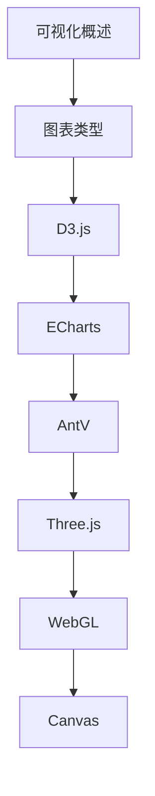

# 数据可视化 学习指南

> **分类**：前端开发 ｜ **章节总数**：100 ｜ **技术栈**：数据可视化

## 领域概述

数据可视化是前端开发领域的重要技术方向，本系列从基础到高级逐步深入，涵盖14个核心模块：可视化概述、图表类型、D3.js、ECharts、AntV等。每个知识点作为独立章节，包含原理讲解、实现要点、常见陷阱和最佳实践，配合源码分析和架构图，帮助读者建立完整的数据可视化知识体系。

本教程基于 **通用** 与 **数据可视化** 生态编写，涵盖 行业标准工具链 等主流工具与框架。每章独立成篇，文字精炼、逻辑清晰，适合系统学习与按需查阅。

## 你将学到什么

完成本系列后，你将能够：

- 系统理解 **数据可视化** 的核心概念与模块划分。
- 按难度递进掌握从入门到实战的完整知识路径。
- 在工程实践中做出合理的技术判断与问题排查。
- 通过章节索引快速定位所需知识点。

## 前置知识

- 编程基础
- 数据结构
- 计算机基础
- 前端开发基础概念

## 推荐学习路径

1. **可视化概述**
2. **图表类型**
3. **D3.js**
4. **ECharts**
5. **AntV**
6. **Three.js**
7. **WebGL**
8. **Canvas**

## 模块体系

本领域按以下模块组织，难度由浅入深：

- **可视化概述**
- **图表类型**
- **D3.js**
- **ECharts**
- **AntV**
- **Three.js**
- **WebGL**
- **Canvas**
- **SVG**
- **地图可视化**
- **大屏可视化**
- **交互设计**
- **性能优化**
- **可视化最佳实践**

## 难度分布

| 难度 | 章节数 | 占比 |
|------|--------|------|
| 入门 | 23 | 23% |
| 实战 | 21 | 21% |
| 进阶 | 28 | 28% |
| 高级 | 28 | 28% |

## 章节索引

点击章节标题进入对应教程：

### 可视化概述

- [可视化概述核心概念与原理](chapters/001-可视化概述核心概念与原理.md) ｜ 入门
- [可视化概述的实现机制详解](chapters/002-可视化概述的实现机制详解.md) ｜ 入门
- [可视化概述的关键技术点](chapters/003-可视化概述的关键技术点.md) ｜ 入门
- [可视化概述的源码级分析](chapters/004-可视化概述的源码级分析.md) ｜ 入门
- [可视化概述的配置与使用](chapters/005-可视化概述的配置与使用.md) ｜ 入门
- [可视化概述的常见问题与解决方案](chapters/006-可视化概述的常见问题与解决方案.md) ｜ 入门
- [可视化概述的性能优化技巧](chapters/007-可视化概述的性能优化技巧.md) ｜ 入门
- [可视化概述的最佳实践指南](chapters/008-可视化概述的最佳实践指南.md) ｜ 入门

### 图表类型

- [图表类型核心概念与原理](chapters/009-图表类型核心概念与原理.md) ｜ 入门
- [图表类型的实现机制详解](chapters/010-图表类型的实现机制详解.md) ｜ 入门
- [图表类型的关键技术点](chapters/011-图表类型的关键技术点.md) ｜ 入门
- [图表类型的源码级分析](chapters/012-图表类型的源码级分析.md) ｜ 入门
- [图表类型的配置与使用](chapters/013-图表类型的配置与使用.md) ｜ 入门
- [图表类型的常见问题与解决方案](chapters/014-图表类型的常见问题与解决方案.md) ｜ 入门
- [图表类型的性能优化技巧](chapters/015-图表类型的性能优化技巧.md) ｜ 入门
- [图表类型的最佳实践指南](chapters/016-图表类型的最佳实践指南.md) ｜ 入门

### D3.js

- [D3.js核心概念与原理](chapters/017-D3.js核心概念与原理.md) ｜ 入门
- [D3.js的实现机制详解](chapters/018-D3.js的实现机制详解.md) ｜ 入门
- [D3.js的关键技术点](chapters/019-D3.js的关键技术点.md) ｜ 入门
- [D3.js的源码级分析](chapters/020-D3.js的源码级分析.md) ｜ 入门
- [D3.js的配置与使用](chapters/021-D3.js的配置与使用.md) ｜ 入门
- [D3.js的常见问题与解决方案](chapters/022-D3.js的常见问题与解决方案.md) ｜ 入门
- [D3.js的性能优化技巧](chapters/023-D3.js的性能优化技巧.md) ｜ 入门

### ECharts

- [ECharts核心概念与原理](chapters/024-ECharts核心概念与原理.md) ｜ 进阶
- [ECharts的实现机制详解](chapters/025-ECharts的实现机制详解.md) ｜ 进阶
- [ECharts的关键技术点](chapters/026-ECharts的关键技术点.md) ｜ 进阶
- [ECharts的源码级分析](chapters/027-ECharts的源码级分析.md) ｜ 进阶
- [ECharts的配置与使用](chapters/028-ECharts的配置与使用.md) ｜ 进阶
- [ECharts的常见问题与解决方案](chapters/029-ECharts的常见问题与解决方案.md) ｜ 进阶
- [ECharts的性能优化技巧](chapters/030-ECharts的性能优化技巧.md) ｜ 进阶

### AntV

- [AntV核心概念与原理](chapters/031-AntV核心概念与原理.md) ｜ 进阶
- [AntV的实现机制详解](chapters/032-AntV的实现机制详解.md) ｜ 进阶
- [AntV的关键技术点](chapters/033-AntV的关键技术点.md) ｜ 进阶
- [AntV的源码级分析](chapters/034-AntV的源码级分析.md) ｜ 进阶
- [AntV的配置与使用](chapters/035-AntV的配置与使用.md) ｜ 进阶
- [AntV的常见问题与解决方案](chapters/036-AntV的常见问题与解决方案.md) ｜ 进阶
- [AntV的性能优化技巧](chapters/037-AntV的性能优化技巧.md) ｜ 进阶

### Three.js

- [Three.js核心概念与原理](chapters/038-Three.js核心概念与原理.md) ｜ 进阶
- [Three.js的实现机制详解](chapters/039-Three.js的实现机制详解.md) ｜ 进阶
- [Three.js的关键技术点](chapters/040-Three.js的关键技术点.md) ｜ 进阶
- [Three.js的源码级分析](chapters/041-Three.js的源码级分析.md) ｜ 进阶
- [Three.js的配置与使用](chapters/042-Three.js的配置与使用.md) ｜ 进阶
- [Three.js的常见问题与解决方案](chapters/043-Three.js的常见问题与解决方案.md) ｜ 进阶
- [Three.js的性能优化技巧](chapters/044-Three.js的性能优化技巧.md) ｜ 进阶

### WebGL

- [WebGL核心概念与原理](chapters/045-WebGL核心概念与原理.md) ｜ 进阶
- [WebGL的实现机制详解](chapters/046-WebGL的实现机制详解.md) ｜ 进阶
- [WebGL的关键技术点](chapters/047-WebGL的关键技术点.md) ｜ 进阶
- [WebGL的源码级分析](chapters/048-WebGL的源码级分析.md) ｜ 进阶
- [WebGL的配置与使用](chapters/049-WebGL的配置与使用.md) ｜ 进阶
- [WebGL的常见问题与解决方案](chapters/050-WebGL的常见问题与解决方案.md) ｜ 进阶
- [WebGL的性能优化技巧](chapters/051-WebGL的性能优化技巧.md) ｜ 进阶

### Canvas

- [Canvas核心概念与原理](chapters/052-Canvas核心概念与原理.md) ｜ 高级
- [Canvas的实现机制详解](chapters/053-Canvas的实现机制详解.md) ｜ 高级
- [Canvas的关键技术点](chapters/054-Canvas的关键技术点.md) ｜ 高级
- [Canvas的源码级分析](chapters/055-Canvas的源码级分析.md) ｜ 高级
- [Canvas的配置与使用](chapters/056-Canvas的配置与使用.md) ｜ 高级
- [Canvas的常见问题与解决方案](chapters/057-Canvas的常见问题与解决方案.md) ｜ 高级
- [Canvas的性能优化技巧](chapters/058-Canvas的性能优化技巧.md) ｜ 高级

### SVG

- [SVG核心概念与原理](chapters/059-SVG核心概念与原理.md) ｜ 高级
- [SVG的实现机制详解](chapters/060-SVG的实现机制详解.md) ｜ 高级
- [SVG的关键技术点](chapters/061-SVG的关键技术点.md) ｜ 高级
- [SVG的源码级分析](chapters/062-SVG的源码级分析.md) ｜ 高级
- [SVG的配置与使用](chapters/063-SVG的配置与使用.md) ｜ 高级
- [SVG的常见问题与解决方案](chapters/064-SVG的常见问题与解决方案.md) ｜ 高级
- [SVG的性能优化技巧](chapters/065-SVG的性能优化技巧.md) ｜ 高级

### 地图可视化

- [地图可视化核心概念与原理](chapters/066-地图可视化核心概念与原理.md) ｜ 高级
- [地图可视化的实现机制详解](chapters/067-地图可视化的实现机制详解.md) ｜ 高级
- [地图可视化的关键技术点](chapters/068-地图可视化的关键技术点.md) ｜ 高级
- [地图可视化的源码级分析](chapters/069-地图可视化的源码级分析.md) ｜ 高级
- [地图可视化的配置与使用](chapters/070-地图可视化的配置与使用.md) ｜ 高级
- [地图可视化的常见问题与解决方案](chapters/071-地图可视化的常见问题与解决方案.md) ｜ 高级
- [地图可视化的性能优化技巧](chapters/072-地图可视化的性能优化技巧.md) ｜ 高级

### 大屏可视化

- [大屏可视化核心概念与原理](chapters/073-大屏可视化核心概念与原理.md) ｜ 高级
- [大屏可视化的实现机制详解](chapters/074-大屏可视化的实现机制详解.md) ｜ 高级
- [大屏可视化的关键技术点](chapters/075-大屏可视化的关键技术点.md) ｜ 高级
- [大屏可视化的源码级分析](chapters/076-大屏可视化的源码级分析.md) ｜ 高级
- [大屏可视化的配置与使用](chapters/077-大屏可视化的配置与使用.md) ｜ 高级
- [大屏可视化的常见问题与解决方案](chapters/078-大屏可视化的常见问题与解决方案.md) ｜ 高级
- [大屏可视化的性能优化技巧](chapters/079-大屏可视化的性能优化技巧.md) ｜ 高级

### 交互设计

- [交互设计核心概念与原理](chapters/080-交互设计核心概念与原理.md) ｜ 实战
- [交互设计的实现机制详解](chapters/081-交互设计的实现机制详解.md) ｜ 实战
- [交互设计的关键技术点](chapters/082-交互设计的关键技术点.md) ｜ 实战
- [交互设计的源码级分析](chapters/083-交互设计的源码级分析.md) ｜ 实战
- [交互设计的配置与使用](chapters/084-交互设计的配置与使用.md) ｜ 实战
- [交互设计的常见问题与解决方案](chapters/085-交互设计的常见问题与解决方案.md) ｜ 实战
- [交互设计的性能优化技巧](chapters/086-交互设计的性能优化技巧.md) ｜ 实战

### 性能优化

- [性能优化核心概念与原理](chapters/087-性能优化核心概念与原理.md) ｜ 实战
- [性能优化的实现机制详解](chapters/088-性能优化的实现机制详解.md) ｜ 实战
- [性能优化的关键技术点](chapters/089-性能优化的关键技术点.md) ｜ 实战
- [性能优化的源码级分析](chapters/090-性能优化的源码级分析.md) ｜ 实战
- [性能优化的配置与使用](chapters/091-性能优化的配置与使用.md) ｜ 实战
- [性能优化的常见问题与解决方案](chapters/092-性能优化的常见问题与解决方案.md) ｜ 实战
- [性能优化的性能优化技巧](chapters/093-性能优化的性能优化技巧.md) ｜ 实战

### 可视化最佳实践

- [可视化最佳实践核心概念与原理](chapters/094-可视化最佳实践核心概念与原理.md) ｜ 实战
- [可视化最佳实践的实现机制详解](chapters/095-可视化最佳实践的实现机制详解.md) ｜ 实战
- [可视化最佳实践的关键技术点](chapters/096-可视化最佳实践的关键技术点.md) ｜ 实战
- [可视化最佳实践的源码级分析](chapters/097-可视化最佳实践的源码级分析.md) ｜ 实战
- [可视化最佳实践的配置与使用](chapters/098-可视化最佳实践的配置与使用.md) ｜ 实战
- [可视化最佳实践的常见问题与解决方案](chapters/099-可视化最佳实践的常见问题与解决方案.md) ｜ 实战
- [可视化最佳实践的性能优化技巧](chapters/100-可视化最佳实践的性能优化技巧.md) ｜ 实战

## 学习方法建议

1. **先读概述再读章节**：用本指南建立全局地图，避免迷失在细节中。
2. **按模块递进**：同一模块内章节有前后关联，顺序阅读效果更好。
3. **主动复述**：每章读完后，用三五句话概括「是什么、为什么、怎么用」。
4. **关联阅读**：利用章节底部的「延伸学习」在同模块内构建知识网络。
5. **对照官方文档**：本教程提供结构化视角，细节以官方文档为准。

---
*领域: 数据可视化 ｜ 版本: 2.0 ｜ 共 100 章*