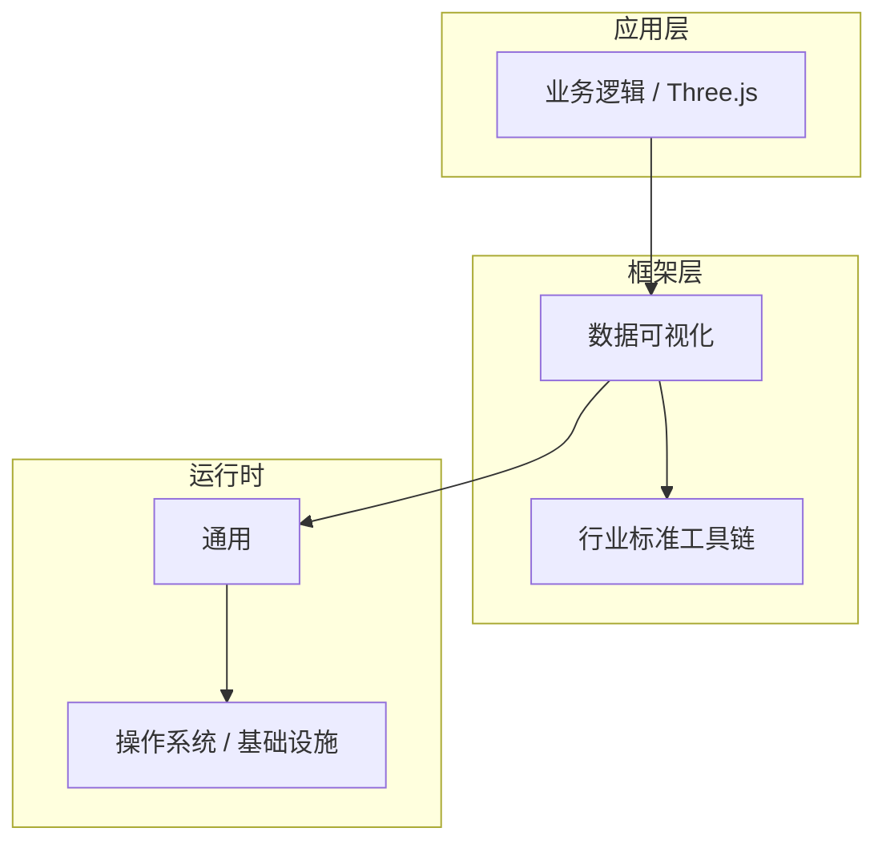

# Three.js的配置与使用

> **领域**：数据可视化 ｜ **模块**：Three.js ｜ **难度**：进阶 ｜ **类型**：配置实践

## 导读

本章属于 **数据可视化** 教程的 **Three.js** 模块，难度为 **进阶**。阅读重点在于建立清晰的概念模型与工程判断能力，而非死记细节。

## 核心概念

数据可视化 是当前技术生态中的重要方向，系统学习需兼顾概念、原理与工程实践。

在 **数据可视化** 体系中，**Three.js** 与上下游模块形成协作。技术栈以 **数据可视化** 为核心（通用），生态包括 行业标准工具链。

「Three.js」是该领域的核心知识模块，理解其原理与边界是工程实践的基础。

### 概念精讲

**Three.js的基本概念与定义**

从流程出发：一次完整调用或生命周期经历哪些阶段。 在 Three.js 语境下，这一点直接影响设计决策与故障排查思路。

**Three.js在数据可视化中的作用与地位**

从数据出发：输入输出是什么格式，状态如何变迁。 在 Three.js 语境下，这一点直接影响设计决策与故障排查思路。

**Three.js的核心数据结构**

从关系出发：它与上下游模块的依赖与接口契约。 在 Three.js 语境下，这一点直接影响设计决策与故障排查思路。

**Three.js的关键算法与流程**

从实践出发：典型应用场景与反模式（不该用的场景）。 在 Three.js 语境下，这一点直接影响设计决策与故障排查思路。

**Three.js与其他模块的关系**

从演进出发：历史上为何出现、未来可能如何变化。 在 Three.js 语境下，这一点直接影响设计决策与故障排查思路。

## 架构与流程

以下框图帮助你在宏观层面把握模块协作关系与处理流向：

## 深度讲解

### 配置三层

- **默认值**：框架内置，开箱可用。
- **环境配置**：开发/测试/生产差异化注入。
- **运行时覆盖**：紧急开关、限流阈值。

### 原则

敏感项由密钥服务注入；变更可追溯；启动时校验，失败快速退出。

### 版本注意

数据可视化 配置项可能随大版本更名，升级前对照迁移指南。

### 落地检查清单

- **理解Three.js的设计思想与适用场景**：落地时需明确验收标准与回滚方案。
- **掌握Three.js的核心API与配置项**：落地时需明确验收标准与回滚方案。
- **分析Three.js的源码实现与调用流程**：落地时需明确验收标准与回滚方案。
- **了解Three.js的性能特点与瓶颈**：落地时需明确验收标准与回滚方案。

### 常见误区与应对

**误区：对Three.js的概念理解不深入导致误用**

**应对**：回到官方定义画一张概念图，与同事讲解一遍，确保能用自己的话复述。

**误区：忽略Three.js的性能边界与限制条件**

**应对**：用 Profiler 或压测建立基线，对比优化前后数据，避免凭感觉优化。

**误区：Three.js配置不当引发的问题**

**应对**：核对环境变量、配置文件与部署清单是否一致，使用配置 diff 工具排查。

**误区：缺乏对Three.js底层原理的理解**

**应对**：阅读官方文档与一篇深度文章，结合小实验验证理解。

**误区：Three.js与其他模块集成时的兼容性问题**

**应对**：列出依赖版本矩阵，在 CI 中跑集成测试覆盖主要组合。

### 最佳实践

1. **遵循Three.js的官方推荐用法与规范** — 落地方式：写入团队 Wiki 并纳入 Code Review 检查项。

2. **在理解原理的基础上合理使用Three.js** — 落地方式：配置静态检查或 CI 规则自动拦截违规写法。

3. **建立完善的Three.js监控与告警机制** — 落地方式：在新人 onboarding 中作为必修内容讲解。

4. **编写充分的测试用例覆盖Three.js的各种场景** — 落地方式：每季度回顾一次，对照社区最佳实践更新。

5. **持续关注Three.js的版本更新与最佳实践演进** — 落地方式：用真实项目案例演示正确与错误对比。

### 本章小结

学完本章，你应能：

- 说清 **Three.js的配置与使用** 在 数据可视化/Three.js 中的定位。
- 描述核心流程与关键概念，能用自己的话复述。
- 识别常见误区并采取预防与排查手段。
- 在项目中做出与场景匹配的工程决策。

类型：**配置实践**。建议完成小练习或复盘笔记，将阅读转化为能力。

## 延伸学习

建议结合以下同模块章节继续阅读，构建完整知识链：

- Three.js的关键技术点
- Three.js的源码级分析
- Three.js的常见问题与解决方案
- Three.js的性能优化技巧

### 参考资料

- 数据可视化官方文档 - Three.js章节
- 《数据可视化权威指南》相关章节
- Three.js源码实现与注释
- 数据可视化社区最佳实践文章
- Three.js相关技术博客与教程

---
*章节 ID: 042 ｜ 领域: 数据可视化 ｜ 版本: 2.0*