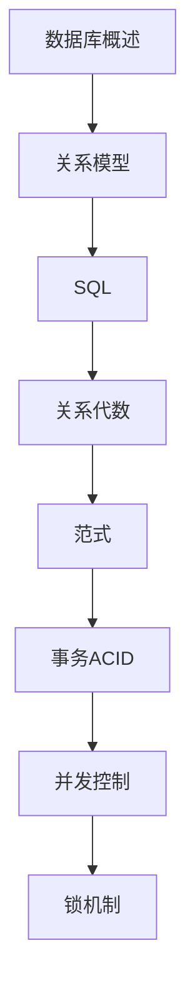

# 数据库原理 学习指南

> **分类**：数据存储 ｜ **章节总数**：120 ｜ **技术栈**：数据库原理

## 领域概述

数据库原理是数据存储领域的重要技术方向，本系列从基础到高级逐步深入，涵盖17个核心模块：数据库概述、关系模型、SQL、关系代数、范式等。每个知识点作为独立章节，包含原理讲解、实现要点、常见陷阱和最佳实践，配合源码分析和架构图，帮助读者建立完整的数据库原理知识体系。

本教程基于 **通用** 与 **数据库原理** 生态编写，涵盖 行业标准工具链 等主流工具与框架。每章独立成篇，文字精炼、逻辑清晰，适合系统学习与按需查阅。

## 你将学到什么

完成本系列后，你将能够：

- 系统理解 **数据库原理** 的核心概念与模块划分。
- 按难度递进掌握从入门到实战的完整知识路径。
- 在工程实践中做出合理的技术判断与问题排查。
- 通过章节索引快速定位所需知识点。

## 前置知识

- 编程基础
- 数据结构
- 计算机基础
- 数据存储基础概念

## 推荐学习路径

1. **数据库概述**
2. **关系模型**
3. **SQL**
4. **关系代数**
5. **范式**
6. **事务ACID**
7. **并发控制**
8. **锁机制**

## 模块体系

本领域按以下模块组织，难度由浅入深：

- **数据库概述**
- **关系模型**
- **SQL**
- **关系代数**
- **范式**
- **事务ACID**
- **并发控制**
- **锁机制**
- **索引**
- **查询优化**
- **存储引擎**
- **日志**
- **备份恢复**
- **分布式数据库**
- **NoSQL**
- **NewSQL**
- **数据库最佳实践**

## 难度分布

| 难度 | 章节数 | 占比 |
|------|--------|------|
| 入门 | 29 | 24% |
| 实战 | 28 | 23% |
| 进阶 | 28 | 23% |
| 高级 | 35 | 29% |

## 章节索引

点击章节标题进入对应教程：

### 数据库概述

- [数据库概述核心概念与原理](chapters/001-数据库概述核心概念与原理.md) ｜ 入门
- [数据库概述的实现机制详解](chapters/002-数据库概述的实现机制详解.md) ｜ 入门
- [数据库概述的关键技术点](chapters/003-数据库概述的关键技术点.md) ｜ 入门
- [数据库概述的源码级分析](chapters/004-数据库概述的源码级分析.md) ｜ 入门
- [数据库概述的配置与使用](chapters/005-数据库概述的配置与使用.md) ｜ 入门
- [数据库概述的常见问题与解决方案](chapters/006-数据库概述的常见问题与解决方案.md) ｜ 入门
- [数据库概述的性能优化技巧](chapters/007-数据库概述的性能优化技巧.md) ｜ 入门
- [数据库概述的最佳实践指南](chapters/008-数据库概述的最佳实践指南.md) ｜ 入门

### 关系模型

- [关系模型核心概念与原理](chapters/009-关系模型核心概念与原理.md) ｜ 入门
- [关系模型的实现机制详解](chapters/010-关系模型的实现机制详解.md) ｜ 入门
- [关系模型的关键技术点](chapters/011-关系模型的关键技术点.md) ｜ 入门
- [关系模型的源码级分析](chapters/012-关系模型的源码级分析.md) ｜ 入门
- [关系模型的配置与使用](chapters/013-关系模型的配置与使用.md) ｜ 入门
- [关系模型的常见问题与解决方案](chapters/014-关系模型的常见问题与解决方案.md) ｜ 入门
- [关系模型的性能优化技巧](chapters/015-关系模型的性能优化技巧.md) ｜ 入门

### SQL

- [SQL核心概念与原理](chapters/016-SQL核心概念与原理.md) ｜ 入门
- [SQL的实现机制详解](chapters/017-SQL的实现机制详解.md) ｜ 入门
- [SQL的关键技术点](chapters/018-SQL的关键技术点.md) ｜ 入门
- [SQL的源码级分析](chapters/019-SQL的源码级分析.md) ｜ 入门
- [SQL的配置与使用](chapters/020-SQL的配置与使用.md) ｜ 入门
- [SQL的常见问题与解决方案](chapters/021-SQL的常见问题与解决方案.md) ｜ 入门
- [SQL的性能优化技巧](chapters/022-SQL的性能优化技巧.md) ｜ 入门

### 关系代数

- [关系代数核心概念与原理](chapters/023-关系代数核心概念与原理.md) ｜ 入门
- [关系代数的实现机制详解](chapters/024-关系代数的实现机制详解.md) ｜ 入门
- [关系代数的关键技术点](chapters/025-关系代数的关键技术点.md) ｜ 入门
- [关系代数的源码级分析](chapters/026-关系代数的源码级分析.md) ｜ 入门
- [关系代数的配置与使用](chapters/027-关系代数的配置与使用.md) ｜ 入门
- [关系代数的常见问题与解决方案](chapters/028-关系代数的常见问题与解决方案.md) ｜ 入门
- [关系代数的性能优化技巧](chapters/029-关系代数的性能优化技巧.md) ｜ 入门

### 范式

- [范式核心概念与原理](chapters/030-范式核心概念与原理.md) ｜ 进阶
- [范式的实现机制详解](chapters/031-范式的实现机制详解.md) ｜ 进阶
- [范式的关键技术点](chapters/032-范式的关键技术点.md) ｜ 进阶
- [范式的源码级分析](chapters/033-范式的源码级分析.md) ｜ 进阶
- [范式的配置与使用](chapters/034-范式的配置与使用.md) ｜ 进阶
- [范式的常见问题与解决方案](chapters/035-范式的常见问题与解决方案.md) ｜ 进阶
- [范式的性能优化技巧](chapters/036-范式的性能优化技巧.md) ｜ 进阶

### 事务ACID

- [事务ACID核心概念与原理](chapters/037-事务ACID核心概念与原理.md) ｜ 进阶
- [事务ACID的实现机制详解](chapters/038-事务ACID的实现机制详解.md) ｜ 进阶
- [事务ACID的关键技术点](chapters/039-事务ACID的关键技术点.md) ｜ 进阶
- [事务ACID的源码级分析](chapters/040-事务ACID的源码级分析.md) ｜ 进阶
- [事务ACID的配置与使用](chapters/041-事务ACID的配置与使用.md) ｜ 进阶
- [事务ACID的常见问题与解决方案](chapters/042-事务ACID的常见问题与解决方案.md) ｜ 进阶
- [事务ACID的性能优化技巧](chapters/043-事务ACID的性能优化技巧.md) ｜ 进阶

### 并发控制

- [并发控制核心概念与原理](chapters/044-并发控制核心概念与原理.md) ｜ 进阶
- [并发控制的实现机制详解](chapters/045-并发控制的实现机制详解.md) ｜ 进阶
- [并发控制的关键技术点](chapters/046-并发控制的关键技术点.md) ｜ 进阶
- [并发控制的源码级分析](chapters/047-并发控制的源码级分析.md) ｜ 进阶
- [并发控制的配置与使用](chapters/048-并发控制的配置与使用.md) ｜ 进阶
- [并发控制的常见问题与解决方案](chapters/049-并发控制的常见问题与解决方案.md) ｜ 进阶
- [并发控制的性能优化技巧](chapters/050-并发控制的性能优化技巧.md) ｜ 进阶

### 锁机制

- [锁机制核心概念与原理](chapters/051-锁机制核心概念与原理.md) ｜ 进阶
- [锁机制的实现机制详解](chapters/052-锁机制的实现机制详解.md) ｜ 进阶
- [锁机制的关键技术点](chapters/053-锁机制的关键技术点.md) ｜ 进阶
- [锁机制的源码级分析](chapters/054-锁机制的源码级分析.md) ｜ 进阶
- [锁机制的配置与使用](chapters/055-锁机制的配置与使用.md) ｜ 进阶
- [锁机制的常见问题与解决方案](chapters/056-锁机制的常见问题与解决方案.md) ｜ 进阶
- [锁机制的性能优化技巧](chapters/057-锁机制的性能优化技巧.md) ｜ 进阶

### 索引

- [索引核心概念与原理](chapters/058-索引核心概念与原理.md) ｜ 高级
- [索引的实现机制详解](chapters/059-索引的实现机制详解.md) ｜ 高级
- [索引的关键技术点](chapters/060-索引的关键技术点.md) ｜ 高级
- [索引的源码级分析](chapters/061-索引的源码级分析.md) ｜ 高级
- [索引的配置与使用](chapters/062-索引的配置与使用.md) ｜ 高级
- [索引的常见问题与解决方案](chapters/063-索引的常见问题与解决方案.md) ｜ 高级
- [索引的性能优化技巧](chapters/064-索引的性能优化技巧.md) ｜ 高级

### 查询优化

- [查询优化核心概念与原理](chapters/065-查询优化核心概念与原理.md) ｜ 高级
- [查询优化的实现机制详解](chapters/066-查询优化的实现机制详解.md) ｜ 高级
- [查询优化的关键技术点](chapters/067-查询优化的关键技术点.md) ｜ 高级
- [查询优化的源码级分析](chapters/068-查询优化的源码级分析.md) ｜ 高级
- [查询优化的配置与使用](chapters/069-查询优化的配置与使用.md) ｜ 高级
- [查询优化的常见问题与解决方案](chapters/070-查询优化的常见问题与解决方案.md) ｜ 高级
- [查询优化的性能优化技巧](chapters/071-查询优化的性能优化技巧.md) ｜ 高级

### 存储引擎

- [存储引擎核心概念与原理](chapters/072-存储引擎核心概念与原理.md) ｜ 高级
- [存储引擎的实现机制详解](chapters/073-存储引擎的实现机制详解.md) ｜ 高级
- [存储引擎的关键技术点](chapters/074-存储引擎的关键技术点.md) ｜ 高级
- [存储引擎的源码级分析](chapters/075-存储引擎的源码级分析.md) ｜ 高级
- [存储引擎的配置与使用](chapters/076-存储引擎的配置与使用.md) ｜ 高级
- [存储引擎的常见问题与解决方案](chapters/077-存储引擎的常见问题与解决方案.md) ｜ 高级
- [存储引擎的性能优化技巧](chapters/078-存储引擎的性能优化技巧.md) ｜ 高级

### 日志

- [日志核心概念与原理](chapters/079-日志核心概念与原理.md) ｜ 高级
- [日志的实现机制详解](chapters/080-日志的实现机制详解.md) ｜ 高级
- [日志的关键技术点](chapters/081-日志的关键技术点.md) ｜ 高级
- [日志的源码级分析](chapters/082-日志的源码级分析.md) ｜ 高级
- [日志的配置与使用](chapters/083-日志的配置与使用.md) ｜ 高级
- [日志的常见问题与解决方案](chapters/084-日志的常见问题与解决方案.md) ｜ 高级
- [日志的性能优化技巧](chapters/085-日志的性能优化技巧.md) ｜ 高级

### 备份恢复

- [备份恢复核心概念与原理](chapters/086-备份恢复核心概念与原理.md) ｜ 高级
- [备份恢复的实现机制详解](chapters/087-备份恢复的实现机制详解.md) ｜ 高级
- [备份恢复的关键技术点](chapters/088-备份恢复的关键技术点.md) ｜ 高级
- [备份恢复的源码级分析](chapters/089-备份恢复的源码级分析.md) ｜ 高级
- [备份恢复的配置与使用](chapters/090-备份恢复的配置与使用.md) ｜ 高级
- [备份恢复的常见问题与解决方案](chapters/091-备份恢复的常见问题与解决方案.md) ｜ 高级
- [备份恢复的性能优化技巧](chapters/092-备份恢复的性能优化技巧.md) ｜ 高级

### 分布式数据库

- [分布式数据库核心概念与原理](chapters/093-分布式数据库核心概念与原理.md) ｜ 实战
- [分布式数据库的实现机制详解](chapters/094-分布式数据库的实现机制详解.md) ｜ 实战
- [分布式数据库的关键技术点](chapters/095-分布式数据库的关键技术点.md) ｜ 实战
- [分布式数据库的源码级分析](chapters/096-分布式数据库的源码级分析.md) ｜ 实战
- [分布式数据库的配置与使用](chapters/097-分布式数据库的配置与使用.md) ｜ 实战
- [分布式数据库的常见问题与解决方案](chapters/098-分布式数据库的常见问题与解决方案.md) ｜ 实战
- [分布式数据库的性能优化技巧](chapters/099-分布式数据库的性能优化技巧.md) ｜ 实战

### NoSQL

- [NoSQL核心概念与原理](chapters/100-NoSQL核心概念与原理.md) ｜ 实战
- [NoSQL的实现机制详解](chapters/101-NoSQL的实现机制详解.md) ｜ 实战
- [NoSQL的关键技术点](chapters/102-NoSQL的关键技术点.md) ｜ 实战
- [NoSQL的源码级分析](chapters/103-NoSQL的源码级分析.md) ｜ 实战
- [NoSQL的配置与使用](chapters/104-NoSQL的配置与使用.md) ｜ 实战
- [NoSQL的常见问题与解决方案](chapters/105-NoSQL的常见问题与解决方案.md) ｜ 实战
- [NoSQL的性能优化技巧](chapters/106-NoSQL的性能优化技巧.md) ｜ 实战

### NewSQL

- [NewSQL核心概念与原理](chapters/107-NewSQL核心概念与原理.md) ｜ 实战
- [NewSQL的实现机制详解](chapters/108-NewSQL的实现机制详解.md) ｜ 实战
- [NewSQL的关键技术点](chapters/109-NewSQL的关键技术点.md) ｜ 实战
- [NewSQL的源码级分析](chapters/110-NewSQL的源码级分析.md) ｜ 实战
- [NewSQL的配置与使用](chapters/111-NewSQL的配置与使用.md) ｜ 实战
- [NewSQL的常见问题与解决方案](chapters/112-NewSQL的常见问题与解决方案.md) ｜ 实战
- [NewSQL的性能优化技巧](chapters/113-NewSQL的性能优化技巧.md) ｜ 实战

### 数据库最佳实践

- [数据库最佳实践核心概念与原理](chapters/114-数据库最佳实践核心概念与原理.md) ｜ 实战
- [数据库最佳实践的实现机制详解](chapters/115-数据库最佳实践的实现机制详解.md) ｜ 实战
- [数据库最佳实践的关键技术点](chapters/116-数据库最佳实践的关键技术点.md) ｜ 实战
- [数据库最佳实践的源码级分析](chapters/117-数据库最佳实践的源码级分析.md) ｜ 实战
- [数据库最佳实践的配置与使用](chapters/118-数据库最佳实践的配置与使用.md) ｜ 实战
- [数据库最佳实践的常见问题与解决方案](chapters/119-数据库最佳实践的常见问题与解决方案.md) ｜ 实战
- [数据库最佳实践的性能优化技巧](chapters/120-数据库最佳实践的性能优化技巧.md) ｜ 实战

## 学习方法建议

1. **先读概述再读章节**：用本指南建立全局地图，避免迷失在细节中。
2. **按模块递进**：同一模块内章节有前后关联，顺序阅读效果更好。
3. **主动复述**：每章读完后，用三五句话概括「是什么、为什么、怎么用」。
4. **关联阅读**：利用章节底部的「延伸学习」在同模块内构建知识网络。
5. **对照官方文档**：本教程提供结构化视角，细节以官方文档为准。

---
*领域: 数据库原理 ｜ 版本: 2.0 ｜ 共 120 章*