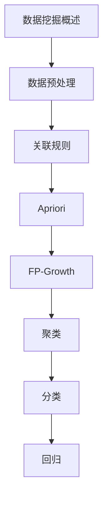

# 数据挖掘 学习指南

> **分类**：AI与算法 ｜ **技术生态**：Pandas, scikit-learn, Apriori, Spark MLlib, Weka

## 领域定位

数据挖掘从大规模数据中发现隐藏模式与知识。关联规则（Apriori）、聚类、分类、异常检测与推荐算法是核心方法，广泛应用于电商、金融与互联网运营分析。

面向数据分析师，侧重算法原理与业务场景应用。

本领域常用技术栈与工具包括：Pandas, scikit-learn, Apriori, Spark MLlib, Weka。

## 学习目标

- 完成数据清洗、转换与探索性分析
- 挖掘关联规则与频繁项集
- 应用聚类与异常检测发现业务洞察
- 构建推荐系统并评估效果

## 前置知识

- Python/SQL
- 统计学
- 机器学习基础
- 数据库

## 学习路径

1. **数据挖掘概述**
2. **数据预处理**
3. **关联规则**
4. **Apriori**
5. **FP-Growth**
6. **聚类**
7. **分类**
8. **回归**

## 模块体系

- **数据挖掘概述**
- **数据预处理**
- **关联规则**
- **Apriori**
- **FP-Growth**
- **聚类**
- **分类**
- **回归**
- **异常检测**
- **序列模式**
- **文本挖掘**
- **Web挖掘**
- **推荐算法**
- **数据挖掘最佳实践**

## 难度分布

| 入门 | 18 | 22% |
| 实战 | 15 | 18% |
| 进阶 | 24 | 30% |
| 高级 | 23 | 28% |

## 章节索引

### 数据挖掘概述

- [数据挖掘概述核心概念与原理](chapters/001-数据挖掘概述核心概念与原理.md) ｜ 入门
- [数据挖掘概述的实现机制详解](chapters/002-数据挖掘概述的实现机制详解.md) ｜ 入门
- [数据挖掘概述的关键技术点](chapters/003-数据挖掘概述的关键技术点.md) ｜ 入门
- [数据挖掘概述的源码级分析](chapters/004-数据挖掘概述的源码级分析.md) ｜ 入门
- [数据挖掘概述的配置与使用](chapters/005-数据挖掘概述的配置与使用.md) ｜ 入门
- [数据挖掘概述的常见问题与解决方案](chapters/006-数据挖掘概述的常见问题与解决方案.md) ｜ 入门

### 数据预处理

- [数据预处理核心概念与原理](chapters/007-数据预处理核心概念与原理.md) ｜ 入门
- [数据预处理的实现机制详解](chapters/008-数据预处理的实现机制详解.md) ｜ 入门
- [数据预处理的关键技术点](chapters/009-数据预处理的关键技术点.md) ｜ 入门
- [数据预处理的源码级分析](chapters/010-数据预处理的源码级分析.md) ｜ 入门
- [数据预处理的配置与使用](chapters/011-数据预处理的配置与使用.md) ｜ 入门
- [数据预处理的常见问题与解决方案](chapters/012-数据预处理的常见问题与解决方案.md) ｜ 入门

### 关联规则

- [关联规则核心概念与原理](chapters/013-关联规则核心概念与原理.md) ｜ 入门
- [关联规则的实现机制详解](chapters/014-关联规则的实现机制详解.md) ｜ 入门
- [关联规则的关键技术点](chapters/015-关联规则的关键技术点.md) ｜ 入门
- [关联规则的源码级分析](chapters/016-关联规则的源码级分析.md) ｜ 入门
- [关联规则的配置与使用](chapters/017-关联规则的配置与使用.md) ｜ 入门
- [关联规则的常见问题与解决方案](chapters/018-关联规则的常见问题与解决方案.md) ｜ 入门

### Apriori

- [Apriori核心概念与原理](chapters/019-Apriori核心概念与原理.md) ｜ 进阶
- [Apriori的实现机制详解](chapters/020-Apriori的实现机制详解.md) ｜ 进阶
- [Apriori的关键技术点](chapters/021-Apriori的关键技术点.md) ｜ 进阶
- [Apriori的源码级分析](chapters/022-Apriori的源码级分析.md) ｜ 进阶
- [Apriori的配置与使用](chapters/023-Apriori的配置与使用.md) ｜ 进阶
- [Apriori的常见问题与解决方案](chapters/024-Apriori的常见问题与解决方案.md) ｜ 进阶

### FP-Growth

- [FP-Growth核心概念与原理](chapters/025-FP-Growth核心概念与原理.md) ｜ 进阶
- [FP-Growth的实现机制详解](chapters/026-FP-Growth的实现机制详解.md) ｜ 进阶
- [FP-Growth的关键技术点](chapters/027-FP-Growth的关键技术点.md) ｜ 进阶
- [FP-Growth的源码级分析](chapters/028-FP-Growth的源码级分析.md) ｜ 进阶
- [FP-Growth的配置与使用](chapters/029-FP-Growth的配置与使用.md) ｜ 进阶
- [FP-Growth的常见问题与解决方案](chapters/030-FP-Growth的常见问题与解决方案.md) ｜ 进阶

### 聚类

- [聚类核心概念与原理](chapters/031-聚类核心概念与原理.md) ｜ 进阶
- [聚类的实现机制详解](chapters/032-聚类的实现机制详解.md) ｜ 进阶
- [聚类的关键技术点](chapters/033-聚类的关键技术点.md) ｜ 进阶
- [聚类的源码级分析](chapters/034-聚类的源码级分析.md) ｜ 进阶
- [聚类的配置与使用](chapters/035-聚类的配置与使用.md) ｜ 进阶
- [聚类的常见问题与解决方案](chapters/036-聚类的常见问题与解决方案.md) ｜ 进阶

### 分类

- [分类核心概念与原理](chapters/037-分类核心概念与原理.md) ｜ 进阶
- [分类的实现机制详解](chapters/038-分类的实现机制详解.md) ｜ 进阶
- [分类的关键技术点](chapters/039-分类的关键技术点.md) ｜ 进阶
- [分类的源码级分析](chapters/040-分类的源码级分析.md) ｜ 进阶
- [分类的配置与使用](chapters/041-分类的配置与使用.md) ｜ 进阶
- [分类的常见问题与解决方案](chapters/042-分类的常见问题与解决方案.md) ｜ 进阶

### 回归

- [回归核心概念与原理](chapters/043-回归核心概念与原理.md) ｜ 高级
- [回归的实现机制详解](chapters/044-回归的实现机制详解.md) ｜ 高级
- [回归的关键技术点](chapters/045-回归的关键技术点.md) ｜ 高级
- [回归的源码级分析](chapters/046-回归的源码级分析.md) ｜ 高级
- [回归的配置与使用](chapters/047-回归的配置与使用.md) ｜ 高级
- [回归的常见问题与解决方案](chapters/048-回归的常见问题与解决方案.md) ｜ 高级

### 异常检测

- [异常检测核心概念与原理](chapters/049-异常检测核心概念与原理.md) ｜ 高级
- [异常检测的实现机制详解](chapters/050-异常检测的实现机制详解.md) ｜ 高级
- [异常检测的关键技术点](chapters/051-异常检测的关键技术点.md) ｜ 高级
- [异常检测的源码级分析](chapters/052-异常检测的源码级分析.md) ｜ 高级
- [异常检测的配置与使用](chapters/053-异常检测的配置与使用.md) ｜ 高级
- [异常检测的常见问题与解决方案](chapters/054-异常检测的常见问题与解决方案.md) ｜ 高级

### 序列模式

- [序列模式核心概念与原理](chapters/055-序列模式核心概念与原理.md) ｜ 高级
- [序列模式的实现机制详解](chapters/056-序列模式的实现机制详解.md) ｜ 高级
- [序列模式的关键技术点](chapters/057-序列模式的关键技术点.md) ｜ 高级
- [序列模式的源码级分析](chapters/058-序列模式的源码级分析.md) ｜ 高级
- [序列模式的配置与使用](chapters/059-序列模式的配置与使用.md) ｜ 高级
- [序列模式的常见问题与解决方案](chapters/060-序列模式的常见问题与解决方案.md) ｜ 高级

### 文本挖掘

- [文本挖掘核心概念与原理](chapters/061-文本挖掘核心概念与原理.md) ｜ 高级
- [文本挖掘的实现机制详解](chapters/062-文本挖掘的实现机制详解.md) ｜ 高级
- [文本挖掘的关键技术点](chapters/063-文本挖掘的关键技术点.md) ｜ 高级
- [文本挖掘的源码级分析](chapters/064-文本挖掘的源码级分析.md) ｜ 高级
- [文本挖掘的配置与使用](chapters/065-文本挖掘的配置与使用.md) ｜ 高级

### Web挖掘

- [Web挖掘核心概念与原理](chapters/066-Web挖掘核心概念与原理.md) ｜ 实战
- [Web挖掘的实现机制详解](chapters/067-Web挖掘的实现机制详解.md) ｜ 实战
- [Web挖掘的关键技术点](chapters/068-Web挖掘的关键技术点.md) ｜ 实战
- [Web挖掘的源码级分析](chapters/069-Web挖掘的源码级分析.md) ｜ 实战
- [Web挖掘的配置与使用](chapters/070-Web挖掘的配置与使用.md) ｜ 实战

### 推荐算法

- [推荐算法核心概念与原理](chapters/071-推荐算法核心概念与原理.md) ｜ 实战
- [推荐算法的实现机制详解](chapters/072-推荐算法的实现机制详解.md) ｜ 实战
- [推荐算法的关键技术点](chapters/073-推荐算法的关键技术点.md) ｜ 实战
- [推荐算法的源码级分析](chapters/074-推荐算法的源码级分析.md) ｜ 实战
- [推荐算法的配置与使用](chapters/075-推荐算法的配置与使用.md) ｜ 实战

### 数据挖掘最佳实践

- [数据挖掘最佳实践核心概念与原理](chapters/076-数据挖掘最佳实践核心概念与原理.md) ｜ 实战
- [数据挖掘最佳实践的实现机制详解](chapters/077-数据挖掘最佳实践的实现机制详解.md) ｜ 实战
- [数据挖掘最佳实践的关键技术点](chapters/078-数据挖掘最佳实践的关键技术点.md) ｜ 实战
- [数据挖掘最佳实践的源码级分析](chapters/079-数据挖掘最佳实践的源码级分析.md) ｜ 实战
- [数据挖掘最佳实践的配置与使用](chapters/080-数据挖掘最佳实践的配置与使用.md) ｜ 实战

---
*领域: 数据挖掘*