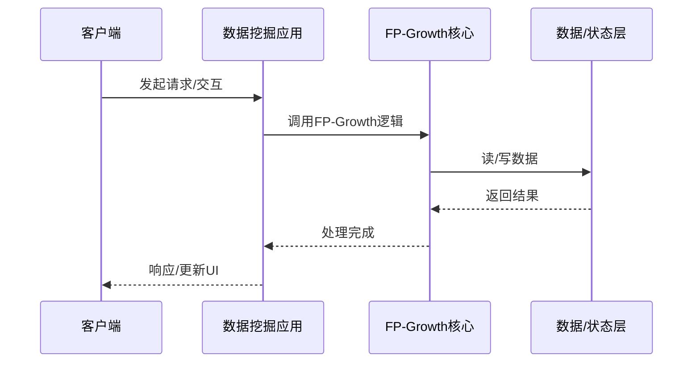

# FP-Growth的实现机制详解

> **领域**：数据挖掘 ｜ **模块**：FP-Growth ｜ **难度**：进阶 ｜ **类型**：实现机制

## 导读

本章属于 **数据挖掘** 教程的 **FP-Growth** 模块，难度为 **进阶**。阅读重点在于建立清晰的概念模型与工程判断能力，而非死记细节。

## 核心概念

数据挖掘 是当前技术生态中的重要方向，系统学习需兼顾概念、原理与工程实践。

在 **数据挖掘** 体系中，**FP-Growth** 与上下游模块形成协作。技术栈以 **数据挖掘** 为核心（通用），生态包括 行业标准工具链。

「FP-Growth」是该领域的核心知识模块，理解其原理与边界是工程实践的基础。

### 概念精讲

**FP-Growth的基本概念与定义**

从流程出发：一次完整调用或生命周期经历哪些阶段。 在 FP-Growth 语境下，这一点直接影响设计决策与故障排查思路。

**FP-Growth在数据挖掘中的作用与地位**

从数据出发：输入输出是什么格式，状态如何变迁。 在 FP-Growth 语境下，这一点直接影响设计决策与故障排查思路。

**FP-Growth的核心数据结构**

从关系出发：它与上下游模块的依赖与接口契约。 在 FP-Growth 语境下，这一点直接影响设计决策与故障排查思路。

**FP-Growth的关键算法与流程**

从实践出发：典型应用场景与反模式（不该用的场景）。 在 FP-Growth 语境下，这一点直接影响设计决策与故障排查思路。

**FP-Growth与其他模块的关系**

从演进出发：历史上为何出现、未来可能如何变化。 在 FP-Growth 语境下，这一点直接影响设计决策与故障排查思路。

## 架构与流程

以下框图帮助你在宏观层面把握模块协作关系与处理流向：

## 深度讲解

### 调用链路

典型 FP-Growth 调用五阶段：**接入**（校验与上下文）→ **路由**（分发）→ **执行**（数据挖掘 核心逻辑）→ **提交**（写存储/回调）→ **收尾**（释放资源、记日志、返回响应）。

### 状态与生命周期

许多「偶发异常」源于状态转换时机错误——资源未就绪即操作，或清理前重复触发。建议对照生命周期图与日志时间线分析。

### 并发与一致性

多调用并发时需明确：共享可变状态、锁粒度、重试对一致性的影响。设计应预设最坏情况，而非假设「不会同时发生」。

### 落地检查清单

- **分析FP-Growth的源码实现与调用流程**：落地时需明确验收标准与回滚方案。
- **了解FP-Growth的性能特点与瓶颈**：落地时需明确验收标准与回滚方案。
- **掌握FP-Growth的常见问题与排查方法**：落地时需明确验收标准与回滚方案。
- **理解FP-Growth的安全注意事项**：落地时需明确验收标准与回滚方案。

### 常见误区与应对

**误区：对FP-Growth的概念理解不深入导致误用**

**应对**：回到官方定义画一张概念图，与同事讲解一遍，确保能用自己的话复述。

**误区：忽略FP-Growth的性能边界与限制条件**

**应对**：用 Profiler 或压测建立基线，对比优化前后数据，避免凭感觉优化。

**误区：FP-Growth配置不当引发的问题**

**应对**：核对环境变量、配置文件与部署清单是否一致，使用配置 diff 工具排查。

**误区：缺乏对FP-Growth底层原理的理解**

**应对**：阅读官方文档与一篇深度文章，结合小实验验证理解。

**误区：FP-Growth与其他模块集成时的兼容性问题**

**应对**：列出依赖版本矩阵，在 CI 中跑集成测试覆盖主要组合。

### 最佳实践

1. **遵循FP-Growth的官方推荐用法与规范** — 落地方式：写入团队 Wiki 并纳入 Code Review 检查项。

2. **在理解原理的基础上合理使用FP-Growth** — 落地方式：配置静态检查或 CI 规则自动拦截违规写法。

3. **建立完善的FP-Growth监控与告警机制** — 落地方式：在新人 onboarding 中作为必修内容讲解。

4. **编写充分的测试用例覆盖FP-Growth的各种场景** — 落地方式：每季度回顾一次，对照社区最佳实践更新。

5. **持续关注FP-Growth的版本更新与最佳实践演进** — 落地方式：用真实项目案例演示正确与错误对比。

### 本章小结

学完本章，你应能：

- 说清 **FP-Growth的实现机制详解** 在 数据挖掘/FP-Growth 中的定位。
- 描述核心流程与关键概念，能用自己的话复述。
- 识别常见误区并采取预防与排查手段。
- 在项目中做出与场景匹配的工程决策。

类型：**实现机制**。建议完成小练习或复盘笔记，将阅读转化为能力。

## 延伸学习

建议结合以下同模块章节继续阅读，构建完整知识链：

- FP-Growth核心概念与原理
- FP-Growth的关键技术点
- FP-Growth的源码级分析

### 参考资料

- 数据挖掘官方文档 - FP-Growth章节
- 《数据挖掘权威指南》相关章节
- FP-Growth源码实现与注释
- 数据挖掘社区最佳实践文章
- FP-Growth相关技术博客与教程

---
*章节 ID: 026 ｜ 领域: 数据挖掘 ｜ 版本: 2.0*