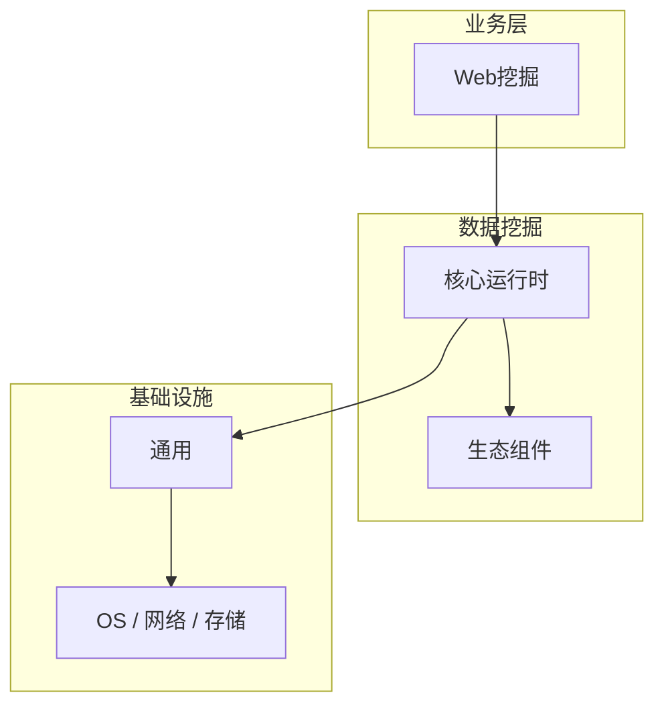

# Web挖掘的源码级分析

> **领域**：数据挖掘 ｜ **模块**：Web挖掘 ｜ **难度**：实战 ｜ **类型**：源码分析

## 导读

本章系统讲解 **数据挖掘** 中 **Web挖掘** 的相关知识（源码分析）。本章沿源码与调用链剖析 **Web挖掘** 的实现，适合需要排障或二次开发的读者。内容基于主流框架与工程实践撰写，不依赖过时概念堆砌。

## 核心知识

**Web挖掘** 是 数据挖掘 领域的核心主题。Web 数据挖掘。本模块从原理与工程实践出发，帮助读者建立系统理解。

### 核心知识

**1. 类型**

Web 内容/结构/使用挖掘。

**2. PageRank**

链接分析排序算法。

**3. 日志**

用户行为分析、点击流。

## 架构与流程

## 技术详解

### 源码与实现

爬取/日志 → 清洗 → 分析 → 洞察。

## 原理与实现

### 工作机制

爬取/日志 → 清洗 → 分析 → 洞察。

### 内部实现

Web挖掘 的底层实现依赖 数据挖掘 生态中的标准组件与协议，建议阅读官方规范文档。

## 操作流程与实践

### 操作流程

1. 理解 Web挖掘 概念 → 2. 学习标准用法 → 3. 动手实验 → 4. 分析案例 → 5. 总结最佳实践。

### 配置要点

配置 Web挖掘 时遵循官方推荐默认值，仅在理解影响后调整参数。

## 性能、安全与排查

### 性能优化

评估 Web挖掘 性能时建立基准测试，关注时间/空间复杂度或系统吞吐延迟指标。

### 安全注意

在 数据挖掘 场景下注意输入校验、权限控制与敏感数据保护。

### 调试排错

排查 Web挖掘 问题时，结合日志、监控与最小复现用例逐步定位根因。

## 案例与选型

### 案例复盘

在典型 数据挖掘 项目中，正确应用 Web挖掘 可显著提升系统质量与可维护性。

### 方案对比

选择 Web挖掘 方案时需对比多种替代方案的适用场景、性能与生态支持。

## 本章聚焦

源码阅读 **Web挖掘** 宜采用「由外向内」：先跟一次主路径请求，再展开分支与错误处理，避免陷入细节迷失主线。

### 常见误区与纠正

**概念理解偏差**

对 Web挖掘 理解不全面导致误用，应回到官方文档重新梳理。

**忽视边界条件**

Web挖掘 在极端输入或高并发下行为可能不同，需充分测试。

**缺少监控**

未对 Web挖掘 关键指标监控，问题只能被动发现。

### 最佳实践

1. 遵循 数据挖掘 领域 Web挖掘 的官方推荐实践
2. 为 Web挖掘 相关功能编写自动化测试
3. 关键配置纳入版本管理与变更审计
4. 生产部署前在接近真实环境验证

## 巩固建议

建议结合 **数据挖掘** 官方文档与小型实验，亲手验证 **Web挖掘** 的默认行为与边界条件；将本章要点整理为检查清单或 ADR，便于评审与团队 onboarding。

### 本章小结

学完本章，你应能独立说明 **Web挖掘** 在 数据挖掘 中的角色，理解其核心机制，规避常见误区，并在项目中正确运用。

## 延伸学习

- Web挖掘核心概念与原理
- Web挖掘的实现机制详解
- Web挖掘的关键技术点
- Web挖掘的配置与使用

### 延伸阅读

- 数据挖掘 官方文档 - Web挖掘
- OWASP / NIST 相关指南（如适用）
- 权威书籍与 RFC 标准文档

---
*章节 ID: 069 ｜ 领域: 数据挖掘*