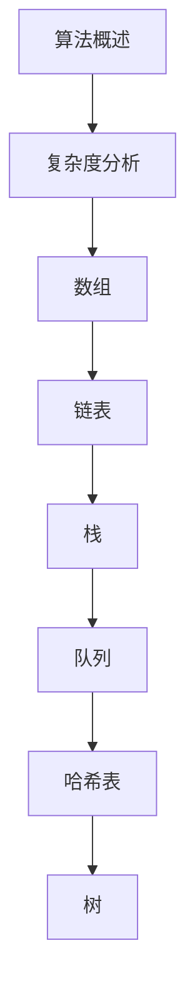

# 数据结构与算法 学习指南

> **分类**：AI与算法 ｜ **章节总数**：200 ｜ **技术栈**：数据结构与算法

## 领域概述

数据结构与算法是AI与算法领域的重要技术方向，本系列从基础到高级逐步深入，涵盖24个核心模块：算法概述、复杂度分析、数组、链表、栈等。每个知识点作为独立章节，包含原理讲解、实现要点、常见陷阱和最佳实践，配合源码分析和架构图，帮助读者建立完整的数据结构与算法知识体系。

本教程基于 **通用** 与 **数据结构与算法** 生态编写，涵盖 行业标准工具链 等主流工具与框架。每章独立成篇，文字精炼、逻辑清晰，适合系统学习与按需查阅。

## 你将学到什么

完成本系列后，你将能够：

- 系统理解 **数据结构与算法** 的核心概念与模块划分。
- 按难度递进掌握从入门到实战的完整知识路径。
- 在工程实践中做出合理的技术判断与问题排查。
- 通过章节索引快速定位所需知识点。

## 前置知识

- 编程基础
- 数据结构
- 计算机基础
- AI与算法基础概念

## 推荐学习路径

1. **算法概述**
2. **复杂度分析**
3. **数组**
4. **链表**
5. **栈**
6. **队列**
7. **哈希表**
8. **树**

## 模块体系

本领域按以下模块组织，难度由浅入深：

- **算法概述**
- **复杂度分析**
- **数组**
- **链表**
- **栈**
- **队列**
- **哈希表**
- **树**
- **二叉树**
- **平衡树**
- **堆**
- **图**
- **排序**
- **查找**
- **递归**
- **分治**
- **动态规划**
- **贪心**
- **回溯**
- **图算法**
- **字符串算法**
- **高级数据结构**
- **算法设计**
- **算法最佳实践**

## 难度分布

| 难度 | 章节数 | 占比 |
|------|--------|------|
| 入门 | 45 | 22% |
| 实战 | 40 | 20% |
| 进阶 | 59 | 29% |
| 高级 | 56 | 28% |

## 章节索引

点击章节标题进入对应教程：

### 算法概述

- [算法概述核心概念与原理](chapters/001-算法概述核心概念与原理.md) ｜ 入门
- [算法概述的实现机制详解](chapters/002-算法概述的实现机制详解.md) ｜ 入门
- [算法概述的关键技术点](chapters/003-算法概述的关键技术点.md) ｜ 入门
- [算法概述的源码级分析](chapters/004-算法概述的源码级分析.md) ｜ 入门
- [算法概述的配置与使用](chapters/005-算法概述的配置与使用.md) ｜ 入门
- [算法概述的常见问题与解决方案](chapters/006-算法概述的常见问题与解决方案.md) ｜ 入门
- [算法概述的性能优化技巧](chapters/007-算法概述的性能优化技巧.md) ｜ 入门
- [算法概述的最佳实践指南](chapters/008-算法概述的最佳实践指南.md) ｜ 入门
- [算法概述的高级应用场景](chapters/009-算法概述的高级应用场景.md) ｜ 入门

### 复杂度分析

- [复杂度分析核心概念与原理](chapters/010-复杂度分析核心概念与原理.md) ｜ 入门
- [复杂度分析的实现机制详解](chapters/011-复杂度分析的实现机制详解.md) ｜ 入门
- [复杂度分析的关键技术点](chapters/012-复杂度分析的关键技术点.md) ｜ 入门
- [复杂度分析的源码级分析](chapters/013-复杂度分析的源码级分析.md) ｜ 入门
- [复杂度分析的配置与使用](chapters/014-复杂度分析的配置与使用.md) ｜ 入门
- [复杂度分析的常见问题与解决方案](chapters/015-复杂度分析的常见问题与解决方案.md) ｜ 入门
- [复杂度分析的性能优化技巧](chapters/016-复杂度分析的性能优化技巧.md) ｜ 入门
- [复杂度分析的最佳实践指南](chapters/017-复杂度分析的最佳实践指南.md) ｜ 入门
- [复杂度分析的高级应用场景](chapters/018-复杂度分析的高级应用场景.md) ｜ 入门

### 数组

- [数组核心概念与原理](chapters/019-数组核心概念与原理.md) ｜ 入门
- [数组的实现机制详解](chapters/020-数组的实现机制详解.md) ｜ 入门
- [数组的关键技术点](chapters/021-数组的关键技术点.md) ｜ 入门
- [数组的源码级分析](chapters/022-数组的源码级分析.md) ｜ 入门
- [数组的配置与使用](chapters/023-数组的配置与使用.md) ｜ 入门
- [数组的常见问题与解决方案](chapters/024-数组的常见问题与解决方案.md) ｜ 入门
- [数组的性能优化技巧](chapters/025-数组的性能优化技巧.md) ｜ 入门
- [数组的最佳实践指南](chapters/026-数组的最佳实践指南.md) ｜ 入门
- [数组的高级应用场景](chapters/027-数组的高级应用场景.md) ｜ 入门

### 链表

- [链表核心概念与原理](chapters/028-链表核心概念与原理.md) ｜ 入门
- [链表的实现机制详解](chapters/029-链表的实现机制详解.md) ｜ 入门
- [链表的关键技术点](chapters/030-链表的关键技术点.md) ｜ 入门
- [链表的源码级分析](chapters/031-链表的源码级分析.md) ｜ 入门
- [链表的配置与使用](chapters/032-链表的配置与使用.md) ｜ 入门
- [链表的常见问题与解决方案](chapters/033-链表的常见问题与解决方案.md) ｜ 入门
- [链表的性能优化技巧](chapters/034-链表的性能优化技巧.md) ｜ 入门
- [链表的最佳实践指南](chapters/035-链表的最佳实践指南.md) ｜ 入门
- [链表的高级应用场景](chapters/036-链表的高级应用场景.md) ｜ 入门

### 栈

- [栈核心概念与原理](chapters/037-栈核心概念与原理.md) ｜ 入门
- [栈的实现机制详解](chapters/038-栈的实现机制详解.md) ｜ 入门
- [栈的关键技术点](chapters/039-栈的关键技术点.md) ｜ 入门
- [栈的源码级分析](chapters/040-栈的源码级分析.md) ｜ 入门
- [栈的配置与使用](chapters/041-栈的配置与使用.md) ｜ 入门
- [栈的常见问题与解决方案](chapters/042-栈的常见问题与解决方案.md) ｜ 入门
- [栈的性能优化技巧](chapters/043-栈的性能优化技巧.md) ｜ 入门
- [栈的最佳实践指南](chapters/044-栈的最佳实践指南.md) ｜ 入门
- [栈的高级应用场景](chapters/045-栈的高级应用场景.md) ｜ 入门

### 队列

- [队列核心概念与原理](chapters/046-队列核心概念与原理.md) ｜ 进阶
- [队列的实现机制详解](chapters/047-队列的实现机制详解.md) ｜ 进阶
- [队列的关键技术点](chapters/048-队列的关键技术点.md) ｜ 进阶
- [队列的源码级分析](chapters/049-队列的源码级分析.md) ｜ 进阶
- [队列的配置与使用](chapters/050-队列的配置与使用.md) ｜ 进阶
- [队列的常见问题与解决方案](chapters/051-队列的常见问题与解决方案.md) ｜ 进阶
- [队列的性能优化技巧](chapters/052-队列的性能优化技巧.md) ｜ 进阶
- [队列的最佳实践指南](chapters/053-队列的最佳实践指南.md) ｜ 进阶
- [队列的高级应用场景](chapters/054-队列的高级应用场景.md) ｜ 进阶

### 哈希表

- [哈希表核心概念与原理](chapters/055-哈希表核心概念与原理.md) ｜ 进阶
- [哈希表的实现机制详解](chapters/056-哈希表的实现机制详解.md) ｜ 进阶
- [哈希表的关键技术点](chapters/057-哈希表的关键技术点.md) ｜ 进阶
- [哈希表的源码级分析](chapters/058-哈希表的源码级分析.md) ｜ 进阶
- [哈希表的配置与使用](chapters/059-哈希表的配置与使用.md) ｜ 进阶
- [哈希表的常见问题与解决方案](chapters/060-哈希表的常见问题与解决方案.md) ｜ 进阶
- [哈希表的性能优化技巧](chapters/061-哈希表的性能优化技巧.md) ｜ 进阶
- [哈希表的最佳实践指南](chapters/062-哈希表的最佳实践指南.md) ｜ 进阶
- [哈希表的高级应用场景](chapters/063-哈希表的高级应用场景.md) ｜ 进阶

### 树

- [树核心概念与原理](chapters/064-树核心概念与原理.md) ｜ 进阶
- [树的实现机制详解](chapters/065-树的实现机制详解.md) ｜ 进阶
- [树的关键技术点](chapters/066-树的关键技术点.md) ｜ 进阶
- [树的源码级分析](chapters/067-树的源码级分析.md) ｜ 进阶
- [树的配置与使用](chapters/068-树的配置与使用.md) ｜ 进阶
- [树的常见问题与解决方案](chapters/069-树的常见问题与解决方案.md) ｜ 进阶
- [树的性能优化技巧](chapters/070-树的性能优化技巧.md) ｜ 进阶
- [树的最佳实践指南](chapters/071-树的最佳实践指南.md) ｜ 进阶
- [树的高级应用场景](chapters/072-树的高级应用场景.md) ｜ 进阶

### 二叉树

- [二叉树核心概念与原理](chapters/073-二叉树核心概念与原理.md) ｜ 进阶
- [二叉树的实现机制详解](chapters/074-二叉树的实现机制详解.md) ｜ 进阶
- [二叉树的关键技术点](chapters/075-二叉树的关键技术点.md) ｜ 进阶
- [二叉树的源码级分析](chapters/076-二叉树的源码级分析.md) ｜ 进阶
- [二叉树的配置与使用](chapters/077-二叉树的配置与使用.md) ｜ 进阶
- [二叉树的常见问题与解决方案](chapters/078-二叉树的常见问题与解决方案.md) ｜ 进阶
- [二叉树的性能优化技巧](chapters/079-二叉树的性能优化技巧.md) ｜ 进阶
- [二叉树的最佳实践指南](chapters/080-二叉树的最佳实践指南.md) ｜ 进阶

### 平衡树

- [平衡树核心概念与原理](chapters/081-平衡树核心概念与原理.md) ｜ 进阶
- [平衡树的实现机制详解](chapters/082-平衡树的实现机制详解.md) ｜ 进阶
- [平衡树的关键技术点](chapters/083-平衡树的关键技术点.md) ｜ 进阶
- [平衡树的源码级分析](chapters/084-平衡树的源码级分析.md) ｜ 进阶
- [平衡树的配置与使用](chapters/085-平衡树的配置与使用.md) ｜ 进阶
- [平衡树的常见问题与解决方案](chapters/086-平衡树的常见问题与解决方案.md) ｜ 进阶
- [平衡树的性能优化技巧](chapters/087-平衡树的性能优化技巧.md) ｜ 进阶
- [平衡树的最佳实践指南](chapters/088-平衡树的最佳实践指南.md) ｜ 进阶

### 堆

- [堆核心概念与原理](chapters/089-堆核心概念与原理.md) ｜ 进阶
- [堆的实现机制详解](chapters/090-堆的实现机制详解.md) ｜ 进阶
- [堆的关键技术点](chapters/091-堆的关键技术点.md) ｜ 进阶
- [堆的源码级分析](chapters/092-堆的源码级分析.md) ｜ 进阶
- [堆的配置与使用](chapters/093-堆的配置与使用.md) ｜ 进阶
- [堆的常见问题与解决方案](chapters/094-堆的常见问题与解决方案.md) ｜ 进阶
- [堆的性能优化技巧](chapters/095-堆的性能优化技巧.md) ｜ 进阶
- [堆的最佳实践指南](chapters/096-堆的最佳实践指南.md) ｜ 进阶

### 图

- [图核心概念与原理](chapters/097-图核心概念与原理.md) ｜ 进阶
- [图的实现机制详解](chapters/098-图的实现机制详解.md) ｜ 进阶
- [图的关键技术点](chapters/099-图的关键技术点.md) ｜ 进阶
- [图的源码级分析](chapters/100-图的源码级分析.md) ｜ 进阶
- [图的配置与使用](chapters/101-图的配置与使用.md) ｜ 进阶
- [图的常见问题与解决方案](chapters/102-图的常见问题与解决方案.md) ｜ 进阶
- [图的性能优化技巧](chapters/103-图的性能优化技巧.md) ｜ 进阶
- [图的最佳实践指南](chapters/104-图的最佳实践指南.md) ｜ 进阶

### 排序

- [排序核心概念与原理](chapters/105-排序核心概念与原理.md) ｜ 高级
- [排序的实现机制详解](chapters/106-排序的实现机制详解.md) ｜ 高级
- [排序的关键技术点](chapters/107-排序的关键技术点.md) ｜ 高级
- [排序的源码级分析](chapters/108-排序的源码级分析.md) ｜ 高级
- [排序的配置与使用](chapters/109-排序的配置与使用.md) ｜ 高级
- [排序的常见问题与解决方案](chapters/110-排序的常见问题与解决方案.md) ｜ 高级
- [排序的性能优化技巧](chapters/111-排序的性能优化技巧.md) ｜ 高级
- [排序的最佳实践指南](chapters/112-排序的最佳实践指南.md) ｜ 高级

### 查找

- [查找核心概念与原理](chapters/113-查找核心概念与原理.md) ｜ 高级
- [查找的实现机制详解](chapters/114-查找的实现机制详解.md) ｜ 高级
- [查找的关键技术点](chapters/115-查找的关键技术点.md) ｜ 高级
- [查找的源码级分析](chapters/116-查找的源码级分析.md) ｜ 高级
- [查找的配置与使用](chapters/117-查找的配置与使用.md) ｜ 高级
- [查找的常见问题与解决方案](chapters/118-查找的常见问题与解决方案.md) ｜ 高级
- [查找的性能优化技巧](chapters/119-查找的性能优化技巧.md) ｜ 高级
- [查找的最佳实践指南](chapters/120-查找的最佳实践指南.md) ｜ 高级

### 递归

- [递归核心概念与原理](chapters/121-递归核心概念与原理.md) ｜ 高级
- [递归的实现机制详解](chapters/122-递归的实现机制详解.md) ｜ 高级
- [递归的关键技术点](chapters/123-递归的关键技术点.md) ｜ 高级
- [递归的源码级分析](chapters/124-递归的源码级分析.md) ｜ 高级
- [递归的配置与使用](chapters/125-递归的配置与使用.md) ｜ 高级
- [递归的常见问题与解决方案](chapters/126-递归的常见问题与解决方案.md) ｜ 高级
- [递归的性能优化技巧](chapters/127-递归的性能优化技巧.md) ｜ 高级
- [递归的最佳实践指南](chapters/128-递归的最佳实践指南.md) ｜ 高级

### 分治

- [分治核心概念与原理](chapters/129-分治核心概念与原理.md) ｜ 高级
- [分治的实现机制详解](chapters/130-分治的实现机制详解.md) ｜ 高级
- [分治的关键技术点](chapters/131-分治的关键技术点.md) ｜ 高级
- [分治的源码级分析](chapters/132-分治的源码级分析.md) ｜ 高级
- [分治的配置与使用](chapters/133-分治的配置与使用.md) ｜ 高级
- [分治的常见问题与解决方案](chapters/134-分治的常见问题与解决方案.md) ｜ 高级
- [分治的性能优化技巧](chapters/135-分治的性能优化技巧.md) ｜ 高级
- [分治的最佳实践指南](chapters/136-分治的最佳实践指南.md) ｜ 高级

### 动态规划

- [动态规划核心概念与原理](chapters/137-动态规划核心概念与原理.md) ｜ 高级
- [动态规划的实现机制详解](chapters/138-动态规划的实现机制详解.md) ｜ 高级
- [动态规划的关键技术点](chapters/139-动态规划的关键技术点.md) ｜ 高级
- [动态规划的源码级分析](chapters/140-动态规划的源码级分析.md) ｜ 高级
- [动态规划的配置与使用](chapters/141-动态规划的配置与使用.md) ｜ 高级
- [动态规划的常见问题与解决方案](chapters/142-动态规划的常见问题与解决方案.md) ｜ 高级
- [动态规划的性能优化技巧](chapters/143-动态规划的性能优化技巧.md) ｜ 高级
- [动态规划的最佳实践指南](chapters/144-动态规划的最佳实践指南.md) ｜ 高级

### 贪心

- [贪心核心概念与原理](chapters/145-贪心核心概念与原理.md) ｜ 高级
- [贪心的实现机制详解](chapters/146-贪心的实现机制详解.md) ｜ 高级
- [贪心的关键技术点](chapters/147-贪心的关键技术点.md) ｜ 高级
- [贪心的源码级分析](chapters/148-贪心的源码级分析.md) ｜ 高级
- [贪心的配置与使用](chapters/149-贪心的配置与使用.md) ｜ 高级
- [贪心的常见问题与解决方案](chapters/150-贪心的常见问题与解决方案.md) ｜ 高级
- [贪心的性能优化技巧](chapters/151-贪心的性能优化技巧.md) ｜ 高级
- [贪心的最佳实践指南](chapters/152-贪心的最佳实践指南.md) ｜ 高级

### 回溯

- [回溯核心概念与原理](chapters/153-回溯核心概念与原理.md) ｜ 高级
- [回溯的实现机制详解](chapters/154-回溯的实现机制详解.md) ｜ 高级
- [回溯的关键技术点](chapters/155-回溯的关键技术点.md) ｜ 高级
- [回溯的源码级分析](chapters/156-回溯的源码级分析.md) ｜ 高级
- [回溯的配置与使用](chapters/157-回溯的配置与使用.md) ｜ 高级
- [回溯的常见问题与解决方案](chapters/158-回溯的常见问题与解决方案.md) ｜ 高级
- [回溯的性能优化技巧](chapters/159-回溯的性能优化技巧.md) ｜ 高级
- [回溯的最佳实践指南](chapters/160-回溯的最佳实践指南.md) ｜ 高级

### 图算法

- [图算法核心概念与原理](chapters/161-图算法核心概念与原理.md) ｜ 实战
- [图算法的实现机制详解](chapters/162-图算法的实现机制详解.md) ｜ 实战
- [图算法的关键技术点](chapters/163-图算法的关键技术点.md) ｜ 实战
- [图算法的源码级分析](chapters/164-图算法的源码级分析.md) ｜ 实战
- [图算法的配置与使用](chapters/165-图算法的配置与使用.md) ｜ 实战
- [图算法的常见问题与解决方案](chapters/166-图算法的常见问题与解决方案.md) ｜ 实战
- [图算法的性能优化技巧](chapters/167-图算法的性能优化技巧.md) ｜ 实战
- [图算法的最佳实践指南](chapters/168-图算法的最佳实践指南.md) ｜ 实战

### 字符串算法

- [字符串算法核心概念与原理](chapters/169-字符串算法核心概念与原理.md) ｜ 实战
- [字符串算法的实现机制详解](chapters/170-字符串算法的实现机制详解.md) ｜ 实战
- [字符串算法的关键技术点](chapters/171-字符串算法的关键技术点.md) ｜ 实战
- [字符串算法的源码级分析](chapters/172-字符串算法的源码级分析.md) ｜ 实战
- [字符串算法的配置与使用](chapters/173-字符串算法的配置与使用.md) ｜ 实战
- [字符串算法的常见问题与解决方案](chapters/174-字符串算法的常见问题与解决方案.md) ｜ 实战
- [字符串算法的性能优化技巧](chapters/175-字符串算法的性能优化技巧.md) ｜ 实战
- [字符串算法的最佳实践指南](chapters/176-字符串算法的最佳实践指南.md) ｜ 实战

### 高级数据结构

- [高级数据结构核心概念与原理](chapters/177-高级数据结构核心概念与原理.md) ｜ 实战
- [高级数据结构的实现机制详解](chapters/178-高级数据结构的实现机制详解.md) ｜ 实战
- [高级数据结构的关键技术点](chapters/179-高级数据结构的关键技术点.md) ｜ 实战
- [高级数据结构的源码级分析](chapters/180-高级数据结构的源码级分析.md) ｜ 实战
- [高级数据结构的配置与使用](chapters/181-高级数据结构的配置与使用.md) ｜ 实战
- [高级数据结构的常见问题与解决方案](chapters/182-高级数据结构的常见问题与解决方案.md) ｜ 实战
- [高级数据结构的性能优化技巧](chapters/183-高级数据结构的性能优化技巧.md) ｜ 实战
- [高级数据结构的最佳实践指南](chapters/184-高级数据结构的最佳实践指南.md) ｜ 实战

### 算法设计

- [算法设计核心概念与原理](chapters/185-算法设计核心概念与原理.md) ｜ 实战
- [算法设计的实现机制详解](chapters/186-算法设计的实现机制详解.md) ｜ 实战
- [算法设计的关键技术点](chapters/187-算法设计的关键技术点.md) ｜ 实战
- [算法设计的源码级分析](chapters/188-算法设计的源码级分析.md) ｜ 实战
- [算法设计的配置与使用](chapters/189-算法设计的配置与使用.md) ｜ 实战
- [算法设计的常见问题与解决方案](chapters/190-算法设计的常见问题与解决方案.md) ｜ 实战
- [算法设计的性能优化技巧](chapters/191-算法设计的性能优化技巧.md) ｜ 实战
- [算法设计的最佳实践指南](chapters/192-算法设计的最佳实践指南.md) ｜ 实战

### 算法最佳实践

- [算法最佳实践核心概念与原理](chapters/193-算法最佳实践核心概念与原理.md) ｜ 实战
- [算法最佳实践的实现机制详解](chapters/194-算法最佳实践的实现机制详解.md) ｜ 实战
- [算法最佳实践的关键技术点](chapters/195-算法最佳实践的关键技术点.md) ｜ 实战
- [算法最佳实践的源码级分析](chapters/196-算法最佳实践的源码级分析.md) ｜ 实战
- [算法最佳实践的配置与使用](chapters/197-算法最佳实践的配置与使用.md) ｜ 实战
- [算法最佳实践的常见问题与解决方案](chapters/198-算法最佳实践的常见问题与解决方案.md) ｜ 实战
- [算法最佳实践的性能优化技巧](chapters/199-算法最佳实践的性能优化技巧.md) ｜ 实战
- [算法最佳实践的最佳实践指南](chapters/200-算法最佳实践的最佳实践指南.md) ｜ 实战

## 学习方法建议

1. **先读概述再读章节**：用本指南建立全局地图，避免迷失在细节中。
2. **按模块递进**：同一模块内章节有前后关联，顺序阅读效果更好。
3. **主动复述**：每章读完后，用三五句话概括「是什么、为什么、怎么用」。
4. **关联阅读**：利用章节底部的「延伸学习」在同模块内构建知识网络。
5. **对照官方文档**：本教程提供结构化视角，细节以官方文档为准。

---
*领域: 数据结构与算法 ｜ 版本: 2.0 ｜ 共 200 章*