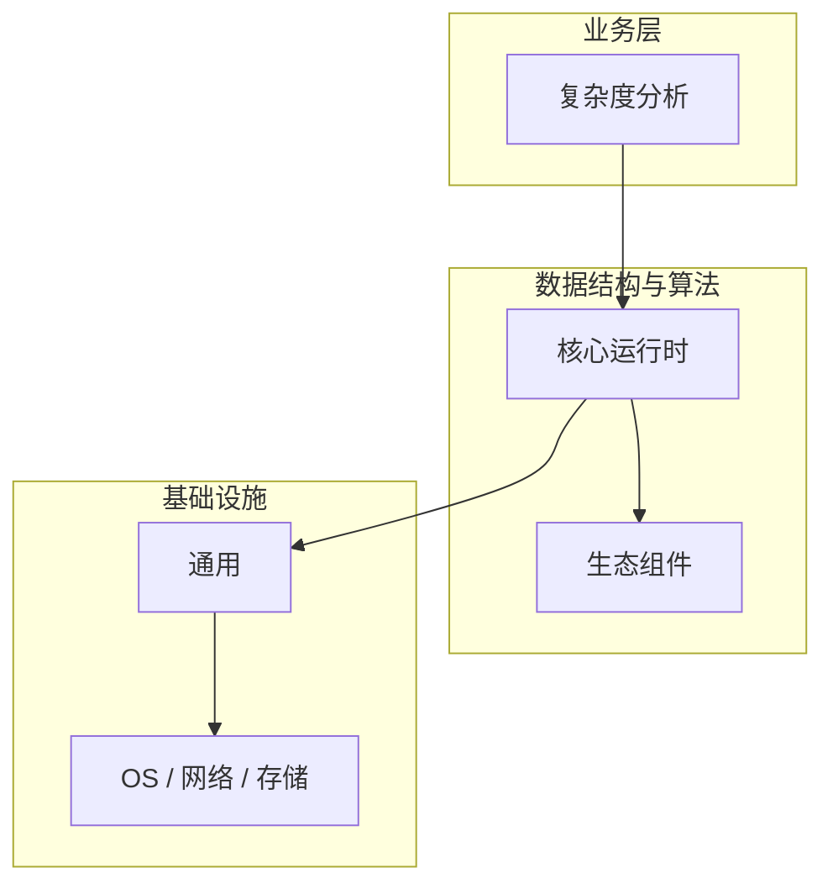

# 复杂度分析的高级应用场景

> **领域**：数据结构与算法 ｜ **模块**：复杂度分析 ｜ **难度**：入门 ｜ **类型**：高级应用

## 导读

本章系统讲解 **数据结构与算法** 中 **复杂度分析** 的相关知识（高级应用）。本章介绍 **复杂度分析** 在复杂场景下的扩展用法与架构组合。内容基于主流框架与工程实践撰写，不依赖过时概念堆砌。

## 核心知识

**复杂度分析** 是 数据结构与算法 领域的核心主题。大 O 表示法与复杂度计算。本模块从原理与工程实践出发，帮助读者建立系统理解。

### 核心知识

**1. 大O**

描述算法最坏情况下的增长趋势。

**2. 常见**

O(1)<O(logn)<O(n)<O(nlogn)<O(n²)<O(2ⁿ)。

**3. 均摊**

均摊分析考虑操作序列的平均代价。

## 架构与流程

## 技术详解

### 高级应用

识别基本操作 → 计数执行次数 → 取最高阶 → 大O 表示。

## 原理与实现

### 工作机制

识别基本操作 → 计数执行次数 → 取最高阶 → 大O 表示。

### 内部实现

复杂度分析 的底层实现依赖 数据结构与算法 生态中的标准组件与协议，建议阅读官方规范文档。

## 操作流程与实践

### 操作流程

1. 理解 复杂度分析 概念 → 2. 学习标准用法 → 3. 动手实验 → 4. 分析案例 → 5. 总结最佳实践。

### 配置要点

配置 复杂度分析 时遵循官方推荐默认值，仅在理解影响后调整参数。

## 性能、安全与排查

### 性能优化

评估 复杂度分析 性能时建立基准测试，关注时间/空间复杂度或系统吞吐延迟指标。

### 安全注意

在 数据结构与算法 场景下注意输入校验、权限控制与敏感数据保护。

### 调试排错

排查 复杂度分析 问题时，结合日志、监控与最小复现用例逐步定位根因。

## 案例与选型

### 案例复盘

在典型 数据结构与算法 项目中，正确应用 复杂度分析 可显著提升系统质量与可维护性。

### 方案对比

选择 复杂度分析 方案时需对比多种替代方案的适用场景、性能与生态支持。

### 常见误区与纠正

**概念理解偏差**

对 复杂度分析 理解不全面导致误用，应回到官方文档重新梳理。

**忽视边界条件**

复杂度分析 在极端输入或高并发下行为可能不同，需充分测试。

**缺少监控**

未对 复杂度分析 关键指标监控，问题只能被动发现。

### 最佳实践

1. 遵循 数据结构与算法 领域 复杂度分析 的官方推荐实践
2. 为 复杂度分析 相关功能编写自动化测试
3. 关键配置纳入版本管理与变更审计
4. 生产部署前在接近真实环境验证

## 巩固建议

建议结合 **数据结构与算法** 官方文档与小型实验，亲手验证 **复杂度分析** 的默认行为与边界条件；将本章要点整理为检查清单或 ADR，便于评审与团队 onboarding。

### 本章小结

学完本章，你应能独立说明 **复杂度分析** 在 数据结构与算法 中的角色，理解其核心机制，规避常见误区，并在项目中正确运用。

## 延伸学习

- 复杂度分析核心概念与原理
- 复杂度分析的实现机制详解
- 复杂度分析的关键技术点
- 复杂度分析的源码级分析
- 复杂度分析的配置与使用

### 延伸阅读

- 数据结构与算法 官方文档 - 复杂度分析
- OWASP / NIST 相关指南（如适用）
- 权威书籍与 RFC 标准文档

---
*章节 ID: 018 ｜ 领域: 数据结构与算法*