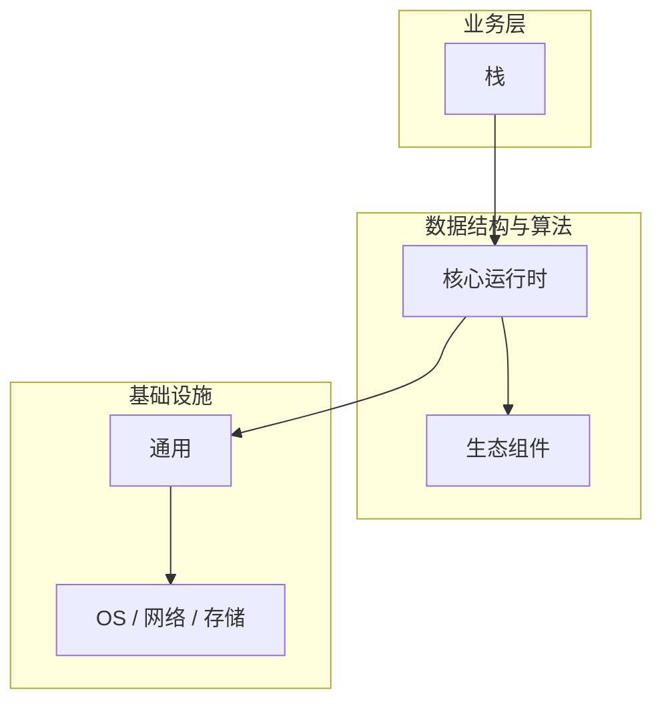

# 栈的高级应用场景

> **领域**：数据结构与算法 ｜ **模块**：栈 ｜ **难度**：入门 ｜ **类型**：高级应用

## 导读

本章系统讲解 **数据结构与算法** 中 **栈** 的相关知识（高级应用）。本章介绍 **栈** 在复杂场景下的扩展用法与架构组合。内容基于主流框架与工程实践撰写，不依赖过时概念堆砌。

## 核心知识

**栈** 是 数据结构与算法 领域的核心主题。栈 LIFO 结构与应用。本模块从原理与工程实践出发，帮助读者建立系统理解。

### 核心知识

**1. 操作**

push/pop/top 均 O(1)。

**2. 应用**

括号匹配、表达式求值、DFS、函数调用栈。

**3. 实现**

数组栈或链表栈。

## 架构与流程

## 技术详解

### 高级应用

push 入栈 → pop 出栈 → 应用：单调栈解决下一个更大元素。

## 原理与实现

### 工作机制

push 入栈 → pop 出栈 → 应用：单调栈解决下一个更大元素。

### 内部实现

栈 的底层实现依赖 数据结构与算法 生态中的标准组件与协议，建议阅读官方规范文档。

## 操作流程与实践

### 操作流程

1. 理解 栈 概念 → 2. 学习标准用法 → 3. 动手实验 → 4. 分析案例 → 5. 总结最佳实践。

### 配置要点

配置 栈 时遵循官方推荐默认值，仅在理解影响后调整参数。

## 性能、安全与排查

### 性能优化

评估 栈 性能时建立基准测试，关注时间/空间复杂度或系统吞吐延迟指标。

### 安全注意

在 数据结构与算法 场景下注意输入校验、权限控制与敏感数据保护。

### 调试排错

排查 栈 问题时，结合日志、监控与最小复现用例逐步定位根因。

## 案例与选型

### 案例复盘

在典型 数据结构与算法 项目中，正确应用 栈 可显著提升系统质量与可维护性。

### 方案对比

选择 栈 方案时需对比多种替代方案的适用场景、性能与生态支持。

### 常见误区与纠正

**概念理解偏差**

对 栈 理解不全面导致误用，应回到官方文档重新梳理。

**忽视边界条件**

栈 在极端输入或高并发下行为可能不同，需充分测试。

**缺少监控**

未对 栈 关键指标监控，问题只能被动发现。

### 最佳实践

1. 遵循 数据结构与算法 领域 栈 的官方推荐实践
2. 为 栈 相关功能编写自动化测试
3. 关键配置纳入版本管理与变更审计
4. 生产部署前在接近真实环境验证

## 巩固建议

建议结合 **数据结构与算法** 官方文档与小型实验，亲手验证 **栈** 的默认行为与边界条件；将本章要点整理为检查清单或 ADR，便于评审与团队 onboarding。

### 本章小结

学完本章，你应能独立说明 **栈** 在 数据结构与算法 中的角色，理解其核心机制，规避常见误区，并在项目中正确运用。

## 延伸学习

- 栈核心概念与原理
- 栈的实现机制详解
- 栈的关键技术点
- 栈的源码级分析
- 栈的配置与使用

### 延伸阅读

- 数据结构与算法 官方文档 - 栈
- OWASP / NIST 相关指南（如适用）
- 权威书籍与 RFC 标准文档

---
*章节 ID: 045 ｜ 领域: 数据结构与算法*