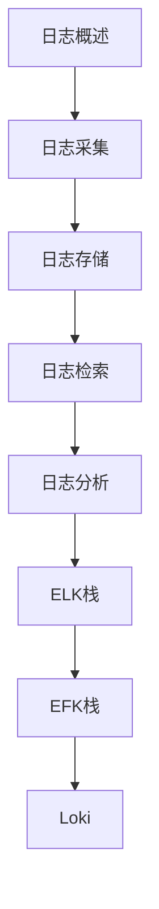

# 日志分析 学习指南

> **分类**：DevOps ｜ **技术生态**：Elasticsearch、Logstash、Filebeat、Loki、Fluent Bit

## 领域定位

集中式日志采集（Filebeat/Fluent Bit）→ 存储检索（Elasticsearch/Loki）→ 可视化告警，是排障与审计的基础设施。

覆盖结构化日志、ELK/EFK、Loki label 设计与日志安全合规。

本领域常用技术栈与工具包括：Elasticsearch、Logstash、Filebeat、Loki、Fluent Bit。

## 学习目标

- 能设计 JSON 结构化日志字段
- 能搭建 ELK 或 Loki 栈
- 能编写 Kibana/LogQL 查询
- 能配置日志保留与脱敏

## 前置知识

- Linux 日志
- JSON
- 基本正则

## 学习路径

1. **日志概述**
2. **日志采集**
3. **日志存储**
4. **日志检索**
5. **日志分析**
6. **ELK栈**
7. **EFK栈**
8. **Loki**

## 模块体系

- **日志概述**
- **日志采集**
- **日志存储**
- **日志检索**
- **日志分析**
- **ELK栈**
- **EFK栈**
- **Loki**
- **日志告警**
- **日志安全**
- **日志最佳实践**

## 难度分布

| 入门 | 12 | 20% |
| 实战 | 15 | 25% |
| 进阶 | 18 | 30% |
| 高级 | 15 | 25% |

## 章节索引

### 日志概述

- [日志概述核心概念与原理](chapters/001-日志概述核心概念与原理.md) ｜ 入门
- [日志概述的实现机制详解](chapters/002-日志概述的实现机制详解.md) ｜ 入门
- [日志概述的关键技术点](chapters/003-日志概述的关键技术点.md) ｜ 入门
- [日志概述的源码级分析](chapters/004-日志概述的源码级分析.md) ｜ 入门
- [日志概述的配置与使用](chapters/005-日志概述的配置与使用.md) ｜ 入门
- [日志概述的常见问题与解决方案](chapters/006-日志概述的常见问题与解决方案.md) ｜ 入门

### 日志采集

- [日志采集核心概念与原理](chapters/007-日志采集核心概念与原理.md) ｜ 入门
- [日志采集的实现机制详解](chapters/008-日志采集的实现机制详解.md) ｜ 入门
- [日志采集的关键技术点](chapters/009-日志采集的关键技术点.md) ｜ 入门
- [日志采集的源码级分析](chapters/010-日志采集的源码级分析.md) ｜ 入门
- [日志采集的配置与使用](chapters/011-日志采集的配置与使用.md) ｜ 入门
- [日志采集的常见问题与解决方案](chapters/012-日志采集的常见问题与解决方案.md) ｜ 入门

### 日志存储

- [日志存储核心概念与原理](chapters/013-日志存储核心概念与原理.md) ｜ 进阶
- [日志存储的实现机制详解](chapters/014-日志存储的实现机制详解.md) ｜ 进阶
- [日志存储的关键技术点](chapters/015-日志存储的关键技术点.md) ｜ 进阶
- [日志存储的源码级分析](chapters/016-日志存储的源码级分析.md) ｜ 进阶
- [日志存储的配置与使用](chapters/017-日志存储的配置与使用.md) ｜ 进阶
- [日志存储的常见问题与解决方案](chapters/018-日志存储的常见问题与解决方案.md) ｜ 进阶

### 日志检索

- [日志检索核心概念与原理](chapters/019-日志检索核心概念与原理.md) ｜ 进阶
- [日志检索的实现机制详解](chapters/020-日志检索的实现机制详解.md) ｜ 进阶
- [日志检索的关键技术点](chapters/021-日志检索的关键技术点.md) ｜ 进阶
- [日志检索的源码级分析](chapters/022-日志检索的源码级分析.md) ｜ 进阶
- [日志检索的配置与使用](chapters/023-日志检索的配置与使用.md) ｜ 进阶
- [日志检索的常见问题与解决方案](chapters/024-日志检索的常见问题与解决方案.md) ｜ 进阶

### 日志分析

- [日志分析核心概念与原理](chapters/025-日志分析核心概念与原理.md) ｜ 进阶
- [日志分析的实现机制详解](chapters/026-日志分析的实现机制详解.md) ｜ 进阶
- [日志分析的关键技术点](chapters/027-日志分析的关键技术点.md) ｜ 进阶
- [日志分析的源码级分析](chapters/028-日志分析的源码级分析.md) ｜ 进阶
- [日志分析的配置与使用](chapters/029-日志分析的配置与使用.md) ｜ 进阶
- [日志分析的常见问题与解决方案](chapters/030-日志分析的常见问题与解决方案.md) ｜ 进阶

### ELK栈

- [ELK栈核心概念与原理](chapters/031-ELK栈核心概念与原理.md) ｜ 高级
- [ELK栈的实现机制详解](chapters/032-ELK栈的实现机制详解.md) ｜ 高级
- [ELK栈的关键技术点](chapters/033-ELK栈的关键技术点.md) ｜ 高级
- [ELK栈的源码级分析](chapters/034-ELK栈的源码级分析.md) ｜ 高级
- [ELK栈的配置与使用](chapters/035-ELK栈的配置与使用.md) ｜ 高级

### EFK栈

- [EFK栈核心概念与原理](chapters/036-EFK栈核心概念与原理.md) ｜ 高级
- [EFK栈的实现机制详解](chapters/037-EFK栈的实现机制详解.md) ｜ 高级
- [EFK栈的关键技术点](chapters/038-EFK栈的关键技术点.md) ｜ 高级
- [EFK栈的源码级分析](chapters/039-EFK栈的源码级分析.md) ｜ 高级
- [EFK栈的配置与使用](chapters/040-EFK栈的配置与使用.md) ｜ 高级

### Loki

- [Loki核心概念与原理](chapters/041-Loki核心概念与原理.md) ｜ 高级
- [Loki的实现机制详解](chapters/042-Loki的实现机制详解.md) ｜ 高级
- [Loki的关键技术点](chapters/043-Loki的关键技术点.md) ｜ 高级
- [Loki的源码级分析](chapters/044-Loki的源码级分析.md) ｜ 高级
- [Loki的配置与使用](chapters/045-Loki的配置与使用.md) ｜ 高级

### 日志告警

- [日志告警核心概念与原理](chapters/046-日志告警核心概念与原理.md) ｜ 实战
- [日志告警的实现机制详解](chapters/047-日志告警的实现机制详解.md) ｜ 实战
- [日志告警的关键技术点](chapters/048-日志告警的关键技术点.md) ｜ 实战
- [日志告警的源码级分析](chapters/049-日志告警的源码级分析.md) ｜ 实战
- [日志告警的配置与使用](chapters/050-日志告警的配置与使用.md) ｜ 实战

### 日志安全

- [日志安全核心概念与原理](chapters/051-日志安全核心概念与原理.md) ｜ 实战
- [日志安全的实现机制详解](chapters/052-日志安全的实现机制详解.md) ｜ 实战
- [日志安全的关键技术点](chapters/053-日志安全的关键技术点.md) ｜ 实战
- [日志安全的源码级分析](chapters/054-日志安全的源码级分析.md) ｜ 实战
- [日志安全的配置与使用](chapters/055-日志安全的配置与使用.md) ｜ 实战

### 日志最佳实践

- [日志最佳实践核心概念与原理](chapters/056-日志最佳实践核心概念与原理.md) ｜ 实战
- [日志最佳实践的实现机制详解](chapters/057-日志最佳实践的实现机制详解.md) ｜ 实战
- [日志最佳实践的关键技术点](chapters/058-日志最佳实践的关键技术点.md) ｜ 实战
- [日志最佳实践的源码级分析](chapters/059-日志最佳实践的源码级分析.md) ｜ 实战
- [日志最佳实践的配置与使用](chapters/060-日志最佳实践的配置与使用.md) ｜ 实战

---
*领域: 日志分析*