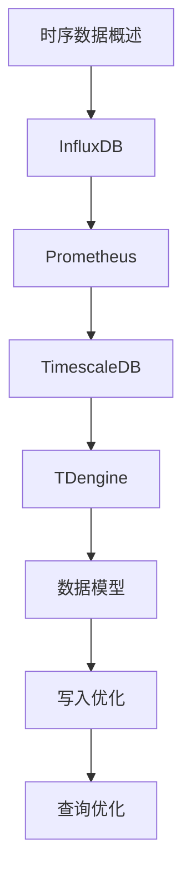

# 时序数据库 学习指南

> **分类**：数据存储 ｜ **技术生态**：Prometheus、InfluxDB、TimescaleDB、TDengine、VictoriaMetrics

## 领域定位

时序数据库优化时间戳索引写入与范围聚合，用于监控、IoT 与 APM。Prometheus TSDB、InfluxDB、TimescaleDB 是常见选型。

覆盖数据模型、降采样、保留策略与高 cardinality 治理。

本领域常用技术栈与工具包括：Prometheus、InfluxDB、TimescaleDB、TDengine、VictoriaMetrics。

## 学习目标

- 能设计 metric labels 避免 cardinality 爆炸
- 能配置 retention 与 downsampling
- 能选型 Prometheus vs InfluxDB
- 能优化批量写入

## 前置知识

- 监控指标概念
- Prometheus 基础更佳

## 学习路径

1. **时序数据概述**
2. **InfluxDB**
3. **Prometheus**
4. **TimescaleDB**
5. **TDengine**
6. **数据模型**
7. **写入优化**
8. **查询优化**

## 模块体系

- **时序数据概述**
- **InfluxDB**
- **Prometheus**
- **TimescaleDB**
- **TDengine**
- **数据模型**
- **写入优化**
- **查询优化**
- **降采样**
- **保留策略**
- **时序数据库最佳实践**

## 难度分布

| 入门 | 12 | 20% |
| 实战 | 15 | 25% |
| 进阶 | 18 | 30% |
| 高级 | 15 | 25% |

## 章节索引

### 时序数据概述

- [时序数据概述核心概念与原理](chapters/001-时序数据概述核心概念与原理.md) ｜ 入门
- [时序数据概述的实现机制详解](chapters/002-时序数据概述的实现机制详解.md) ｜ 入门
- [时序数据概述的关键技术点](chapters/003-时序数据概述的关键技术点.md) ｜ 入门
- [时序数据概述的源码级分析](chapters/004-时序数据概述的源码级分析.md) ｜ 入门
- [时序数据概述的配置与使用](chapters/005-时序数据概述的配置与使用.md) ｜ 入门
- [时序数据概述的常见问题与解决方案](chapters/006-时序数据概述的常见问题与解决方案.md) ｜ 入门

### InfluxDB

- [InfluxDB核心概念与原理](chapters/007-InfluxDB核心概念与原理.md) ｜ 入门
- [InfluxDB的实现机制详解](chapters/008-InfluxDB的实现机制详解.md) ｜ 入门
- [InfluxDB的关键技术点](chapters/009-InfluxDB的关键技术点.md) ｜ 入门
- [InfluxDB的源码级分析](chapters/010-InfluxDB的源码级分析.md) ｜ 入门
- [InfluxDB的配置与使用](chapters/011-InfluxDB的配置与使用.md) ｜ 入门
- [InfluxDB的常见问题与解决方案](chapters/012-InfluxDB的常见问题与解决方案.md) ｜ 入门

### Prometheus

- [Prometheus核心概念与原理](chapters/013-Prometheus核心概念与原理.md) ｜ 进阶
- [Prometheus的实现机制详解](chapters/014-Prometheus的实现机制详解.md) ｜ 进阶
- [Prometheus的关键技术点](chapters/015-Prometheus的关键技术点.md) ｜ 进阶
- [Prometheus的源码级分析](chapters/016-Prometheus的源码级分析.md) ｜ 进阶
- [Prometheus的配置与使用](chapters/017-Prometheus的配置与使用.md) ｜ 进阶
- [Prometheus的常见问题与解决方案](chapters/018-Prometheus的常见问题与解决方案.md) ｜ 进阶

### TimescaleDB

- [TimescaleDB核心概念与原理](chapters/019-TimescaleDB核心概念与原理.md) ｜ 进阶
- [TimescaleDB的实现机制详解](chapters/020-TimescaleDB的实现机制详解.md) ｜ 进阶
- [TimescaleDB的关键技术点](chapters/021-TimescaleDB的关键技术点.md) ｜ 进阶
- [TimescaleDB的源码级分析](chapters/022-TimescaleDB的源码级分析.md) ｜ 进阶
- [TimescaleDB的配置与使用](chapters/023-TimescaleDB的配置与使用.md) ｜ 进阶
- [TimescaleDB的常见问题与解决方案](chapters/024-TimescaleDB的常见问题与解决方案.md) ｜ 进阶

### TDengine

- [TDengine核心概念与原理](chapters/025-TDengine核心概念与原理.md) ｜ 进阶
- [TDengine的实现机制详解](chapters/026-TDengine的实现机制详解.md) ｜ 进阶
- [TDengine的关键技术点](chapters/027-TDengine的关键技术点.md) ｜ 进阶
- [TDengine的源码级分析](chapters/028-TDengine的源码级分析.md) ｜ 进阶
- [TDengine的配置与使用](chapters/029-TDengine的配置与使用.md) ｜ 进阶
- [TDengine的常见问题与解决方案](chapters/030-TDengine的常见问题与解决方案.md) ｜ 进阶

### 数据模型

- [数据模型核心概念与原理](chapters/031-数据模型核心概念与原理.md) ｜ 高级
- [数据模型的实现机制详解](chapters/032-数据模型的实现机制详解.md) ｜ 高级
- [数据模型的关键技术点](chapters/033-数据模型的关键技术点.md) ｜ 高级
- [数据模型的源码级分析](chapters/034-数据模型的源码级分析.md) ｜ 高级
- [数据模型的配置与使用](chapters/035-数据模型的配置与使用.md) ｜ 高级

### 写入优化

- [写入优化核心概念与原理](chapters/036-写入优化核心概念与原理.md) ｜ 高级
- [写入优化的实现机制详解](chapters/037-写入优化的实现机制详解.md) ｜ 高级
- [写入优化的关键技术点](chapters/038-写入优化的关键技术点.md) ｜ 高级
- [写入优化的源码级分析](chapters/039-写入优化的源码级分析.md) ｜ 高级
- [写入优化的配置与使用](chapters/040-写入优化的配置与使用.md) ｜ 高级

### 查询优化

- [查询优化核心概念与原理](chapters/041-查询优化核心概念与原理.md) ｜ 高级
- [查询优化的实现机制详解](chapters/042-查询优化的实现机制详解.md) ｜ 高级
- [查询优化的关键技术点](chapters/043-查询优化的关键技术点.md) ｜ 高级
- [查询优化的源码级分析](chapters/044-查询优化的源码级分析.md) ｜ 高级
- [查询优化的配置与使用](chapters/045-查询优化的配置与使用.md) ｜ 高级

### 降采样

- [降采样核心概念与原理](chapters/046-降采样核心概念与原理.md) ｜ 实战
- [降采样的实现机制详解](chapters/047-降采样的实现机制详解.md) ｜ 实战
- [降采样的关键技术点](chapters/048-降采样的关键技术点.md) ｜ 实战
- [降采样的源码级分析](chapters/049-降采样的源码级分析.md) ｜ 实战
- [降采样的配置与使用](chapters/050-降采样的配置与使用.md) ｜ 实战

### 保留策略

- [保留策略核心概念与原理](chapters/051-保留策略核心概念与原理.md) ｜ 实战
- [保留策略的实现机制详解](chapters/052-保留策略的实现机制详解.md) ｜ 实战
- [保留策略的关键技术点](chapters/053-保留策略的关键技术点.md) ｜ 实战
- [保留策略的源码级分析](chapters/054-保留策略的源码级分析.md) ｜ 实战
- [保留策略的配置与使用](chapters/055-保留策略的配置与使用.md) ｜ 实战

### 时序数据库最佳实践

- [时序数据库最佳实践核心概念与原理](chapters/056-时序数据库最佳实践核心概念与原理.md) ｜ 实战
- [时序数据库最佳实践的实现机制详解](chapters/057-时序数据库最佳实践的实现机制详解.md) ｜ 实战
- [时序数据库最佳实践的关键技术点](chapters/058-时序数据库最佳实践的关键技术点.md) ｜ 实战
- [时序数据库最佳实践的源码级分析](chapters/059-时序数据库最佳实践的源码级分析.md) ｜ 实战
- [时序数据库最佳实践的配置与使用](chapters/060-时序数据库最佳实践的配置与使用.md) ｜ 实战

---
*领域: 时序数据库*