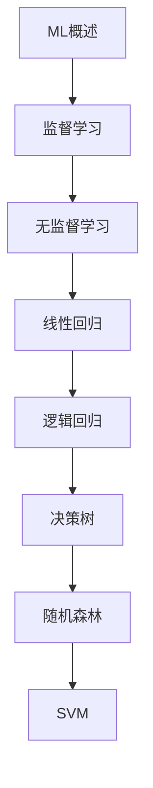

# 机器学习 学习指南

> **分类**：AI与算法 ｜ **技术生态**：scikit-learn, XGBoost, LightGBM, Jupyter, MLflow

## 领域定位

机器学习让计算机从数据中学习模式，无需显式编程规则。监督学习（分类/回归）、无监督学习（聚类/降维）与集成方法是核心内容，scikit-learn 提供经典算法实现，是入门与实践的首选工具。

面向数据分析师与工程师，侧重算法原理、特征工程与模型评估。

本领域常用技术栈与工具包括：scikit-learn, XGBoost, LightGBM, Jupyter, MLflow。

## 学习目标

- 选择并训练适合的监督/无监督模型
- 完成特征工程与超参数调优
- 使用交叉验证与指标评估模型泛化能力
- 部署模型并监控数据漂移

## 前置知识

- Python
- 线性代数
- 概率统计
- NumPy/Pandas

## 学习路径

1. **ML概述**
2. **监督学习**
3. **无监督学习**
4. **线性回归**
5. **逻辑回归**
6. **决策树**
7. **随机森林**
8. **SVM**

## 模块体系

- **ML概述**
- **监督学习**
- **无监督学习**
- **线性回归**
- **逻辑回归**
- **决策树**
- **随机森林**
- **SVM**
- **KNN**
- **朴素贝叶斯**
- **KMeans**
- **DBSCAN**
- **PCA**
- **特征工程**
- **模型评估**
- **交叉验证**
- **超参数调优**
- **集成学习**
- **XGBoost**
- **LightGBM**
- **推荐系统**
- **ML最佳实践**

## 难度分布

| 入门 | 35 | 23% |
| 实战 | 31 | 20% |
| 进阶 | 42 | 28% |
| 高级 | 42 | 28% |

## 章节索引

### ML概述

- [ML概述核心概念与原理](chapters/001-ML概述核心概念与原理.md) ｜ 入门
- [ML概述的实现机制详解](chapters/002-ML概述的实现机制详解.md) ｜ 入门
- [ML概述的关键技术点](chapters/003-ML概述的关键技术点.md) ｜ 入门
- [ML概述的源码级分析](chapters/004-ML概述的源码级分析.md) ｜ 入门
- [ML概述的配置与使用](chapters/005-ML概述的配置与使用.md) ｜ 入门
- [ML概述的常见问题与解决方案](chapters/006-ML概述的常见问题与解决方案.md) ｜ 入门
- [ML概述的性能优化技巧](chapters/007-ML概述的性能优化技巧.md) ｜ 入门

### 监督学习

- [监督学习核心概念与原理](chapters/008-监督学习核心概念与原理.md) ｜ 入门
- [监督学习的实现机制详解](chapters/009-监督学习的实现机制详解.md) ｜ 入门
- [监督学习的关键技术点](chapters/010-监督学习的关键技术点.md) ｜ 入门
- [监督学习的源码级分析](chapters/011-监督学习的源码级分析.md) ｜ 入门
- [监督学习的配置与使用](chapters/012-监督学习的配置与使用.md) ｜ 入门
- [监督学习的常见问题与解决方案](chapters/013-监督学习的常见问题与解决方案.md) ｜ 入门
- [监督学习的性能优化技巧](chapters/014-监督学习的性能优化技巧.md) ｜ 入门

### 无监督学习

- [无监督学习核心概念与原理](chapters/015-无监督学习核心概念与原理.md) ｜ 入门
- [无监督学习的实现机制详解](chapters/016-无监督学习的实现机制详解.md) ｜ 入门
- [无监督学习的关键技术点](chapters/017-无监督学习的关键技术点.md) ｜ 入门
- [无监督学习的源码级分析](chapters/018-无监督学习的源码级分析.md) ｜ 入门
- [无监督学习的配置与使用](chapters/019-无监督学习的配置与使用.md) ｜ 入门
- [无监督学习的常见问题与解决方案](chapters/020-无监督学习的常见问题与解决方案.md) ｜ 入门
- [无监督学习的性能优化技巧](chapters/021-无监督学习的性能优化技巧.md) ｜ 入门

### 线性回归

- [线性回归核心概念与原理](chapters/022-线性回归核心概念与原理.md) ｜ 入门
- [线性回归的实现机制详解](chapters/023-线性回归的实现机制详解.md) ｜ 入门
- [线性回归的关键技术点](chapters/024-线性回归的关键技术点.md) ｜ 入门
- [线性回归的源码级分析](chapters/025-线性回归的源码级分析.md) ｜ 入门
- [线性回归的配置与使用](chapters/026-线性回归的配置与使用.md) ｜ 入门
- [线性回归的常见问题与解决方案](chapters/027-线性回归的常见问题与解决方案.md) ｜ 入门
- [线性回归的性能优化技巧](chapters/028-线性回归的性能优化技巧.md) ｜ 入门

### 逻辑回归

- [逻辑回归核心概念与原理](chapters/029-逻辑回归核心概念与原理.md) ｜ 入门
- [逻辑回归的实现机制详解](chapters/030-逻辑回归的实现机制详解.md) ｜ 入门
- [逻辑回归的关键技术点](chapters/031-逻辑回归的关键技术点.md) ｜ 入门
- [逻辑回归的源码级分析](chapters/032-逻辑回归的源码级分析.md) ｜ 入门
- [逻辑回归的配置与使用](chapters/033-逻辑回归的配置与使用.md) ｜ 入门
- [逻辑回归的常见问题与解决方案](chapters/034-逻辑回归的常见问题与解决方案.md) ｜ 入门
- [逻辑回归的性能优化技巧](chapters/035-逻辑回归的性能优化技巧.md) ｜ 入门

### 决策树

- [决策树核心概念与原理](chapters/036-决策树核心概念与原理.md) ｜ 进阶
- [决策树的实现机制详解](chapters/037-决策树的实现机制详解.md) ｜ 进阶
- [决策树的关键技术点](chapters/038-决策树的关键技术点.md) ｜ 进阶
- [决策树的源码级分析](chapters/039-决策树的源码级分析.md) ｜ 进阶
- [决策树的配置与使用](chapters/040-决策树的配置与使用.md) ｜ 进阶
- [决策树的常见问题与解决方案](chapters/041-决策树的常见问题与解决方案.md) ｜ 进阶
- [决策树的性能优化技巧](chapters/042-决策树的性能优化技巧.md) ｜ 进阶

### 随机森林

- [随机森林核心概念与原理](chapters/043-随机森林核心概念与原理.md) ｜ 进阶
- [随机森林的实现机制详解](chapters/044-随机森林的实现机制详解.md) ｜ 进阶
- [随机森林的关键技术点](chapters/045-随机森林的关键技术点.md) ｜ 进阶
- [随机森林的源码级分析](chapters/046-随机森林的源码级分析.md) ｜ 进阶
- [随机森林的配置与使用](chapters/047-随机森林的配置与使用.md) ｜ 进阶
- [随机森林的常见问题与解决方案](chapters/048-随机森林的常见问题与解决方案.md) ｜ 进阶
- [随机森林的性能优化技巧](chapters/049-随机森林的性能优化技巧.md) ｜ 进阶

### SVM

- [SVM核心概念与原理](chapters/050-SVM核心概念与原理.md) ｜ 进阶
- [SVM的实现机制详解](chapters/051-SVM的实现机制详解.md) ｜ 进阶
- [SVM的关键技术点](chapters/052-SVM的关键技术点.md) ｜ 进阶
- [SVM的源码级分析](chapters/053-SVM的源码级分析.md) ｜ 进阶
- [SVM的配置与使用](chapters/054-SVM的配置与使用.md) ｜ 进阶
- [SVM的常见问题与解决方案](chapters/055-SVM的常见问题与解决方案.md) ｜ 进阶
- [SVM的性能优化技巧](chapters/056-SVM的性能优化技巧.md) ｜ 进阶

### KNN

- [KNN核心概念与原理](chapters/057-KNN核心概念与原理.md) ｜ 进阶
- [KNN的实现机制详解](chapters/058-KNN的实现机制详解.md) ｜ 进阶
- [KNN的关键技术点](chapters/059-KNN的关键技术点.md) ｜ 进阶
- [KNN的源码级分析](chapters/060-KNN的源码级分析.md) ｜ 进阶
- [KNN的配置与使用](chapters/061-KNN的配置与使用.md) ｜ 进阶
- [KNN的常见问题与解决方案](chapters/062-KNN的常见问题与解决方案.md) ｜ 进阶
- [KNN的性能优化技巧](chapters/063-KNN的性能优化技巧.md) ｜ 进阶

### 朴素贝叶斯

- [朴素贝叶斯核心概念与原理](chapters/064-朴素贝叶斯核心概念与原理.md) ｜ 进阶
- [朴素贝叶斯的实现机制详解](chapters/065-朴素贝叶斯的实现机制详解.md) ｜ 进阶
- [朴素贝叶斯的关键技术点](chapters/066-朴素贝叶斯的关键技术点.md) ｜ 进阶
- [朴素贝叶斯的源码级分析](chapters/067-朴素贝叶斯的源码级分析.md) ｜ 进阶
- [朴素贝叶斯的配置与使用](chapters/068-朴素贝叶斯的配置与使用.md) ｜ 进阶
- [朴素贝叶斯的常见问题与解决方案](chapters/069-朴素贝叶斯的常见问题与解决方案.md) ｜ 进阶
- [朴素贝叶斯的性能优化技巧](chapters/070-朴素贝叶斯的性能优化技巧.md) ｜ 进阶

### KMeans

- [KMeans核心概念与原理](chapters/071-KMeans核心概念与原理.md) ｜ 进阶
- [KMeans的实现机制详解](chapters/072-KMeans的实现机制详解.md) ｜ 进阶
- [KMeans的关键技术点](chapters/073-KMeans的关键技术点.md) ｜ 进阶
- [KMeans的源码级分析](chapters/074-KMeans的源码级分析.md) ｜ 进阶
- [KMeans的配置与使用](chapters/075-KMeans的配置与使用.md) ｜ 进阶
- [KMeans的常见问题与解决方案](chapters/076-KMeans的常见问题与解决方案.md) ｜ 进阶
- [KMeans的性能优化技巧](chapters/077-KMeans的性能优化技巧.md) ｜ 进阶

### DBSCAN

- [DBSCAN核心概念与原理](chapters/078-DBSCAN核心概念与原理.md) ｜ 高级
- [DBSCAN的实现机制详解](chapters/079-DBSCAN的实现机制详解.md) ｜ 高级
- [DBSCAN的关键技术点](chapters/080-DBSCAN的关键技术点.md) ｜ 高级
- [DBSCAN的源码级分析](chapters/081-DBSCAN的源码级分析.md) ｜ 高级
- [DBSCAN的配置与使用](chapters/082-DBSCAN的配置与使用.md) ｜ 高级
- [DBSCAN的常见问题与解决方案](chapters/083-DBSCAN的常见问题与解决方案.md) ｜ 高级
- [DBSCAN的性能优化技巧](chapters/084-DBSCAN的性能优化技巧.md) ｜ 高级

### PCA

- [PCA核心概念与原理](chapters/085-PCA核心概念与原理.md) ｜ 高级
- [PCA的实现机制详解](chapters/086-PCA的实现机制详解.md) ｜ 高级
- [PCA的关键技术点](chapters/087-PCA的关键技术点.md) ｜ 高级
- [PCA的源码级分析](chapters/088-PCA的源码级分析.md) ｜ 高级
- [PCA的配置与使用](chapters/089-PCA的配置与使用.md) ｜ 高级
- [PCA的常见问题与解决方案](chapters/090-PCA的常见问题与解决方案.md) ｜ 高级
- [PCA的性能优化技巧](chapters/091-PCA的性能优化技巧.md) ｜ 高级

### 特征工程

- [特征工程核心概念与原理](chapters/092-特征工程核心概念与原理.md) ｜ 高级
- [特征工程的实现机制详解](chapters/093-特征工程的实现机制详解.md) ｜ 高级
- [特征工程的关键技术点](chapters/094-特征工程的关键技术点.md) ｜ 高级
- [特征工程的源码级分析](chapters/095-特征工程的源码级分析.md) ｜ 高级
- [特征工程的配置与使用](chapters/096-特征工程的配置与使用.md) ｜ 高级
- [特征工程的常见问题与解决方案](chapters/097-特征工程的常见问题与解决方案.md) ｜ 高级
- [特征工程的性能优化技巧](chapters/098-特征工程的性能优化技巧.md) ｜ 高级

### 模型评估

- [模型评估核心概念与原理](chapters/099-模型评估核心概念与原理.md) ｜ 高级
- [模型评估的实现机制详解](chapters/100-模型评估的实现机制详解.md) ｜ 高级
- [模型评估的关键技术点](chapters/101-模型评估的关键技术点.md) ｜ 高级
- [模型评估的源码级分析](chapters/102-模型评估的源码级分析.md) ｜ 高级
- [模型评估的配置与使用](chapters/103-模型评估的配置与使用.md) ｜ 高级
- [模型评估的常见问题与解决方案](chapters/104-模型评估的常见问题与解决方案.md) ｜ 高级
- [模型评估的性能优化技巧](chapters/105-模型评估的性能优化技巧.md) ｜ 高级

### 交叉验证

- [交叉验证核心概念与原理](chapters/106-交叉验证核心概念与原理.md) ｜ 高级
- [交叉验证的实现机制详解](chapters/107-交叉验证的实现机制详解.md) ｜ 高级
- [交叉验证的关键技术点](chapters/108-交叉验证的关键技术点.md) ｜ 高级
- [交叉验证的源码级分析](chapters/109-交叉验证的源码级分析.md) ｜ 高级
- [交叉验证的配置与使用](chapters/110-交叉验证的配置与使用.md) ｜ 高级
- [交叉验证的常见问题与解决方案](chapters/111-交叉验证的常见问题与解决方案.md) ｜ 高级
- [交叉验证的性能优化技巧](chapters/112-交叉验证的性能优化技巧.md) ｜ 高级

### 超参数调优

- [超参数调优核心概念与原理](chapters/113-超参数调优核心概念与原理.md) ｜ 高级
- [超参数调优的实现机制详解](chapters/114-超参数调优的实现机制详解.md) ｜ 高级
- [超参数调优的关键技术点](chapters/115-超参数调优的关键技术点.md) ｜ 高级
- [超参数调优的源码级分析](chapters/116-超参数调优的源码级分析.md) ｜ 高级
- [超参数调优的配置与使用](chapters/117-超参数调优的配置与使用.md) ｜ 高级
- [超参数调优的常见问题与解决方案](chapters/118-超参数调优的常见问题与解决方案.md) ｜ 高级
- [超参数调优的性能优化技巧](chapters/119-超参数调优的性能优化技巧.md) ｜ 高级

### 集成学习

- [集成学习核心概念与原理](chapters/120-集成学习核心概念与原理.md) ｜ 实战
- [集成学习的实现机制详解](chapters/121-集成学习的实现机制详解.md) ｜ 实战
- [集成学习的关键技术点](chapters/122-集成学习的关键技术点.md) ｜ 实战
- [集成学习的源码级分析](chapters/123-集成学习的源码级分析.md) ｜ 实战
- [集成学习的配置与使用](chapters/124-集成学习的配置与使用.md) ｜ 实战
- [集成学习的常见问题与解决方案](chapters/125-集成学习的常见问题与解决方案.md) ｜ 实战
- [集成学习的性能优化技巧](chapters/126-集成学习的性能优化技巧.md) ｜ 实战

### XGBoost

- [XGBoost核心概念与原理](chapters/127-XGBoost核心概念与原理.md) ｜ 实战
- [XGBoost的实现机制详解](chapters/128-XGBoost的实现机制详解.md) ｜ 实战
- [XGBoost的关键技术点](chapters/129-XGBoost的关键技术点.md) ｜ 实战
- [XGBoost的源码级分析](chapters/130-XGBoost的源码级分析.md) ｜ 实战
- [XGBoost的配置与使用](chapters/131-XGBoost的配置与使用.md) ｜ 实战
- [XGBoost的常见问题与解决方案](chapters/132-XGBoost的常见问题与解决方案.md) ｜ 实战

### LightGBM

- [LightGBM核心概念与原理](chapters/133-LightGBM核心概念与原理.md) ｜ 实战
- [LightGBM的实现机制详解](chapters/134-LightGBM的实现机制详解.md) ｜ 实战
- [LightGBM的关键技术点](chapters/135-LightGBM的关键技术点.md) ｜ 实战
- [LightGBM的源码级分析](chapters/136-LightGBM的源码级分析.md) ｜ 实战
- [LightGBM的配置与使用](chapters/137-LightGBM的配置与使用.md) ｜ 实战
- [LightGBM的常见问题与解决方案](chapters/138-LightGBM的常见问题与解决方案.md) ｜ 实战

### 推荐系统

- [推荐系统核心概念与原理](chapters/139-推荐系统核心概念与原理.md) ｜ 实战
- [推荐系统的实现机制详解](chapters/140-推荐系统的实现机制详解.md) ｜ 实战
- [推荐系统的关键技术点](chapters/141-推荐系统的关键技术点.md) ｜ 实战
- [推荐系统的源码级分析](chapters/142-推荐系统的源码级分析.md) ｜ 实战
- [推荐系统的配置与使用](chapters/143-推荐系统的配置与使用.md) ｜ 实战
- [推荐系统的常见问题与解决方案](chapters/144-推荐系统的常见问题与解决方案.md) ｜ 实战

### ML最佳实践

- [ML最佳实践核心概念与原理](chapters/145-ML最佳实践核心概念与原理.md) ｜ 实战
- [ML最佳实践的实现机制详解](chapters/146-ML最佳实践的实现机制详解.md) ｜ 实战
- [ML最佳实践的关键技术点](chapters/147-ML最佳实践的关键技术点.md) ｜ 实战
- [ML最佳实践的源码级分析](chapters/148-ML最佳实践的源码级分析.md) ｜ 实战
- [ML最佳实践的配置与使用](chapters/149-ML最佳实践的配置与使用.md) ｜ 实战
- [ML最佳实践的常见问题与解决方案](chapters/150-ML最佳实践的常见问题与解决方案.md) ｜ 实战

---
*领域: 机器学习*