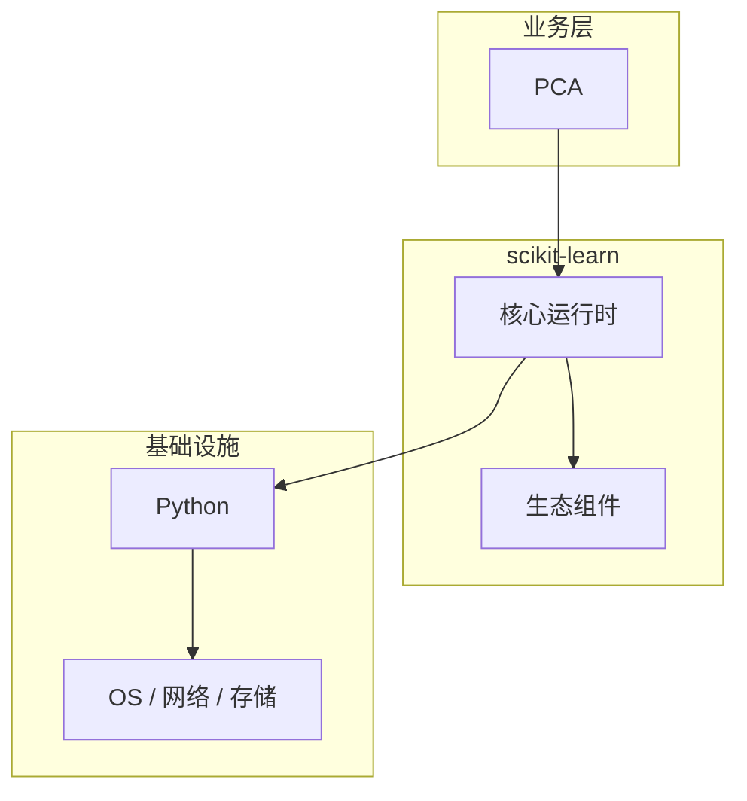

# PCA的性能优化技巧

> **领域**：机器学习 ｜ **模块**：PCA ｜ **难度**：高级 ｜ **类型**：性能优化

## 导读

本章系统讲解 **机器学习** 中 **PCA** 的相关知识（性能优化）。本章从度量指标、瓶颈定位与优化手段三方面讲解 **PCA** 的性能议题。内容基于主流框架与工程实践撰写，不依赖过时概念堆砌。

## 核心知识

**PCA** 是 机器学习 领域的核心主题。主成分分析降维。本模块从原理与工程实践出发，帮助读者建立系统理解。

### 核心知识

**1. 原理**

找方差最大的正交方向作为新轴。

**2. 步骤**

标准化 → 协方差矩阵 → 特征分解 → 选前 k 个。

**3. 应用**

可视化、去噪、特征压缩。

## 架构与流程

## 技术详解

### 性能优化

数据中心化 → SVD/特征分解 → 投影到主成分。

## 原理与实现

### 工作机制

数据中心化 → SVD/特征分解 → 投影到主成分。

### 内部实现

PCA 的底层实现依赖 机器学习 生态中的标准组件与协议，建议阅读官方规范文档。

## 操作流程与实践

### 操作流程

1. 理解 PCA 概念 → 2. 学习标准用法 → 3. 动手实验 → 4. 分析案例 → 5. 总结最佳实践。

### 配置要点

配置 PCA 时遵循官方推荐默认值，仅在理解影响后调整参数。

## 性能、安全与排查

### 性能优化

评估 PCA 性能时建立基准测试，关注时间/空间复杂度或系统吞吐延迟指标。

### 安全注意

在 机器学习 场景下注意输入校验、权限控制与敏感数据保护。

### 调试排错

排查 PCA 问题时，结合日志、监控与最小复现用例逐步定位根因。

## 案例与选型

### 案例复盘

在典型 机器学习 项目中，正确应用 PCA 可显著提升系统质量与可维护性。

### 方案对比

选择 PCA 方案时需对比多种替代方案的适用场景、性能与生态支持。

## 本章聚焦

针对 **PCA**，性能工作应「先度量后优化」：明确 P50/P95/P99 与资源占用基线，用 profiler/trace 定位热点，优先处理 I/O、锁竞争与算法复杂度问题，避免无数据支撑的微调。

### 常见误区与纠正

**概念理解偏差**

对 PCA 理解不全面导致误用，应回到官方文档重新梳理。

**忽视边界条件**

PCA 在极端输入或高并发下行为可能不同，需充分测试。

**缺少监控**

未对 PCA 关键指标监控，问题只能被动发现。

### 最佳实践

1. 遵循 机器学习 领域 PCA 的官方推荐实践
2. 为 PCA 相关功能编写自动化测试
3. 关键配置纳入版本管理与变更审计
4. 生产部署前在接近真实环境验证

## 巩固建议

建议结合 **机器学习** 官方文档与小型实验，亲手验证 **PCA** 的默认行为与边界条件；将本章要点整理为检查清单或 ADR，便于评审与团队 onboarding。

### 本章小结

学完本章，你应能独立说明 **PCA** 在 机器学习 中的角色，理解其核心机制，规避常见误区，并在项目中正确运用。

## 延伸学习

- PCA核心概念与原理
- PCA的实现机制详解
- PCA的关键技术点
- PCA的源码级分析
- PCA的配置与使用

### 延伸阅读

- 机器学习 官方文档 - PCA
- OWASP / NIST 相关指南（如适用）
- 权威书籍与 RFC 标准文档

---
*章节 ID: 091 ｜ 领域: 机器学习*