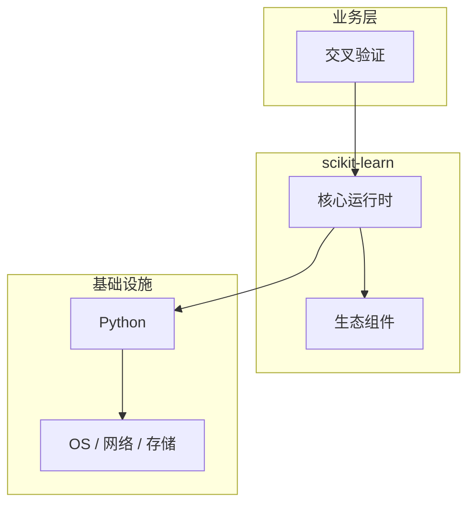

# 交叉验证的常见问题与解决方案

> **领域**：机器学习 ｜ **模块**：交叉验证 ｜ **难度**：高级 ｜ **类型**：问题排查

## 导读

本章系统讲解 **机器学习** 中 **交叉验证** 的相关知识（问题排查）。本章围绕 **交叉验证** 的典型故障现象、根因定位与修复步骤组织内容。内容基于主流框架与工程实践撰写，不依赖过时概念堆砌。

## 核心知识

**交叉验证** 是 机器学习 领域的核心主题。K-Fold 与交叉验证。本模块从原理与工程实践出发，帮助读者建立系统理解。

### 核心知识

**1. K-Fold**

K 折划分，每折轮流作验证集。

**2. Stratified**

保持类别比例的分层 K-Fold。

**3. LOOCV**

Leave-One-Out，N 小样本时使用。

## 架构与流程

## 技术详解

### 问题排查

K 折划分 → 训练 K 次 → 平均性能 → 选模型。

## 原理与实现

### 工作机制

K 折划分 → 训练 K 次 → 平均性能 → 选模型。

### 内部实现

交叉验证 的底层实现依赖 机器学习 生态中的标准组件与协议，建议阅读官方规范文档。

## 操作流程与实践

### 操作流程

1. 理解 交叉验证 概念 → 2. 学习标准用法 → 3. 动手实验 → 4. 分析案例 → 5. 总结最佳实践。

### 配置要点

配置 交叉验证 时遵循官方推荐默认值，仅在理解影响后调整参数。

## 性能、安全与排查

### 性能优化

评估 交叉验证 性能时建立基准测试，关注时间/空间复杂度或系统吞吐延迟指标。

### 安全注意

在 机器学习 场景下注意输入校验、权限控制与敏感数据保护。

### 调试排错

排查 交叉验证 问题时，结合日志、监控与最小复现用例逐步定位根因。

## 案例与选型

### 案例复盘

在典型 机器学习 项目中，正确应用 交叉验证 可显著提升系统质量与可维护性。

### 方案对比

选择 交叉验证 方案时需对比多种替代方案的适用场景、性能与生态支持。

## 本章聚焦

排障 **交叉验证** 时建议固定顺序：复现 → 收集日志/metrics/trace → 对比最近变更与配置 diff → 最小化隔离实验 → 记录根因与回归用例。

### 常见误区与纠正

**概念理解偏差**

对 交叉验证 理解不全面导致误用，应回到官方文档重新梳理。

**忽视边界条件**

交叉验证 在极端输入或高并发下行为可能不同，需充分测试。

**缺少监控**

未对 交叉验证 关键指标监控，问题只能被动发现。

### 最佳实践

1. 遵循 机器学习 领域 交叉验证 的官方推荐实践
2. 为 交叉验证 相关功能编写自动化测试
3. 关键配置纳入版本管理与变更审计
4. 生产部署前在接近真实环境验证

## 巩固建议

建议结合 **机器学习** 官方文档与小型实验，亲手验证 **交叉验证** 的默认行为与边界条件；将本章要点整理为检查清单或 ADR，便于评审与团队 onboarding。

### 本章小结

学完本章，你应能独立说明 **交叉验证** 在 机器学习 中的角色，理解其核心机制，规避常见误区，并在项目中正确运用。

## 延伸学习

- 交叉验证核心概念与原理
- 交叉验证的实现机制详解
- 交叉验证的关键技术点
- 交叉验证的源码级分析
- 交叉验证的配置与使用

### 延伸阅读

- 机器学习 官方文档 - 交叉验证
- OWASP / NIST 相关指南（如适用）
- 权威书籍与 RFC 标准文档

---
*章节 ID: 111 ｜ 领域: 机器学习*