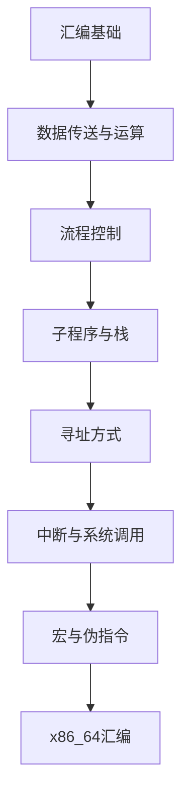

# 汇编语言 学习指南

> **分类**：系统底层 ｜ **章节总数**：80 ｜ **技术栈**：汇编语言

## 领域概述

汇编语言是系统底层领域的重要技术方向，本系列从基础到高级逐步深入，涵盖10个核心模块：汇编基础、数据传送与运算、流程控制、子程序与栈、寻址方式等。每个知识点作为独立章节，包含原理讲解、实现要点、常见陷阱和最佳实践，配合源码分析和架构图，帮助读者建立完整的汇编语言知识体系。

本教程基于 **通用** 与 **汇编语言** 生态编写，涵盖 行业标准工具链 等主流工具与框架。每章独立成篇，文字精炼、逻辑清晰，适合系统学习与按需查阅。

## 你将学到什么

完成本系列后，你将能够：

- 系统理解 **汇编语言** 的核心概念与模块划分。
- 按难度递进掌握从入门到实战的完整知识路径。
- 在工程实践中做出合理的技术判断与问题排查。
- 通过章节索引快速定位所需知识点。

## 前置知识

- 编程基础
- 数据结构
- 计算机基础
- 系统底层基础概念

## 推荐学习路径

1. **汇编基础**
2. **数据传送与运算**
3. **流程控制**
4. **子程序与栈**
5. **寻址方式**
6. **中断与系统调用**
7. **宏与伪指令**
8. **x86_64汇编**

## 模块体系

本领域按以下模块组织，难度由浅入深：

- **汇编基础**
- **数据传送与运算**
- **流程控制**
- **子程序与栈**
- **寻址方式**
- **中断与系统调用**
- **宏与伪指令**
- **x86_64汇编**
- **ARM汇编**
- **汇编优化**

## 难度分布

| 难度 | 章节数 | 占比 |
|------|--------|------|
| 入门 | 16 | 20% |
| 实战 | 16 | 20% |
| 进阶 | 24 | 30% |
| 高级 | 24 | 30% |

## 章节索引

点击章节标题进入对应教程：

### 汇编基础

- [汇编基础核心概念与原理](chapters/001-汇编基础核心概念与原理.md) ｜ 入门
- [汇编基础的实现机制详解](chapters/002-汇编基础的实现机制详解.md) ｜ 入门
- [汇编基础的关键技术点](chapters/003-汇编基础的关键技术点.md) ｜ 入门
- [汇编基础的源码级分析](chapters/004-汇编基础的源码级分析.md) ｜ 入门
- [汇编基础的配置与使用](chapters/005-汇编基础的配置与使用.md) ｜ 入门
- [汇编基础的常见问题与解决方案](chapters/006-汇编基础的常见问题与解决方案.md) ｜ 入门
- [汇编基础的性能优化技巧](chapters/007-汇编基础的性能优化技巧.md) ｜ 入门
- [汇编基础的最佳实践指南](chapters/008-汇编基础的最佳实践指南.md) ｜ 入门

### 数据传送与运算

- [数据传送与运算核心概念与原理](chapters/009-数据传送与运算核心概念与原理.md) ｜ 入门
- [数据传送与运算的实现机制详解](chapters/010-数据传送与运算的实现机制详解.md) ｜ 入门
- [数据传送与运算的关键技术点](chapters/011-数据传送与运算的关键技术点.md) ｜ 入门
- [数据传送与运算的源码级分析](chapters/012-数据传送与运算的源码级分析.md) ｜ 入门
- [数据传送与运算的配置与使用](chapters/013-数据传送与运算的配置与使用.md) ｜ 入门
- [数据传送与运算的常见问题与解决方案](chapters/014-数据传送与运算的常见问题与解决方案.md) ｜ 入门
- [数据传送与运算的性能优化技巧](chapters/015-数据传送与运算的性能优化技巧.md) ｜ 入门
- [数据传送与运算的最佳实践指南](chapters/016-数据传送与运算的最佳实践指南.md) ｜ 入门

### 流程控制

- [流程控制核心概念与原理](chapters/017-流程控制核心概念与原理.md) ｜ 进阶
- [流程控制的实现机制详解](chapters/018-流程控制的实现机制详解.md) ｜ 进阶
- [流程控制的关键技术点](chapters/019-流程控制的关键技术点.md) ｜ 进阶
- [流程控制的源码级分析](chapters/020-流程控制的源码级分析.md) ｜ 进阶
- [流程控制的配置与使用](chapters/021-流程控制的配置与使用.md) ｜ 进阶
- [流程控制的常见问题与解决方案](chapters/022-流程控制的常见问题与解决方案.md) ｜ 进阶
- [流程控制的性能优化技巧](chapters/023-流程控制的性能优化技巧.md) ｜ 进阶
- [流程控制的最佳实践指南](chapters/024-流程控制的最佳实践指南.md) ｜ 进阶

### 子程序与栈

- [子程序与栈核心概念与原理](chapters/025-子程序与栈核心概念与原理.md) ｜ 进阶
- [子程序与栈的实现机制详解](chapters/026-子程序与栈的实现机制详解.md) ｜ 进阶
- [子程序与栈的关键技术点](chapters/027-子程序与栈的关键技术点.md) ｜ 进阶
- [子程序与栈的源码级分析](chapters/028-子程序与栈的源码级分析.md) ｜ 进阶
- [子程序与栈的配置与使用](chapters/029-子程序与栈的配置与使用.md) ｜ 进阶
- [子程序与栈的常见问题与解决方案](chapters/030-子程序与栈的常见问题与解决方案.md) ｜ 进阶
- [子程序与栈的性能优化技巧](chapters/031-子程序与栈的性能优化技巧.md) ｜ 进阶
- [子程序与栈的最佳实践指南](chapters/032-子程序与栈的最佳实践指南.md) ｜ 进阶

### 寻址方式

- [寻址方式核心概念与原理](chapters/033-寻址方式核心概念与原理.md) ｜ 进阶
- [寻址方式的实现机制详解](chapters/034-寻址方式的实现机制详解.md) ｜ 进阶
- [寻址方式的关键技术点](chapters/035-寻址方式的关键技术点.md) ｜ 进阶
- [寻址方式的源码级分析](chapters/036-寻址方式的源码级分析.md) ｜ 进阶
- [寻址方式的配置与使用](chapters/037-寻址方式的配置与使用.md) ｜ 进阶
- [寻址方式的常见问题与解决方案](chapters/038-寻址方式的常见问题与解决方案.md) ｜ 进阶
- [寻址方式的性能优化技巧](chapters/039-寻址方式的性能优化技巧.md) ｜ 进阶
- [寻址方式的最佳实践指南](chapters/040-寻址方式的最佳实践指南.md) ｜ 进阶

### 中断与系统调用

- [中断与系统调用核心概念与原理](chapters/041-中断与系统调用核心概念与原理.md) ｜ 高级
- [中断与系统调用的实现机制详解](chapters/042-中断与系统调用的实现机制详解.md) ｜ 高级
- [中断与系统调用的关键技术点](chapters/043-中断与系统调用的关键技术点.md) ｜ 高级
- [中断与系统调用的源码级分析](chapters/044-中断与系统调用的源码级分析.md) ｜ 高级
- [中断与系统调用的配置与使用](chapters/045-中断与系统调用的配置与使用.md) ｜ 高级
- [中断与系统调用的常见问题与解决方案](chapters/046-中断与系统调用的常见问题与解决方案.md) ｜ 高级
- [中断与系统调用的性能优化技巧](chapters/047-中断与系统调用的性能优化技巧.md) ｜ 高级
- [中断与系统调用的最佳实践指南](chapters/048-中断与系统调用的最佳实践指南.md) ｜ 高级

### 宏与伪指令

- [宏与伪指令核心概念与原理](chapters/049-宏与伪指令核心概念与原理.md) ｜ 高级
- [宏与伪指令的实现机制详解](chapters/050-宏与伪指令的实现机制详解.md) ｜ 高级
- [宏与伪指令的关键技术点](chapters/051-宏与伪指令的关键技术点.md) ｜ 高级
- [宏与伪指令的源码级分析](chapters/052-宏与伪指令的源码级分析.md) ｜ 高级
- [宏与伪指令的配置与使用](chapters/053-宏与伪指令的配置与使用.md) ｜ 高级
- [宏与伪指令的常见问题与解决方案](chapters/054-宏与伪指令的常见问题与解决方案.md) ｜ 高级
- [宏与伪指令的性能优化技巧](chapters/055-宏与伪指令的性能优化技巧.md) ｜ 高级
- [宏与伪指令的最佳实践指南](chapters/056-宏与伪指令的最佳实践指南.md) ｜ 高级

### x86_64汇编

- [x86_64汇编核心概念与原理](chapters/057-x86_64汇编核心概念与原理.md) ｜ 高级
- [x86_64汇编的实现机制详解](chapters/058-x86_64汇编的实现机制详解.md) ｜ 高级
- [x86_64汇编的关键技术点](chapters/059-x86_64汇编的关键技术点.md) ｜ 高级
- [x86_64汇编的源码级分析](chapters/060-x86_64汇编的源码级分析.md) ｜ 高级
- [x86_64汇编的配置与使用](chapters/061-x86_64汇编的配置与使用.md) ｜ 高级
- [x86_64汇编的常见问题与解决方案](chapters/062-x86_64汇编的常见问题与解决方案.md) ｜ 高级
- [x86_64汇编的性能优化技巧](chapters/063-x86_64汇编的性能优化技巧.md) ｜ 高级
- [x86_64汇编的最佳实践指南](chapters/064-x86_64汇编的最佳实践指南.md) ｜ 高级

### ARM汇编

- [ARM汇编核心概念与原理](chapters/065-ARM汇编核心概念与原理.md) ｜ 实战
- [ARM汇编的实现机制详解](chapters/066-ARM汇编的实现机制详解.md) ｜ 实战
- [ARM汇编的关键技术点](chapters/067-ARM汇编的关键技术点.md) ｜ 实战
- [ARM汇编的源码级分析](chapters/068-ARM汇编的源码级分析.md) ｜ 实战
- [ARM汇编的配置与使用](chapters/069-ARM汇编的配置与使用.md) ｜ 实战
- [ARM汇编的常见问题与解决方案](chapters/070-ARM汇编的常见问题与解决方案.md) ｜ 实战
- [ARM汇编的性能优化技巧](chapters/071-ARM汇编的性能优化技巧.md) ｜ 实战
- [ARM汇编的最佳实践指南](chapters/072-ARM汇编的最佳实践指南.md) ｜ 实战

### 汇编优化

- [汇编优化核心概念与原理](chapters/073-汇编优化核心概念与原理.md) ｜ 实战
- [汇编优化的实现机制详解](chapters/074-汇编优化的实现机制详解.md) ｜ 实战
- [汇编优化的关键技术点](chapters/075-汇编优化的关键技术点.md) ｜ 实战
- [汇编优化的源码级分析](chapters/076-汇编优化的源码级分析.md) ｜ 实战
- [汇编优化的配置与使用](chapters/077-汇编优化的配置与使用.md) ｜ 实战
- [汇编优化的常见问题与解决方案](chapters/078-汇编优化的常见问题与解决方案.md) ｜ 实战
- [汇编优化的性能优化技巧](chapters/079-汇编优化的性能优化技巧.md) ｜ 实战
- [汇编优化的最佳实践指南](chapters/080-汇编优化的最佳实践指南.md) ｜ 实战

## 学习方法建议

1. **先读概述再读章节**：用本指南建立全局地图，避免迷失在细节中。
2. **按模块递进**：同一模块内章节有前后关联，顺序阅读效果更好。
3. **主动复述**：每章读完后，用三五句话概括「是什么、为什么、怎么用」。
4. **关联阅读**：利用章节底部的「延伸学习」在同模块内构建知识网络。
5. **对照官方文档**：本教程提供结构化视角，细节以官方文档为准。

---
*领域: 汇编语言 ｜ 版本: 2.0 ｜ 共 80 章*