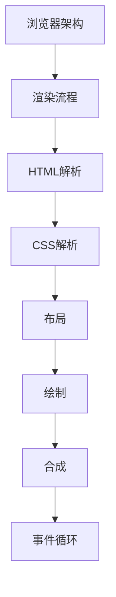

# 浏览器原理 学习指南

> **分类**：前端开发 ｜ **技术生态**：Chromium、Blink、V8、DevTools、Web Vitals、Lighthouse

## 领域定位

浏览器是 Web 运行时。多进程架构、渲染流水线、事件循环与 V8 是性能优化与排障的理论基础。

从 Chromium 架构剖析解析、布局、绘制、合成与安全机制，建立代码到像素的完整链路。

本领域常用技术栈与工具包括：Chromium、Blink、V8、DevTools、Web Vitals、Lighthouse。

## 学习目标

- 描述 URL 到页面绘制流程
- 理解重排重绘与合成层
- 事件循环与 V8 GC
- DevTools 性能安全分析

## 前置知识

- HTML/CSS/JS 基础
- HTTP 概念

## 学习路径

1. **浏览器架构**
2. **渲染流程**
3. **HTML解析**
4. **CSS解析**
5. **布局**
6. **绘制**
7. **合成**
8. **事件循环**

## 模块体系

- **浏览器架构**
- **渲染流程**
- **HTML解析**
- **CSS解析**
- **布局**
- **绘制**
- **合成**
- **事件循环**
- **垃圾回收**
- **V8引擎**
- **网络栈**
- **安全机制**
- **同源策略**
- **存储**
- **PWA**
- **浏览器调试**
- **浏览器性能优化**

## 难度分布

| 入门 | 24 | 24% |
| 实战 | 22 | 22% |
| 进阶 | 24 | 24% |
| 高级 | 30 | 30% |

## 章节索引

### 浏览器架构

- [浏览器架构核心概念与原理](chapters/001-浏览器架构核心概念与原理.md) ｜ 入门
- [浏览器架构的实现机制详解](chapters/002-浏览器架构的实现机制详解.md) ｜ 入门
- [浏览器架构的关键技术点](chapters/003-浏览器架构的关键技术点.md) ｜ 入门
- [浏览器架构的源码级分析](chapters/004-浏览器架构的源码级分析.md) ｜ 入门
- [浏览器架构的配置与使用](chapters/005-浏览器架构的配置与使用.md) ｜ 入门
- [浏览器架构的常见问题与解决方案](chapters/006-浏览器架构的常见问题与解决方案.md) ｜ 入门

### 渲染流程

- [渲染流程核心概念与原理](chapters/007-渲染流程核心概念与原理.md) ｜ 入门
- [渲染流程的实现机制详解](chapters/008-渲染流程的实现机制详解.md) ｜ 入门
- [渲染流程的关键技术点](chapters/009-渲染流程的关键技术点.md) ｜ 入门
- [渲染流程的源码级分析](chapters/010-渲染流程的源码级分析.md) ｜ 入门
- [渲染流程的配置与使用](chapters/011-渲染流程的配置与使用.md) ｜ 入门
- [渲染流程的常见问题与解决方案](chapters/012-渲染流程的常见问题与解决方案.md) ｜ 入门

### HTML解析

- [HTML解析核心概念与原理](chapters/013-HTML解析核心概念与原理.md) ｜ 入门
- [HTML解析的实现机制详解](chapters/014-HTML解析的实现机制详解.md) ｜ 入门
- [HTML解析的关键技术点](chapters/015-HTML解析的关键技术点.md) ｜ 入门
- [HTML解析的源码级分析](chapters/016-HTML解析的源码级分析.md) ｜ 入门
- [HTML解析的配置与使用](chapters/017-HTML解析的配置与使用.md) ｜ 入门
- [HTML解析的常见问题与解决方案](chapters/018-HTML解析的常见问题与解决方案.md) ｜ 入门

### CSS解析

- [CSS解析核心概念与原理](chapters/019-CSS解析核心概念与原理.md) ｜ 入门
- [CSS解析的实现机制详解](chapters/020-CSS解析的实现机制详解.md) ｜ 入门
- [CSS解析的关键技术点](chapters/021-CSS解析的关键技术点.md) ｜ 入门
- [CSS解析的源码级分析](chapters/022-CSS解析的源码级分析.md) ｜ 入门
- [CSS解析的配置与使用](chapters/023-CSS解析的配置与使用.md) ｜ 入门
- [CSS解析的常见问题与解决方案](chapters/024-CSS解析的常见问题与解决方案.md) ｜ 入门

### 布局

- [布局核心概念与原理](chapters/025-布局核心概念与原理.md) ｜ 进阶
- [布局的实现机制详解](chapters/026-布局的实现机制详解.md) ｜ 进阶
- [布局的关键技术点](chapters/027-布局的关键技术点.md) ｜ 进阶
- [布局的源码级分析](chapters/028-布局的源码级分析.md) ｜ 进阶
- [布局的配置与使用](chapters/029-布局的配置与使用.md) ｜ 进阶
- [布局的常见问题与解决方案](chapters/030-布局的常见问题与解决方案.md) ｜ 进阶

### 绘制

- [绘制核心概念与原理](chapters/031-绘制核心概念与原理.md) ｜ 进阶
- [绘制的实现机制详解](chapters/032-绘制的实现机制详解.md) ｜ 进阶
- [绘制的关键技术点](chapters/033-绘制的关键技术点.md) ｜ 进阶
- [绘制的源码级分析](chapters/034-绘制的源码级分析.md) ｜ 进阶
- [绘制的配置与使用](chapters/035-绘制的配置与使用.md) ｜ 进阶
- [绘制的常见问题与解决方案](chapters/036-绘制的常见问题与解决方案.md) ｜ 进阶

### 合成

- [合成核心概念与原理](chapters/037-合成核心概念与原理.md) ｜ 进阶
- [合成的实现机制详解](chapters/038-合成的实现机制详解.md) ｜ 进阶
- [合成的关键技术点](chapters/039-合成的关键技术点.md) ｜ 进阶
- [合成的源码级分析](chapters/040-合成的源码级分析.md) ｜ 进阶
- [合成的配置与使用](chapters/041-合成的配置与使用.md) ｜ 进阶
- [合成的常见问题与解决方案](chapters/042-合成的常见问题与解决方案.md) ｜ 进阶

### 事件循环

- [事件循环核心概念与原理](chapters/043-事件循环核心概念与原理.md) ｜ 进阶
- [事件循环的实现机制详解](chapters/044-事件循环的实现机制详解.md) ｜ 进阶
- [事件循环的关键技术点](chapters/045-事件循环的关键技术点.md) ｜ 进阶
- [事件循环的源码级分析](chapters/046-事件循环的源码级分析.md) ｜ 进阶
- [事件循环的配置与使用](chapters/047-事件循环的配置与使用.md) ｜ 进阶
- [事件循环的常见问题与解决方案](chapters/048-事件循环的常见问题与解决方案.md) ｜ 进阶

### 垃圾回收

- [垃圾回收核心概念与原理](chapters/049-垃圾回收核心概念与原理.md) ｜ 高级
- [垃圾回收的实现机制详解](chapters/050-垃圾回收的实现机制详解.md) ｜ 高级
- [垃圾回收的关键技术点](chapters/051-垃圾回收的关键技术点.md) ｜ 高级
- [垃圾回收的源码级分析](chapters/052-垃圾回收的源码级分析.md) ｜ 高级
- [垃圾回收的配置与使用](chapters/053-垃圾回收的配置与使用.md) ｜ 高级
- [垃圾回收的常见问题与解决方案](chapters/054-垃圾回收的常见问题与解决方案.md) ｜ 高级

### V8引擎

- [V8引擎核心概念与原理](chapters/055-V8引擎核心概念与原理.md) ｜ 高级
- [V8引擎的实现机制详解](chapters/056-V8引擎的实现机制详解.md) ｜ 高级
- [V8引擎的关键技术点](chapters/057-V8引擎的关键技术点.md) ｜ 高级
- [V8引擎的源码级分析](chapters/058-V8引擎的源码级分析.md) ｜ 高级
- [V8引擎的配置与使用](chapters/059-V8引擎的配置与使用.md) ｜ 高级
- [V8引擎的常见问题与解决方案](chapters/060-V8引擎的常见问题与解决方案.md) ｜ 高级

### 网络栈

- [网络栈核心概念与原理](chapters/061-网络栈核心概念与原理.md) ｜ 高级
- [网络栈的实现机制详解](chapters/062-网络栈的实现机制详解.md) ｜ 高级
- [网络栈的关键技术点](chapters/063-网络栈的关键技术点.md) ｜ 高级
- [网络栈的源码级分析](chapters/064-网络栈的源码级分析.md) ｜ 高级
- [网络栈的配置与使用](chapters/065-网络栈的配置与使用.md) ｜ 高级
- [网络栈的常见问题与解决方案](chapters/066-网络栈的常见问题与解决方案.md) ｜ 高级

### 安全机制

- [安全机制核心概念与原理](chapters/067-安全机制核心概念与原理.md) ｜ 高级
- [安全机制的实现机制详解](chapters/068-安全机制的实现机制详解.md) ｜ 高级
- [安全机制的关键技术点](chapters/069-安全机制的关键技术点.md) ｜ 高级
- [安全机制的源码级分析](chapters/070-安全机制的源码级分析.md) ｜ 高级
- [安全机制的配置与使用](chapters/071-安全机制的配置与使用.md) ｜ 高级
- [安全机制的常见问题与解决方案](chapters/072-安全机制的常见问题与解决方案.md) ｜ 高级

### 同源策略

- [同源策略核心概念与原理](chapters/073-同源策略核心概念与原理.md) ｜ 高级
- [同源策略的实现机制详解](chapters/074-同源策略的实现机制详解.md) ｜ 高级
- [同源策略的关键技术点](chapters/075-同源策略的关键技术点.md) ｜ 高级
- [同源策略的源码级分析](chapters/076-同源策略的源码级分析.md) ｜ 高级
- [同源策略的配置与使用](chapters/077-同源策略的配置与使用.md) ｜ 高级
- [同源策略的常见问题与解决方案](chapters/078-同源策略的常见问题与解决方案.md) ｜ 高级

### 存储

- [存储核心概念与原理](chapters/079-存储核心概念与原理.md) ｜ 实战
- [存储的实现机制详解](chapters/080-存储的实现机制详解.md) ｜ 实战
- [存储的关键技术点](chapters/081-存储的关键技术点.md) ｜ 实战
- [存储的源码级分析](chapters/082-存储的源码级分析.md) ｜ 实战
- [存储的配置与使用](chapters/083-存储的配置与使用.md) ｜ 实战
- [存储的常见问题与解决方案](chapters/084-存储的常见问题与解决方案.md) ｜ 实战

### PWA

- [PWA核心概念与原理](chapters/085-PWA核心概念与原理.md) ｜ 实战
- [PWA的实现机制详解](chapters/086-PWA的实现机制详解.md) ｜ 实战
- [PWA的关键技术点](chapters/087-PWA的关键技术点.md) ｜ 实战
- [PWA的源码级分析](chapters/088-PWA的源码级分析.md) ｜ 实战
- [PWA的配置与使用](chapters/089-PWA的配置与使用.md) ｜ 实战
- [PWA的常见问题与解决方案](chapters/090-PWA的常见问题与解决方案.md) ｜ 实战

### 浏览器调试

- [浏览器调试核心概念与原理](chapters/091-浏览器调试核心概念与原理.md) ｜ 实战
- [浏览器调试的实现机制详解](chapters/092-浏览器调试的实现机制详解.md) ｜ 实战
- [浏览器调试的关键技术点](chapters/093-浏览器调试的关键技术点.md) ｜ 实战
- [浏览器调试的源码级分析](chapters/094-浏览器调试的源码级分析.md) ｜ 实战
- [浏览器调试的配置与使用](chapters/095-浏览器调试的配置与使用.md) ｜ 实战

### 浏览器性能优化

- [浏览器性能优化核心概念与原理](chapters/096-浏览器性能优化核心概念与原理.md) ｜ 实战
- [浏览器性能优化的实现机制详解](chapters/097-浏览器性能优化的实现机制详解.md) ｜ 实战
- [浏览器性能优化的关键技术点](chapters/098-浏览器性能优化的关键技术点.md) ｜ 实战
- [浏览器性能优化的源码级分析](chapters/099-浏览器性能优化的源码级分析.md) ｜ 实战
- [浏览器性能优化的配置与使用](chapters/100-浏览器性能优化的配置与使用.md) ｜ 实战

---
*领域: 浏览器原理*